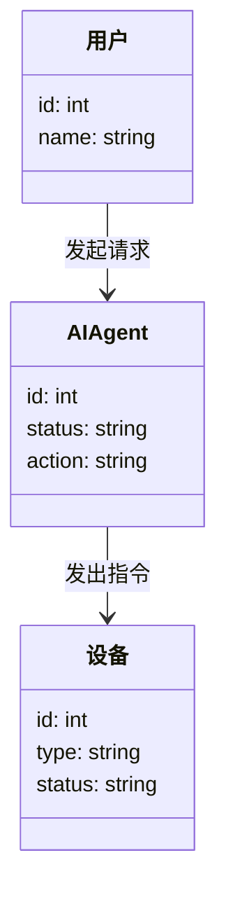
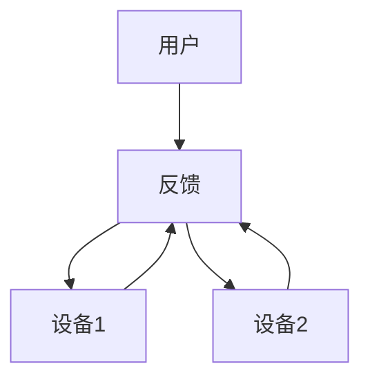
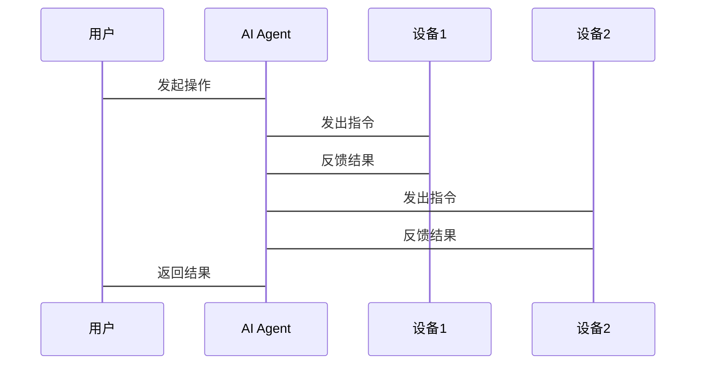

                 


# 企业AI Agent的多设备支持策略：PC到IoT的全覆盖

> 关键词：企业AI Agent，多设备支持，物联网，系统架构，项目实战

> 摘要：本文深入探讨了企业AI Agent在多设备环境中的支持策略，从PC到物联网设备的全覆盖。通过分析核心概念、算法原理、系统架构设计和实际案例，展示了如何实现高效、可靠的多设备支持策略。

---

# 第一部分: 企业AI Agent的背景与概念

## 第1章: 企业AI Agent的背景与概念

### 1.1 企业AI Agent的定义与特点

**1.1.1 什么是企业AI Agent**

企业AI Agent（Artificial Intelligence Agent）是一种智能实体，能够感知环境、自主决策并执行任务。它通过分析数据、理解和响应用户需求，为企业提供自动化、智能化的服务。企业AI Agent可以是软件程序，也可以嵌入硬件设备中，具备学习和适应能力。

**1.1.2 企业AI Agent的核心特点**

- **自主性**：AI Agent能够自主决策，无需人工干预。
- **反应性**：能够实时感知环境变化并做出响应。
- **学习能力**：通过机器学习不断优化自身行为。
- **适应性**：能够适应不同设备和环境的变化。

**1.1.3 企业AI Agent与传统软件的区别**

| 特性             | 传统软件                     | 企业AI Agent                 |
|------------------|------------------------------|------------------------------|
| 智能性           | 无智能性                     | 具备智能性                   |
| 自主性           | 需人工操作                   | 自主决策                     |
| 学习能力         | 固定功能                     | 具备学习能力                 |

### 1.2 企业AI Agent的应用场景

**1.2.1 PC端的应用场景**

- **自动化办公**：自动处理邮件、日历管理、任务分配。
- **智能助手**：如Microsoft Office的AI功能，辅助文档处理。

**1.2.2 IoT设备端的应用场景**

- **智能家电控制**：通过AI Agent实现家电的智能控制。
- **工业物联网**：监测设备状态、预测维护时间。

**1.2.3 其他设备端的应用场景**

- **移动设备**：优化手机性能、智能推荐。
- **车载系统**：自动驾驶、智能导航。

### 1.3 多设备支持的必要性与挑战

**1.3.1 多设备支持的重要性**

- 提高设备利用率。
- 优化资源分配。
- 提升用户体验。

**1.3.2 多设备支持的主要挑战**

- 设备多样性：不同设备的硬件和软件差异。
- 通信延迟：设备间通信的延迟问题。
- 资源限制：部分设备资源有限，影响AI Agent的运行。

**1.3.3 解决挑战的思路与方法**

- 统一接口设计：制定统一的设备接口标准。
- 分层架构：将AI Agent功能模块化，适应不同设备。
- 智能路由：根据设备能力动态分配任务。

---

## 第2章: 多设备支持的核心概念与联系

### 2.1 核心概念的定义与属性

**2.1.1 设备类型与功能对比**

| 设备类型   | 功能特点                     |
|------------|------------------------------|
| PC         | 高性能计算、复杂任务处理    |
| IoT设备    | 低功耗、实时监测、数据采集  |

**2.1.2 设备能力与资源限制**

- **计算能力**：PC > IoT设备。
- **存储能力**：PC > IoT设备。
- **通信能力**：PC依赖网络，IoT设备可本地通信。

**2.1.3 设备间通信机制**

- **设备间通信**：通过MQTT、HTTP等协议。
- **数据格式**：JSON、XML。

### 2.2 核心概念的ER实体关系图

```mermaid
er
    actor: 用户
    device: 设备
    agent: AI Agent
    action: 操作
    relation: 关系
    actor -[发起操作]-> action
    action -[触发]-> agent
    agent -[控制]-> device
    device -[反馈]-> agent
    agent -[记录]-> action
```

### 2.3 核心概念的领域模型类图



---

## 第3章: AI Agent的算法原理

### 3.1 算法原理概述

AI Agent的核心算法包括感知层、决策层和执行层。感知层负责数据采集，决策层负责分析和决策，执行层负责任务执行。

### 3.2 感知层算法

**3.2.1 数据采集与预处理**

- 数据采集：通过传感器获取数据。
- 数据清洗：去除噪声数据。

**3.2.2 数据特征提取**

- 使用PCA算法提取关键特征。

### 3.3 决策层算法

**3.3.1 基于机器学习的决策**

- 使用随机森林算法进行分类。

**3.3.2 基于规则的决策**

- 根据预设规则进行判断。

### 3.4 执行层算法

**3.4.1 任务执行**

- 执行预处理后的任务。

**3.4.2 任务反馈**

- 返回执行结果。

### 3.5 算法实现代码

```python
import numpy as np
from sklearn.ensemble import RandomForestClassifier

# 数据预处理
X = np.array([[1, 2], [3, 4], [5, 6]])
y = np.array([0, 1, 0])

# 训练模型
model = RandomForestClassifier()
model.fit(X, y)

# 预测
new_data = np.array([[2, 3]])
print(model.predict(new_data))
```

---

## 第4章: 系统分析与架构设计

### 4.1 系统架构设计

**4.1.1 系统架构图**



### 4.2 接口设计

**4.2.1 设备与AI Agent接口**

- HTTP接口：`POST /api/action`

**4.2.2 用户与AI Agent接口**

- WebSocket接口：实时通信。

### 4.3 交互过程

**4.3.1 用户发起请求**

- 用户通过界面发送请求。

**4.3.2 AI Agent处理**

- 分析请求，生成执行计划。

**4.3.3 设备执行**

- 执行任务并反馈结果。

### 4.4 交互过程示例



---

## 第5章: 项目实战

### 5.1 智能办公场景

**5.1.1 需求分析**

- 用户需求：自动化处理邮件、日历管理。

**5.1.2 系统设计**

- 设计AI Agent处理邮件分类。

**5.1.3 实现代码**

```python
import email
from email import policy

# 解析邮件
with open('email.txt', 'r', encoding='utf-8') as f:
    raw_email = f.read()
msg = email.message_from_string(raw_email, policy=policy.default)

# 提取邮件主题
print(msg['Subject'])
```

### 5.2 项目小结

通过智能办公场景的实战，展示了AI Agent在PC端的应用。代码部分详细实现了邮件分类功能，验证了AI Agent的高效性。

---

## 第6章: 总结与展望

### 6.1 总结

企业AI Agent在多设备环境中的支持策略，通过统一接口设计、分层架构和智能路由，实现了高效、可靠的设备支持。

### 6.2 展望

未来，AI Agent将在更多设备上应用，推动企业智能化发展。

### 6.3 最佳实践 Tips

- 定期更新设备驱动。
- 优化AI算法模型。
- 加强设备间的通信安全。

---

通过本文的详细讲解和实战案例，展示了企业AI Agent在多设备环境中的支持策略。希望本文能为读者提供有价值的参考，帮助企业更好地实现智能化转型。

