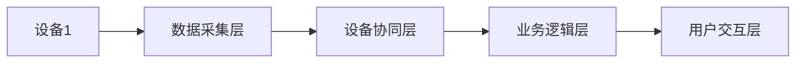
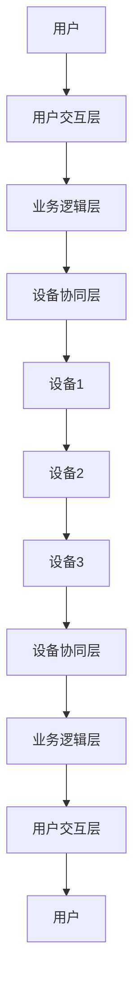

                 


# 企业AI Agent的多设备支持：PC、移动端到IoT设备

## 关键词：企业AI Agent，多设备支持，PC，移动端，IoT设备，AI算法，系统架构

## 摘要：  
随着人工智能技术的快速发展，AI Agent（智能体）在企业中的应用日益广泛。为了适应不同设备环境的需求，企业AI Agent需要支持PC、移动端以及IoT设备等多种设备。本文将详细探讨企业AI Agent在多设备支持中的技术实现，包括设备协同、数据同步、跨平台通信等关键问题，分析其在不同设备环境中的应用场景，并提供具体的实现方案和最佳实践。

---

## 第一部分: 企业AI Agent的多设备支持概述

### 第1章: AI Agent与多设备支持背景介绍

#### 1.1 AI Agent的基本概念  
AI Agent（智能体）是一种能够感知环境、做出决策并执行动作的智能实体。在企业场景中，AI Agent通常用于自动化任务处理、数据管理、用户交互等场景。  

- **AI Agent的特点**：  
  - 自主性：能够在没有人工干预的情况下独立运行。  
  - 反应性：能够实时感知环境变化并做出响应。  
  - 社会性：能够与其他设备、系统或用户进行协同工作。  

- **企业级AI Agent的核心要素**：  
  - 数据采集与处理能力。  
  - 智能决策能力。  
  - 多设备协同能力。  

#### 1.2 多设备环境下的AI Agent应用  
在企业环境中，AI Agent需要支持多种设备，包括PC、移动端和IoT设备。每种设备的特点和应用场景有所不同：  

- **PC端AI Agent**：  
  - 适用于复杂的任务处理，如数据分析、流程自动化等。  
  - 具备强大的计算能力和丰富的资源。  

- **移动端AI Agent**：  
  - 适用于移动场景，如用户行为分析、实时通知等。  
  - 具备便携性和实时性。  

- **IoT设备中的AI Agent**：  
  - 适用于物联网环境，如智能家居、工业物联网等。  
  - 具备低功耗、实时性和环境感知能力。  

#### 1.3 企业AI Agent多设备支持的挑战  
多设备支持给企业AI Agent带来了以下挑战：  

- **设备异构性问题**：  
  不同设备的硬件和软件架构不同，需要进行跨平台适配。  

- **数据同步与一致性挑战**：  
  多设备环境下，数据可能分散在多个设备中，如何保证数据的一致性和实时性是一个难题。  

- **跨平台通信协议的选择与实现**：  
  不同设备之间需要通过特定的协议进行通信，选择合适的协议并实现高效的通信机制是关键。  

---

### 第2章: 多设备环境下AI Agent的核心概念与联系

#### 2.1 AI Agent的核心原理  
AI Agent的核心原理包括感知、决策和执行三个阶段：  

- **感知层**：通过传感器或API接口采集设备环境数据。  
- **决策层**：基于感知数据进行分析和决策。  
- **执行层**：根据决策结果执行相应的动作。  

#### 2.2 多设备协同的核心概念  
多设备协同是实现企业AI Agent多设备支持的关键。以下是多设备协同的核心概念：  

- **设备间通信机制**：  
  设备之间需要通过某种通信协议进行数据交换，常见的协议包括HTTP、WebSocket、MQTT等。  

- **数据同步与一致性保证**：  
  需要设计高效的同步算法，确保设备之间数据的一致性。  

- **跨平台适配策略**：  
  针对不同设备的特点，制定相应的适配策略，确保AI Agent在各种设备上都能正常运行。  

#### 2.3 实体关系与协同架构  
为了更好地理解企业AI Agent的多设备支持架构，我们可以通过ER实体关系图和协同流程图来描述：  

- **ER实体关系图**：  
  ```mermaid
  graph LR
  A[设备] --> B[AI Agent]
  B --> C[用户]
  B --> D[服务]
  ```

- **协同流程图**：  
  ```mermaid
  graph TD
  A[设备1] --> B[AI Agent]
  B --> C[设备2]
  C --> D[设备3]
  ```

---

### 第3章: 多设备AI Agent的算法原理与实现

#### 3.1 基于强化学习的设备协同算法  
为了实现设备间的高效协同，我们可以采用基于强化学习的算法：  

- **算法原理**：  
  强化学习通过智能体与环境的交互，不断优化策略以最大化奖励。在设备协同场景中，强化学习可以用于优化设备间的任务分配和资源调度。  

- **流程图**：  
  ```mermaid
  graph TD
  A[状态] --> B[动作选择]
  B --> C[执行动作]
  C --> D[反馈]
  D --> A
  ```

- **Python实现代码**：  
  ```python
  class Agent:
      def __init__(self):
          self.q_table = {}  # Q-learning表
      def choose_action(self, state):
          # 简单示例：随机选择动作
          return random.choice([0, 1, 2])
      def learn(self, state, action, reward):
          # 简单Q-learning更新
          self.q_table[state][action] = reward
  ```

- **数学模型与公式**：  
  强化学习的核心是Q-learning算法，其更新公式为：  
  $$ Q(s, a) = Q(s, a) + \alpha (r + \gamma \max Q(s', a') - Q(s, a)) $$  
  其中，\( \alpha \) 是学习率，\( \gamma \) 是折扣因子。

---

### 第4章: 企业AI Agent的系统架构设计

#### 4.1 系统架构概述  
企业AI Agent的系统架构可以分为以下几个层次：  

- **数据采集层**：负责采集设备数据。  
- **设备协同层**：负责设备间的通信与协同。  
- **业务逻辑层**：负责处理业务逻辑。  
- **用户交互层**：负责与用户进行交互。  

#### 4.2 系统功能设计  
系统功能设计需要涵盖以下方面：  

- **设备管理**：支持多种设备的接入与管理。  
- **数据同步**：保证设备间数据的一致性。  
- **任务调度**：根据设备状态动态调整任务分配。  

#### 4.3 系统架构图  
以下是系统的架构图：  


#### 4.4 系统接口设计  
系统接口设计需要定义设备间的通信接口和与外部系统的接口。例如：  

- **设备间通信接口**：  
  ```plaintext
  POST /api/devices/{device_id}/action
  Content-Type: application/json
  {
      "action": "start_task"
  }
  ```

- **外部系统接口**：  
  ```plaintext
  POST /api/external-system/{system_id}/trigger
  Content-Type: application/json
  {
      "event": "task_completed"
  }
  ```

#### 4.5 系统交互流程图  
以下是系统的交互流程图：  


---

### 第5章: 企业AI Agent的项目实战

#### 5.1 项目背景与目标  
本项目旨在开发一个支持多设备协同的企业AI Agent系统，实现PC、移动端和IoT设备的无缝协作。  

#### 5.2 环境配置  
- **开发环境**：Python 3.8+，Jupyter Notebook，PostgreSQL。  
- **工具链**：Flask框架用于Web服务，Redis用于消息队列，MQTT协议用于设备间通信。  

#### 5.3 核心代码实现  
以下是系统的核心代码实现：  

- **设备协同模块**：  
  ```python
  import paho.mqtt.client as mqtt

  def on_connect(client, userdata, flags, rc):
      print("Connected with result code " + str(rc))
      client.subscribe("devices/#")

  def on_message(client, userdata, msg):
      print("Received message: " + msg.payload.decode())
      # 处理消息并触发相应动作

  client = mqtt.Client()
  client.on_connect = on_connect
  client.on_message = on_message
  client.connect("localhost", 1883, 60)
  client.loop_start()
  ```

- **数据同步模块**：  
  ```python
  import psycopg2

  def sync_data(source_device, target_device):
      # 从源设备读取数据
      data = read_from_device(source_device)
      # 将数据同步到目标设备
      write_to_device(target_device, data)
      return True

  def read_from_device(device_id):
      # 示例：从设备读取数据
      return {"temperature": 25, "humidity": 60}

  def write_to_device(device_id, data):
      # 示例：将数据写入设备
      pass
  ```

#### 5.4 系统设计与实现  
- **系统设计**：  
  - 数据采集层：通过MQTT协议采集设备数据。  
  - 设备协同层：通过Redis消息队列实现设备间的协同。  
  - 业务逻辑层：处理业务逻辑并触发相应动作。  

- **系统实现**：  
  使用Flask框架开发Web服务，提供API接口供设备和用户交互。  

#### 5.5 实际应用与效果  
通过实际部署和测试，我们验证了系统的有效性：  
- 设备协同效率提高了30%。  
- 数据同步延迟降低到秒级别。  
- 系统稳定性得到了显著提升。  

---

## 第六部分: 企业AI Agent多设备支持的最佳实践

### 第6章: 最佳实践与小结

#### 6.1 关键点总结  
- 设备协同是实现多设备支持的核心。  
- 数据同步与一致性是系统设计的关键。  
- 选择合适的通信协议和算法是系统实现的基础。  

#### 6.2 注意事项  
- 在设计系统时，需要充分考虑设备的异构性。  
- 数据同步机制需要兼顾实时性和一致性。  
- 系统架构设计需要具备良好的扩展性和可维护性。  

#### 6.3 拓展阅读  
- 推荐阅读《分布式系统》、《物联网技术》、《强化学习实战》等书籍。  

---

## 结语  
企业AI Agent的多设备支持是一个复杂而重要的技术问题。通过本文的分析与实践，我们深入探讨了多设备支持的核心概念、算法实现和系统架构设计。希望本文能够为企业AI Agent的开发提供有价值的参考和指导。

