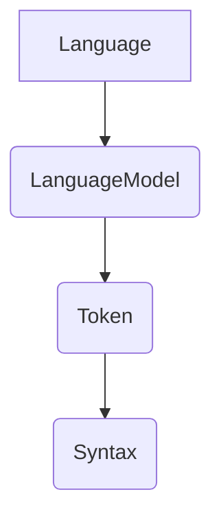
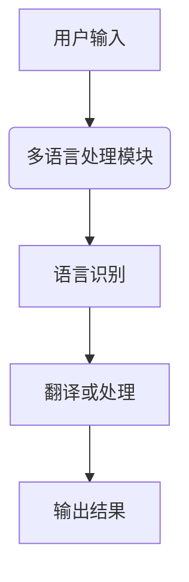
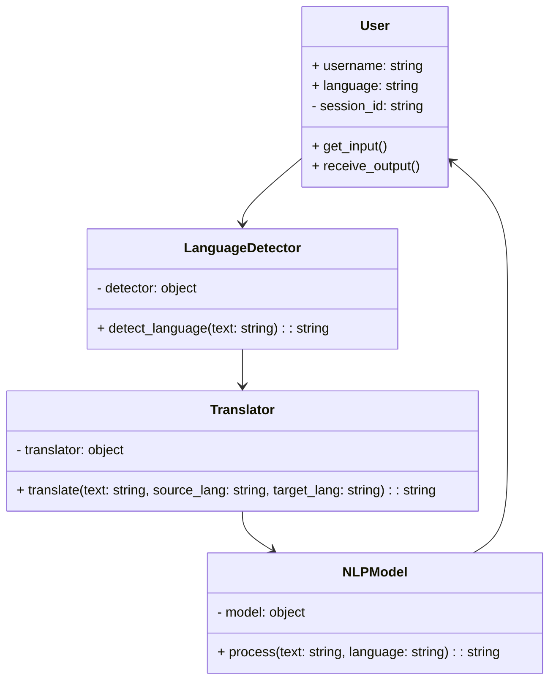
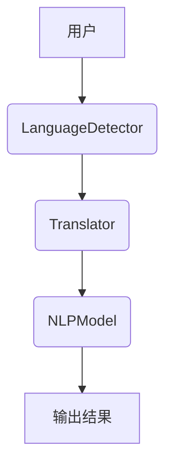
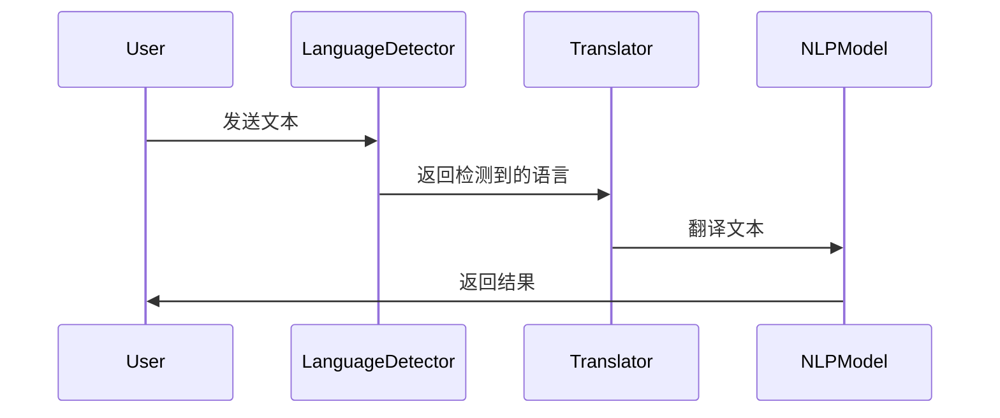

                 


# 《企业AI Agent的多语言支持策略》

> 关键词：企业AI Agent，多语言支持，自然语言处理，NLP，机器翻译，系统架构

> 摘要：本文深入探讨了企业AI Agent在多语言支持方面的策略，从背景与概述、核心概念与联系、算法原理、系统分析与架构设计、项目实战到最佳实践，全面分析了多语言支持的实现方法和应用场景，为企业在多语言环境下的AI Agent开发提供了理论支持和实践指导。

---

# 第一部分: 企业AI Agent的多语言支持背景与概述

## 第1章: 企业AI Agent与多语言支持的背景

### 1.1 AI Agent的基本概念

#### 1.1.1 AI Agent的定义与核心功能
AI Agent（人工智能代理）是一种智能体，能够感知环境、执行任务并做出决策。它通过自然语言处理（NLP）、机器学习（ML）和大数据分析等技术，为企业提供智能化的服务，如信息检索、问题解答、任务执行等。

- **核心功能**：
  - 感知环境：通过NLP技术理解用户的输入。
  - 分析需求：利用机器学习模型分析用户意图。
  - 执行任务：根据分析结果执行相应的操作。
  - 优化决策：通过反馈机制不断优化自身性能。

#### 1.1.2 企业AI Agent的应用场景
企业AI Agent广泛应用于客户服务、内部管理、市场分析等领域。例如：
- **客户服务**：通过聊天机器人提供多语言支持，帮助用户解决问题。
- **内部管理**：协助员工处理跨语言文档，提高效率。
- **市场分析**：实时监控多语言社交媒体数据，为企业提供市场洞察。

#### 1.1.3 多语言支持的重要性
在全球化背景下，企业需要与来自不同语言背景的客户和合作伙伴进行交互。多语言支持能够提升用户体验、增强企业的市场竞争力，同时降低跨语言沟通的成本。

### 1.2 多语言支持的背景与挑战

#### 1.2.1 全球化企业的需求
随着企业全球化进程的加快，跨语言交互的需求日益增加。企业需要支持多种语言，以满足不同地区客户和员工的需求。

#### 1.2.2 多语言支持的技术挑战
多语言支持涉及复杂的技术问题，如语言间的语义差异、文化差异、语法结构差异等。这些问题需要通过自然语言处理、机器翻译和跨语言信息检索等技术来解决。

#### 1.2.3 市场竞争的压力
在激烈的市场竞争中，多语言支持已经成为企业差异化竞争的重要手段。能够提供高质量多语言支持的企业更容易赢得客户的信任和青睐。

### 1.3 问题背景与问题描述

#### 1.3.1 企业AI Agent的多语言支持需求
企业AI Agent需要支持多种语言，包括但不限于英语、中文、西班牙语、法语等。支持的语言越多，系统的复杂性越高。

#### 1.3.2 多语言支持的核心问题
- **语言识别**：准确识别用户输入的语言。
- **语言翻译**：在不同语言之间进行准确的翻译。
- **跨语言理解**：理解不同语言背后的语义和意图。

#### 1.3.3 边界与外延
- **边界**：仅支持特定语言，不支持小语种或方言。
- **外延**：扩展到支持更多语言，或集成第三方翻译服务。

### 1.4 本章小结
本章介绍了企业AI Agent的基本概念、应用场景，以及多语言支持的重要性。明确了多语言支持的核心问题和边界条件，为后续章节的分析奠定了基础。

---

## 第2章: 多语言支持的核心概念与联系

### 2.1 多语言支持的核心概念

#### 2.1.1 自然语言处理（NLP）基础
NLP是实现多语言支持的核心技术。通过NLP技术，AI Agent能够理解、生成和处理多种语言的文本。

- **关键任务**：
  - 语言识别（Language Detection）：识别输入文本的语言。
  - 分词（Tokenization）：将文本分割成单词或短语。
  - 语法分析（Syntax Analysis）：分析文本的语法结构。

#### 2.1.2 多语言模型的原理
多语言模型是一种能够处理多种语言的NLP模型。它通过共享不同语言的特征，减少训练数据的需求，提高模型的泛化能力。

- **优势**：
  - 减少计算资源的消耗。
  - 提高模型的通用性。

#### 2.1.3 多语言支持的实现方式
多语言支持可以通过以下方式实现：
- **单模型多语言**：训练一个统一的模型来处理多种语言。
- **多模型多语言**：为每种语言训练独立的模型。

### 2.2 核心概念的属性特征对比

#### 2.2.1 不同语言处理方法的对比

| 方法              | 优点                          | 缺点                          |
|-------------------|-------------------------------|-------------------------------|
| 单模型多语言      | 训练效率高，通用性强          | 支持语言有限，精度可能降低    |
| 多模型多语言      | 支持语言广，精度高            | 训练和计算资源消耗大          |

#### 2.2.2 多语言支持的优缺点分析
- **优点**：
  - 提高用户体验。
  - 增强企业竞争力。
- **缺点**：
  - 技术复杂性高。
  - 计算资源消耗大。

#### 2.2.3 核心概念的ER实体关系图


### 2.3 系统架构的Mermaid流程图


### 2.4 本章小结
本章详细分析了多语言支持的核心概念，包括NLP基础、多语言模型的原理以及实现方式。通过对比不同方法的优缺点，明确了多语言支持的技术路线。

---

## 第3章: 多语言支持的算法原理与实现

### 3.1 多语言模型的训练原理

#### 3.1.1 多语言预训练模型的原理
多语言预训练模型（如Marian、XLM）通过在多种语言的语料库上进行预训练，共享语言间的特征，从而实现多语言支持。

- **训练流程**：
  1. 收集多语言语料库。
  2. 对语料进行清洗和预处理。
  3. 使用预训练模型进行训练。
  4. 微调模型以适应特定任务。

#### 3.1.2 跨语言迁移学习的机制
跨语言迁移学习是一种通过在一种语言上训练模型，然后将其迁移到其他语言的技术。这种方法可以减少数据稀疏性问题。

- **优势**：
  - 减少计算资源的消耗。
  - 提高模型的泛化能力。

### 3.2 多语言支持的算法实现

#### 3.2.1 基于NLP的多语言处理算法
- **实现步骤**：
  1. 语言识别：使用语言检测模型（如Fasttext）识别输入语言。
  2. 语言翻译：使用翻译模型（如Google Translate API）进行翻译。
  3. 跨语言理解：通过多语言NLP模型理解文本含义。

#### 3.2.2 多语言模型的优化策略
- **优化方法**：
  - 增加训练数据的多样性。
  - 使用预训练模型进行初始化。
  - 采用数据增强技术。

#### 3.2.3 多语言支持的数学模型

```latex
$$
\text{模型输入} = \{x_1, x_2, ..., x_n\}
$$

$$
\text{模型输出} = f(x_1, x_2, ..., x_n)
$$

其中，\(f\)是多语言模型的函数。
```

### 3.3 本章小结
本章详细分析了多语言模型的训练原理和实现方法，包括预训练模型、跨语言迁移学习和具体的算法实现。通过数学公式和流程图，明确了多语言支持的技术实现路径。

---

## 第4章: 系统分析与架构设计方案

### 4.1 问题场景介绍
企业AI Agent需要支持多语言交互，包括语言识别、翻译和跨语言理解。系统需要高效地处理大量多语言请求，同时保证准确性。

### 4.2 项目介绍
本项目旨在开发一个支持多种语言的企业AI Agent，涵盖语言识别、翻译和跨语言理解功能。

### 4.3 系统功能设计

#### 4.3.1 领域模型（Mermaid类图）


#### 4.3.2 系统架构设计（Mermaid架构图）


#### 4.3.3 系统接口设计
- **输入接口**：用户输入文本和语言。
- **输出接口**：处理结果和反馈信息。

#### 4.3.4 系统交互（Mermaid序列图）


### 4.4 本章小结
本章从系统架构的角度，详细分析了企业AI Agent的多语言支持系统。通过类图、架构图和序列图，明确了系统的模块划分、功能设计和交互流程。

---

## 第5章: 项目实战

### 5.1 环境安装
- **Python环境**：安装Python 3.8及以上版本。
- **依赖库安装**：使用pip安装必要的库，如`transformers`、`langdetect`、`python-Levenshtein`。

### 5.2 系统核心实现源代码

#### 5.2.1 语言检测模块
```python
from langdetect import detect, Detector

def detect_language(text):
    try:
        return detect(text)
    except Exception as e:
        return 'und'  # 表示未检测到语言
```

#### 5.2.2 翻译模块
```python
from googletrans import Translator

def translate_text(text, source_lang, target_lang):
    translator = Translator()
    translated = translator.translate(text, src=source_lang, dest=target_lang)
    return translated.text
```

#### 5.2.3 NLP处理模块
```python
from transformers import pipeline

def process_text(text, language):
    model = pipeline('text-classification', model='dbmdz/bert-base-nlu-de-cased')
    result = model(text, language=language)
    return result[0]['label']
```

### 5.3 代码应用解读与分析
- **语言检测模块**：使用`langdetect`库检测输入文本的语言。
- **翻译模块**：集成Google Translate API进行文本翻译。
- **NLP处理模块**：使用预训练的NLP模型进行文本分类或摘要。

### 5.4 案例分析和详细讲解剖析
通过具体案例，分析多语言支持在企业AI Agent中的应用。例如，用户输入中文问题，系统检测语言为中文，然后调用中文NLP模型进行处理，并返回结果。

### 5.5 本章小结
本章通过实际项目案例，详细讲解了企业AI Agent多语言支持系统的实现过程，包括环境安装、代码实现和案例分析。

---

## 第6章: 最佳实践与小结

### 6.1 最佳实践
- **选择合适的NLP模型**：根据需求选择单模型或多模型方案。
- **优化系统性能**：通过缓存和并行处理提高系统效率。
- **处理语言边界情况**：明确系统的语言支持范围和边界条件。

### 6.2 小结
本文从背景、核心概念、算法原理、系统架构到项目实战，全面分析了企业AI Agent的多语言支持策略。通过理论分析和实践案例，为企业提供了实现多语言支持的系统化方法。

### 6.3 注意事项
- **数据隐私**：注意处理多语言数据时的隐私保护问题。
- **性能优化**：合理分配资源，确保系统高效运行。
- **用户体验**：注重多语言交互的流畅性和准确性。

### 6.4 拓展阅读
- 推荐阅读相关领域的书籍和论文，如《神经机器翻译入门》、《自然语言处理实战》等。

---

# 结语
企业AI Agent的多语言支持是一个复杂但重要的技术挑战。通过本文的分析和实践，读者可以掌握实现多语言支持的核心方法和技术，为企业在全球化竞争中提供有力支持。

