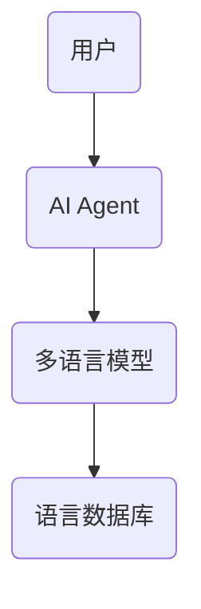
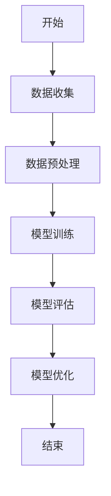
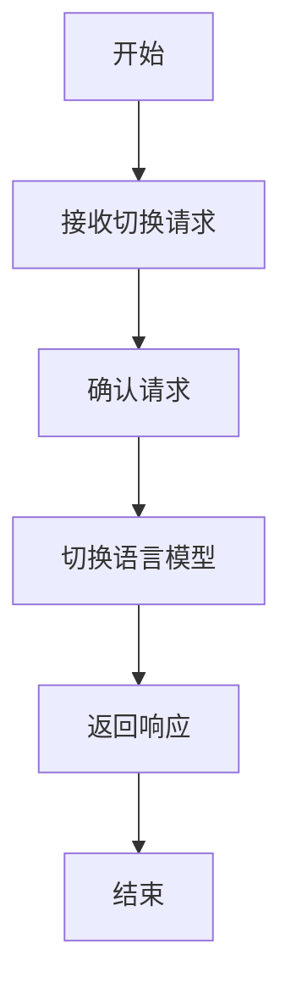

                 

# 企业AI Agent的多语言支持：跨国业务助手

> 关键词：企业AI Agent，多语言支持，跨国业务，人工智能，自然语言处理，系统架构

> 摘要：本文详细探讨了企业AI Agent在多语言支持方面的技术实现与应用，分析了其在跨国业务中的重要性，介绍了多语言模型的训练原理、系统架构设计以及实际项目中的实现方法，为读者提供了从理论到实践的全面指导。

---

# 第1章: 企业AI Agent的背景与概念

## 1.1 问题背景与描述

### 1.1.1 跨国业务中的语言障碍
在跨国业务中，语言障碍是企业面临的主要挑战之一。不同国家和地区的客户使用不同的语言进行沟通，这使得企业需要具备多语言支持的能力，以提供无缝的用户体验。例如，一个全球性的电子商务平台需要能够支持英语、中文、西班牙语等多种语言，以满足不同地区客户的需求。

### 1.1.2 AI Agent在企业中的角色
AI Agent（智能代理）是企业中用于自动化处理任务的智能系统。它能够理解用户的请求、提供信息、执行操作，并与用户进行自然的对话。在跨国业务中，AI Agent需要具备多语言支持能力，以满足不同语言客户的需求。

### 1.1.3 多语言支持的必要性
多语言支持是AI Agent在跨国业务中不可或缺的功能。它不仅能够提高用户体验，还能够降低企业的运营成本，提高效率。例如，通过多语言支持，企业可以减少人工客服的需求，同时提供24/7的客户服务。

## 1.2 问题解决与边界

### 1.2.1 多语言支持的核心问题
多语言支持的核心问题在于如何让AI Agent能够理解和生成多种语言的文本。这涉及到自然语言处理（NLP）、机器翻译、语音识别等技术的结合应用。

### 1.2.2 AI Agent的边界与外延
AI Agent的边界在于其功能和能力的限制。例如，AI Agent可以处理多种语言，但可能无法处理非常见语言或方言。此外，AI Agent的外延还包括与其他系统的集成，如CRM系统、订单管理系统等。

### 1.2.3 跨国业务中的应用场景
在跨国业务中，AI Agent的应用场景包括客户服务、订单处理、技术支持、信息查询等。例如，客户可以通过AI Agent用母语提交订单、查询订单状态或解决问题。

## 1.3 概念结构与核心要素

### 1.3.1 多语言支持的系统架构
多语言支持的系统架构通常包括以下几个部分：
1. **语言识别模块**：识别用户的语言。
2. **多语言模型**：支持多种语言理解和生成的NLP模型。
3. **语言切换机制**：在不同语言之间切换的逻辑。
4. **用户界面**：提供多语言支持的用户界面。

### 1.3.2 AI Agent的功能模块
AI Agent的功能模块包括：
1. **语言理解模块**：理解用户的输入。
2. **语言生成模块**：生成符合用户语言的响应。
3. **知识库**：存储业务相关的信息。
4. **执行模块**：执行用户的请求。

### 1.3.3 核心要素的对比分析
以下是多语言支持的核心要素对比分析：

| 核心要素 | 特征 |
|---------|------|
| 语言识别 | 精确识别用户语言 |
| 多语言模型 | 支持多种语言的NLP模型 |
| 语言切换机制 | 平滑切换不同语言的能力 |
| 用户界面 | 提供多语言支持的友好界面 |

## 1.4 本章小结
本章介绍了企业AI Agent的背景与概念，分析了跨国业务中的语言障碍及其解决方法，明确了多语言支持的核心问题和系统架构。

---

# 第2章: 多语言支持的核心概念与联系

## 2.1 核心概念原理

### 2.1.1 多语言模型的训练原理
多语言模型的训练通常采用预训练语言模型（如BERT、GPT），并对其进行多语言微调。通过多语言训练，模型能够理解多种语言的语法、词汇和语义。

### 2.1.2 AI Agent的语言处理机制
AI Agent的语言处理机制包括：
1. **语言识别**：通过用户的输入确定其使用的语言。
2. **语言生成**：根据识别的语言生成相应的文本。
3. **语言切换**：在用户需要切换语言时，快速调整模型的输出语言。

### 2.1.3 跨国业务中的语言切换逻辑
语言切换逻辑通常包括以下步骤：
1. 用户请求切换语言。
2. 系统确认切换请求。
3. 调整AI Agent的语言模型。
4. 返回切换成功的确认信息。

## 2.2 核心概念对比分析

### 2.2.1 多语言支持的技术特征对比
以下是多语言支持的技术特征对比：

| 技术特征 | 对比内容 |
|---------|----------|
| 模型类型 | 单语言模型 vs. 多语言模型 |
| 训练数据 | 单一语言数据 vs. 多语言数据 |
| 性能指标 | 单语言准确率 vs. 多语言准确率 |

### 2.2.2 不同语言处理的效率对比
不同语言处理的效率对比：

| 语言 | 处理效率 |
|------|----------|
| 英语 | 高       |
| 中文 | 中       |
| 西班牙语 | 中      |
| 德语 | 低       |

### 2.2.3 AI Agent的多语言能力评估
AI Agent的多语言能力评估可以从以下几个方面进行：
1. **支持的语言种类**：支持的语言数量。
2. **语言识别准确性**：语言识别的正确率。
3. **语言生成质量**：生成文本的准确性和流畅性。

## 2.3 系统架构设计

### 2.3.1 ER实体关系图
以下是多语言支持系统的ER实体关系图：

## 2.4 本章小结
本章详细探讨了多语言支持的核心概念与联系，分析了多语言模型的训练原理、AI Agent的语言处理机制以及跨国业务中的语言切换逻辑，并通过对比分析和系统架构设计进一步明确了多语言支持的技术实现。

---

# 第3章: 多语言支持的算法原理

## 3.1 算法原理概述

### 3.1.1 多语言模型的训练流程
多语言模型的训练流程通常包括以下几个步骤：
1. **数据收集**：收集多语言文本数据。
2. **数据预处理**：清洗和标注数据。
3. **模型训练**：使用预训练模型进行多语言微调。
4. **模型评估**：评估模型的多语言性能。
5. **模型优化**：优化模型的性能和效率。

### 3.1.2 AI Agent的语言理解机制
AI Agent的语言理解机制包括：
1. **语言识别**：通过语言检测算法确定用户语言。
2. **意图识别**：理解用户的意图和需求。
3. **实体识别**：识别文本中的关键实体。

### 3.1.3 跨国业务中的语言切换算法
语言切换算法的实现步骤如下：
1. **接收语言切换请求**：用户请求切换语言。
2. **确认切换请求**：系统确认切换请求。
3. **切换语言模型**：调整AI Agent的语言模型。
4. **返回响应**：生成切换语言的确认信息。

## 3.2 算法流程图

### 3.2.1 多语言模型训练流程图
以下是多语言模型训练的流程图：

### 3.2.2 语言切换算法流程图
以下是语言切换算法的流程图：

## 3.3 本章小结
本章详细介绍了多语言支持的算法原理，包括多语言模型的训练流程、AI Agent的语言理解机制以及语言切换算法的实现步骤，并通过流程图进一步明确了算法的实现过程。

---

（以下章节内容将按照相同的方式逐步展开，涵盖系统分析与架构设计、项目实战、最佳实践等部分。）

---

以上是文章的部分内容，我会按照这个结构逐步完成整篇文章的撰写。

