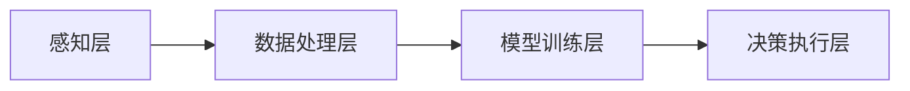
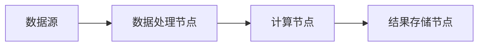
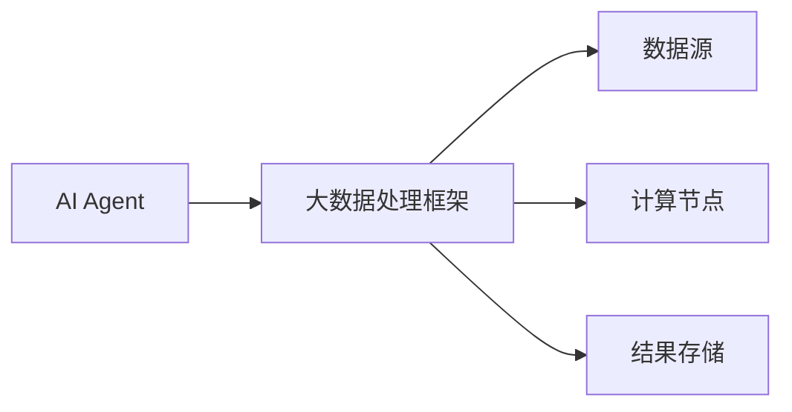
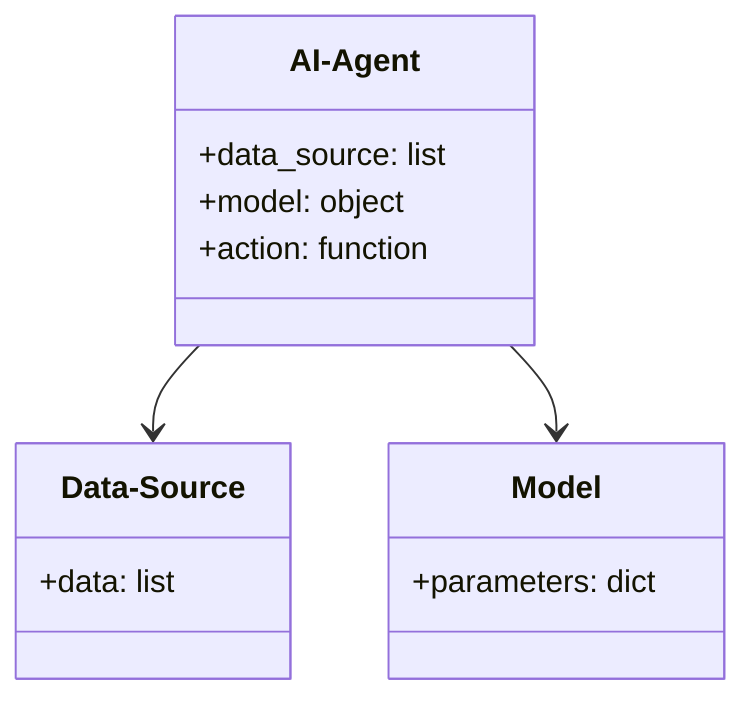
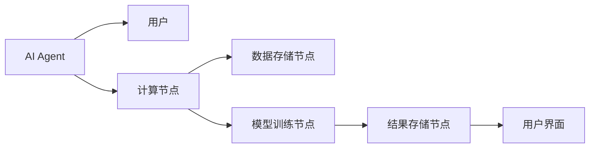

                 


# 企业AI Agent的大数据处理框架

> 关键词：企业AI Agent，大数据处理框架，人工智能，数据处理，系统架构

> 摘要：本文详细探讨了企业AI Agent在大数据处理框架中的应用，从概念、原理到系统架构和项目实战，结合丰富的图表和代码示例，全面解析企业AI Agent如何高效处理和分析海量数据，为企业智能化转型提供理论支持和实践指导。

---

# 第一部分: 企业AI Agent的背景与概述

## 第1章: 企业AI Agent与大数据处理框架概述

### 1.1 企业AI Agent的定义与特点

#### 1.1.1 什么是企业AI Agent
企业AI Agent（Artificial Intelligence Agent）是一种具备智能决策和自主执行能力的软件实体，能够根据环境信息和业务目标，主动采取行动以实现特定任务。企业AI Agent通常具备以下特点：
- **自主性**：无需外部干预，自主决策和执行任务。
- **反应性**：能够实时感知环境变化并做出响应。
- **学习能力**：通过数据和经验不断优化自身行为。
- **协作性**：能够与其他系统或AI Agent协同工作，完成复杂任务。

#### 1.1.2 AI Agent的核心特点
AI Agent的核心特点包括：
- **智能性**：基于数据和模型进行推理和决策。
- **适应性**：能够根据环境变化调整策略。
- **可扩展性**：能够处理不同规模和复杂度的任务。

#### 1.1.3 企业AI Agent与传统AI的区别
企业AI Agent与传统AI的区别主要体现在以下几个方面：
- **目标导向性**：企业AI Agent具有明确的业务目标，而传统AI更多是为了解决特定问题。
- **自主性**：企业AI Agent具备自主决策能力，而传统AI通常需要人工干预。
- **实时性**：企业AI Agent需要实时处理数据并做出决策，传统AI则更注重离线分析。

### 1.2 大数据处理框架的定义与特点

#### 1.2.1 大数据处理框架的定义
大数据处理框架是指用于处理、存储和分析海量数据的软件系统，通常包括数据采集、存储、处理、分析和可视化等多个模块。常见的大数据处理框架包括Hadoop、Spark、Flink等。

#### 1.2.2 大数据处理框架的核心特点
大数据处理框架的核心特点包括：
- **分布式计算**：通过分布式计算提升数据处理效率。
- **高扩展性**：能够处理从少量数据到海量数据的多种规模。
- **多样性**：支持结构化、半结构化和非结构化数据的处理。

#### 1.2.3 大数据处理框架与传统数据处理的区别
大数据处理框架与传统数据处理的区别主要体现在：
- **数据规模**：大数据处理框架能够处理PB级数据，而传统数据处理通常处理MB级数据。
- **处理速度**：大数据处理框架支持实时或近实时处理，而传统数据处理通常为批处理。
- **技术架构**：大数据处理框架采用分布式架构，而传统数据处理通常采用单机处理。

### 1.3 企业AI Agent与大数据处理框架的结合

#### 1.3.1 企业AI Agent在大数据处理中的作用
企业AI Agent在大数据处理中的作用包括：
- **数据采集与预处理**：AI Agent可以自动采集数据并进行预处理，确保数据质量。
- **特征提取**：AI Agent能够从海量数据中提取有用特征，为后续分析提供支持。
- **模型训练与优化**：AI Agent可以自动训练和优化模型，提升数据分析的准确性。

#### 1.3.2 大数据处理框架对AI Agent的支持
大数据处理框架对AI Agent的支持包括：
- **分布式计算能力**：大数据处理框架提供分布式计算能力，支持AI Agent的并行处理。
- **数据存储与管理**：大数据处理框架提供高效的数据存储和管理能力，支持AI Agent的数据访问。
- **资源调度与优化**：大数据处理框架能够自动调度计算资源，优化AI Agent的运行效率。

#### 1.3.3 企业AI Agent与大数据处理框架的结合优势
企业AI Agent与大数据处理框架结合的优势包括：
- **高效性**：通过分布式计算和并行处理，显著提升数据处理效率。
- **智能化**：AI Agent的智能决策能力能够优化数据处理流程。
- **扩展性**：大数据处理框架的高扩展性能够支持企业AI Agent的规模扩展。

### 1.4 企业AI Agent在大数据处理中的应用前景

#### 1.4.1 企业AI Agent的潜在应用领域
企业AI Agent的潜在应用领域包括：
- **金融行业**：用于 fraud detection, credit scoring等。
- **医疗行业**：用于 disease diagnosis, treatment recommendation等。
- **制造业**：用于 predictive maintenance, quality control等。

#### 1.4.2 企业采用AI Agent的优势
企业采用AI Agent的优势包括：
- **提升效率**：通过自动化处理和智能决策，显著提升数据处理效率。
- **降低成本**：减少人工干预，降低运营成本。
- **增强决策能力**：通过数据驱动的决策，提升企业竞争力。

#### 1.4.3 AI Agent应用的挑战与机遇
AI Agent应用的挑战包括：
- **数据隐私**：如何在处理大数据时保护数据隐私。
- **计算资源**：如何在企业内部有效调度计算资源。
- **模型可解释性**：如何提升AI Agent决策的可解释性。

AI Agent应用的机遇包括：
- **技术进步**：AI和大数据技术的快速发展为企业AI Agent的应用提供了技术保障。
- **市场需求**：企业对智能化转型的需求不断增加，为AI Agent的应用提供了市场空间。

### 1.5 本章小结
本章主要介绍了企业AI Agent和大数据处理框架的定义、特点及其结合方式，分析了AI Agent在大数据处理中的作用和应用前景，为后续章节的深入分析奠定了基础。

---

## 第2章: 企业AI Agent的核心概念与原理

### 2.1 企业AI Agent的组成与结构

#### 2.1.1 AI Agent的组成要素
AI Agent的组成要素包括：
- **感知层**：负责数据的采集和感知。
- **决策层**：负责数据分析和决策制定。
- **执行层**：负责根据决策结果执行具体操作。

#### 2.1.2 企业AI Agent的结构设计
企业AI Agent的结构设计包括：
- **数据采集模块**：负责从多种数据源采集数据。
- **数据处理模块**：负责对采集到的数据进行清洗、转换和整合。
- **模型训练模块**：负责基于处理后的数据训练机器学习模型。
- **决策执行模块**：负责根据模型预测结果执行具体操作。

#### 2.1.3 核心要素之间的关系
核心要素之间的关系可以用以下图表示：



### 2.2 大数据处理框架的核心概念

#### 2.2.1 大数据处理框架的类型
大数据处理框架的类型包括：
- **批处理框架**：如Hadoop MapReduce。
- **流处理框架**：如Apache Flink。
- **分布式文件系统**：如Hadoop HDFS。

#### 2.2.2 大数据处理框架的实体关系图
大数据处理框架的实体关系可以用以下图表示：



#### 2.2.3 大数据处理框架的核心属性
大数据处理框架的核心属性包括：
- **可扩展性**：能够处理不同规模的数据。
- **分布式计算**：支持多节点协作处理数据。
- **容错性**：能够在节点故障时自动恢复数据。

### 2.3 企业AI Agent与大数据处理框架的关系

#### 2.3.1 企业AI Agent与大数据处理框架的协同工作
企业AI Agent与大数据处理框架的协同工作包括：
- **数据采集与预处理**：AI Agent从数据源采集数据，并通过大数据处理框架进行预处理。
- **模型训练与优化**：AI Agent利用大数据处理框架的分布式计算能力进行模型训练和优化。
- **决策执行与反馈**：AI Agent根据训练结果做出决策，并通过大数据处理框架进行反馈和优化。

#### 2.3.2 企业AI Agent在大数据处理框架中的角色
企业AI Agent在大数据处理框架中的角色包括：
- **数据消费者**：AI Agent作为数据消费者，从大数据处理框架中获取数据。
- **任务执行者**：AI Agent作为任务执行者，通过大数据处理框架执行具体任务。
- **结果消费者**：AI Agent作为结果消费者，从大数据处理框架中获取处理结果。

#### 2.3.3 企业AI Agent与大数据处理框架的结合模型
企业AI Agent与大数据处理框架的结合模型可以用以下图表示：



### 2.4 本章小结
本章主要分析了企业AI Agent的组成与结构，探讨了大数据处理框架的核心概念及其与AI Agent的关系，为后续章节的算法原理和系统架构设计奠定了基础。

---

## 第3章: 企业AI Agent的算法原理与数学模型

### 3.1 企业AI Agent的核心算法

#### 3.1.1 数据预处理算法
数据预处理是AI Agent进行数据分析的第一步，主要包括数据清洗、数据转换和数据整合。

##### 数据清洗算法
数据清洗算法包括：
- **去除重复数据**：通过哈希表或排序去重。
- **处理缺失值**：通过均值、中位数或插值法填充缺失值。
- **去除异常值**：通过Z-score或IQR方法去除异常值。

##### 数据转换算法
数据转换算法包括：
- **归一化**：将数据按比例缩放到一个固定范围内。
- **标准化**：将数据标准化到均值为0，方差为1的范围。
- **特征提取**：通过主成分分析（PCA）提取重要特征。

##### 数据整合算法
数据整合算法包括：
- **数据合并**：将多个数据源合并到一个数据集。
- **数据关联**：通过关联规则挖掘关联数据。
- **数据聚合**：通过聚合函数（如sum、avg）聚合数据。

#### 3.1.2 特征工程算法
特征工程是AI Agent数据分析的关键步骤，主要包括特征选择和特征构建。

##### 特征选择算法
特征选择算法包括：
- **基于统计的方法**：如卡方检验。
- **基于模型的方法**：如Lasso回归。
- **基于树模型的方法**：如随机森林特征重要性。

##### 特征构建算法
特征构建算法包括：
- **特征组合**：将多个特征组合成一个新的特征。
- **特征衍生**：通过数学运算生成新的特征。
- **特征降维**：通过PCA等方法降低特征维度。

#### 3.1.3 模型训练算法
模型训练是AI Agent数据分析的核心步骤，主要包括监督学习、无监督学习和强化学习。

##### 监督学习算法
监督学习算法包括：
- **线性回归**：用于回归问题。
- **支持向量机（SVM）**：用于分类问题。
- **随机森林**：用于分类和回归问题。

##### 无监督学习算法
无监督学习算法包括：
- **K-means**：用于聚类分析。
- **主成分分析（PCA）**：用于降维分析。
- **DBSCAN**：用于密度聚类。

##### 强化学习算法
强化学习算法包括：
- **Q-learning**：用于策略学习。
- **Deep Q-Networks（DQN）**：用于复杂环境下的策略学习。
- **Policy Gradient**：用于优化策略。

### 3.2 企业AI Agent的数学模型

#### 3.2.1 线性回归模型
线性回归模型用于预测连续型变量，其数学表达式为：

$$ y = \beta_0 + \beta_1 x_1 + \beta_2 x_2 + ... + \beta_n x_n + \epsilon $$

其中，$$ \beta_0 $$ 是截距，$$ \beta_1, \beta_2, ..., \beta_n $$ 是回归系数，$$ \epsilon $$ 是误差项。

#### 3.2.2 支持向量机（SVM）模型
SVM模型用于分类问题，其数学表达式为：

$$ f(x) = sign(w \cdot x + b) $$

其中，$$ w $$ 是权重向量，$$ b $$ 是偏置项，$$ sign $$ 是符号函数。

#### 3.2.3 随机森林模型
随机森林模型是基于决策树的集成学习方法，其数学表达式为：

$$ y = \sum_{i=1}^{n} \text{Tree}(x_i) $$

其中，$$ n $$ 是决策树的数量，$$ Tree(x_i) $$ 是第i棵决策树的输出。

#### 3.2.4 K-means聚类算法
K-means聚类算法用于无监督学习，其目标函数为：

$$ \arg \min_{K} \sum_{i=1}^{K} \sum_{j=1}^{n} (x_j - c_i)^2 $$

其中，$$ K $$ 是聚类数目，$$ c_i $$ 是第i个聚类的中心，$$ x_j $$ 是样本点。

#### 3.2.5 DBSCAN聚类算法
DBSCAN聚类算法用于密度聚类，其核心思想是将高密度区域划分为同一类，其数学表达式为：

$$ \text{distance}(x_i, x_j) < \epsilon $$

其中，$$ \epsilon $$ 是邻域半径，$$ x_i $$ 和 $$ x_j $$ 是样本点。

### 3.3 本章小结
本章主要介绍了企业AI Agent的核心算法和数学模型，包括数据预处理、特征工程和模型训练等方面的内容，为后续章节的系统架构设计和项目实战奠定了基础。

---

## 第4章: 企业AI Agent的系统架构设计

### 4.1 系统功能设计

#### 4.1.1 领域模型
领域模型是系统功能设计的核心，可以用类图表示：



#### 4.1.2 功能模块
功能模块包括：
- **数据采集模块**：负责数据的采集和预处理。
- **模型训练模块**：负责模型的训练和优化。
- **决策执行模块**：负责根据模型结果执行具体操作。

### 4.2 系统架构设计

#### 4.2.1 分层架构
系统架构采用分层架构，包括数据层、计算层和应用层。

##### 数据层
数据层包括数据源和数据存储，数据源可以是数据库、文件或API，数据存储可以是HDFS或云存储。

##### 计算层
计算层包括计算节点和模型训练节点，计算节点负责数据的分布式计算，模型训练节点负责模型的训练和优化。

##### 应用层
应用层包括AI Agent和用户界面，AI Agent负责接收请求并执行任务，用户界面负责展示结果。

#### 4.2.2 分布式架构
系统架构采用分布式架构，包括多个计算节点和存储节点，通过分布式计算和并行处理提升数据处理效率。

##### 计算节点
计算节点负责数据的处理和计算，每个计算节点运行相同的任务，通过分布式协调服务（如Zookeeper）实现节点间的协调。

##### 存储节点
存储节点负责数据的存储和管理，支持高并发和大容量的数据存储。

#### 4.2.3 并行计算
系统架构支持并行计算，通过多线程或多进程的方式提升数据处理效率。

##### 多线程
多线程适用于I/O密集型任务，通过线程池管理多个线程，提升数据处理速度。

##### 多进程
多进程适用于计算密集型任务，通过进程间通信（如MPI）实现任务的并行计算。

### 4.3 系统接口设计

#### 4.3.1 数据接口
数据接口包括数据源接口和数据存储接口，数据源接口负责数据的采集，数据存储接口负责数据的存储。

#### 4.3.2 计算接口
计算接口包括分布式计算接口和并行计算接口，分布式计算接口负责任务的分布式执行，并行计算接口负责任务的并行执行。

#### 4.3.3 应用接口
应用接口包括AI Agent接口和用户界面接口，AI Agent接口负责接收请求并执行任务，用户界面接口负责展示结果。

### 4.4 系统交互设计

#### 4.4.1 系统交互流程
系统交互流程包括请求接收、任务执行和结果返回三个阶段。

##### 请求接收
AI Agent接收用户的请求，解析请求参数并生成任务。

##### 任务执行
AI Agent通过计算接口执行任务，分布式计算和并行计算协同工作，提升任务执行效率。

##### 结果返回
任务执行完成后，AI Agent将结果返回给用户，用户可以通过用户界面查看结果。

#### 4.4.2 交互流程图
系统交互流程可以用以下图表示：



### 4.5 本章小结
本章主要介绍了企业AI Agent的系统架构设计，包括分层架构、分布式架构和并行计算等方面的内容，为后续章节的项目实战奠定了基础。

---

## 第5章: 企业AI Agent的项目实战

### 5.1 环境安装与配置

#### 5.1.1 环境需求
项目实战需要以下环境：
- **操作系统**：Linux或Windows。
- **编程语言**：Python 3.6+。
- **大数据框架**：Hadoop、Spark或Flink。
- **机器学习库**：Scikit-learn、XGBoost或TensorFlow。

#### 5.1.2 安装步骤
安装步骤包括：
1. 安装Python和Jupyter Notebook。
2. 安装Hadoop、Spark或Flink。
3. 安装机器学习库和相关依赖。

### 5.2 系统核心实现

#### 5.2.1 数据采集模块
数据采集模块用于从多种数据源采集数据，实现代码如下：

```python
import os
import requests

def fetch_data(url):
    response = requests.get(url)
    return response.json()

def save_data(data, filename):
    with open(filename, 'w') as f:
        json.dump(data, f)

# 示例代码
data_url = 'https://example.com/api/data'
data = fetch_data(data_url)
save_data(data, 'data.json')
```

#### 5.2.2 数据处理模块
数据处理模块用于对采集到的数据进行清洗和转换，实现代码如下：

```python
import pandas as pd

def clean_data(dataframe):
    # 去除重复数据
    dataframe.drop_duplicates(inplace=True)
    # 处理缺失值
    dataframe.fillna(method='ffill', inplace=True)
    # 去除异常值
    dataframe = dataframe[(dataframe['value'] > dataframe['value'].quantile(0.05)) & 
                         (dataframe['value'] < dataframe['value'].quantile(0.95))]
    return dataframe

# 示例代码
df = pd.read_json('data.json')
cleaned_df = clean_data(df)
```

#### 5.2.3 模型训练模块
模型训练模块用于基于处理后的数据训练机器学习模型，实现代码如下：

```python
from sklearn.model

