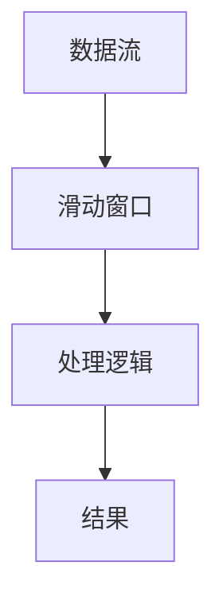
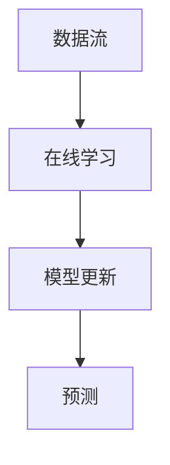
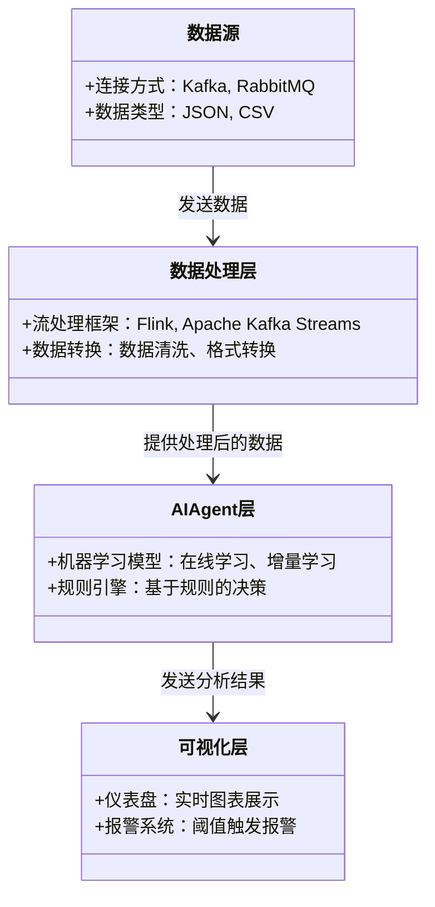
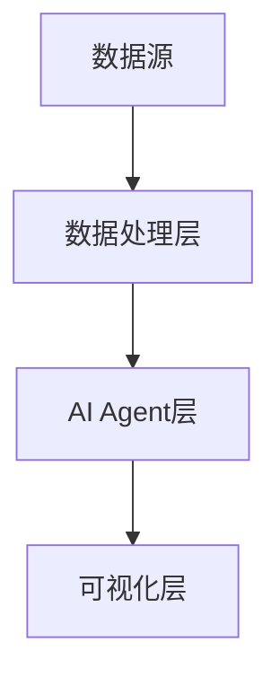
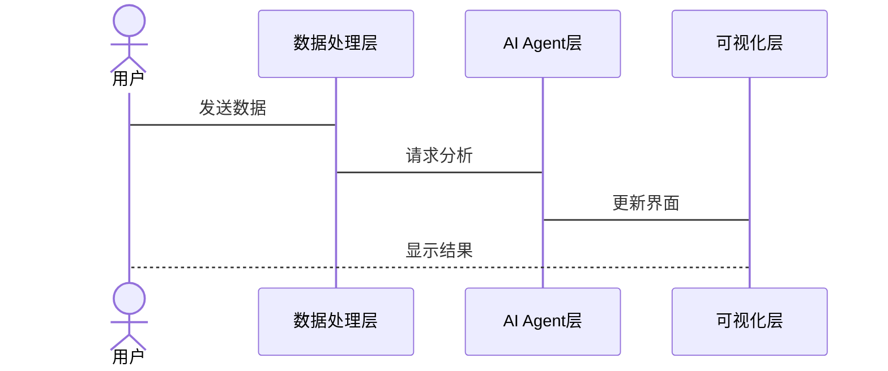

                 


# 《企业AI Agent的实时大数据分析平台》

> 关键词：企业AI Agent，实时大数据分析，流数据处理，实时机器学习，分布式计算，系统架构，数据可视化

> 摘要：本文探讨了企业AI Agent与实时大数据分析平台的结合，详细分析了其实现原理、系统架构及项目实战。通过背景介绍、核心概念、算法原理、系统架构、项目实战等部分，全面阐述了如何构建高效实时数据分析平台，助力企业智能化决策。

---

# 第1章: 企业AI Agent与实时大数据分析平台的背景与概念

## 1.1 问题背景

### 1.1.1 企业实时数据分析的需求
企业面临数据量激增、数据类型多样化的挑战，需要实时分析数据以快速响应市场变化。传统批量处理已无法满足实时需求。

### 1.1.2 AI Agent在企业中的角色
AI Agent能够自动化执行任务，从数据中提取洞察，辅助决策。实时数据分析是AI Agent的核心能力之一。

### 1.1.3 实时大数据分析的挑战
- 数据量大：实时处理海量数据需要高效算法和分布式计算。
- 数据变化快：动态数据要求系统具备快速响应能力。
- 系统复杂性：多组件协同工作需要良好的架构设计。

## 1.2 问题描述

### 1.2.1 传统数据分析的局限性
- 延迟高：批量处理无法实时反馈。
- 响应慢：无法应对实时决策需求。
- 资源消耗大：大量数据存储和处理成本高昂。

### 1.2.2 实时数据分析的必要性
- 快速决策：实时数据处理支持即时反馈。
- 智能监控：实时监控企业运营状态。
- 提高效率：通过实时数据优化业务流程。

### 1.2.3 AI Agent在实时数据分析中的作用
AI Agent能够自动化数据处理、模型训练和决策执行，提升实时数据分析的效率和准确性。

## 1.3 问题解决

### 1.3.1 AI Agent如何实现实时数据分析
通过集成流数据处理和实时机器学习算法，AI Agent能够实时处理数据并生成洞察。

### 1.3.2 数据实时处理的技术路径
- 数据采集：实时采集数据源。
- 数据处理：使用流处理技术清洗和转换数据。
- 数据分析：应用机器学习模型进行实时预测和分类。
- 结果输出：通过可视化界面呈现分析结果。

### 1.3.3 平台构建的目标与价值
目标是构建一个高效、可靠的实时数据分析平台，价值在于提升企业决策效率和智能化水平。

## 1.4 边界与外延

### 1.4.1 平台的边界定义
平台仅负责实时数据处理和分析，不包括数据存储和用户界面部分。

### 1.4.2 平台的外延功能
集成数据可视化工具和报警系统，扩展平台的功能。

### 1.4.3 与其他系统的接口关系
通过API接口与企业现有的系统集成，确保数据流的顺畅。

## 1.5 核心要素与组成

### 1.5.1 数据源
实时数据流，如日志、传感器数据、用户行为数据等。

### 1.5.2 数据处理引擎
流数据处理框架，如Kafka、Flink等。

### 1.5.3 AI Agent算法
实时机器学习模型，如在线学习、增量学习等。

### 1.5.4 可视化界面
展示实时分析结果，如仪表盘、图表等。

## 1.6 本章小结
本章介绍了企业AI Agent与实时大数据分析平台的背景，分析了其实现的必要性和挑战，明确了平台的构成和目标。

---

# 第2章: 企业AI Agent与实时大数据分析平台的核心概念

## 2.1 AI Agent的定义与特点

### 2.1.1 AI Agent的基本定义
AI Agent是能够感知环境、自主决策并执行任务的智能实体。

### 2.1.2 AI Agent的核心特点
- 自主性：无需人工干预。
- 反应性：实时响应环境变化。
- 社会性：与其他系统或人交互协作。
- 学习能力：通过经验改进性能。

### 2.1.3 AI Agent与传统软件的区别
AI Agent具备自主决策和学习能力，能够处理复杂动态环境。

## 2.2 实时大数据分析平台的定义与特点

### 2.2.1 实时大数据分析的定义
实时大数据分析是指对数据流进行持续处理和分析，以提供即时反馈和决策支持。

### 2.2.2 实时大数据分析的核心特点
- 实时性：数据到达后立即处理。
- 高效性：快速处理大量数据。
- 可扩展性：支持数据量的动态变化。
- 可靠性：确保数据处理的准确性。

## 2.3 AI Agent与实时大数据分析平台的关系

### 2.3.1 平台的整体架构
AI Agent作为核心模块，负责数据处理和分析，平台提供数据源和展示层。

### 2.3.2 核心组件
- 数据采集层：负责实时数据采集。
- 数据处理层：执行流数据处理和分析。
- AI Agent层：应用机器学习模型进行预测和分类。
- 可视化层：展示分析结果。

## 2.4 核心概念的ER实体关系图

```mermaid
er
actor: 用户
agent: AI Agent
data_source: 数据源
data_stream: 数据流
analysis_result: 分析结果
visualization: 可视化界面

actor --> data_source: 提供数据
data_source --> data_stream: 发出数据流
data_stream --> agent: 接收数据
agent --> analysis_result: 生成分析结果
analysis_result --> visualization: 更新可视化界面
```

## 2.5 本章小结
本章详细阐述了企业AI Agent和实时大数据分析平台的核心概念，分析了它们的特点和关系，并通过ER图展示了平台的整体架构。

---

# 第3章: 企业AI Agent实时大数据分析平台的算法原理

## 3.1 流数据处理算法

### 3.1.1 流数据处理的基本原理
流数据处理是对不断到达的数据流进行实时处理，通常采用滑动窗口技术。

### 3.1.2 滑动窗口算法
滑动窗口用于维护一段时间内的数据，确保处理的数据是有效的。



### 3.1.3 流数据处理的Python实现
代码示例：

```python
from itertools import islice
import time

def sliding_window(iterable, window_size):
    it = iter(iterable)
    window = []
    while True:
        try:
            item = next(it)
            window.append(item)
            if len(window) == window_size:
                yield window.copy()
                window.pop(0)
        except StopIteration:
            break

# 使用示例
data = [1, 2, 3, 4, 5, 6, 7, 8, 9, 10]
window_size = 3
for window in sliding_window(data, window_size):
    print(window)
```

## 3.2 实时机器学习算法

### 3.2.1 实时机器学习的基本原理
实时机器学习是在数据流上进行在线学习，模型能够动态更新。

### 3.2.2 在线学习算法
使用在线随机梯度下降（SGD）进行模型更新。



### 3.2.3 实时机器学习的Python实现
代码示例：

```python
import numpy as np
from sklearn.linear_model import SGDClassifier

# 示例数据流
X = np.array([[0, 0], [1, 1], [2, 2], [3, 3], [4, 4]])
y = np.array([0, 1, 0, 1, 0])

# 初始化模型
model = SGDClassifier()
for xi, yi in zip(X, y):
    model.partial_fit(xi.reshape(1, -1), yi.reshape(1, -1))

# 预测
print(model.predict(X[-1].reshape(1, -1)))
```

## 3.3 算法的数学模型与公式

### 3.3.1 滑动窗口算法的数学模型
滑动窗口维护一个窗口大小为N的队列，每接收一个新数据，移除最旧数据。

### 3.3.2 在线学习算法的数学公式
随机梯度下降更新权重的公式：

$$ w_{t+1} = w_t - \eta (y_i - \text{predict}(x_i, w_t)) x_i $$

## 3.4 本章小结
本章详细讲解了企业AI Agent实时大数据分析平台中的核心算法，包括流数据处理和实时机器学习的原理和实现。

---

# 第4章: 企业AI Agent实时大数据分析平台的系统分析与架构设计

## 4.1 问题场景介绍

### 4.1.1 企业应用场景
实时监控、 fraud detection、实时推荐等。

### 4.1.2 核心需求
实时性、高可用性、可扩展性、易用性。

## 4.2 系统功能设计

### 4.2.1 领域模型
展示系统各组件及其关系。



## 4.3 系统架构设计

### 4.3.1 分层架构
系统分为数据源、数据处理层、AI Agent层和可视化层。

### 4.3.2 组件交互关系
展示各组件之间的交互流程。



## 4.4 系统接口设计

### 4.4.1 API接口
- 数据接收接口：处理数据流。
- 分析结果查询接口：获取实时分析结果。

### 4.4.2 交互序列图
展示用户请求处理的流程。



## 4.5 本章小结
本章分析了企业AI Agent实时大数据分析平台的系统架构，展示了各组件的交互关系和接口设计。

---

# 第5章: 企业AI Agent实时大数据分析平台的项目实战

## 5.1 环境安装与配置

### 5.1.1 开发环境
- 操作系统：Linux/Windows/MacOS
- 软件工具：Python、Jupyter Notebook、IDE（PyCharm）

### 5.1.2 依赖安装
使用pip安装所需库。

```bash
pip install numpy pandas scikit-learn sgvizler
```

## 5.2 核心代码实现

### 5.2.1 数据流处理
代码示例：

```python
import time
from kafka import KafkaConsumer, KafkaProducer

# 消费者
consumer = KafkaConsumer('realtime_stream', bootstrap_servers='localhost:9092')

for message in consumer:
    print(f"收到消息: {message.value}")
    time.sleep(1)
```

### 5.2.2 实时机器学习
代码示例：

```python
from sklearn.linear_model import SGDClassifier

model = SGDClassifier()
model.partial_fit(X_train, y_train)
y_pred = model.predict(X_test)
```

### 5.2.3 可视化展示
使用Matplotlib或Seaborn库进行实时图表绘制。

```python
import matplotlib.pyplot as plt
import numpy as np

x = np.linspace(0, 10, 100)
y = np.sin(x)

plt.ion()
plt.figure()
plt.plot(x, y)
plt.show()
```

## 5.3 实际案例分析

### 5.3.1 案例背景
某电商平台的实时销售数据分析。

### 5.3.2 数据流处理
使用Kafka处理实时销售数据流。

### 5.3.3 模型训练与预测
训练实时销售预测模型，预测未来销售趋势。

### 5.3.4 可视化结果
展示实时销售趋势图和预测结果。

## 5.4 本章小结
本章通过实际案例展示了企业AI Agent实时大数据分析平台的实现过程，包括环境配置、代码实现和案例分析。

---

# 第6章: 企业AI Agent实时大数据分析平台的最佳实践与总结

## 6.1 最佳实践

### 6.1.1 系统设计
- 采用分布式架构，确保高可用性。
- 使用流处理框架优化数据处理效率。

### 6.1.2 开发实践
- 模块化设计，便于维护和扩展。
- 定期更新模型，保持准确性。

### 6.1.3 部署与监控
- 使用容器化技术部署系统。
- 实时监控系统性能，及时处理异常。

## 6.2 小结
企业AI Agent实时大数据分析平台通过高效的数据处理和智能分析，帮助企业快速响应市场变化，提升决策效率。

## 6.3 注意事项

### 6.3.1 数据质量
确保数据源的准确性和完整性。

### 6.3.2 系统性能
优化算法和架构设计，确保实时处理的高效性。

### 6.3.3 安全性
保护数据安全，防止数据泄露。

## 6.4 拓展阅读
推荐阅读相关技术书籍和论文，深入了解流数据处理和实时机器学习的最新进展。

## 6.5 本章小结
本章总结了企业AI Agent实时大数据分析平台的最佳实践，提供了系统设计和开发的注意事项，并推荐了进一步学习的资源。

---

# 附录: 企业AI Agent实时大数据分析平台的常见问题解答

## 1. 什么是AI Agent？
AI Agent是能够感知环境、自主决策并执行任务的智能实体。

## 2. 如何保证实时数据分析的准确性？
通过数据预处理、模型优化和定期校准。

## 3. 实时数据分析的延迟如何控制？
使用高效的流处理框架和优化算法复杂度。

## 4. 如何处理数据源中断？
通过冗余数据源和断点续传机制。

## 5. AI Agent如何学习新知识？
通过在线学习和增量学习方法。

---

# 结束语
企业AI Agent实时大数据分析平台结合了人工智能和大数据分析技术，为企业提供了实时数据处理和智能决策支持。通过本文的详细阐述，读者可以深入了解其实现原理和构建方法，为企业数字化转型提供有力支持。

