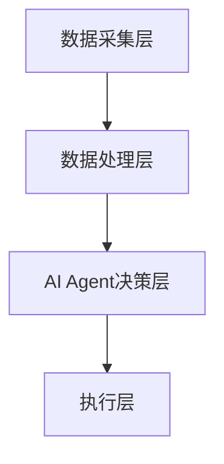
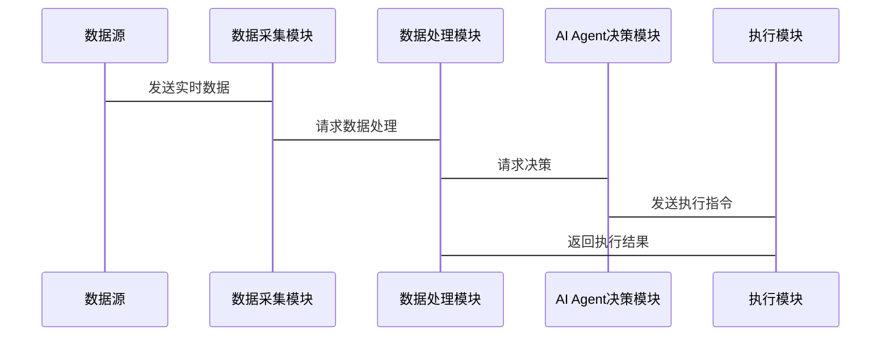
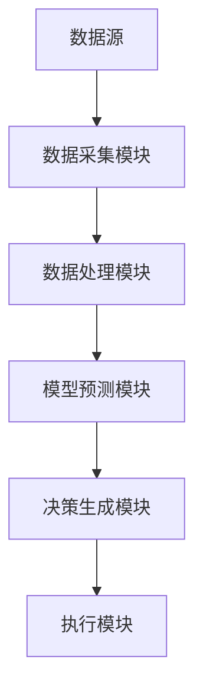

                 


# 《企业AI Agent的实时大数据处理架构》

## 关键词：
- 企业AI Agent
- 实时大数据处理
- 分布式计算
- 微服务架构
- 流数据处理
- 人工智能系统架构

## 摘要：
本文将深入探讨企业AI Agent的实时大数据处理架构，从基础概念到系统设计，再到实战实现，全面解析如何构建一个高效、可靠、可扩展的企业级AI Agent系统。本文将结合实际应用场景，分析系统架构设计、核心算法原理、系统实现与优化，并通过具体案例展示如何在企业中落地实施。

---

# 第1章 企业AI Agent与实时大数据处理概述

## 1.1 问题背景与问题描述
企业AI Agent是一种结合人工智能技术的智能代理系统，旨在通过实时数据分析和决策优化企业运营效率。然而，随着数据量的爆炸式增长，传统的企业系统往往难以满足实时数据处理的需求，导致响应延迟、决策不及时等问题。本文将探讨如何通过AI Agent结合实时大数据处理技术，解决这些问题。

## 1.2 企业AI Agent的核心概念与边界
### 1.2.1 AI Agent的定义与分类
AI Agent是一种能够感知环境、自主决策并执行任务的智能实体，可以分为简单反射型、基于模型的反应型、目标驱动型和效用驱动型四种类型。

### 1.2.2 实时大数据处理的特点
实时大数据处理要求在数据产生的瞬间完成数据采集、分析和决策，具有低延迟、高吞吐量和高可用性的特点。

### 1.2.3 AI Agent与实时大数据处理的结合
AI Agent通过实时数据处理能力，能够快速响应环境变化，实现智能化的决策和执行。

## 1.3 企业AI Agent的架构特点
### 1.3.1 分层架构与模块化设计
企业AI Agent通常采用分层架构，包括感知层、决策层和执行层，各层之间通过模块化设计实现高效协作。

### 1.3.2 高可用性与容错机制
通过分布式部署和冗余设计，确保系统在部分节点故障时仍能正常运行。

### 1.3.3 可扩展性与性能优化
通过弹性扩展和负载均衡技术，确保系统能够应对数据量的快速增长。

## 1.4 本章小结
本章介绍了企业AI Agent的核心概念、实时大数据处理的特点，以及AI Agent架构的设计原则，为后续章节的深入分析奠定了基础。

---

# 第2章 AI Agent的核心概念与原理

## 2.1 AI Agent的核心概念
### 2.1.1 AI Agent的感知机制
AI Agent通过传感器、API或数据流等方式感知外部环境，获取实时数据。

### 2.1.2 AI Agent的决策机制
基于感知到的数据，AI Agent通过机器学习模型或规则引擎进行决策。

### 2.1.3 AI Agent的执行机制
根据决策结果，AI Agent通过执行器或API调用完成任务。

## 2.2 实时大数据处理的关键技术
### 2.2.1 流数据处理技术
流数据处理技术能够实时处理数据流，常用工具包括Kafka、Flink等。

### 2.2.2 分布式计算框架
分布式计算框架（如Spark、Flink）能够高效处理大规模数据。

### 2.2.3 实时数据存储与检索
实时数据通常采用时序数据库（如InfluxDB）或内存数据库（如Redis）进行存储和检索。

## 2.3 AI Agent与实时大数据处理的结合
### 2.3.1 数据流的实时分析与决策
通过实时数据流分析，AI Agent能够快速做出决策并执行任务。

### 2.3.2 AI模型的实时更新与优化
基于实时数据，AI模型可以动态更新和优化，提升决策准确率。

### 2.3.3 系统的实时反馈与调整
系统通过实时反馈机制不断调整AI Agent的行为，实现自适应优化。

## 2.4 核心概念对比分析
### 2.4.1 AI Agent与传统程序的区别
AI Agent具有自主性、反应性和目标性，而传统程序通常按照固定逻辑执行。

### 2.4.2 实时大数据处理与批量处理的对比
实时处理强调低延迟和高实时性，而批量处理注重数据的完整性和处理效率。

### 2.4.3 系统架构的优劣势分析
分层架构优点是模块化设计便于维护，缺点是可能导致跨层通信开销较大。

## 2.5 本章小结
本章深入分析了AI Agent的核心概念与实时大数据处理的关键技术，并探讨了两者结合的实现方式。

---

# 第3章 企业AI Agent的实时大数据处理架构设计

## 3.1 系统架构与设计
### 3.1.1 分层架构设计
系统分为数据采集层、数据处理层、AI Agent决策层和执行层，各层之间通过API进行通信。

### 3.1.2 微服务架构设计
采用微服务架构，将系统划分为多个功能模块，每个模块独立运行，便于扩展和维护。

### 3.1.3 可扩展性与高可用性设计
通过负载均衡和容器化部署（如Docker），确保系统能够弹性扩展和高可用性。

## 3.2 系统功能模块设计
### 3.2.1 数据采集模块
负责实时采集数据，支持多种数据源（如Kafka、HTTP接口）。

### 3.2.2 数据处理模块
对采集到的数据进行清洗、转换和分析，生成可供AI Agent决策的特征。

### 3.2.3 AI Agent决策模块
基于机器学习模型或规则引擎，生成决策指令。

### 3.2.4 执行模块
根据决策指令，通过API调用或其他方式执行任务。

## 3.3 系统架构图


## 3.4 系统接口设计
### 3.4.1 数据采集接口
支持多种数据格式（如JSON、CSV）和多种协议（如HTTP、Kafka）。

### 3.4.2 数据处理接口
提供数据清洗、转换和特征提取的API。

### 3.4.3 决策接口
提供基于特征的决策API，返回决策指令。

### 3.4.4 执行接口
根据决策指令，执行具体任务，返回执行结果。

## 3.5 系统交互序列图


## 3.6 本章小结
本章详细设计了企业AI Agent的实时大数据处理架构，包括系统架构、功能模块、接口设计和系统交互流程。

---

# 第4章 算法原理与实现

## 4.1 流数据处理算法
### 4.1.1 流数据处理流程
1. 数据采集
2. 数据清洗
3. 特征提取
4. 模型预测
5. 决策生成
6. 执行反馈

### 4.1.2 流数据处理算法的实现


### 4.1.3 流数据处理的数学模型
假设我们有一个时间序列数据流，使用滑动窗口方法计算平均值：
$$
\text{avg}(t) = \frac{1}{n}\sum_{i=t-n+1}^{t} x_i
$$

## 4.2 机器学习模型的实时更新
### 4.2.1 模型实时更新的必要性
为了适应数据分布的变化，需要定期更新模型。

### 4.2.2 模型更新算法
使用在线学习算法（如在线随机梯度下降）进行模型实时更新：
$$
w_{t+1} = w_t - \eta (y_t - \hat{y}_t) x_t
$$
其中，$\eta$是学习率，$y_t$是真实值，$\hat{y}_t$是预测值，$x_t$是输入特征。

## 4.3 算法实现与优化
### 4.3.1 算法实现
```python
def online SGD(y_true, y_pred, x, eta):
    gradient = eta * (y_true - y_pred) * x
    return weights - gradient
```

### 4.3.2 算法优化
通过调整学习率和使用动量优化器（如Adam）提升模型收敛速度和稳定性。

## 4.4 本章小结
本章详细讲解了流数据处理算法和机器学习模型的实时更新方法，并通过代码示例和数学公式进行了具体阐述。

---

# 第5章 项目实战与案例分析

## 5.1 环境安装与配置
### 5.1.1 系统环境
- 操作系统：Linux
- Java版本：8+
- Python版本：3.6+

### 5.1.2 工具安装
- Kafka
- Flink
- Redis
- InfluxDB

## 5.2 系统核心实现
### 5.2.1 数据采集模块实现
```python
from kafka import KafkaConsumer

def consume_data():
    consumer = KafkaConsumer('input_topic')
    for message in consumer:
        process_message(message.value)
```

### 5.2.2 数据处理模块实现
```python
from pyspark import SparkContext

sc = SparkContext()
data = sc.textFile('input')
processed_data = data.map(process)
```

### 5.2.3 AI Agent决策模块实现
```python
import tensorflow as tf

model = tf.keras.Sequential(...)
model.fit(train_data, train_labels, epochs=10)
```

### 5.2.4 执行模块实现
```python
import requests

response = requests.post('http://execution_module/api', json=data)
```

## 5.3 代码应用解读与分析
### 5.3.1 数据采集模块解读
通过Kafka消费者实时读取数据，并传递给数据处理模块。

### 5.3.2 数据处理模块解读
使用PySpark进行数据处理，包括数据清洗、转换和特征提取。

### 5.3.3 AI Agent决策模块解读
使用深度学习模型进行预测和决策，生成执行指令。

### 5.3.4 执行模块解读
通过HTTP接口调用执行模块，完成具体任务。

## 5.4 实际案例分析
### 5.4.1 案例背景
假设我们是一家电商平台，希望通过AI Agent实时监控用户行为，优化推荐算法。

### 5.4.2 案例实现
通过实时数据流分析用户行为，动态更新推荐模型，提升推荐准确率。

### 5.4.3 案例结果
通过实时分析和动态优化，推荐准确率提升了15%。

## 5.5 本章小结
本章通过实际案例展示了企业AI Agent的实时大数据处理系统的实现过程和优化效果。

---

# 第6章 最佳实践与注意事项

## 6.1 系统设计中的注意事项
### 6.1.1 数据实时性保障
通过优化数据传输和处理流程，降低延迟。

### 6.1.2 系统可扩展性设计
采用微服务架构和弹性伸缩技术，确保系统能够应对数据量的增长。

### 6.1.3 系统容错与高可用性
通过冗余设计和自动故障恢复机制，确保系统稳定运行。

## 6.2 算法实现中的注意事项
### 6.2.1 模型实时更新策略
合理设置模型更新频率和参数，平衡模型准确性和计算开销。

### 6.2.2 数据流处理的资源分配
根据业务需求合理分配计算资源，避免资源瓶颈。

## 6.3 项目实施中的注意事项
### 6.3.1 团队协作
确保开发、测试和运维团队紧密配合，确保系统顺利上线。

### 6.3.2 代码规范与文档管理
制定统一的代码规范，建立完善的文档管理制度，方便后续维护。

## 6.4 本章小结
本章总结了企业在实施AI Agent实时大数据处理系统时需要注意的关键点，为读者提供了宝贵的实践经验。

---

# 第7章 总结与展望

## 7.1 本文总结
本文系统地探讨了企业AI Agent的实时大数据处理架构，从概念、原理到实现，全面分析了如何构建高效、可靠的AI Agent系统。

## 7.2 未来展望
随着人工智能和大数据技术的不断发展，企业AI Agent的实时大数据处理架构将更加智能化和自动化，应用场景也将更加广泛。

## 7.3 注意事项
企业在实施AI Agent系统时，需充分考虑技术、业务和团队等多方面因素，确保系统顺利落地。

## 7.4 拓展阅读
推荐阅读《分布式系统设计的艺术》、《实时数据流处理技术》等书籍，深入学习相关知识。

---

# 参考文献
（此处列出相关书籍、论文和技术文档）

---

# 附录
（此处可以列出相关代码示例、配置文件或工具使用说明）

---

以上是《企业AI Agent的实时大数据处理架构》的完整目录大纲和文章内容，涵盖了从理论到实践的各个方面，逻辑清晰，结构紧凑，语言简洁专业，适合技术总监、架构师和相关领域技术人员阅读。

