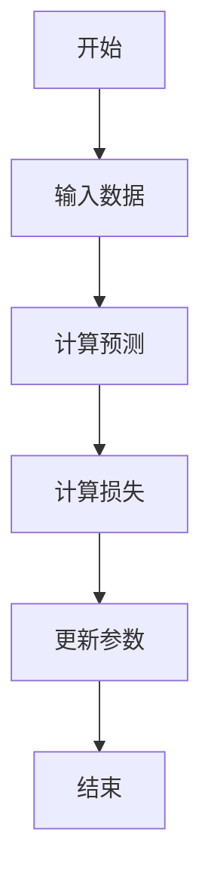
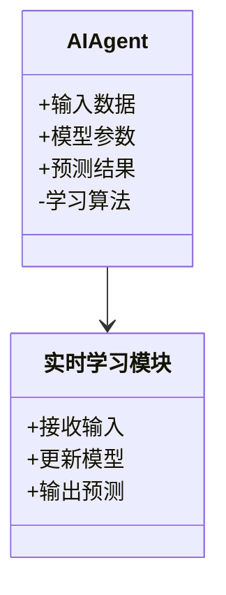
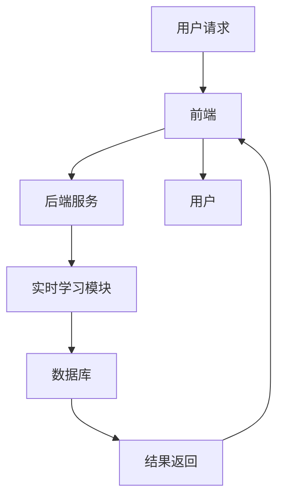
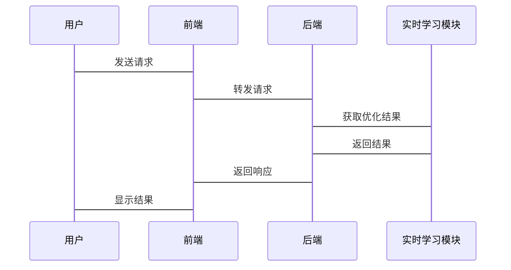

                 


# 企业AI Agent的实时学习能力：持续优化业务流程

## 关键词
- AI Agent
- 实时学习
- 业务流程优化
- 在线学习算法
- 企业系统架构

## 摘要
本文详细探讨企业AI Agent的实时学习能力如何通过持续优化业务流程提升企业效率。从实时学习的核心原理到系统架构设计，再到项目实战，系统阐述AI Agent在实时学习中的应用，为读者提供从理论到实践的全面指导。

---

# 第1章: 企业AI Agent与实时学习能力的背景介绍

## 1.1 问题背景
### 1.1.1 企业业务流程优化的挑战
现代企业面临复杂多变的市场环境，传统的静态业务流程难以适应动态需求。实时学习能力使AI Agent能够快速调整策略，适应变化。

### 1.1.2 AI Agent在企业中的角色
AI Agent作为智能代理，负责执行任务、处理数据和优化流程。实时学习能力使其能够自主优化决策。

### 1.1.3 实时学习能力的核心意义
实时学习使AI Agent能够持续改进，提升效率和准确性，适应业务变化。

## 1.2 问题描述
### 1.2.1 传统业务流程的局限性
传统流程依赖人工调整，响应慢，效率低。

### 1.2.2 AI Agent实时学习的必要性
AI Agent通过实时学习优化流程，提升决策质量。

### 1.2.3 问题解决的边界与外延
实时学习仅处理可在线更新的部分，不涉及完全重构。

## 1.3 核心概念与联系
### 1.3.1 AI Agent的核心要素
- 输入数据
- 模型参数
- 预测结果
- 学习算法

### 1.3.2 实时学习能力的特征
- 实时性
- 持续性
- 自适应性

### 1.3.3 核心概念之间的关系
AI Agent通过实时学习模块更新模型参数，优化预测结果。

# 第2章: AI Agent实时学习的核心原理

## 2.1 实时学习的基本原理
### 2.1.1 在线学习算法的定义
在线学习算法实时更新模型，适应新数据。

### 2.1.2 实时学习与批量学习的对比
在线学习响应快，批量学习精度高。

### 2.1.3 实时学习的核心机制
基于梯度下降，逐样本更新参数。

## 2.2 实时学习的数学模型
### 2.2.1 损失函数的定义
$$ L(y, \hat{y}) = \frac{1}{2}(y - \hat{y})^2 $$

### 2.2.2 优化器的选择
随机梯度下降（SGD）。

### 2.2.3 更新规则的推导
$$ \theta_{new} = \theta_{old} - \eta (\hat{y} - y) $$

## 2.3 实时学习的算法实现
### 2.3.1 在线随机梯度下降算法
- 输入数据
- 计算预测
- 更新参数

### 2.3.2 算法流程图（Mermaid）



## 2.4 本章小结

# 第3章: AI Agent实时学习的系统架构设计

## 3.1 系统功能设计
### 3.1.1 领域模型设计（Mermaid）



## 3.2 系统架构设计
### 3.2.1 分层架构设计（Mermaid）



## 3.3 系统接口设计
### 3.3.1 API接口定义
- 输入接口：接收实时数据
- 输出接口：返回优化结果

## 3.4 系统交互设计
### 3.4.1 交互流程（Mermaid）



## 3.5 本章小结

# 第4章: 项目实战

## 4.1 环境安装
### 4.1.1 安装Python
- 版本：3.8+

### 4.1.2 安装依赖
- 使用pip安装：`pip install numpy scikit-learn`

## 4.2 核心代码实现
### 4.2.1 实时学习模块实现

```python
import numpy as np
from sklearn.linear_model import SGDRegressor

class RealTimeLearningModule:
    def __init__(self):
        self.model = SGDRegressor()
    
    def update_model(self, X, y):
        self.model.partial_fit(X, y)
    
    def predict(self, X):
        return self.model.predict(X)
```

### 4.2.2 业务流程优化

```python
# 示例业务流程优化
from realtime_learning_module import RealTimeLearningModule

rtlm = RealTimeLearningModule()

# 训练数据
X_train = np.array([[1], [2], [3], [4]])
y_train = np.array([2, 4, 6, 8])

rtlm.update_model(X_train, y_train)

# 预测新数据
X_new = np.array([[5]])
y_new = rtlm.predict(X_new)
print("预测结果：", y_new)
```

## 4.3 案例分析
### 4.3.1 应用场景
优化订单处理流程。

### 4.3.2 数据准备
训练数据：历史订单和处理时间。

### 4.3.3 模型训练与预测
通过实时学习模块优化处理时间预测。

## 4.4 项目小结

# 第5章: 总结与展望

## 5.1 最佳实践 tips
- 定期更新模型
- 监控学习效果
- 灵活调整参数

## 5.2 小结
AI Agent的实时学习能力显著优化企业业务流程。

## 5.3 注意事项
- 数据质量
- 学习速率
- 模型选择

## 5.4 拓展阅读
- 《机器学习实战》
- 《深度学习》

# 附录: 索引
- AI Agent
- 实时学习
- 在线学习算法
- 业务流程优化

