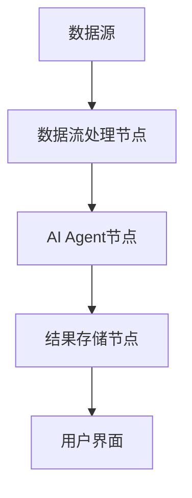
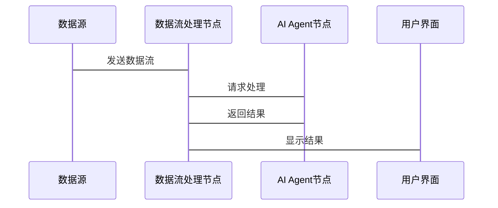

                 


# 《企业AI Agent的实时数据流处理与分析架构》

> 关键词：企业AI Agent，实时数据流处理，流处理算法，系统架构设计，Python代码示例

> 摘要：本文详细探讨了企业AI Agent在实时数据流处理与分析中的架构设计，涵盖了背景介绍、核心概念、算法原理、系统架构、项目实战及最佳实践。通过理论与实践结合，帮助读者理解如何构建高效的实时数据处理系统。

---

## 第一部分: 背景介绍

### 第1章: 问题背景与描述

#### 1.1 问题背景
- **1.1.1 企业数据流处理的挑战**  
  企业面临海量实时数据流，如何高效处理和分析成为关键问题。
- **1.1.2 AI Agent在实时数据处理中的作用**  
  AI Agent能够自动化处理和决策，提升数据处理效率。

#### 1.2 问题描述
- **1.2.1 数据流处理的实时性要求**  
  实时处理需要快速响应，避免数据延迟。
- **1.2.2 AI Agent的智能化需求**  
  AI Agent需具备学习和自适应能力，以应对复杂场景。

#### 1.3 问题解决
- **1.3.1 AI Agent的核心能力**  
  包括感知、决策和执行能力。
- **1.3.2 实时数据流处理的关键技术**  
  如流处理框架（Flink、Kafka）的应用。

#### 1.4 边界与外延
- **1.4.1 AI Agent的边界**  
  明确AI Agent的功能范围和限制。
- **1.4.2 数据流处理的范围界定**  
  区分实时与批量处理的适用场景。

#### 1.5 概念结构与核心要素
- **1.5.1 核心概念的组成**  
  包括数据流、AI Agent、处理算法等。
- **1.5.2 核心要素的关联关系**  
  描述各要素之间的交互与依赖。

---

## 第二部分: 核心概念与联系

### 第2章: 核心概念原理

#### 2.1 AI Agent的基本原理
- **2.1.1 AI Agent的定义**  
  AI Agent是具备自主决策能力的智能体。
- **2.1.2 AI Agent的核心算法**  
  包括感知算法（如机器学习）和决策算法（如强化学习）。

#### 2.2 实时数据流处理的原理
- **2.2.1 数据流的定义**  
  数据流是连续的、实时生成的数据序列。
- **2.2.2 实时处理的关键技术**  
  如事件驱动架构和分布式处理框架。

#### 2.3 AI Agent与实时数据流的关系
- **2.3.1 两者的核心联系**  
  数据流驱动AI Agent的感知和决策。
- **2.3.2 数据流驱动AI Agent的机制**  
  实时数据流触发AI Agent的响应和处理。

### 第3章: 核心概念对比与ER实体关系图

#### 3.1 核心概念属性特征对比
| 比较维度 | 数据流 | AI Agent |
|----------|--------|----------|
| 核心特征 | 实时性 | 智能化 | 
| 处理方式 | 流式处理 | 自主决策 | 
| 依赖技术 | 流处理框架 | 机器学习算法 |

#### 3.2 ER实体关系图
```mermaid
erDiagram
    customer[CUSTOMER] {
        +id: int
        +name: string
        +email: string
    }
    order[ORDER] {
        +id: int
        +customerId: int
        +orderTime: datetime
        +amount: float
    }
    product[PRODUCT] {
        +id: int
        +name: string
        +price: float
    }
    CUSTOMER o-- ORDER
    ORDER o-- PRODUCT
```

---

## 第三部分: 算法原理讲解

### 第4章: 流处理算法原理

#### 4.1 流处理的基本算法
- **4.1.1 基于时间窗口的流处理**  
  示例代码：
  ```python
  window_size = 5
  for i in range(len(stream)):
      current_window = stream[i:i+window_size]
      process(current_window)
  ```

- **4.1.2 基于事件的流处理**  
  事件驱动的处理流程：
  ```mermaid
  flowchart TD
      A[开始] --> B[接收事件]
      B --> C[处理事件]
      C --> D[反馈结果]
      D --> E[结束]
  ```

#### 4.2 算法原理的数学模型
- **4.2.1 时间戳处理**  
  公式：$t_{current} = t_{previous} + \Delta t$
- **4.2.2 窗口大小调整**  
  公式：$window\_size = min(n, max\_window\_size)$

---

## 第四部分: 系统分析与架构设计

### 第5章: 问题场景介绍

#### 5.1 项目介绍
- **项目目标**：构建一个实时监控系统，利用AI Agent处理流数据，进行异常检测。

#### 5.2 系统功能设计
- **5.2.1 领域模型设计**  
  ```mermaid
  classDiagram
      class Customer {
          id
          name
          email
      }
      class Order {
          id
          customerId
          orderTime
          amount
      }
      Customer --> Order
  ```

### 第6章: 系统架构设计

#### 6.1 系统架构设计


#### 6.2 系统接口设计
- **API接口**：提供RESTful API，如`/api/process_stream`。

#### 6.3 系统交互设计


---

## 第五部分: 项目实战

### 第7章: 环境安装与系统实现

#### 7.1 环境安装
- 安装Python和必要的库：`pip install apache-flink kafka-python`

#### 7.2 系统核心实现
```python
from apache.flink import StreamExecutionEnvironment
from kafka import KafkaConsumer

def process_stream():
    env = StreamExecutionEnvironment.get_execution_environment()
    consumer = KafkaConsumer('localhost:9092', 'topic')
    data_stream = env.add_source(consumer)
    processed_stream = data_stream.map(lambda x: process_data(x))
    processed_stream.sink_to_console()
    env.execute("DataStream Processing")

def process_data(record):
    # AI Agent逻辑处理
    return result
```

### 第8章: 代码应用解读与分析

#### 8.1 代码实现细节
- 数据流的读取和处理逻辑。
- AI Agent的决策算法实现。

#### 8.2 系统运行结果分析
- 处理时间分析。
- 系统性能优化建议。

### 第9章: 实际案例分析

#### 9.1 案例介绍
- 实际应用场景：实时交易监控。

#### 9.2 系统处理过程分析
- 数据流的接收、处理和反馈过程。

#### 9.3 结果分析与优化
- 系统处理效率提升策略。

### 第10章: 项目小结
- 项目实现的关键点。
- 项目成果总结。

---

## 第六部分: 最佳实践

### 第11章: 总结与注意事项

#### 11.1 总结
- 本文总结了企业AI Agent实时数据流处理与分析的架构设计。

#### 11.2 注意事项
- 系统设计时需注意数据安全和性能优化。
- 确保算法的可扩展性和可维护性。

### 第12章: 拓展阅读
- 推荐相关技术书籍和论文。
- 提供进一步学习的资源。

---

# 结语

通过本文的详细讲解，读者可以系统地理解企业AI Agent实时数据流处理与分析的架构设计，掌握核心算法和系统实现的关键点。希望本文能为相关领域的技术人员提供有价值的参考和启发。

