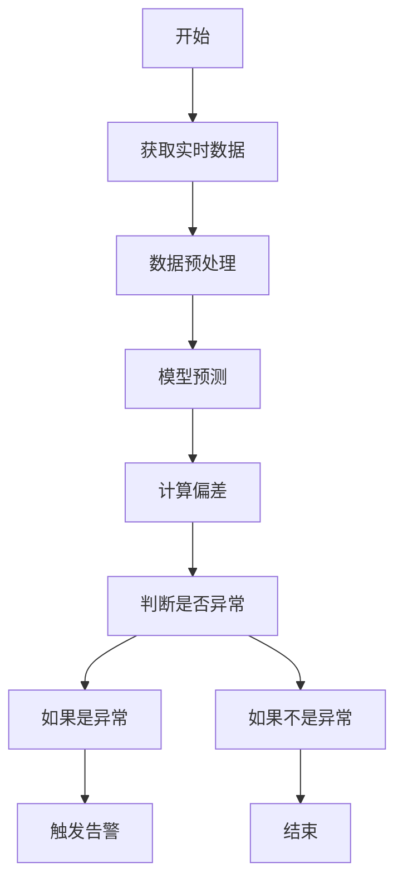
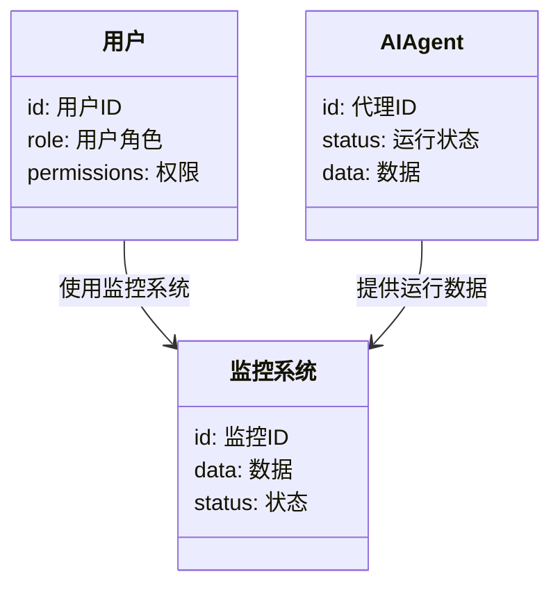
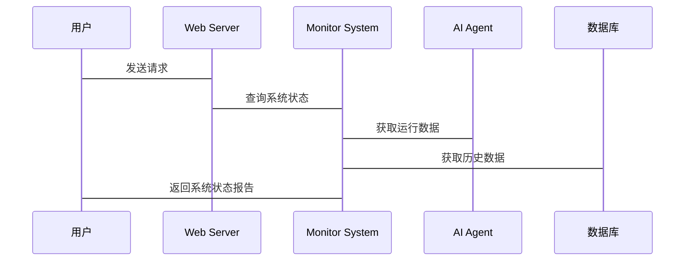

                 


# 企业AI Agent的实时监控系统

## 关键词：AI Agent，实时监控，系统架构，算法原理，项目实战

## 摘要：  
随着人工智能技术的快速发展，企业AI Agent（智能代理）的应用越来越广泛。AI Agent通过自动化执行任务、优化决策和提高效率，成为企业数字化转型的重要工具。然而，AI Agent的运行涉及复杂的系统架构和算法，如何对其运行状态进行实时监控，确保系统的稳定性和可靠性，是企业面临的重要挑战。本文将从背景介绍、核心概念、算法原理、系统架构设计、项目实战等多个方面，详细探讨企业AI Agent实时监控系统的实现方法，为企业提供一套完整的解决方案。

---

# 第一部分：企业AI Agent实时监控系统概述

## 第1章：问题背景与需求分析

### 1.1 问题背景

#### 1.1.1 企业AI Agent的兴起
随着深度学习、自然语言处理和强化学习等技术的快速发展，企业AI Agent（智能代理）的应用场景不断扩大。AI Agent能够通过感知环境、自主决策并执行任务，为企业提供智能化的解决方案。例如，在金融行业，AI Agent可以用于自动化交易和风险控制；在制造业，AI Agent可以用于生产优化和设备维护。

#### 1.1.2 实时监控的重要性
AI Agent的运行依赖于复杂的算法和系统架构，其运行状态可能受到多种因素的影响，例如网络延迟、数据质量、算法参数调整等。实时监控是确保AI Agent稳定运行的关键，能够帮助企业及时发现并解决潜在问题，避免因系统故障导致的经济损失。

#### 1.1.3 当前监控系统的不足
传统的监控系统通常针对单点系统设计，难以应对AI Agent这种多维度、高动态的复杂系统。例如，传统监控系统可能无法实时捕捉AI Agent的内部状态变化，也无法对异常行为进行预测和干预。

### 1.2 问题描述

#### 1.2.1 AI Agent运行中的关键问题
- 数据流的实时性：AI Agent需要处理大量的实时数据，数据的延迟可能影响系统的决策能力。
- 系统状态的复杂性：AI Agent的运行状态涉及多个模块，包括感知模块、决策模块和执行模块，每个模块的状态都需要实时监控。
- 异常检测的准确性：AI Agent的异常可能表现为多种形式，例如算法失效、数据偏差或环境变化，需要高效的异常检测机制。

#### 1.2.2 实时监控的核心需求
- 实时数据采集：能够快速采集AI Agent的运行数据，包括计算资源使用情况、算法执行时间、系统错误率等。
- 异常检测：基于实时数据，快速识别系统中的异常行为，并触发告警机制。
- 可视化与分析：提供直观的可视化界面，帮助用户理解和分析系统运行状态。

#### 1.2.3 边界与外延
AI Agent的实时监控系统需要与企业现有的IT基础设施集成，包括数据存储、网络通信和用户界面等。同时，监控系统的边界可能涉及数据隐私、系统安全等问题。

### 1.3 问题解决

#### 1.3.1 监控系统的总体思路
- 数据采集：通过传感器、日志文件和API接口等多种方式采集AI Agent的运行数据。
- 数据处理：对采集到的数据进行清洗、转换和存储，确保数据的准确性和可用性。
- 异常检测：基于机器学习算法，建立异常检测模型，实时识别系统中的异常行为。
- 告警与反馈：当检测到异常时，触发告警机制，并将反馈信息传递给相关系统进行处理。

#### 1.3.2 核心技术的选择
- 数据采集技术：采用高效的采集方法，例如使用Kafka进行实时数据流的传输。
- 数据存储技术：选择分布式数据库，如InfluxDB，用于存储时间序列数据。
- 异常检测算法：基于深度学习或统计学习的方法，例如使用LSTM进行时间序列分析。

#### 1.3.3 系统实现的关键点
- 系统的实时性：确保数据采集和处理的低延迟，避免数据堆积导致的系统卡顿。
- 系统的可扩展性：设计模块化的架构，便于后续的功能扩展和性能优化。
- 系统的安全性：采取数据加密、访问控制等措施，防止数据泄露和系统攻击。

### 1.4 概念结构与核心要素

#### 1.4.1 系统架构的核心要素
- 数据采集模块：负责采集AI Agent的运行数据。
- 数据处理模块：对采集到的数据进行清洗和存储。
- 异常检测模块：基于机器学习算法，实时识别系统中的异常行为。
- 告警模块：当检测到异常时，触发告警机制，并将信息传递给相关系统。

#### 1.4.2 各要素之间的关系
- 数据采集模块与数据处理模块之间通过API接口进行数据传输。
- 异常检测模块依赖于数据处理模块提供的数据，通过算法模型进行分析。
- 告警模块与数据采集模块、异常检测模块之间通过消息队列进行通信。

#### 1.4.3 系统功能的模块划分
- 数据采集模块：包括传感器、日志文件和API接口。
- 数据处理模块：包括数据清洗、数据存储和数据索引。
- 异常检测模块：包括特征提取、模型训练和实时检测。
- 告警模块：包括告警触发、信息传递和日志记录。

## 第2章：核心概念与联系

### 2.1 核心概念原理

#### 2.1.1 AI Agent的基本原理
AI Agent是一种能够感知环境、自主决策并执行任务的智能系统。其核心功能包括：
- **感知**：通过传感器或API接口获取环境数据。
- **决策**：基于感知数据，通过算法模型做出决策。
- **执行**：根据决策结果，执行相应的操作。

#### 2.1.2 实时监控的实现机制
实时监控系统通过采集、处理和分析AI Agent的运行数据，实现对系统状态的实时掌握。其实现机制包括：
- **数据采集**：通过传感器、日志文件和API接口采集实时数据。
- **数据处理**：对采集到的数据进行清洗、转换和存储。
- **异常检测**：基于机器学习算法，实时识别系统中的异常行为。
- **告警与反馈**：当检测到异常时，触发告警机制，并将反馈信息传递给相关系统。

#### 2.1.3 系统设计的核心思想
实时监控系统的核心思想是通过数据驱动的方式，实现对AI Agent运行状态的全面掌控。其核心思想包括：
- **数据驱动**：基于实时数据，实现对系统状态的动态监控。
- **算法驱动**：通过机器学习算法，实现对异常行为的精准识别。
- **反馈驱动**：通过告警和反馈机制，实现对系统问题的快速响应。

### 2.2 概念属性特征对比

| 概念        | 属性            | 特征分析                     |
|-------------|-----------------|-----------------------------|
| 数据采集    | 数据来源        | 传感器、日志文件、API接口   |
|             | 数据格式        | 结构化数据、非结构化数据     |
|             | 数据频率        | 实时采集、周期性采集         |
| 数据处理    | 数据清洗        | 去噪、填补缺失值             |
|             | 数据存储        | 时间序列数据库、分布式存储   |
|             | 数据索引        | 全文检索、时间范围查询       |
| 异常检测    | 检测算法        | 基于统计的异常检测、基于深度学习的异常检测 |
|             | 检测范围        | 系统错误率、执行时间、资源使用率 |
|             | 检测精度        | 真正异常率、假阳性率           |
| 告警模块    | 告警方式        | 界面告警、邮件告警、短信告警   |
|             | 告警级别        | 严重性分级：低、中、高         |
|             | 告警响应时间    | 实时响应、延迟响应             |

### 2.3 ER实体关系图

```mermaid
er
actor: 用户
agent: AI Agent
monitor: 监控系统
event: 监控事件
action: 系统操作
```

---

## 第3章：算法原理讲解

### 3.1 算法原理

#### 3.1.1 实时监控的核心算法
实时监控的核心算法是基于时间序列数据的异常检测算法。常见的算法包括：
- **基于统计的方法**：例如Z-score、Moving Average等。
- **基于深度学习的方法**：例如LSTM、GRU等。

#### 3.1.2 算法的数学模型
时间序列异常检测的数学模型如下：

$$
\text{异常概率} = P(x_t | x_{t-1}, x_{t-2}, ..., x_{t-k})
$$

其中，$x_t$表示时间$t$的观测值，$k$表示历史数据的窗口大小。

#### 3.1.3 算法的实现步骤
1. 数据预处理：对原始数据进行标准化、去噪处理。
2. 模型训练：基于训练数据，训练时间序列模型。
3. 实时检测：对实时数据进行预测，并计算预测值与实际值的偏差。
4. 异常判断：根据偏差值判断是否为异常数据。

### 3.2 算法流程图



### 3.3 Python源代码实现

```python
import numpy as np
from sklearn.ensemble import IsolationForest

def detect_anomaly(data, window_size=10):
    # 数据预处理
    normalized_data = (data - np.mean(data)) / np.std(data)
    
    # 模型训练
    model = IsolationForest(random_state=42)
    model.fit(normalized_data)
    
    # 实时检测
    for i in range(len(data)):
        if i < window_size:
            continue
        current_data = normalized_data[i - window_size:i]
        predicted = model.predict(current_data)
        if predicted[-1] == -1:
            return True  # 发现异常
    return False
```

### 3.4 算法的数学公式与举例说明

#### 3.4.1 算法的数学公式
时间序列异常检测的Z-score公式如下：

$$
z = \frac{x_t - \mu}{\sigma}
$$

其中，$\mu$是均值，$\sigma$是标准差，$x_t$是当前观测值。

#### 3.4.2 举例说明
假设我们有一个时间序列数据集，其中$\mu=100$，$\sigma=10$。当当前观测值$x_t=130$时，Z-score为：

$$
z = \frac{130 - 100}{10} = 3
$$

如果Z-score大于3，则认为该数据点是异常值。

---

## 第4章：系统分析与架构设计

### 4.1 问题场景介绍

#### 4.1.1 系统运行的典型场景
- 数据采集：通过传感器、日志文件和API接口采集实时数据。
- 数据处理：对采集到的数据进行清洗、转换和存储。
- 异常检测：基于机器学习算法，实时识别系统中的异常行为。
- 告警与反馈：当检测到异常时，触发告警机制，并将反馈信息传递给相关系统。

### 4.2 系统功能设计

#### 4.2.1 领域模型



#### 4.2.2 系统架构设计


#### 4.2.3 系统接口设计
- 数据采集接口：通过HTTP API或消息队列接收实时数据。
- 异常检测接口：通过RESTful API调用异常检测模型。
- 告警接口：通过消息队列或WebSocket通知用户异常信息。

#### 4.2.4 系统交互



### 4.3 系统实现的关键点

#### 4.3.1 模块化设计
- 数据采集模块：负责采集实时数据。
- 数据处理模块：负责数据清洗和存储。
- 异常检测模块：负责实时检测异常行为。
- 告警模块：负责触发告警机制。

#### 4.3.2 高可用性设计
- 数据备份：通过分布式存储实现数据冗余。
- 系统容错：通过冗余部署实现故障容错。
- 自动恢复：通过自动化脚本实现系统自动恢复。

#### 4.3.3 可扩展性设计
- 模块化架构：便于后续功能的扩展。
- 异构计算：通过GPU加速提升系统性能。
- 云原生设计：支持容器化部署和弹性扩展。

---

## 第5章：项目实战

### 5.1 环境安装

#### 5.1.1 系统环境
- 操作系统：Linux或Windows
- Python版本：3.6+

#### 5.1.2 依赖库安装
```bash
pip install numpy scikit-learn matplotlib influxdb kafka-python
```

### 5.2 核心代码实现

#### 5.2.1 数据采集模块

```python
import kafka
from influxdb import InfluxDBClient

class DataCollector:
    def __init__(self):
        self.kafka_producer = kafka.KafkaProducer(bootstrap_servers='localhost:9092')
        self.influx_client = InfluxDBClient(host='localhost', port=8086)
```

#### 5.2.2 异常检测模块

```python
import numpy as np
from sklearn.ensemble import IsolationForest

class AnomalyDetector:
    def __init__(self):
        self.model = IsolationForest(random_state=42)
    
    def train(self, data):
        normalized_data = (data - np.mean(data)) / np.std(data)
        self.model.fit(normalized_data)
    
    def predict(self, data):
        normalized_data = (data - np.mean(data)) / np.std(data)
        return self.model.predict(normalized_data)
```

#### 5.2.3 告警模块

```python
import smtplib
from email.mime.text import MIMEText

class AlarmNotifier:
    def __init__(self, email):
        self.email = email
        self.smtp_server = 'smtp.example.com'
        self.smtp_port = 587
        self.sender = 'admin@example.com'
        self.password = 'password'
    
    def send_email(self, message):
        msg = MIMEText(message)
        msg['Subject'] = '系统异常告警'
        msg['From'] = self.sender
        msg['To'] = self.email
        with smtplib.SMTP(self.smtp_server, self.smtp_port) as server:
            server.starttls()
            server.login(self.sender, self.password)
            server.sendmail(self.sender, self.email, msg.as_string())
```

### 5.3 代码应用解读与分析

#### 5.3.1 数据采集模块
数据采集模块负责从多种数据源采集实时数据，包括Kafka消息队列和InfluxDB数据库。通过模块化设计，确保数据采集的高效性和可靠性。

#### 5.3.2 异常检测模块
异常检测模块基于Isolation Forest算法，实现对时间序列数据的异常检测。通过数据标准化和模型训练，确保检测的准确性和实时性。

#### 5.3.3 告警模块
告警模块通过邮件通知的方式，将异常信息及时传递给相关人员。通过配置不同的告警级别和通知方式，确保系统异常能够被快速响应。

### 5.4 实际案例分析与详细讲解

#### 5.4.1 案例背景
某企业AI Agent系统在运行过程中，出现频繁的计算资源不足问题，导致系统响应延迟和交易失败。为了提高系统的稳定性和可靠性，企业决定部署实时监控系统。

#### 5.4.2 实施步骤
1. 数据采集：通过Kafka消息队列采集AI Agent的运行数据，包括计算资源使用率、系统错误率等。
2. 数据处理：将采集到的数据存储到InfluxDB数据库，并进行数据清洗和转换。
3. 异常检测：基于Isolation Forest算法，实时检测系统中的异常行为，例如计算资源使用率突然升高。
4. 告警与反馈：当检测到异常时，触发邮件告警，并将反馈信息传递给相关系统进行处理。

### 5.5 项目小结

#### 5.5.1 项目成果
通过部署实时监控系统，企业成功实现了对AI Agent运行状态的实时监控，提高了系统的稳定性和可靠性。

#### 5.5.2 项目经验
- 数据采集模块的设计需要考虑数据源的多样性和数据格式的统一性。
- 异常检测算法的选择需要结合系统的实际需求和数据的特性。
- 告警模块的实现需要考虑通知方式的多样性和告警级别的分级管理。

---

## 第6章：最佳实践

### 6.1 小结

通过本文的详细讲解，我们了解了企业AI Agent实时监控系统的实现方法。从系统设计到算法实现，再到项目实战，我们提供了一套完整的解决方案。

### 6.2 注意事项

- 数据隐私和系统安全是实时监控系统设计中需要重点关注的问题。
- 异常检测算法的选择需要结合系统的实际需求和数据的特性。
- 告警机制的实现需要考虑通知方式的多样性和告警级别的分级管理。

### 6.3 拓展阅读

- 《时间序列分析与应用》
- 《机器学习实战》
- 《实时数据流处理技术》

---

# 结语

企业AI Agent的实时监控系统是确保AI Agent稳定运行的关键技术。通过本文的详细讲解，我们了解了实时监控系统的实现方法，包括系统设计、算法实现、项目实战等。希望本文能够为企业的AI Agent实时监控系统建设提供参考和借鉴。

