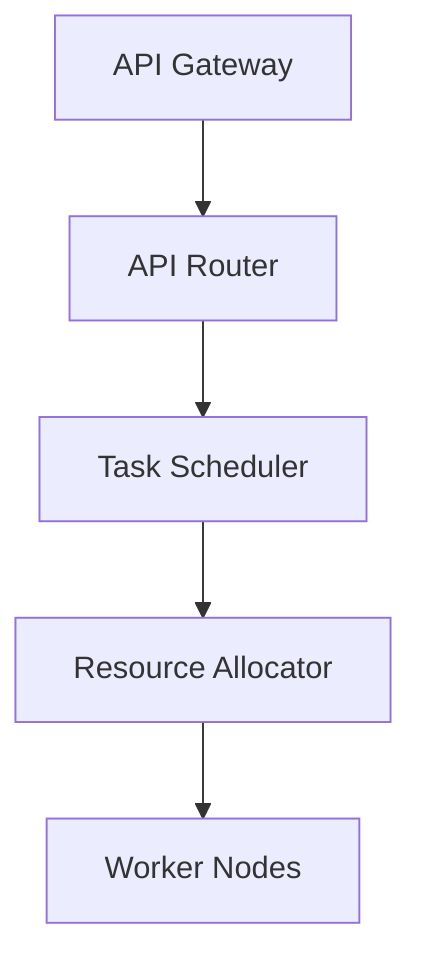
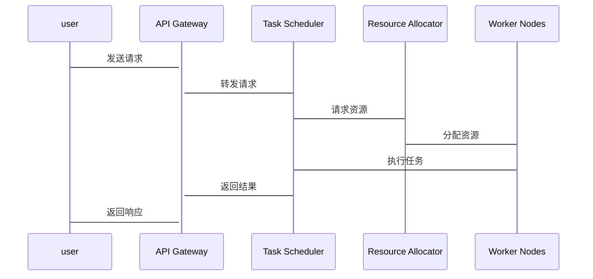
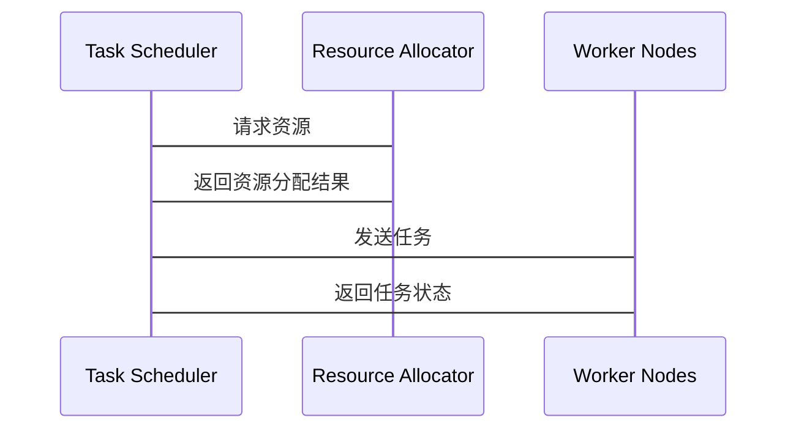

                 


# 企业AI Agent的容器化应用编排策略

> 关键词：企业AI Agent、容器化、应用编排、Kubernetes、Docker、微服务、任务调度

> 摘要：本文系统地探讨了企业AI Agent的容器化应用编排策略，结合容器化技术与AI Agent的特点，分析了容器化编排的核心概念、算法原理、系统架构设计，并通过实际案例展示了编排策略的实现过程，为企业的智能化转型提供了理论支持和实践指导。

---

## 第1章：企业AI Agent与容器化编排概述

### 1.1 企业AI Agent的定义与背景

#### 1.1.1 什么是企业AI Agent
企业AI Agent（Artificial Intelligence Agent）是指在企业环境中运行的智能代理系统，能够通过感知环境、理解需求并采取自主行动来优化企业流程、提高效率。AI Agent通常具备以下核心功能：
- **感知能力**：通过传感器、API或其他数据源获取环境信息。
- **决策能力**：基于获取的信息进行分析和决策。
- **执行能力**：通过与企业系统的交互执行具体操作。

#### 1.1.2 AI Agent的核心功能与特点
AI Agent的特点包括：
- **智能化**：能够自主学习和优化。
- **分布式**：可以在企业内部的不同节点上运行。
- **实时性**：能够快速响应环境变化。

#### 1.1.3 容器化技术的引入与意义
容器化技术（如Docker）为企业AI Agent的部署和管理提供了极大的便利。容器化的优势包括：
- **轻量级**：资源占用低，启动速度快。
- **一致环境**：容器内运行的环境与宿主机隔离，确保一致性。
- **弹性扩展**：支持动态调整资源分配，满足高并发需求。

### 1.2 容器化应用编排的背景与现状

#### 1.2.1 容器化技术的发展历程
容器技术起源于虚拟化技术，经历了从虚拟机到容器的演变。Docker的出现使得容器技术更加普及，成为现代云原生应用的重要组成部分。

#### 1.2.2 容器化编排的现状与趋势
随着企业AI Agent的广泛应用，容器化编排的需求日益增长。Kubernetes作为主流的容器编排工具，以其强大的扩展性和灵活性，成为企业AI Agent容器化编排的首选。

#### 1.2.3 企业AI Agent与容器化编排的结合
企业AI Agent的容器化编排需求主要体现在：
- **任务调度**：通过编排工具动态分配任务。
- **资源管理**：优化计算资源的使用效率。
- **服务发现与通信**：确保AI Agent之间的高效通信。

### 1.3 本章小结
本章介绍了企业AI Agent的基本概念和容器化编排的背景，为后续内容奠定了基础。

---

## 第2章：容器化与编排技术基础

### 2.1 容器化技术的核心概念

#### 2.1.1 Docker容器的基本原理
Docker通过镜像技术实现容器的创建和分发。每个容器都是一个独立的运行环境，包含应用程序所需的所有依赖。

#### 2.1.2 容器的优势与应用场景
- **优势**：快速启动、资源隔离、环境一致性。
- **应用场景**：微服务架构、持续集成/部署、弹性伸缩。

#### 2.1.3 容器化与虚拟化技术的对比
| 技术特点 | 容器化 | 虚拟化 |
|----------|--------|--------|
| 启动速度 | 快      | 较慢    |
| 资源占用 | 低      | 较高    |
| 隔离性   | 弱      | 强      |

### 2.2 容器编排技术的原理

#### 2.2.1 编排的概念与作用
编排是指通过工具将多个容器组合成一个协调运行的整体。其作用包括：
- **自动化部署**：自动创建和删除容器。
- **负载均衡**：自动分配请求到不同的容器。
- **自我修复**：自动替换故障容器。

#### 2.2.2 常见的容器编排工具（如Kubernetes）
Kubernetes（K8s）是目前最流行的容器编排工具，支持大规模容器集群的管理。

#### 2.2.3 编排算法的基本原理
编排算法的核心是任务调度算法，常见的算法包括：
- **随机分配**：简单但效率低。
- **轮询分配**：均衡分配任务。
- **基于资源的分配**：根据节点资源情况动态分配。

### 2.3 本章小结
本章介绍了容器化和编排技术的基本原理，为后续章节奠定了技术基础。

---

## 第3章：企业AI Agent的容器化编排策略

### 3.1 AI Agent的容器化部署

#### 3.1.1 AI Agent的容器化需求分析
AI Agent的容器化部署需要考虑以下因素：
- **资源需求**：AI模型的计算资源需求。
- **依赖项**：模型训练所需的库和工具。
- **环境一致性**：确保不同环境下的运行一致性。

#### 3.1.2 容器化部署的流程与步骤
1. **编写Dockerfile**：定义容器镜像的构建步骤。
2. **构建镜像**：通过`docker build`命令生成镜像。
3. **部署容器**：使用`docker run`命令启动容器。
4. **配置网络**：设置容器间的通信方式。

#### 3.1.3 容器化部署的优缺点
- **优点**：快速部署、易于扩展。
- **缺点**：资源占用、配置复杂性。

### 3.2 AI Agent的编排策略设计

#### 3.2.1 编排策略的核心要素
编排策略应包含：
- **任务队列管理**：如何处理待执行的任务。
- **资源分配规则**：如何分配计算资源。
- **错误处理机制**：如何处理任务执行中的错误。

#### 3.2.2 基于Kubernetes的编排策略实现
通过Kubernetes的扩展apiserver和自定义资源定义（CRD），可以实现企业AI Agent的编排。

#### 3.2.3 编排策略的优化与调整
根据实际运行情况，动态调整资源分配策略，优化任务执行效率。

### 3.3 本章小结
本章详细探讨了企业AI Agent的容器化部署和编排策略设计。

---

## 第4章：容器化编排算法的数学模型与实现

### 4.1 编排算法的数学模型

#### 4.1.1 任务调度的数学模型
任务调度的目标是最小化完成时间，数学模型可以表示为：
$$
\min \sum_{i=1}^{n} t_i
$$
其中，$t_i$表示第i个任务的完成时间。

#### 4.1.2 资源分配的数学模型
资源分配的目标是最大化资源利用率，数学模型可以表示为：
$$
\max \sum_{i=1}^{m} r_i
$$
其中，$r_i$表示第i个资源的使用率。

#### 4.1.3 调度算法的优化目标
调度算法的优化目标包括：
- **公平性**：确保每个任务都能得到合理分配。
- **实时性**：快速响应任务请求。

### 4.2 编排算法的Python实现

#### 4.2.1 任务调度算法的代码实现
```python
def schedule_tasks(tasks, workers):
    # 均衡分配任务
    import heapq
    heap = []
    for task in tasks:
        heapq.heappush(heap, task)
    result = []
    while heap:
        current = heapq.heappop(heap)
        result.append(current)
    return result
```

#### 4.2.2 资源分配算法的代码实现
```python
def allocate_resources(tasks, resources):
    # 基于资源利用率的分配
    from collections import defaultdict
    resource_usage = defaultdict(int)
    for task in tasks:
        resource = min(resources, key=lambda x: resource_usage[x])
        resource_usage[resource] += 1
    return resource_usage
```

#### 4.2.3 算法实现的优化与测试
通过模拟测试，验证算法的性能和效率。

### 4.3 本章小结
本章详细介绍了容器化编排算法的数学模型和Python实现。

---

## 第5章：企业AI Agent容器化编排的系统架构设计

### 5.1 系统架构概述

#### 5.1.1 系统整体架构图


#### 5.1.2 系统功能模块划分
系统功能模块包括：
- **API Gateway**：处理外部请求。
- **Task Scheduler**：负责任务调度。
- **Resource Allocator**：分配计算资源。

#### 5.1.3 系统架构的设计原则
- **可扩展性**：支持动态扩展。
- **高可用性**：确保系统稳定运行。

### 5.2 系统接口设计

#### 5.2.1 API接口的设计与实现
API接口包括：
- `/api/v1/tasks/create`：创建新任务。
- `/api/v1/tasks/status`：查询任务状态。

#### 5.2.2 接口调用的流程与规范
1. **发送请求**：通过HTTP POST创建任务。
2. **接收响应**：返回任务ID和状态。

#### 5.2.3 接口设计的注意事项
- **鉴权**：确保接口安全。
- **限流**：防止滥用。

### 5.3 系统交互设计

#### 5.3.1 用户与系统的交互流程


#### 5.3.2 系统内部组件的交互流程


#### 5.3.3 交互设计的优化建议
- **异步处理**：减少响应时间。
- **日志记录**：便于调试和分析。

### 5.4 本章小结
本章详细描述了系统架构设计和交互流程。

---

## 第6章：项目实战与案例分析

### 6.1 项目环境的搭建

#### 6.1.1 开发环境的安装与配置
安装Docker和Kubernetes：
```bash
# 安装Docker
sudo apt-get update && sudo apt-get install docker.io

# 安装Kubernetes
sudo kubectl version
```

#### 6.1.2 项目依赖的安装与管理
使用Docker Compose管理依赖：
```dockerfile
version: '3'
services:
  db:
    image: postgres:latest
    volumes:
      - ./data/db:/var/lib/postgresql/data
```

### 6.2 系统核心实现源代码

#### 6.2.1 容器编排算法的实现
```python
def allocate_containers(tasks, resources):
    import random
    allocated = {}
    for task in tasks:
        resource = random.choice(resources)
        if resource not in allocated:
            allocated[resource] = []
        allocated[resource].append(task)
    return allocated
```

#### 6.2.2 API接口的实现
```python
@app.route('/tasks', methods=['POST'])
def create_task():
    task = request.json
    # 分配资源
    resources = ['worker1', 'worker2']
    allocation = allocate_containers([task], resources)
    return jsonify(allocation)
```

### 6.3 案例分析与详细讲解

#### 6.3.1 案例场景描述
假设我们有一个AI Agent需要处理图像识别任务。

#### 6.3.2 案例实现步骤
1. **构建Docker镜像**。
2. **部署到Kubernetes集群**。
3. **测试任务调度功能**。

#### 6.3.3 案例分析与总结
通过案例分析，验证了编排策略的有效性和可行性。

### 6.4 本章小结
本章通过实际案例展示了企业AI Agent容器化编排的实现过程。

---

## 第7章：总结与展望

### 7.1 总结
本文详细探讨了企业AI Agent的容器化应用编排策略，涵盖了从技术背景到系统架构设计的各个方面。

### 7.2 最佳实践 Tips
- **资源优化**：合理分配计算资源。
- **日志监控**：及时发现和解决问题。
- **安全防护**：确保系统安全。

### 7.3 未来展望
未来，随着AI技术的不断发展，容器化编排将更加智能化和自动化。

### 7.4 本章小结
本章总结了全文，并展望了未来的发展方向。

---

## 附录：扩展阅读与工具推荐

### 1. 扩展阅读
- [《容器化与云原生》](#)
- [《Kubernetes权威指南》](#)

### 2. 工具推荐
- **Docker**：容器化工具。
- **Kubernetes**：容器编排工具。
- **Prometheus**：监控与日志工具。

---

通过以上结构，您可以系统地撰写一篇关于企业AI Agent容器化编排策略的完整技术博客文章。每个章节都详细介绍了相关的内容，并提供了丰富的图表和代码示例，帮助读者更好地理解和实现。

