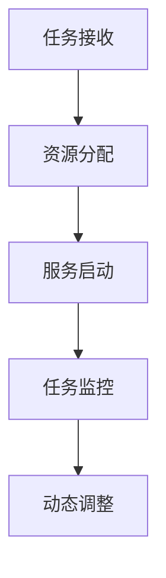
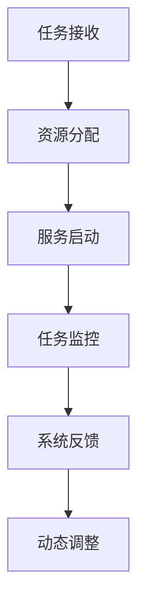
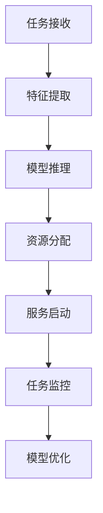
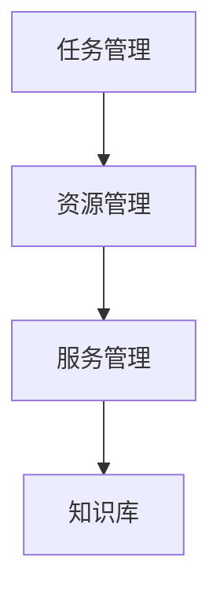

                 


# 企业AI Agent的容器化微服务编排策略

> 关键词：企业AI Agent，容器化，微服务编排，Docker，Kubernetes

> 摘要：随着企业智能化转型的推进，AI Agent作为一种能够实现自动化决策和执行任务的智能体，逐渐成为企业数字化转型的核心技术。本文将深入探讨企业AI Agent的容器化微服务编排策略，从背景、原理、实现到实战，系统性地阐述如何通过容器化技术实现AI Agent的高效部署与管理。

---

# 第一部分: 企业AI Agent的容器化微服务编排概述

## 第1章: 企业AI Agent的背景与概念

### 1.1 企业AI Agent的定义与背景

#### 1.1.1 什么是企业AI Agent
企业AI Agent是一种能够理解企业业务需求、执行复杂任务并提供智能决策支持的智能体。它通常由感知层、决策层和执行层组成，能够通过与企业系统的交互完成任务。

#### 1.1.2 企业AI Agent的应用场景
- **智能监控**：实时监控企业系统的运行状态，发现异常并自动处理。
- **自动化运维**：通过AI Agent实现系统的自动部署、监控和故障修复。
- **智能客服**：通过自然语言处理技术为用户提供智能咨询服务。
- **业务决策支持**：基于历史数据和实时信息，为企业提供决策支持。

#### 1.1.3 企业AI Agent的发展趋势
随着AI技术的不断进步，企业AI Agent将更加智能化、自动化，并与企业业务深度融合，成为企业数字化转型的重要推动力。

---

### 1.2 容器化微服务编排的背景

#### 1.2.1 微服务架构的兴起
微服务架构通过将系统拆分为多个独立的服务，提高了系统的可扩展性和可维护性。然而，随着服务数量的增加，如何高效地管理和编排这些服务成为新的挑战。

#### 1.2.2 容器化技术的崛起
容器化技术（如Docker）通过将服务及其依赖打包为容器，实现了服务的快速部署和环境一致性。容器化技术为微服务架构的实现提供了强有力的支持。

#### 1.2.3 容器化微服务编排的必要性
为了应对大规模微服务的管理和调度问题，容器化微服务编排技术（如Kubernetes）应运而生，能够实现服务的自动部署、扩缩容和故障恢复。

---

## 第2章: 企业AI Agent的核心概念与技术

### 2.1 企业AI Agent的核心概念

#### 2.1.1 AI Agent的基本组成
- **感知层**：通过传感器、API等方式获取外部信息。
- **决策层**：基于感知层获取的信息，通过算法进行决策。
- **执行层**：根据决策层的指令执行具体操作。

#### 2.1.2 AI Agent的任务模型
任务模型是AI Agent完成任务的核心逻辑，通常包括任务分解、任务优先级排序和任务执行等步骤。

#### 2.1.3 AI Agent的知识表示
知识表示是AI Agent理解世界的基础，通常采用知识图谱、规则库等方式。

---

### 2.2 容器化微服务编排的核心技术

#### 2.2.1 容器化技术原理
容器化技术通过将服务及其依赖打包为轻量级的容器，实现了服务的快速部署和环境一致性。

#### 2.2.2 微服务编排的实现机制
微服务编排通过定义服务之间的依赖关系，实现了服务的自动部署、扩缩容和故障恢复。

#### 2.2.3 容器编排工具的分类与对比
- **Docker Swarm**：Docker自带的容器编排工具，简单易用但功能有限。
- **Kubernetes**：功能强大，支持复杂的容器编排需求。
- **Apache Mesos**：支持多种资源管理策略，适合大规模集群。

---

## 第3章: 企业AI Agent与容器化微服务编排的结合

### 3.1 企业AI Agent的容器化部署

#### 3.1.1 AI Agent的容器化封装
通过Dockerfile将AI Agent服务及其依赖打包为镜像，实现服务的快速部署。

#### 3.1.2 容器化部署的优势
- **环境一致性**：确保服务在不同环境中的行为一致。
- **快速部署**：通过镜像快速启动服务。
- **资源隔离**：通过容器实现资源的隔离和限制。

#### 3.1.3 容器化部署的挑战
- **资源利用率**：容器资源分配需要精细管理。
- **服务发现与通信**：容器化环境下服务之间的通信需要高效的机制。

---

### 3.2 微服务编排在企业AI Agent中的应用

#### 3.2.1 微服务编排的场景
- **任务分解**：将复杂任务分解为多个子任务，分别由不同的服务执行。
- **任务调度**：根据任务优先级和资源情况，动态调整任务的执行顺序。
- **任务协同**：通过服务之间的协同完成复杂的任务。

#### 3.2.2 微服务编排的流程
1. **任务分解**：将复杂任务分解为多个子任务。
2. **任务调度**：根据资源情况和任务优先级，制定调度策略。
3. **服务执行**：通过容器编排工具启动相应的服务。
4. **任务监控**：实时监控任务的执行状态，及时处理异常情况。

#### 3.2.3 微服务编排的优化策略
- **负载均衡**：通过负载均衡算法实现任务的均衡分配。
- **弹性扩缩容**：根据任务负载动态调整服务数量。
- **容错机制**：通过服务冗余和自动恢复实现任务的可靠性。

---

# 第二部分: 企业AI Agent的容器化微服务编排原理

## 第4章: 企业AI Agent的任务建模与知识表示

### 4.1 任务建模的原理

#### 4.1.1 任务建模的基本概念
任务建模是通过数学模型描述任务的结构、关系和执行逻辑。

#### 4.1.2 任务建模的实现方法
- **任务分解**：将复杂任务分解为多个子任务。
- **任务优先级排序**：根据任务的重要性和紧急性进行排序。
- **任务依赖关系**：描述任务之间的依赖关系，确保任务的顺序执行。

#### 4.1.3 任务建模的优化策略
- **动态调整**：根据任务执行情况动态调整任务模型。
- **模型验证**：通过模拟和测试验证任务模型的正确性。

---

### 4.2 知识表示的实现

#### 4.2.1 知识表示的定义
知识表示是通过某种形式化的方式描述知识，通常包括实体、属性和关系。

#### 4.2.2 知识表示的分类
- **规则表示**：通过逻辑规则描述知识。
- **语义网络**：通过节点和边描述知识的语义关系。
- **知识图谱**：通过图结构描述实体之间的关系。

#### 4.2.3 知识表示的优化
- **知识融合**：将不同来源的知识进行融合，消除冗余和冲突。
- **知识推理**：通过推理算法从已有知识中推导出新的知识。

---

## 第5章: 容器化微服务编排的算法原理

### 5.1 容器编排算法的概述

#### 5.1.1 容器编排算法的分类
- **基于规则的编排**：通过预定义的规则进行编排。
- **基于反馈的编排**：根据系统反馈动态调整编排策略。
- **基于机器学习的编排**：通过机器学习模型进行编排优化。

#### 5.1.2 容器编排算法的实现流程
1. **任务接收**：接收需要编排的任务。
2. **资源分配**：根据任务需求分配资源。
3. **服务启动**：启动相应的服务。
4. **任务监控**：实时监控任务的执行状态。
5. **动态调整**：根据监控结果动态调整编排策略。

#### 5.1.3 容器编排算法的优化策略
- **负载均衡**：通过负载均衡算法实现资源的均衡分配。
- **弹性扩缩容**：根据任务负载动态调整服务数量。
- **容错机制**：通过服务冗余和自动恢复实现任务的可靠性。

---

### 5.2 容器编排算法的实现

#### 5.2.1 基于规则的编排算法


#### 5.2.2 基于反馈的编排算法


#### 5.2.3 基于机器学习的编排算法


---

## 第6章: 系统架构设计与实现

### 6.1 系统架构设计

#### 6.1.1 系统功能设计
- **任务管理模块**：负责任务的接收、分解和调度。
- **资源管理模块**：负责资源的分配和管理。
- **服务管理模块**：负责服务的启动、监控和恢复。
- **知识库模块**：负责知识的存储、推理和更新。

#### 6.1.2 系统架构图


---

## 第7章: 项目实战与优化

### 7.1 项目环境搭建

#### 7.1.1 环境要求
- 操作系统：Linux或macOS
- Docker版本：>=20.0.0
- Kubernetes版本：>=1.20.0

#### 7.1.2 环境配置
```bash
# 安装Docker
curl -fsSL https://get.docker.com | bash -s docker

# 安装Kubernetes
curl -LO "https://dl.k8s.io/release-1.20.0/binaries/Linux/x86_64/kubectl"
```

---

### 7.2 核心代码实现

#### 7.2.1 任务管理模块
```python
class TaskManager:
    def __init__(self):
        self.tasks = []

    def receive_task(self, task):
        self.tasks.append(task)
        self.schedule_task(task)

    def schedule_task(self, task):
        # 根据任务优先级和资源情况分配资源
        pass
```

#### 7.2.2 资源管理模块
```python
class ResourceManager:
    def __init__(self):
        self.resources = {}

    def allocate_resource(self, task):
        # 根据任务需求分配资源
        pass
```

#### 7.2.3 服务管理模块
```python
class ServiceManager:
    def __init__(self):
        self.services = []

    def start_service(self, service):
        # 通过Docker启动服务
        pass
```

---

### 7.3 案例分析与优化

#### 7.3.1 案例分析
- **案例背景**：某企业需要通过AI Agent实现自动化的订单处理。
- **实现步骤**：
  1. **任务分解**：将订单处理任务分解为订单接收、订单验证、订单执行等子任务。
  2. **资源分配**：根据任务需求分配相应的资源。
  3. **服务启动**：通过容器编排工具启动相应的服务。
  4. **任务监控**：实时监控任务的执行状态，及时处理异常情况。

#### 7.3.2 优化策略
- **负载均衡**：通过负载均衡算法实现任务的均衡分配。
- **弹性扩缩容**：根据任务负载动态调整服务数量。
- **容错机制**：通过服务冗余和自动恢复实现任务的可靠性。

---

# 第三部分: 总结与展望

## 第8章: 总结与最佳实践

### 8.1 总结
本文系统性地探讨了企业AI Agent的容器化微服务编排策略，从背景、原理到实现，详细阐述了如何通过容器化技术实现AI Agent的高效部署与管理。

### 8.2 最佳实践
- **容器化部署**：通过Docker和Kubernetes实现服务的快速部署和管理。
- **微服务编排**：通过任务建模和知识表示实现服务的智能调度。
- **优化策略**：通过负载均衡、弹性扩缩容和容错机制实现任务的高效执行。

---

## 第9章: 展望与未来发展方向

### 9.1 未来发展方向
- **智能化编排**：通过机器学习算法实现编排策略的自动优化。
- **边缘计算**：将AI Agent部署到边缘设备，实现本地化的智能处理。
- **多云管理**：实现跨云平台的容器化微服务编排，提高系统的可用性。

---

通过本文的探讨，企业可以更好地理解和应用容器化微服务编排技术，为企业的智能化转型提供强有力的技术支持。

