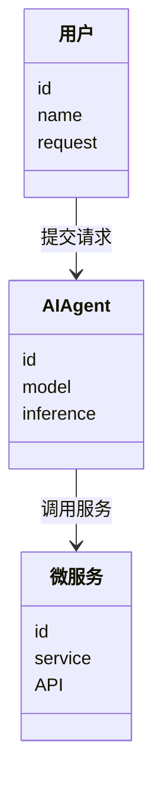

                 


# 企业AI Agent的容器化微服务部署策略

## 关键词：企业AI Agent，容器化，微服务，Kubernetes，算法原理，系统架构，项目实战

## 摘要：  
企业AI Agent是一种结合人工智能和自动化技术的智能系统，其容器化微服务部署策略是实现高效、灵活、可扩展的AI解决方案的关键。本文从企业AI Agent的定义与特点出发，深入探讨其容器化微服务部署的核心概念、算法原理、系统架构设计及项目实战，为企业技术团队提供从理论到实践的全面指导。通过本文的学习，读者将能够掌握企业AI Agent的容器化部署方法，优化系统性能，提升业务效率。

---

# 第1章: 企业AI Agent的概述

## 1.1 企业AI Agent的定义与特点
### 1.1.1 什么是企业AI Agent
企业AI Agent是一种基于人工智能技术的智能代理系统，能够理解、分析和执行企业级的复杂任务。它通过感知环境、自主决策和执行操作，为企业提供智能化的解决方案。

### 1.1.2 企业AI Agent的核心特点
- **智能性**：基于机器学习和自然语言处理技术，能够理解用户需求并提供智能建议。
- **自主性**：无需人工干预，能够自动完成任务。
- **可扩展性**：支持多种业务场景，能够快速适应企业需求的变化。
- **高可用性**：通过容器化和微服务架构，确保系统稳定运行。

### 1.1.3 企业AI Agent与传统AI的区别
| **特点**       | **传统AI**             | **企业AI Agent**      |
|----------------|-----------------------|-----------------------|
| **自主性**     | 依赖人工干预           | 自主决策和执行         |
| **灵活性**     | 固定流程               | 支持动态调整           |
| **扩展性**     | 难以快速扩展           | 支持快速扩展           |

## 1.2 容器化微服务部署的背景
### 1.2.1 微服务架构的兴起
微服务架构通过将应用程序分解为多个小型、独立的服务，提高了系统的灵活性和可维护性。每个服务可以独立开发、部署和扩展。

### 1.2.2 容器化技术的发展
容器化技术（如Docker）通过轻量级虚拟化实现了应用程序的隔离运行环境，使得微服务架构的部署和管理更加高效。

### 1.2.3 企业AI Agent与容器化部署的结合
企业AI Agent的智能性和高可用性需求与容器化微服务部署的灵活性和扩展性不谋而合。容器化部署能够满足企业AI Agent在复杂环境下的高效运行和动态调整需求。

## 1.3 企业AI Agent的部署需求
### 1.3.1 高可用性需求
企业AI Agent需要在任何时候都能提供服务，容器化部署通过服务的自愈合和负载均衡满足高可用性需求。

### 1.3.2 弹性扩展需求
企业AI Agent在面对突发需求时需要快速扩展，容器化部署通过动态分配资源实现弹性扩展。

### 1.3.3 灵活性与可维护性需求
容器化部署使得企业AI Agent的各个组件可以独立升级和维护，提高了系统的灵活性和可维护性。

## 1.4 本章小结
本章介绍了企业AI Agent的定义、特点以及容器化微服务部署的背景和需求，为后续章节的深入探讨奠定了基础。

---

# 第2章: 企业AI Agent的容器化微服务部署核心概念

## 2.1 容器化技术原理
### 2.1.1 容器与虚拟机的区别
| **特性**       | **容器**             | **虚拟机**            |
|----------------|---------------------|-----------------------|
| **资源占用**   | 轻量级               | 重量级                 |
| **启动速度**   | 快                   | 较慢                   |
| **隔离性**     | 共享宿主机核和内存    | 完全隔离               |

### 2.1.2 Docker容器的工作原理
Docker通过容器镜像技术实现了应用程序的隔离运行环境，每个容器独立运行，互不干扰。

### 2.1.3 容器镜像的构建与分发
- **容器镜像构建**：通过Dockerfile定义镜像构建过程。
- **容器镜像分发**：通过Docker Hub或其他镜像仓库进行分发和共享。

## 2.2 微服务架构原理
### 2.2.1 微服务架构的特点
- **松耦合**：各个服务之间通过API进行通信，耦合性低。
- **独立部署**：每个服务可以独立部署和扩展。
- **可扩展性**：可以根据需求动态扩展服务。

### 2.2.2 微服务之间的通信机制
- **HTTP通信**：通过RESTful API进行通信。
- **gRPC通信**：基于RPC协议的高效通信方式。
- **消息队列**：通过Kafka或RabbitMQ实现异步通信。

### 2.2.3 微服务的发现与管理
- **服务发现**：通过Consul或Etcd实现服务注册与发现。
- **负载均衡**：通过Nginx或Kubernetes实现流量分发。

## 2.3 企业AI Agent的核心组件
### 2.3.1 AI Agent的业务逻辑层
负责处理用户的请求，执行AI算法，返回结果。

### 2.3.2 AI Agent的数据访问层
负责与数据库、API等数据源进行交互，获取所需数据。

### 2.3.3 AI Agent的通信与协调层
负责与其他服务或系统进行通信，协调任务的执行。

## 2.4 核心概念对比与ER实体关系图
### 2.4.1 核心概念对比表格
| **组件**       | **功能**             | **依赖关系**          |
|----------------|---------------------|-----------------------|
| **业务逻辑层** | 处理用户请求         | 数据访问层、通信层    |
| **数据访问层** | 与数据源交互         | 数据库、API            |
| **通信层**     | 与其他服务通信       | 业务逻辑层            |

### 2.4.2 ER实体关系图（Mermaid）
```mermaid
er
actor: 用户
agent: AI Agent
service: 微服务
container: 容器
```

## 2.5 本章小结
本章详细介绍了企业AI Agent的容器化微服务部署的核心概念，包括容器化技术、微服务架构以及AI Agent的核心组件，为后续章节的实现提供了理论基础。

---

# 第3章: 企业AI Agent的容器化微服务部署算法原理

## 3.1 容器编排算法
### 3.1.1 Kubernetes的调度算法
Kubernetes通过资源配额、亲和性规则等策略实现容器的最优调度。

### 3.1.2 容器资源分配算法
通过资源配额和限制，确保每个容器获得合理的资源分配。

### 3.1.3 容器自愈合算法
当容器出现故障时，通过自动重启、重建或滚动更新实现自愈合。

## 3.2 微服务通信算法
### 3.2.1 HTTP通信协议
通过RESTful API实现微服务之间的通信。

### 3.2.2 gRPC通信协议
基于RPC协议的高效通信方式，适合需要高性能的场景。

### 3.2.3 消息队列通信机
通过Kafka或RabbitMQ实现异步通信，提高系统的吞吐量。

## 3.3 企业AI Agent的算法实现
### 3.3.1 算法选择与优化
根据具体业务需求选择合适的算法，并进行性能优化。

### 3.3.2 算法实现代码示例
```python
def ai_agent_algorithm(input_data):
    # 数据预处理
    processed_data = preprocess(input_data)
    # 模型推理
    result = model_inference(processed_data)
    return result
```

### 3.3.3 算法的数学模型与公式
$$\text{输出结果} = f(\text{输入数据})$$
其中，$f$表示AI Agent的算法模型，$\text{输入数据}$是用户提供的数据。

## 3.4 本章小结
本章从算法原理的角度，详细介绍了企业AI Agent的容器化微服务部署中的关键算法，包括容器编排算法和微服务通信算法，并通过代码示例和数学公式进行了深入讲解。

---

# 第4章: 企业AI Agent的容器化微服务部署系统架构设计

## 4.1 问题场景介绍
企业AI Agent需要在复杂的业务环境中运行，涉及多部门、多系统的协作。

## 4.2 系统功能设计
### 4.2.1 领域模型设计（Mermaid类图）


### 4.2.2 系统架构设计（Mermaid架构图）
```mermaid
container {
    title 企业AI Agent系统架构
    Kubernetes Cluster
    --> Nginx Load Balancer
    --> AI Agent Service
    --> 微服务1、微服务2、微服务3
    --> MySQL数据库
    --> Redis缓存
}
```

### 4.2.3 系统接口设计
- **API接口**：定义RESTful API接口，用于微服务之间的通信。
- **数据库接口**：定义与数据库交互的接口，确保数据一致性。

### 4.2.4 系统交互设计（Mermaid序列图）
```mermaid
sequenceDiagram
    用户 ->+> AI Agent: 提交请求
    AI Agent ->+> 微服务1: 调用服务
    微服务1 ->+> 数据库: 查询数据
    数据库 -->> 微服务1: 返回数据
    微服务1 --> AI Agent: 返回结果
    AI Agent --> 用户: 返回最终结果
```

## 4.3 本章小结
本章通过系统架构设计，详细介绍了企业AI Agent的容器化微服务部署的实现方案，包括领域模型、系统架构、接口设计和交互设计。

---

# 第5章: 企业AI Agent的容器化微服务部署项目实战

## 5.1 环境安装
### 5.1.1 安装Kubernetes
```bash
sudo apt-get update && sudo apt-get install docker.io kubectl
```

### 5.1.2 安装Docker
```bash
sudo apt-get install docker.io
```

## 5.2 系统核心实现
### 5.2.1 实现AI Agent业务逻辑
```python
def handle_request(request):
    # 处理请求
    result = process_request(request)
    return result
```

### 5.2.2 实现微服务接口
```python
from flask import Flask
app = Flask(__name__)
@app.route('/api', methods=['POST'])
def api():
    return 'Service Response'
```

## 5.3 代码应用解读与分析
### 5.3.1 代码结构分析
- **主程序**：处理用户请求，调用微服务。
- **微服务模块**：实现具体业务逻辑，提供API接口。

### 5.3.2 代码优化建议
- 使用容器化技术部署微服务。
- 使用Kubernetes进行容器编排。

## 5.4 实际案例分析
通过一个实际案例，详细讲解如何部署企业AI Agent的容器化微服务系统。

## 5.5 本章小结
本章通过项目实战，详细介绍了企业AI Agent的容器化微服务部署的实现过程，包括环境安装、代码实现和案例分析。

---

# 第6章: 企业AI Agent的容器化微服务部署安全与优化

## 6.1 安全策略
### 6.1.1 访问控制
通过IAM（身份认证管理）实现权限控制。

### 6.1.2 数据加密
对敏感数据进行加密存储和传输。

## 6.2 性能优化
### 6.2.1 资源优化
通过资源配额和限制优化容器资源使用。

### 6.2.2 网络优化
通过负载均衡和CDN优化网络性能。

## 6.3 高可用性
### 6.3.1 容器自愈合
通过Kubernetes的自愈合机制确保系统稳定运行。

### 6.3.2 备份与恢复
定期备份数据，确保系统故障时能够快速恢复。

## 6.4 本章小结
本章从安全与优化的角度，详细介绍了如何确保企业AI Agent的容器化微服务部署系统的安全性和高性能。

---

# 第7章: 总结与展望

## 7.1 核心内容回顾
本文从企业AI Agent的定义与特点出发，详细探讨了其容器化微服务部署的核心概念、算法原理、系统架构设计及项目实战。

## 7.2 最佳实践 tips
- 使用Kubernetes进行容器编排。
- 采用微服务架构提高系统的灵活性和可扩展性。
- 注重系统的安全性和性能优化。

## 7.3 未来展望
随着人工智能和容器化技术的不断发展，企业AI Agent的容器化微服务部署将更加智能化和高效化。

## 7.4 本章小结
本章总结了全文的核心内容，并展望了企业AI Agent的容器化微服务部署的未来发展方向。

---

# 结语

通过本文的学习，读者将能够掌握企业AI Agent的容器化微服务部署的方法，优化系统性能，提升业务效率。希望本文能够为企业技术团队提供有价值的参考和指导。

---

