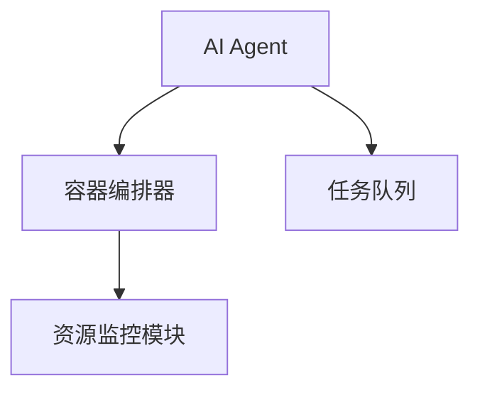
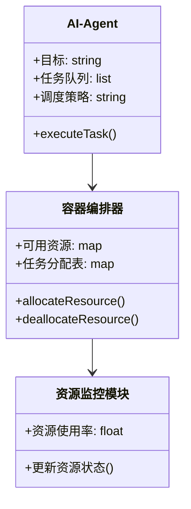

                 


# 企业AI Agent的容器编排与管理策略

## 关键词：企业AI Agent，容器编排，Kubernetes，AI任务调度，资源优化

## 摘要：本文探讨了企业AI Agent在容器编排环境下的管理策略，分析了AI Agent与容器编排技术的结合，详细阐述了容器编排算法、系统架构设计、项目实战及最佳实践，为企业AI Agent的高效管理提供了理论和实践指导。

---

## 第1章: 企业AI Agent与容器编排的背景与概念

### 1.1 企业AI Agent的定义与核心概念

#### 1.1.1 企业AI Agent的定义
企业AI Agent是一种智能化的自动化工具，能够根据预设目标或实时反馈执行复杂任务。它通常具备感知环境、决策优化和自主执行的能力。

#### 1.1.2 AI Agent的核心属性与特征
- **目标导向性**：基于明确的目标执行任务。
- **自主性**：无需人工干预，自主完成任务。
- **响应性**：能够实时感知环境变化并调整策略。
- **学习能力**：通过数据反馈优化决策模型。

#### 1.1.3 企业AI Agent的边界与外延
企业AI Agent的应用边界包括任务范围、数据来源和权限限制。外延则扩展到与企业其他系统的集成，如CRM、ERP等。

### 1.2 容器编排技术的背景与发展

#### 1.2.1 容器技术的起源与演进
容器技术起源于20世纪末，经过Docker的崛起和Kubernetes的普及，成为现代云原生应用的基础。

#### 1.2.2 容器编排技术的现状
Kubernetes已成为企业容器编排的事实标准，支持大规模应用部署和动态扩缩容。

#### 1.2.3 企业级容器编排的需求与挑战
企业需要容器编排支持高可用性、动态扩展和资源隔离，同时面临复杂性、安全性和成本控制的挑战。

### 1.3 企业AI Agent与容器编排的结合

#### 1.3.1 企业AI Agent的场景化应用
AI Agent在企业中的应用包括智能客服、自动化运维、数据处理和推荐系统。

#### 1.3.2 容器编排在AI Agent中的作用
容器编排为AI Agent提供弹性资源分配、任务隔离和高可用性保障。

#### 1.3.3 企业AI Agent容器编排的核心问题
任务调度优化、资源分配效率和系统稳定性是核心挑战。

### 1.4 本章小结
本章介绍了企业AI Agent和容器编排的基本概念，分析了它们的结合方式和应用场景，为后续章节打下基础。

---

## 第2章: 企业AI Agent的容器编排核心概念与联系

### 2.1 核心概念原理

#### 2.1.1 AI Agent的任务调度机制
AI Agent根据任务优先级和资源可用性动态调整调度策略。

#### 2.1.2 容器编排的资源分配策略
容器编排基于资源利用率和负载均衡算法分配计算资源。

#### 2.1.3 企业AI Agent与容器编排的协同关系
AI Agent通过容器编排API请求资源，容器编排负责资源分配和任务调度。

### 2.2 核心概念属性对比表
| 概念 | 属性 | 描述 |
|------|------|------|
| AI Agent | 任务驱动性 | 基于目标执行任务 |
| 容器编排 | 资源分配 | 动态分配计算资源 |

### 2.3 实体关系图（Mermaid）


### 2.4 本章小结
本章通过对比分析和实体关系图，展示了企业AI Agent与容器编排之间的协同关系。

---

## 第3章: 容器编排与AI Agent的算法原理

### 3.1 容器编排调度算法

#### 3.1.1 基于资源利用率的调度算法
$$ \text{资源利用率} = \frac{\text{分配资源}}{\text{总资源}} $$

#### 3.1.2 基于任务优先级的调度算法
任务优先级由权重和紧急程度决定，权重高的任务优先调度。

#### 3.1.3 基于AI预测的调度算法
AI Agent通过预测任务负载，优化资源分配策略。

### 3.2 AI Agent的任务分配算法

#### 3.2.1 任务分配的数学模型
$$ \text{优化目标} = \max \sum_{i=1}^{n} w_i x_i $$
$$ \text{约束条件} = \sum_{i=1}^{n} x_i \leq C $$

#### 3.2.2 任务分配的优化目标
最大化资源利用率和任务完成时间。

---

## 第4章: 系统分析与架构设计方案

### 4.1 系统功能设计

#### 4.1.1 领域模型类图（Mermaid）


### 4.2 系统架构设计

#### 4.2.1 系统架构图（Mermaid）


### 4.3 系统接口设计

#### 4.3.1 接口描述
- **AI Agent API**：接收任务请求，调用容器编排器分配资源。
- **容器编排器 API**：提供资源分配和释放接口。

### 4.4 系统交互流程图（Mermaid）
```mermaid
sequenceDiagram
    AI-Agent -> 容器编排器: 请求资源分配
    容器编排器 -> 资源监控模块: 查询资源状态
    资源监控模块 --> 容器编排器: 返回资源状态
    容器编排器 --> AI-Agent: 分配资源
    AI-Agent -> 执行任务
    AI-Agent -> 容器编排器: 释放资源
```

---

## 第5章: 项目实战

### 5.1 环境安装

#### 5.1.1 安装Kubernetes
```bash
curl -fsSL https://get.k3s.io | sh -
```

#### 5.1.2 安装Docker
```bash
curl -fsSL https://get.docker.com | bash -s docker
```

### 5.2 核心代码实现

#### 5.2.1 AI Agent调度模块
```python
def allocate_resource(tasks, resources):
    # 任务优先级排序
    sorted_tasks = sorted(tasks, key=lambda x: x['priority'])
    # 资源分配
    assigned = {}
    for task in sorted_tasks:
        if task['resource'] <= resources['available']:
            assigned[task['id']] = 'allocated'
            resources['available'] -= task['resource']
        else:
            assigned[task['id']] = 'pending'
    return assigned
```

### 5.3 代码解读与分析
AI Agent根据任务优先级分配资源，优先级高的任务优先获得资源。

### 5.4 实际案例分析
以电商系统的AI Agent为例，分析资源分配策略和任务调度流程。

### 5.5 本章小结
通过具体案例展示了AI Agent在容器编排环境下的实现和应用。

---

## 第6章: 最佳实践与注意事项

### 6.1 性能优化建议
- 使用资源预测模型优化调度策略。
- 配置合理的资源预留和弹性扩缩。

### 6.2 安全注意事项
- 确保容器编排和AI Agent的权限分离。
- 定期进行安全审计和漏洞修复。

### 6.3 未来趋势
AI Agent与边缘计算、Serverless架构的结合将是未来发展方向。

### 6.4 本章小结
本文总结了企业AI Agent容器编排的实践经验，为读者提供了实用的建议。

---

## 附录: 工具资源与术语表

### 附录A: 工具资源
- Kubernetes官方文档：[https://kubernetes.io](https://kubernetes.io)
- Docker Swarm官方文档：[https://docs.docker.com](https://docs.docker.com)

### 附录B: 术语表
- **容器编排**：动态管理容器资源的技术。
- **AI Agent**：具备自主决策能力的智能代理。

---

## 结语

企业AI Agent的容器编排与管理策略是一个复杂而重要的课题。通过本文的分析，读者可以深入了解AI Agent与容器编排的结合方式，掌握相关的算法原理和系统架构设计，为企业智能化转型提供指导。

--- 

（全文完）

