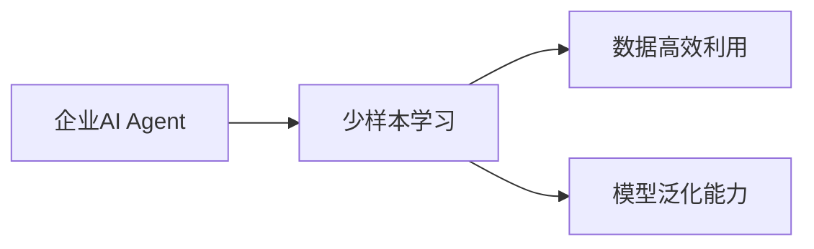
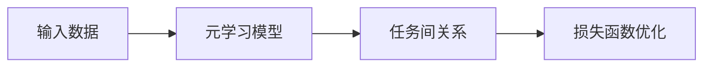
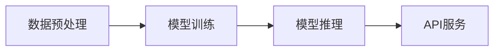
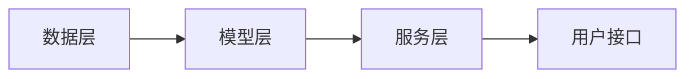
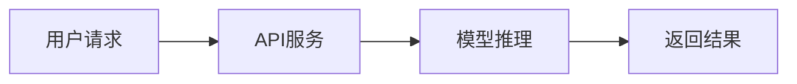

                 


# 《企业AI Agent的少样本学习：快速适应新业务场景》

## 关键词：
- 企业AI Agent
- 少样本学习
- 快速适应
- 业务场景
- 数据高效利用
- 模型泛化能力
- 人工智能

## 摘要：
随着企业对AI Agent的需求不断增加，如何在新业务场景中快速适应成为关键挑战。少样本学习作为一种高效的数据利用方法，能够在数据稀少的情况下快速训练出适用于新场景的AI Agent。本文将详细探讨少样本学习的核心原理、算法实现、系统架构设计以及实际应用案例，为企业技术团队提供理论与实践相结合的解决方案，帮助他们在业务场景中快速部署和优化AI Agent。

---

# 目录

## 第一章: 企业AI Agent与少样本学习的背景介绍

### 1.1 问题背景与挑战
#### 1.1.1 企业AI Agent的核心需求
- 业务场景的多样性和快速变化
- 数据获取的困难性
- 模型泛化的关键性

#### 1.1.2 少样本学习的定义与特点
- 少样本学习的定义
- 少样本学习的特点：数据量少、模型高效、场景适应性强

#### 1.1.3 企业AI Agent的挑战
- 数据量不足的问题
- 模型泛化能力的局限性
- 业务场景快速变化的应对

### 1.2 问题描述与解决方案
#### 1.2.1 业务场景中的数据获取难题
- 数据获取的成本高
- 数据标注的难度大
- 数据分布的不平衡性

#### 1.2.2 少样本学习的应用场景
- 新业务场景的快速部署
- 数据稀少环境下的模型训练
- 领域知识的快速迁移

#### 1.2.3 解决方案概述
- 元学习（Meta-Learning）
- 数据增强技术
- 迁移学习

### 1.3 问题解决的边界与外延
#### 1.3.1 少样本学习的适用范围
- 数据量少的场景
- 快速适应新任务的需求
- 领域知识迁移的需求

#### 1.3.2 与传统机器学习的对比
- 数据量需求的对比
- 模型训练时间的对比
- 模型泛化能力的对比

#### 1.3.3 企业AI Agent的边界条件
- 业务场景的复杂性
- 数据的质量和分布
- 模型的可解释性需求

### 1.4 核心概念结构与要素
#### 1.4.1 少样本学习的核心要素
- 元学习框架
- 数据增强技术
- 模型优化方法

#### 1.4.2 企业AI Agent的组成结构
- 数据层：数据获取与预处理
- 模型层：模型训练与优化
- 服务层：API接口与应用集成

#### 1.4.3 两者结合的逻辑关系
- 少样本学习如何提升企业AI Agent的适应能力
- 企业AI Agent如何为少样本学习提供应用场景

## 第二章: 少样本学习的核心概念与联系

### 2.1 少样本学习的原理
#### 2.1.1 数据高效利用的机制
- 元学习：通过任务间关系提升泛化能力
- 数据增强：通过生成多样数据提升模型鲁棒性

#### 2.1.2 模型的泛化能力提升
- 元学习的核心思想：学习如何学习
- 数据增强的实现：通过变换数据提升模型的适应性

#### 2.1.3 核心算法的特征对比
- 基于任务间关系的元学习算法
- 基于数据生成的数据增强算法

### 2.2 企业AI Agent与少样本学习的关系
#### 2.2.1 企业AI Agent的核心需求
- 快速适应新场景
- 数据高效利用
- 模型的快速部署

#### 2.2.2 少样本学习的适用场景
- 新业务场景的快速建模
- 数据量少的领域知识迁移
- 领域适应性需求高的场景

#### 2.2.3 两者结合的优势
- 少样本学习提升AI Agent的适应能力
- AI Agent为少样本学习提供应用场景
- 两者结合实现快速业务部署

### 2.3 核心概念对比表
| 对比维度       | 传统机器学习                     | 少样本学习                     |
|----------------|----------------------------------|----------------------------------|
| 数据需求       | 数据量大，需要充分标注            | 数据量小，适用于数据稀少场景      |
| 训练时间       | 长，需要大量计算资源              | 较短，适合快速部署                |
| 模型泛化能力   | 一般，依赖于数据分布              | 强，适用于新场景快速适应          |

### 2.4 实体关系图


## 第三章: 少样本学习的算法原理

### 3.1 Meta-Learning算法
#### 3.1.1 算法概述
- Meta-Learning的核心思想：学习如何从少量数据中快速学习新任务
- 元学习框架：通过任务间关系优化模型参数

#### 3.1.2 算法流程
1. 在多个任务上预训练模型
2. 在新任务上进行快速微调
3. 通过优化器更新模型参数



#### 3.1.3 代码实现
```python
import torch
class MetaLearner:
    def __init__(self, model, optimizer):
        self.model = model
        self.optimizer = optimizer

    def forward(self, x):
        return self.model(x)

    def loss(self, outputs, labels):
        return torch.nn.CrossEntropyLoss()(outputs, labels)

    def step(self, x_support, y_support, x_query, y_query):
        # 预测支持集
        support_outputs = self.model(x_support)
        # 计算支持集损失
        support_loss = self.loss(support_outputs, y_support)
        # 反向传播
        self.optimizer.zero_grad()
        support_loss.backward()
        self.optimizer.step()
        # 预测查询集
        query_outputs = self.model(x_query)
        # 计算查询集损失
        query_loss = self.loss(query_outputs, y_query)
        return query_loss.item()
```

### 3.2 数据增强方法
#### 3.2.1 数据增强的原理
- 数据增强：通过数据变换生成多样化的数据，提升模型的泛化能力

#### 3.2.2 常用数据增强技术
- 图像数据：旋转、缩放、裁剪、颜色变换
- 文本数据：同义词替换、句式变化、数据降噪

#### 3.2.3 数据增强的实现步骤
1. 数据预处理：标准化、归一化
2. 数据变换：随机应用多种数据增强技术
3. 数据生成：生成多样化的数据集

### 3.3 算法实现代码

---

## 第四章: 企业AI Agent的系统架构设计

### 4.1 问题场景介绍
- 企业AI Agent的应用场景：客服、智能推荐、流程自动化
- 少样本学习在系统中的位置：数据预处理、模型训练、模型推理

### 4.2 系统功能设计
#### 4.2.1 领域模型设计


#### 4.2.2 系统架构设计


### 4.3 系统交互设计
#### 4.3.1 系统接口设计
- 数据输入接口：支持多种数据格式
- 模型训练接口：支持在线微调
- API服务接口：支持实时推理

#### 4.3.2 系统交互流程


---

## 第五章: 项目实战

### 5.1 环境安装
- 安装必要的库：PyTorch、transformers、scikit-learn

### 5.2 核心功能实现
#### 5.2.1 数据预处理
- 数据清洗：去除噪声数据
- 数据增强：生成多样化数据

#### 5.2.2 模型训练
- 元学习模型的训练：预训练和微调
- 数据增强的实现：随机应用数据变换

#### 5.2.3 模型推理
- 模型推理：实时处理用户请求
- 结果返回：提供API服务

### 5.3 实际案例分析
- 案例背景：客服对话系统
- 案例实现：少样本学习快速适应新用户需求
- 案例总结：提升用户体验和系统效率

---

## 第六章: 总结与展望

### 6.1 本章小结
- 少样本学习的核心原理
- 企业AI Agent的系统架构
- 项目实战的经验总结

### 6.2 最佳实践 tips
- 数据预处理的重要性
- 模型微调的技巧
- 系统架构设计的注意事项

### 6.3 注意事项
- 数据质量对模型性能的影响
- 模型泛化能力的测试与优化
- 系统部署中的性能优化

### 6.4 拓展阅读
- 元学习的最新研究
- 少样本学习在其他领域的应用
- 企业AI Agent的未来发展趋势

