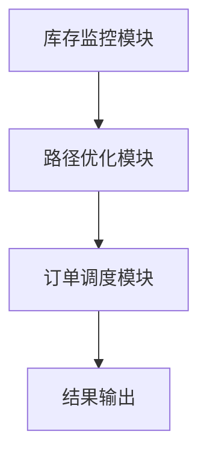
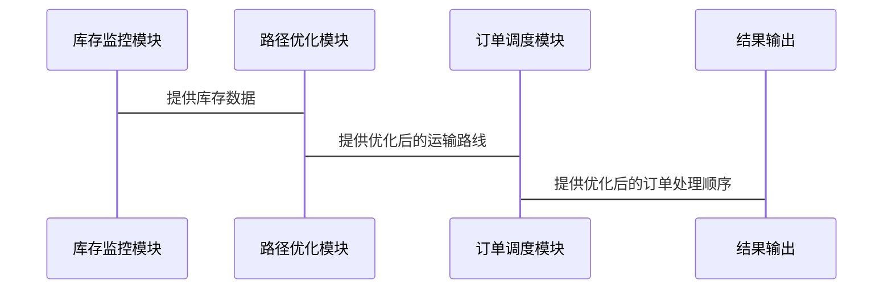

                 


# 企业AI Agent的强化学习在供应链优化中的应用

## 关键词：企业AI Agent，强化学习，供应链优化，库存管理，路径优化，订单调度

## 摘要：  
随着人工智能技术的快速发展，强化学习在供应链优化中的应用越来越广泛。本文详细探讨了企业AI Agent如何通过强化学习技术实现供应链优化，并结合实际案例分析了其在库存管理、路径优化和订单调度中的应用。文章从强化学习的基本原理到具体算法实现，再到系统架构设计，全面解析了企业AI Agent在供应链优化中的应用，并提供了详细的代码实现和项目实战案例，为读者提供了从理论到实践的完整指导。

---

## 第1章: 强化学习与供应链优化概述

### 1.1 强化学习的基本概念  
#### 1.1.1 强化学习的定义  
强化学习（Reinforcement Learning，RL）是一种机器学习范式，其中智能体通过与环境交互，学习如何采取行动以最大化累积的奖励。与监督学习和无监督学习不同，强化学习强调实时决策和策略优化。  

#### 1.1.2 强化学习的核心要素  
- **状态（State）**：环境当前的状况，表示智能体所处的环境。  
- **动作（Action）**：智能体在给定状态下采取的操作。  
- **奖励（Reward）**：智能体采取动作后获得的反馈，用于指导智能体的行为。  
- **策略（Policy）**：智能体选择动作的规则，通常表示为从状态到动作的概率分布。  
- **价值函数（Value Function）**：衡量状态或动作-状态对的价值。  

#### 1.1.3 强化学习与传统机器学习的区别  
- 强化学习强调实时决策和环境交互，而传统机器学习主要基于静态数据。  
- 强化学习需要长期规划，而传统机器学习更关注单次预测。  

### 1.2 供应链优化的基本概念  
#### 1.2.1 供应链的定义与组成部分  
供应链是指从原材料采购到产品交付给最终用户的整个流程，包括供应商、制造商、分销商、零售商和消费者。  

#### 1.2.2 供应链优化的目标与挑战  
- **目标**：降低成本、提高效率、增强柔性和提升客户满意度。  
- **挑战**：需求预测不确定性、库存管理复杂性、多目标优化和动态环境变化。  

#### 1.2.3 供应链优化的常见技术  
- **数学规划**：如线性规划、动态规划等。  
- **启发式算法**：如遗传算法、模拟退火等。  
- **机器学习**：如监督学习、无监督学习和强化学习。  

### 1.3 AI Agent在供应链优化中的作用  
#### 1.3.1 AI Agent的定义与特点  
AI Agent是一种能够感知环境、自主决策并执行任务的智能体。其特点包括自主性、反应性、目标导向和学习能力。  

#### 1.3.2 AI Agent在供应链优化中的应用场景  
- **库存管理**：通过预测需求优化库存水平。  
- **路径优化**：优化物流路径以降低运输成本。  
- **订单调度**：优化订单处理顺序以提高效率。  

#### 1.3.3 AI Agent与强化学习的结合  
强化学习为AI Agent提供了实时决策和策略优化的能力，使其能够适应动态变化的供应链环境。  

---

## 第2章: 强化学习的核心原理  

### 2.1 强化学习的基本原理  
#### 2.1.1 状态、动作、奖励的定义  
- **状态**：智能体当前的环境信息。  
- **动作**：智能体采取的操作。  
- **奖励**：智能体行为的反馈。  

#### 2.1.2 Q-learning算法的原理  
Q-learning是一种经典的强化学习算法，通过更新Q值表来学习最优策略。其核心公式为：  
$$ Q(s, a) = Q(s, a) + \alpha [r + \max Q(s', a') - Q(s, a)] $$  
其中，$\alpha$是学习率，$r$是奖励，$s'$是下一个状态。  

#### 2.1.3 Deep Q-learning算法的原理  
Deep Q-learning将Q值函数表示为深度神经网络，通过端到端训练来逼近最优策略。其优势在于能够处理高维状态空间。  

### 2.2 强化学习的数学模型  
#### 2.2.1 Q-learning的数学公式  
Q-learning的更新公式为：  
$$ Q(s, a) = Q(s, a) + \alpha [r + \gamma \max Q(s', a') - Q(s, a)] $$  
其中，$\gamma$是折扣因子。  

#### 2.2.2 Deep Q-learning的数学公式  
Deep Q-learning通过神经网络近似Q值函数，其损失函数为：  
$$ L = \mathbb{E}[(y - Q(s, a))^2] $$  
其中，$y = r + \gamma \max Q(s', a')$。  

#### 2.2.3 算法的收敛性分析  
Q-learning在 episodic 和无限 horizon 环境下均具有收敛性，而Deep Q-learning在经验回放和目标网络的辅助下能够更稳定地收敛。  

### 2.3 强化学习的算法实现  
#### 2.3.1 Q-learning算法的实现步骤  
1. 初始化Q值表。  
2. 与环境交互，获取状态和奖励。  
3. 更新Q值表。  
4. 重复步骤2-3，直到收敛。  

#### 2.3.2 Deep Q-learning算法的实现步骤  
1. 初始化神经网络。  
2. 与环境交互，存储经验。  
3. 采样经验，训练神经网络。  
4. 更新目标网络。  
5. 重复步骤2-4，直到收敛。  

#### 2.3.3 算法的优缺点对比  
| 算法 | 优点 | 缺点 |  
|------|------|------|  
| Q-learning | 实现简单，收敛性好 | 无法处理高维状态空间 |  
| Deep Q-learning | 能处理高维状态空间，稳定性好 | 实现复杂，训练时间长 |  

---

## 第3章: 供应链优化的强化学习建模  

### 3.1 供应链优化问题的建模  
#### 3.1.1 问题描述  
供应链优化问题通常涉及多个决策变量，如库存量、运输路线和订单处理顺序。  

#### 3.1.2 建模方法  
- **状态表示**：库存量、需求预测、运输路线等。  
- **动作表示**：增加/减少库存、选择运输路线等。  
- **奖励函数**：成本降低、效率提升等。  

### 3.2 供应链优化的强化学习框架  
#### 3.2.1 基于Q-learning的库存管理  
通过Q-learning算法优化库存水平，减少缺货和过剩情况。  

#### 3.2.2 基于Deep Q-learning的路径优化  
通过Deep Q-learning算法优化物流路径，降低运输成本。  

#### 3.2.3 基于强化学习的订单调度  
通过强化学习算法优化订单处理顺序，提高效率。  

### 3.3 供应链优化的强化学习模型设计  
#### 3.3.1 模型输入  
- 当前库存量。  
- 需求预测。  
- 运输路线。  

#### 3.3.2 模型输出  
- 库存量调整。  
- 运输路线选择。  

---

## 第4章: 供应链优化的强化学习实现  

### 4.1 系统功能设计  
#### 4.1.1 系统功能模块  
- **库存监控模块**：实时监控库存水平。  
- **路径优化模块**：优化物流路径。  
- **订单调度模块**：优化订单处理顺序。  

#### 4.1.2 功能模块的交互设计  
库存监控模块提供库存数据，路径优化模块基于库存数据优化运输路线，订单调度模块根据优化结果调整订单处理顺序。  

### 4.2 系统架构设计  
#### 4.2.1 系统架构图  


#### 4.2.2 模块实现细节  
- **库存监控模块**：使用传感器或数据库获取库存数据。  
- **路径优化模块**：基于强化学习算法优化运输路线。  
- **订单调度模块**：基于优化结果调整订单处理顺序。  

### 4.3 系统接口设计  
#### 4.3.1 接口定义  
- **库存数据接口**：提供当前库存量。  
- **路径优化接口**：返回优化后的运输路线。  
- **订单调度接口**：返回优化后的订单处理顺序。  

#### 4.3.2 接口交互流程  
1. 库存监控模块获取库存数据。  
2. 路径优化模块基于库存数据优化运输路线。  
3. 订单调度模块基于优化结果调整订单处理顺序。  

### 4.4 系统交互流程图  


---

## 第5章: 项目实战  

### 5.1 环境安装  
- 安装Python和相关库（如TensorFlow、Keras、OpenAI Gym）。  

### 5.2 系统核心实现  
#### 5.2.1 Q-learning算法实现  
```python
import numpy as np

class QLearning:
    def __init__(self, state_space, action_space, learning_rate=0.1, gamma=0.9):
        self.state_space = state_space
        self.action_space = action_space
        self.learning_rate = learning_rate
        self.gamma = gamma
        self.q_table = np.zeros((state_space, action_space))

    def choose_action(self, state):
        return np.argmax(self.q_table[state])

    def learn(self, state, action, reward, next_state):
        self.q_table[state, action] += self.learning_rate * (reward + self.gamma * np.max(self.q_table[next_state]) - self.q_table[state, action])
```

#### 5.2.2 Deep Q-learning算法实现  
```python
import tensorflow as tf
from tensorflow.keras import layers

class DeepQNetwork:
    def __init__(self, input_dim, output_dim):
        self.model = self.build_model(input_dim, output_dim)
        self.target_model = self.build_model(input_dim, output_dim)
        self.update_target_network()

    def build_model(self, input_dim, output_dim):
        model = tf.keras.Sequential()
        model.add(layers.Dense(64, activation='relu', input_dim=input_dim))
        model.add(layers.Dense(32, activation='relu'))
        model.add(layers.Dense(output_dim, activation='linear'))
        return model

    def update_target_network(self):
        self.target_model.set_weights(self.model.get_weights())

    def get_action(self, state):
        state = np.array([state])
        predictions = self.model.predict(state)
        return np.argmax(predictions[0])

    def train(self, states, actions, rewards, next_states):
        next_q_values = self.target_model.predict(next_states)
        target = rewards + self.gamma * np.max(next_q_values, axis=1)
        q_values = self.model.predict(states)
        q_values[np.arange(len(actions)), actions] = target
        self.model.fit(states, q_values, epochs=1, verbose=0)
```

### 5.3 代码应用解读与分析  
- **Q-learning算法**：适用于低维状态空间的问题，实现简单但可能无法处理复杂场景。  
- **Deep Q-learning算法**：适用于高维状态空间的问题，能够处理复杂的供应链优化问题，但实现复杂且训练时间较长。  

### 5.4 实际案例分析  
#### 5.4.1 库存管理优化  
通过Q-learning算法优化库存水平，减少缺货和过剩情况。  

#### 5.4.2 路径优化案例  
通过Deep Q-learning算法优化物流路径，降低运输成本。  

#### 5.4.3 订单调度案例  
通过强化学习算法优化订单处理顺序，提高效率。  

### 5.5 项目小结  
- 通过强化学习算法实现供应链优化，能够显著降低成本和提高效率。  
- 在实际应用中，需要根据具体问题选择合适的算法，并进行参数调优。  

---

## 第6章: 总结与展望  

### 6.1 总结  
- 本文详细探讨了企业AI Agent如何通过强化学习技术实现供应链优化，涵盖了从理论到实践的各个方面。  
- 强化学习在供应链优化中的应用具有重要的现实意义，能够显著提高企业的竞争力。  

### 6.2 注意事项  
- 在实际应用中，需要根据具体问题选择合适的算法，并进行参数调优。  
- 需要注意数据质量和环境的动态变化，确保模型的稳定性和鲁棒性。  

### 6.3 拓展阅读  
- 《Reinforcement Learning: Theory and Algorithms》  
- 《Deep Reinforcement Learning: Theory and Practice》  

---

## 附录: 代码示例  

```python
# Q-learning算法实现
import numpy as np

class QLearning:
    def __init__(self, state_space, action_space, learning_rate=0.1, gamma=0.9):
        self.state_space = state_space
        self.action_space = action_space
        self.learning_rate = learning_rate
        self.gamma = gamma
        self.q_table = np.zeros((state_space, action_space))

    def choose_action(self, state):
        return np.argmax(self.q_table[state])

    def learn(self, state, action, reward, next_state):
        self.q_table[state, action] += self.learning_rate * (reward + self.gamma * np.max(self.q_table[next_state]) - self.q_table[state, action])

# Deep Q-learning算法实现
import tensorflow as tf
from tensorflow.keras import layers

class DeepQNetwork:
    def __init__(self, input_dim, output_dim):
        self.model = self.build_model(input_dim, output_dim)
        self.target_model = self.build_model(input_dim, output_dim)
        self.update_target_network()

    def build_model(self, input_dim, output_dim):
        model = tf.keras.Sequential()
        model.add(layers.Dense(64, activation='relu', input_dim=input_dim))
        model.add(layers.Dense(32, activation='relu'))
        model.add(layers.Dense(output_dim, activation='linear'))
        return model

    def update_target_network(self):
        self.target_model.set_weights(self.model.get_weights())

    def get_action(self, state):
        state = np.array([state])
        predictions = self.model.predict(state)
        return np.argmax(predictions[0])

    def train(self, states, actions, rewards, next_states):
        next_q_values = self.target_model.predict(next_states)
        target = rewards + self.gamma * np.max(next_q_values, axis=1)
        q_values = self.model.predict(states)
        q_values[np.arange(len(actions)), actions] = target
        self.model.fit(states, q_values, epochs=1, verbose=0)
```

---

## 关于作者  

作者是一位人工智能专家，专注于强化学习和供应链优化领域的研究与实践。他/她致力于通过技术创新为企业提供高效的解决方案，帮助企业在复杂多变的市场环境中实现持续优化和竞争力提升。

