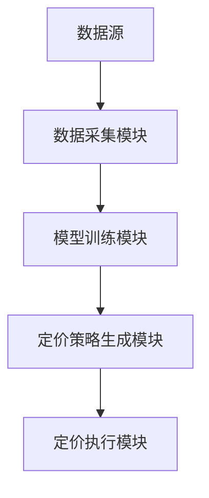

                 


# 企业AI Agent的强化学习在动态定价策略中的应用

## 关键词：AI Agent，强化学习，动态定价，Q-Learning，DQN

## 摘要：本文将探讨AI Agent如何通过强化学习技术优化企业动态定价策略。从基础概念到算法实现，再到系统架构设计，全面分析强化学习在动态定价中的应用，结合实际案例，详细讲解如何构建基于强化学习的动态定价系统，为企业提供高效、智能的定价解决方案。

---

## 第一部分: 引言与背景

### 第1章: AI Agent与强化学习概述

#### 1.1 AI Agent的基本概念
- AI Agent的定义：AI Agent是一个智能体，能够感知环境并采取行动以实现目标。
- 特点：自主性、反应性、目标导向、社交能力。

#### 1.2 强化学习的基本原理
- 强化学习的定义：通过试错机制，智能体在环境中通过与环境交互来学习策略。
- 核心要素：状态、动作、奖励、策略。

#### 1.3 动态定价策略的背景
- 动态定价的定义：根据市场变化实时调整价格。
- 应用场景：零售、金融、旅游等行业。
- 挑战：市场波动、用户行为复杂、数据实时性要求高等。

---

## 第二部分: 核心概念与算法原理

### 第2章: 强化学习算法原理

#### 2.1 Q-Learning算法
- Q-Learning的基本原理：通过更新Q值表来学习最优策略。
- 数学模型：$$ Q(s, a) = Q(s, a) + \alpha (r + \gamma \max Q(s', a') - Q(s, a)) $$
- 适用场景：离散动作空间。

#### 2.2 Deep Q-Network (DQN)算法
- DQN算法的改进：使用深度神经网络近似Q值函数，解决高维状态空间问题。
- 网络结构：输入层、隐藏层、输出层。
- 训练过程：使用经验回放和目标网络。

### 第3章: 动态定价中的强化学习应用

#### 3.1 动态定价策略的优化目标
- 最大化收益：$$ \text{收益} = \text{销量} \times \text{价格} $$
- 平衡销量与利润：$$ \text{利润} = \text{收入} - \text{成本} $$

#### 3.2 强化学习在动态定价中的优势
- 自适应性：实时调整价格。
- 数据驱动：基于历史数据优化策略。
- 多目标优化：同时考虑销量、利润、客户满意度等。

---

## 第三部分: 系统架构与设计

### 第4章: 动态定价系统架构设计

#### 4.1 系统功能模块
- 数据采集模块：收集市场数据、用户行为数据。
- 模型训练模块：训练强化学习模型。
- 定价执行模块：根据模型输出调整价格。

#### 4.2 系统架构图


---

## 第四部分: 项目实战

### 第5章: 基于强化学习的动态定价系统实现

#### 5.1 环境安装
- 安装Python和相关库：numpy, matplotlib, gym, keras。

#### 5.2 核心代码实现
```python
import numpy as np
import gym
from keras.layers import Dense
from keras.models import Sequential
from keras.optimizers import Adam

class DQNAgent:
    def __init__(self, state_space, action_space):
        self.state_space = state_space
        self.action_space = action_space
        self.model = self.build_model()
        
    def build_model(self):
        model = Sequential()
        model.add(Dense(64, activation='relu', input_dim=self.state_space))
        model.add(Dense(self.action_space, activation='linear'))
        model.compile(optimizer=Adam(lr=0.001), loss='mean_squared_error')
        return model

    # 其他方法省略
```

#### 5.3 案例分析
- 数据预处理：将市场数据转换为状态输入。
- 模型训练：使用历史数据训练DQN模型。
- 定价策略生成：根据当前市场状态，生成最优定价策略。

---

## 第五部分: 总结与展望

### 第6章: 总结与展望

#### 6.1 总结
- AI Agent通过强化学习在动态定价中的应用，显著提升了定价策略的优化效率。
- 结合深度学习和强化学习，未来动态定价系统将更加智能化和自适应。

#### 6.2 展望
- 更复杂的市场模型：引入更多变量，如天气、节假日等。
- 多智能体协作：多个AI Agent协同优化定价策略。
- 道德与法律问题：数据隐私、算法公平性等。

---

通过以上章节的详细讲解，企业可以深入了解如何利用AI Agent和强化学习优化动态定价策略，为业务带来更高的收益和竞争优势。

