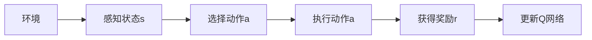

                 

# 企业AI Agent的强化学习在动态定价策略中的应用

## 关键词：AI Agent，强化学习，动态定价，企业应用，算法实现

## 摘要：  
本文探讨了AI Agent结合强化学习在动态定价策略中的应用，通过分析强化学习算法的核心原理、动态定价策略的模型构建，以及企业级系统架构设计，展示了如何利用AI Agent实现智能化定价。文章从基础概念到算法实现，再到系统架构和项目实战，全面解析了强化学习在动态定价中的应用，为企业的定价策略优化提供了理论和实践指导。

---

# 第1章: AI Agent与强化学习概述

## 1.1 AI Agent的基本概念

### 1.1.1 AI Agent的定义
AI Agent（人工智能代理）是指能够感知环境、自主决策并执行任务的智能实体。它可以是一个软件程序、机器人或其他智能系统，通过与环境交互来实现特定目标。

### 1.1.2 AI Agent的核心特征
- **自主性**：能够自主决策，无需人工干预。
- **反应性**：能够感知环境并实时调整行为。
- **目标导向性**：所有行为都以实现特定目标为导向。
- **学习能力**：能够通过经验优化决策策略。

### 1.1.3 AI Agent在企业中的应用价值
AI Agent在企业中的应用广泛，尤其是在动态定价、供应链优化、客户行为预测等领域。通过AI Agent，企业可以实现自动化决策，提高运营效率和盈利能力。

---

## 1.2 强化学习的基本原理

### 1.2.1 强化学习的定义与特点
强化学习是一种机器学习范式，通过智能体与环境的交互，学习最优策略以最大化累积奖励。其核心特点是通过试错学习，智能体逐步优化决策策略。

### 1.2.2 强化学习与监督学习的区别
| 特性 | 监督学习 | 强化学习 |
|------|----------|----------|
| 数据来源 | 标签数据 | 奖励信号 |
| 决策方式 | 确定性 | 概率性 |
| 优化目标 | 最小化误差 | 最大化累积奖励 |

### 1.2.3 强化学习的核心要素：状态、动作、奖励
- **状态（State）**：智能体所处的环境信息，例如当前价格、市场需求等。
- **动作（Action）**：智能体在给定状态下采取的行动，例如调整价格。
- **奖励（Reward）**：智能体采取动作后获得的反馈，通常以数值形式表示。

---

## 1.3 动态定价策略的基本概念

### 1.3.1 动态定价的定义
动态定价是指根据市场环境和客户需求实时调整产品或服务价格的策略。与传统定价不同，动态定价能够快速响应市场变化，提高收益。

### 1.3.2 动态定价的常见应用场景
- **电子商务**：实时调整商品价格以应对市场竞争。
- **酒店与航空业**：根据需求波动调整房间或机票价格。
- **金融服务业**：实时调整金融产品的定价。

### 1.3.3 动态定价与传统定价策略的区别
| 特性 | 动态定价 | 传统定价 |
|------|----------|----------|
| 时间维度 | 实时调整 | 固定或周期性调整 |
| 数据依赖 | 高度依赖实时数据 | 依赖历史数据 |
| 决策方式 | 自动化决策 | 人工或半自动化决策 |

---

## 1.4 本章小结

### 1.4.1 AI Agent与强化学习的关系
AI Agent是强化学习的应用载体，强化学习为AI Agent提供决策能力。

### 1.4.2 强化学习在动态定价中的潜力
通过强化学习，AI Agent可以实时优化定价策略，提高企业收益。

### 1.4.3 本章内容回顾
本章介绍了AI Agent和强化学习的基本概念，分析了动态定价策略的核心要素及其与传统定价的区别。

---

# 第2章: 强化学习算法原理

## 2.1 强化学习的核心算法

### 2.1.1 Q-learning算法
Q-learning是一种经典的强化学习算法，通过更新Q值函数来学习最优策略。其核心公式为：
$$ Q(s,a) = Q(s,a) + \alpha (r + \gamma \max Q(s',a') - Q(s,a)) $$

### 2.1.2 Deep Q-Networks (DQN)
DQN通过深度神经网络近似Q值函数，能够处理高维状态空间。其核心流程如下：

### 2.1.3 策略梯度方法
策略梯度方法直接优化策略，通过梯度上升最大化累积奖励。其优化目标为：
$$ \theta = \theta + \alpha \nabla_\theta J(\theta) $$

---

## 2.2 强化学习的数学模型

### 2.2.1 状态-动作-奖励的数学表示
状态空间：\( S \)  
动作空间：\( A \)  
奖励函数：\( R: S \times A \rightarrow \mathbb{R} \)

### 2.2.2 Q值函数的更新公式
$$ Q(s,a) = Q(s,a) + \alpha (r + \gamma \max Q(s',a') - Q(s,a)) $$

### 2.2.3 策略梯度的优化目标
$$ \theta = \theta + \alpha \nabla_\theta J(\theta) $$

---

## 2.3 强化学习的挑战与解决方案

### 2.3.1 探索与利用的平衡
通过epsilon-greedy策略，在探索和利用之间找到平衡点。

### 2.3.2 状态空间的稀疏性问题
使用函数近似方法（如神经网络）来处理高维或连续状态空间。

### 2.3.3 奖励函数的设计难度
通过与领域专家合作，设计合理的奖励函数。

---

## 2.4 本章小结

### 2.4.1 强化学习算法的核心流程
1. 感知状态，选择动作。
2. 执行动作，获得奖励。
3. 更新模型，优化策略。

### 2.4.2 不同算法的适用场景
- Q-learning适用于低维状态空间。
- DQN适用于高维连续状态空间。
- 策略梯度适用于策略直接优化。

### 2.4.3 强化学习的数学模型总结
Q-learning和策略梯度方法是强化学习的核心算法，分别适用于不同的场景。

---

# 第3章: 动态定价策略的核心模型

## 3.1 动态定价的基本模型

### 3.1.1 需求预测模型
需求预测模型通过历史数据预测未来需求，常用的模型包括ARIMA和LSTM。

### 3.1.2 价格弹性模型
价格弹性模型描述价格变化对需求的影响，常用弹性系数衡量。

### 3.1.3 竞争对手行为模型
竞争对手行为模型预测竞争对手的定价策略，常用博弈论方法建模。

---

## 3.2 强化学习在动态定价中的应用模型

### 3.2.1 基于Q-learning的价格调整模型
通过Q-learning算法，AI Agent实时调整价格以最大化收益。

### 3.2.2 基于DQN的需求响应模型
DQN通过深度网络近似Q值函数，优化价格调整策略。

### 3.2.3

---

# 第4章: AI Agent与强化学习在动态定价中的结合

## 4.1 AI Agent在动态定价中的角色
AI Agent作为决策主体，通过强化学习优化定价策略。

## 4.2 强化学习在动态定价中的具体应用
通过强化学习，AI Agent能够实时调整价格，应对市场变化。

## 4.3 算法实现与案例分析
通过Python代码实现强化学习算法，分析实际案例，展示AI Agent在动态定价中的应用效果。

---

# 第5章: 系统架构与设计

## 5.1 系统功能设计
- **需求预测模块**：预测未来需求。
- **价格优化模块**：基于强化学习优化价格。
- **执行模块**：实时调整价格。

## 5.2 系统架构设计
使用Mermaid绘制系统架构图，展示各模块之间的关系。

## 5.3 系统接口设计
定义系统接口，确保各模块协同工作。

---

# 第6章: 项目实战

## 6.1 环境配置
安装必要的Python库，如TensorFlow和Keras。

## 6.2 系统核心实现
编写强化学习算法代码，实现动态定价策略。

## 6.3 案例分析
通过具体案例，分析AI Agent在动态定价中的实际应用效果。

---

# 第7章: 最佳实践与总结

## 7.1 小结
总结全文，强调AI Agent与强化学习在动态定价中的潜力。

## 7.2 注意事项
提醒读者注意强化学习的局限性和实际应用中的挑战。

## 7.3 拓展阅读
推荐相关领域的进一步阅读材料。

---

# 附录: 代码示例

提供Python代码示例，展示强化学习算法在动态定价中的实现。

---

通过以上章节的详细讲解，本文系统地介绍了AI Agent与强化学习在动态定价中的应用，从理论到实践，为企业的定价策略优化提供了全面的指导。

