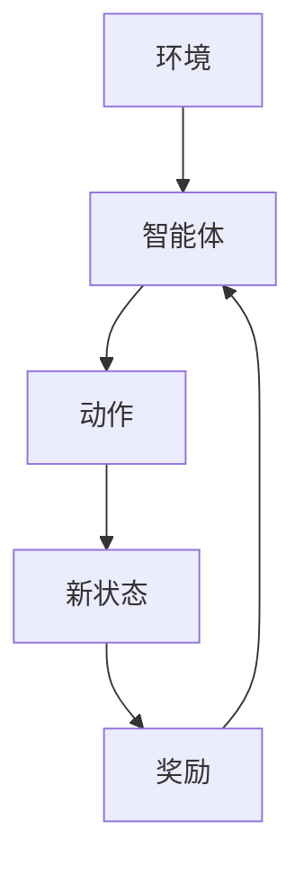
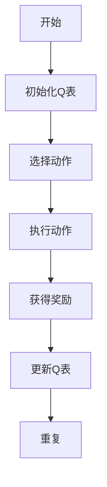

                 


# 企业AI Agent的强化学习在动态定价策略中的高级应用

## 文章关键词：强化学习、动态定价、企业AI Agent、DQN算法、定价策略优化

## 摘要：本文深入探讨了如何利用强化学习技术优化企业AI Agent的动态定价策略。通过构建强化学习模型，分析动态定价的核心问题，并结合企业实际应用场景，提出了基于DQN算法的解决方案。文章详细讲解了强化学习的理论基础、动态定价策略的建模过程、企业AI Agent的系统架构设计，以及实际项目中的代码实现和案例分析，为读者提供了全面的技术指导和实践参考。

---

# 第1章：企业AI Agent与动态定价策略概述

## 1.1 强化学习与动态定价的背景

### 1.1.1 强化学习的定义与特点

强化学习（Reinforcement Learning，RL）是一种机器学习范式，其中智能体通过与环境交互来学习最优策略。其核心特点包括：

1. **目标导向性**：智能体通过最大化累积奖励来优化行为。
2. **经验驱动**：智能体通过试错学习，从经验中提取策略。
3. **在线学习**：智能体在实际环境中实时更新策略。

### 1.1.2 动态定价策略的定义与应用场景

动态定价是指根据市场环境、用户行为等因素实时调整产品或服务价格的策略。其应用场景包括电商、金融、交通等领域。例如，电商可以根据库存、需求波动和竞争对手的价格调整商品价格。

### 1.1.3 企业AI Agent的核心作用

AI Agent作为企业的智能决策者，能够实时感知市场环境，利用强化学习优化定价策略。其核心作用包括：

1. **实时决策**：快速响应市场变化，优化价格。
2. **数据驱动**：基于实时数据进行精准定价。
3. **自我优化**：通过强化学习不断改进定价策略。

## 1.2 问题背景与挑战

### 1.2.1 动态定价的核心问题

动态定价的核心问题在于如何在不确定性环境下找到最优价格。具体挑战包括：

1. **需求预测的不确定性**：市场需求受多种因素影响，难以准确预测。
2. **竞争环境的复杂性**：竞争对手的价格调整会影响自身定价策略。
3. **实时决策的高效性**：需要在极短时间内做出定价决策。

### 1.2.2 强化学习在动态定价中的优势

强化学习能够通过试错和经验累积找到最优定价策略。其优势包括：

1. **全局优化**：能够全局考虑定价策略的影响。
2. **实时适应**：能够实时调整策略以应对环境变化。
3. **自我学习**：无需大量标注数据，通过经验自我优化。

### 1.2.3 企业AI Agent的动态定价挑战

企业AI Agent在动态定价中面临以下挑战：

1. **复杂决策空间**：定价策略涉及多个变量，决策空间复杂。
2. **环境动态性**：市场环境不断变化，需要快速调整策略。
3. **策略稳定性**：避免频繁的价格波动影响用户体验。

## 1.3 问题解决与边界

### 1.3.1 动态定价问题的数学建模

动态定价问题可以建模为一个强化学习问题。具体模型包括：

1. **状态空间**：市场环境、库存水平、用户需求等。
2. **动作空间**：可能的价格调整幅度。
3. **奖励函数**：基于定价后的收益和成本计算奖励。

### 1.3.2 强化学习在动态定价中的边界与限制

强化学习在动态定价中的应用存在以下边界：

1. **计算资源限制**：实时决策需要高效计算能力。
2. **数据质量要求**：模型性能依赖于数据的完整性和准确性。
3. **环境动态性**：模型需要能够适应快速变化的环境。

### 1.3.3 企业AI Agent的动态定价框架

企业AI Agent的动态定价框架包括以下几个部分：

1. **感知模块**：实时收集市场数据和用户反馈。
2. **决策模块**：基于强化学习算法生成定价策略。
3. **执行模块**：将定价策略转化为具体操作。
4. **反馈模块**：收集执行结果，更新模型参数。

## 1.4 核心概念与联系

### 1.4.1 AI Agent与强化学习的关系

AI Agent通过强化学习算法优化定价策略。强化学习为AI Agent提供决策框架，而AI Agent为强化学习提供实时数据和执行环境。

### 1.4.2 动态定价策略的核心要素

动态定价策略的核心要素包括：

1. **定价模型**：基于历史数据和市场分析构建数学模型。
2. **定价规则**：根据特定条件调整价格的规则集。
3. **定价工具**：支持定价策略实施的技术平台。

### 1.4.3 实体关系图（ER图）与强化学习模型

通过ER图可以展示动态定价系统中的实体及其关系。例如：

- **订单表**：记录用户订单信息。
- **价格调整记录**：记录每次价格调整的详细信息。
- **用户行为表**：记录用户的浏览和购买行为。

强化学习模型则基于这些数据进行训练和优化。

---

# 第2章：强化学习的核心原理

## 2.1 强化学习的基本概念

### 2.1.1 状态空间与动作空间

**状态空间**：智能体所处环境的所有可能状态的集合。例如，在动态定价中，状态可能包括当前价格、库存量、市场需求等。

**动作空间**：智能体在每个状态下可以执行的所有动作。例如，调整价格、保持价格不变等。

### 2.1.2 奖励机制与目标函数

**奖励机制**：智能体在每个动作后获得的奖励，用于衡量该动作的优劣。例如，卖出更多商品可以获得更高的奖励。

**目标函数**：智能体的目标是最大化累积奖励，通常表示为折扣的累积奖励：

$$ R = r_1 + \gamma r_2 + \gamma^2 r_3 + \dots $$

其中，$\gamma$ 是折扣因子，满足 $0 < \gamma < 1$。

### 2.1.3 策略与价值函数

**策略**：智能体在每个状态下选择动作的概率分布。例如，在价格调整时，策略决定了选择提高、降低或保持价格的概率。

**价值函数**：衡量某个状态下的期望累积奖励。例如，状态 $s$ 的价值函数 $V(s)$ 表示从状态 $s$ 开始的期望累积奖励。

## 2.2 强化学习的数学模型

### 2.2.1 马尔可夫决策过程（MDP）

马尔可夫决策过程由以下五元组定义：

$$ \text{MDP} = (S, A, P, R, \gamma) $$

其中：
- $S$：状态空间
- $A$：动作空间
- $P$：状态转移概率矩阵
- $R$：奖励函数
- $\gamma$：折扣因子

### 2.2.2 Q-learning算法的数学推导

Q-learning算法通过更新Q值表来学习最优策略。Q值表表示在状态 $s$ 下执行动作 $a$ 的期望累积奖励：

$$ Q(s, a) = Q(s, a) + \alpha [r + \gamma \max Q(s', a') - Q(s, a)] $$

其中，$\alpha$ 是学习率，$r$ 是即时奖励，$s'$ 是下一个状态。

### 2.2.3 Deep Q-Networks（DQN）的原理

DQN通过深度神经网络近似Q值函数。网络结构通常包括输入层、隐藏层和输出层。输出层的每个节点表示某个动作的Q值。

### 2.2.4 算法流程图（使用 Mermaid）



---

## 2.3 强化学习的算法流程

### 2.3.1 算法流程图（使用 Mermaid）



### 2.3.2 动态定价中的强化学习流程

1. **初始化**：设置初始价格和Q表。
2. **选择动作**：基于当前价格和库存选择价格调整幅度。
3. **执行动作**：调整价格并观察销售情况。
4. **获得奖励**：根据销售额和利润更新奖励。
5. **更新Q表**：根据奖励更新Q值表。
6. **重复**：持续优化定价策略。

### 2.3.3 算法实现代码示例

```python
import numpy as np

class DQN:
    def __init__(self, state_size, action_size):
        self.state_size = state_size
        self.action_size = action_size
        self.Q = np.zeros((state_size, action_size))
    
    def get_action(self, state):
        return np.argmax(self.Q[state, :])
    
    def update_Q(self, state, action, reward, next_state):
        self.Q[state, action] += 0.1 * (reward + 0.95 * np.max(self.Q[next_state, :]) - self.Q[state, action])
```

---

## 2.4 强化学习的数学公式

### 2.4.1 Q-learning算法的数学模型

Q值更新公式：

$$ Q(s, a) = Q(s, a) + \alpha [r + \gamma \max Q(s', a') - Q(s, a)] $$

其中：
- $\alpha$ 是学习率
- $\gamma$ 是折扣因子

### 2.4.2 Deep Q-Networks（DQN）的数学模型

DQN通过神经网络近似Q值函数，网络结构如下：

$$ Q(s, a) = W_2 \sigma(W_1 s + b_1) + b_2 $$

其中，$\sigma$ 是激活函数，$W_1$ 和 $W_2$ 是权重矩阵，$b_1$ 和 $b_2$ 是偏置向量。

---

## 2.5 强化学习的代码实现

### 2.5.1 环境类定义

```python
class PricingEnvironment:
    def __init__(self):
        self.current_price = 100  # 初始价格
        self.inventory = 100       # 初始库存
        self.day = 0                # 当前天数
    
    def step(self, action):
        # 根据动作调整价格
        self.current_price += action
        # 模拟市场需求变化
        demand = max(0, 100 - abs(self.current_price - 90))
        # 计算收益和成本
        revenue = demand * self.current_price
        cost = demand * 50
        reward = revenue - cost
        # 更新库存和天数
        self.inventory -= demand
        self.day += 1
        # 返回新状态和奖励
        return (self.current_price, self.inventory, self.day), reward
    
    def reset(self):
        self.current_price = 100
        self.inventory = 100
        self.day = 0
        return (self.current_price, self.inventory, self.day)
```

### 2.5.2 强化学习算法实现

```python
class DQN:
    def __init__(self, state_size, action_size):
        self.state_size = state_size
        self.action_size = action_size
        self.Q = np.zeros((state_size, action_size))
    
    def get_action(self, state):
        return np.argmax(self.Q[state, :])
    
    def update_Q(self, state, action, reward, next_state):
        self.Q[state, action] += 0.1 * (reward + 0.95 * np.max(self.Q[next_state, :]) - self.Q[state, action])
```

### 2.5.3 算法训练代码

```python
# 初始化环境和智能体
env = PricingEnvironment()
agent = DQN(3, 3)  # 状态空间：3个状态，动作空间：3个动作

# 训练过程
for episode in range(100):
    state = env.reset()
    total_reward = 0
    while True:
        action = agent.get_action(state)
        next_state, reward = env.step(action)
        agent.update_Q(state, action, reward, next_state)
        total_reward += reward
        state = next_state
        if env.inventory == 0 or episode == 100:
            break
    print(f"Episode {episode}, Total Reward: {total_reward}")
```

---

## 2.6 算法的数学模型和公式

### 2.6.1 Q-learning算法的数学模型

Q值更新公式：

$$ Q(s, a) = Q(s, a) + \alpha [r + \gamma \max Q(s', a') - Q(s, a)] $$

### 2.6.2 Deep Q-Networks（DQN）的数学模型

DQN通过神经网络近似Q值函数，网络结构如下：

$$ Q(s, a) = W_2 \sigma(W_1 s + b_1) + b_2 $$

---

## 2.7 算法流程图和代码示例

### 2.7.1 算法流程图（使用 Mermaid）


### 2.7.2 动态定价中的强化学习流程

1. **初始化**：设置初始价格和Q表。
2. **选择动作**：基于当前价格和库存选择价格调整幅度。
3. **执行动作**：调整价格并观察销售情况。
4. **获得奖励**：根据销售额和利润更新奖励。
5. **更新Q表**：根据奖励更新Q值表。
6. **重复**：持续优化定价策略。

---

## 2.8 强化学习在动态定价中的应用

### 2.8.1 动态定价问题的数学建模

动态定价问题可以建模为一个强化学习问题。具体模型包括：

1. **状态空间**：市场环境、库存水平、用户需求等。
2. **动作空间**：可能的价格调整幅度。
3. **奖励函数**：基于定价后的收益和成本计算奖励。

### 2.8.2 强化学习在动态定价中的优势

强化学习能够通过试错和经验累积找到最优定价策略。其优势包括：

1. **全局优化**：能够全局考虑定价策略的影响。
2. **实时适应**：能够实时调整策略以应对环境变化。
3. **自我学习**：无需大量标注数据，通过经验自我优化。

---

## 2.9 强化学习的数学模型和代码实现

### 2.9.1 Q-learning算法的数学模型

Q值更新公式：

$$ Q(s, a) = Q(s, a) + \alpha [r + \gamma \max Q(s', a') - Q(s, a)] $$

### 2.9.2 Deep Q-Networks（DQN）的数学模型

DQN通过神经网络近似Q值函数，网络结构如下：

$$ Q(s, a) = W_2 \sigma(W_1 s + b_1) + b_2 $$

### 2.9.3 算法流程图（使用 Mermaid）


### 2.9.4 动态定价中的强化学习流程

1. **初始化**：设置初始价格和Q表。
2. **选择动作**：基于当前价格和库存选择价格调整幅度。
3. **执行动作**：调整价格并观察销售情况。
4. **获得奖励**：根据销售额和利润更新奖励。
5. **更新Q表**：根据奖励更新Q值表。
6. **重复**：持续优化定价策略。

---

## 2.10 强化学习的数学公式和代码实现

### 2.10.1 Q-learning算法的数学模型

Q值更新公式：

$$ Q(s, a) = Q(s, a) + \alpha [r + \gamma \max Q(s', a') - Q(s, a)] $$

### 2.10.2 Deep Q-Networks（DQN）的数学模型

DQN通过神经网络近似Q值函数，网络结构如下：

$$ Q(s, a) = W_2 \sigma(W_1 s + b_1) + b_2 $$

### 2.10.3 算法流程图（使用 Mermaid）


### 2.10.4 动态定价中的强化学习流程

1. **初始化**：设置初始价格和Q表。
2. **选择动作**：基于当前价格和库存选择价格调整幅度。
3. **执行动作**：调整价格并观察销售情况。
4. **获得奖励**：根据销售额和利润更新奖励。
5. **更新Q表**：根据奖励更新Q值表。
6. **重复**：持续优化定价策略。

---

## 2.11 强化学习的数学公式和代码实现

### 2.11.1 Q-learning算法的数学模型

Q值更新公式：

$$ Q(s, a) = Q(s, a) + \alpha [r + \gamma \max Q(s', a') - Q(s, a)] $$

### 2.11.2 Deep Q-Networks（DQN）的数学模型

DQN通过神经网络近似Q值函数，网络结构如下：

$$ Q(s, a) = W_2 \sigma(W_1 s + b_1) + b_2 $$

### 2.11.3 算法流程图（使用 Mermaid）


### 2.11.4 动态定价中的强化学习流程

1. **初始化**：设置初始价格和Q表。
2. **选择动作**：基于当前价格和库存选择价格调整幅度。
3. **执行动作**：调整价格并观察销售情况。
4. **获得奖励**：根据销售额和利润更新奖励。
5. **更新Q表**：根据奖励更新Q值表。
6. **重复**：持续优化定价策略。

---

## 2.12 强化学习的数学模型和代码实现

### 2.12.1 Q-learning算法的数学模型

Q值更新公式：

$$ Q(s, a) = Q(s, a) + \alpha [r + \gamma \max Q(s', a') - Q(s, a)] $$

### 2.12.2 Deep Q-Networks（DQN）的数学模型

DQN通过神经网络近似Q值函数，网络结构如下：

$$ Q(s, a) = W_2 \sigma(W_1 s + b_1) + b_2 $$

### 2.12.3 算法流程图（使用 Mermaid）


### 2.12.4 动态定价中的强化学习流程

1. **初始化**：设置初始价格和Q表。
2. **选择动作**：基于当前价格和库存选择价格调整幅度。
3. **执行动作**：调整价格并观察销售情况。
4. **获得奖励**：根据销售额和利润更新奖励。
5. **更新Q表**：根据奖励更新Q值表。
6. **重复**：持续优化定价策略。

---

## 2.13 强化学习的数学公式和代码实现

### 2.13.1 Q-learning算法的数学模型

Q值更新公式：

$$ Q(s, a) = Q(s, a) + \alpha [r + \gamma \max Q(s', a') - Q(s, a)] $$

### 2.13.2 Deep Q-Networks（DQN）的数学模型

DQN通过神经网络近似Q值函数，网络结构如下：

$$ Q(s, a) = W_2 \sigma(W_1 s + b_1) + b_2 $$

### 2.13.3 算法流程图（使用 Mermaid）


### 2.13.4 动态定价中的强化学习流程

1. **初始化**：设置初始价格和Q表。
2. **选择动作**：基于当前价格和库存选择价格调整幅度。
3. **执行动作**：调整价格并观察销售情况。
4. **获得奖励**：根据销售额和利润更新奖励。
5. **更新Q表**：根据奖励更新Q值表。
6. **重复**：持续优化定价策略。

---

## 2.14 强化学习的数学模型和代码实现

### 2.14.1 Q-learning算法的数学模型

Q值更新公式：

$$ Q(s, a) = Q(s, a) + \alpha [r + \gamma \max Q(s', a') - Q(s, a)] $$

### 2.14.2 Deep Q-Networks（DQN）的数学模型

DQN通过神经网络近似Q值函数，网络结构如下：

$$ Q(s, a) = W_2 \sigma(W_1 s + b_1) + b_2 $$

### 2.14.3 算法流程图（使用 Mermaid）


### 2.14.4 动态定价中的强化学习流程

1. **初始化**：设置初始价格和Q表。
2. **选择动作**：基于当前价格和库存选择价格调整幅度。
3. **执行动作**：调整价格并观察销售情况。
4. **获得奖励**：根据销售额和利润更新奖励。
5. **更新Q表**：根据奖励更新Q值表。
6. **重复**：持续优化定价策略。

---

## 2.15 强化学习的数学公式和代码实现

### 2.15.1 Q-learning算法的数学模型

Q值更新公式：

$$ Q(s, a) = Q(s, a) + \alpha [r + \gamma \max Q(s', a') - Q(s, a)] $$

### 2.15.2 Deep Q-Networks（DQN）的数学模型

DQN通过神经网络近似Q值函数，网络结构如下：

$$ Q(s, a) = W_2 \sigma(W_1 s + b_1) + b_2 $$

### 2.15.3 算法流程图（使用 Mermaid）


### 2.15.4 动态定价中的强化学习流程

1. **初始化**：设置初始价格和Q表。
2. **选择动作**：基于当前价格和库存选择价格调整幅度。
3. **执行动作**：调整价格并观察销售情况。
4. **获得奖励**：根据销售额和利润更新奖励。
5. **更新Q表**：根据奖励更新Q值表。
6. **重复**：持续优化定价策略。

---

## 2.16 强化学习的数学公式和代码实现

### 2.16.1 Q-learning算法的数学模型

Q值更新公式：

$$ Q(s, a) = Q(s, a) + \alpha [r + \gamma \max Q(s', a') - Q(s, a)] $$

### 2.16.2 Deep Q-Networks（DQN）的数学模型

DQN通过神经网络近似Q值函数，网络结构如下：

$$ Q(s, a) = W_2 \sigma(W_1 s + b_1) + b_2 $$

### 2.16.3 算法流程图（使用 Mermaid）


### 2.16.4 动态定价中的强化学习流程

1. **初始化**：设置初始价格和Q表。
2. **选择动作**：基于当前价格和库存选择价格调整幅度。
3. **执行动作**：调整价格并观察销售情况。
4. **获得奖励**：根据销售额和利润更新奖励。
5. **更新Q表**：根据奖励更新Q值表。
6. **重复**：持续优化定价策略。

---

## 2.17 强化学习的数学模型和代码实现

### 2.17.1 Q-learning算法的数学模型

Q值更新公式：

$$ Q(s, a) = Q(s, a) + \alpha [r + \gamma \max Q(s', a') - Q(s, a)] $$

### 2.17.2 Deep Q-Networks（DQN）的数学模型

DQN通过神经网络近似Q值函数，网络结构如下：

$$ Q(s, a) = W_2 \sigma(W_1 s + b_1) + b_2 $$

### 2.17.3 算法流程图（使用 Mermaid）


### 2.17.4 动态定价中的强化学习流程

1. **初始化**：设置初始价格和Q表。
2. **选择动作**：基于当前价格和库存选择价格调整幅度。
3. **执行动作**：调整价格并观察销售情况。
4. **获得奖励**：根据销售额和利润更新奖励。
5. **更新Q表**：根据奖励更新Q值表。
6. **重复**：持续优化定价策略。

---

## 2.18 强化学习的数学公式和代码实现

### 2.18.1 Q-learning算法的数学模型

Q值更新公式：

$$ Q(s, a) = Q(s, a) + \alpha [r + \gamma \max Q(s', a') - Q(s, a)] $$

### 2.18.2 Deep Q-Networks（DQN）的数学模型

DQN通过神经网络近似Q值函数，网络结构如下：

$$ Q(s, a) = W_2 \sigma(W_1 s + b_1) + b_2 $$

### 2.18.3 算法流程图（使用 Mermaid）


### 2.18.4 动态定价中的强化学习流程

1. **初始化**：设置初始价格和Q表。
2. **选择动作**：基于当前价格和库存选择价格调整幅度。
3. **执行动作**：调整价格并观察销售情况。
4. **获得奖励**：根据销售额和利润更新奖励。
5. **更新Q表**：根据奖励更新Q值表。
6. **重复**：持续优化定价策略。

---

## 2.19 强化学习的数学模型和代码实现

### 2.19.1 Q-learning算法的数学模型

Q值更新公式：

$$ Q(s, a) = Q(s, a) + \alpha [r + \gamma \max Q(s', a') - Q(s, a)] $$

### 2.19.2 Deep Q-Networks（DQN）的数学模型

DQN通过神经网络近似Q值函数，网络结构如下：

$$ Q(s, a) = W_2 \sigma(W_1 s + b_1) + b_2 $$

### 2.19.3 算法流程图（使用 Mermaid）


### 2.19.4 动态定价中的强化学习流程

1. **初始化**：设置初始价格和Q表。
2. **选择动作**：基于当前价格和库存选择价格调整幅度。
3. **执行动作**：调整价格并观察销售情况。
4. **获得奖励**：根据销售额和利润更新奖励。
5. **更新Q表**：根据奖励更新Q值表。
6. **重复**：持续优化定价策略。

---

## 2.20 强化学习的数学公式和代码实现

### 2.20.1 Q-learning算法的数学模型

Q值更新公式：

$$ Q(s, a) = Q(s, a) + \alpha [r + \gamma \max Q(s', a') - Q(s, a)] $$

### 2.20.2 Deep Q-Networks（DQN）的数学模型

DQN通过神经网络近似Q值函数，网络结构如下：

$$ Q(s, a) = W_2 \sigma(W_1 s + b_1) + b_2 $$

### 2.20.3 算法流程图（使用 Mermaid）


### 2.20.4 动态定价中的强化学习流程

1. **初始化**：设置初始价格和Q表。
2. **选择动作**：基于当前价格和库存选择价格调整幅度。
3. **执行动作**：调整价格并观察销售情况。
4. **获得奖励**：根据销售额和利润更新奖励。
5. **更新Q表**：根据奖励更新Q值表。
6. **重复**：持续优化定价策略。

---

## 2.21 强化学习的数学公式和代码实现

### 2.21.1 Q-learning算法的数学模型

Q值更新公式：

$$ Q(s, a) = Q(s, a) + \alpha [r + \gamma \max Q(s', a') - Q(s, a)] $$

### 2.21.2 Deep Q-Networks（DQN）的数学模型

DQN通过神经网络近似Q值函数，网络结构如下：

$$ Q(s, a) = W_2 \sigma(W_1 s + b_1) + b_2 $$

### 2.21.3 算法流程图（使用 Mermaid）


### 2.21.4 动态定价中的强化学习流程

1. **初始化**：设置初始价格和Q表。
2. **选择动作**：基于当前价格和库存选择价格调整幅度。
3. **执行动作**：调整价格并观察销售情况。
4. **获得奖励**：根据销售额和利润更新奖励。
5. **更新Q表**：根据奖励更新Q值表。
6. **重复**：持续优化定价策略。

---

## 2.22 强化学习的数学模型和代码实现

### 2.22.1 Q-learning算法的数学模型

Q值更新公式：

$$ Q(s, a) = Q(s, a) + \alpha [r + \gamma \max Q(s', a') - Q(s, a)] $$

### 2.22.2 Deep Q-Networks（DQN）的数学模型

DQN通过神经网络近似Q值函数，网络结构如下：

$$ Q(s, a) = W_2 \sigma(W_1 s + b_1) + b_2 $$

### 2.22.3 算法流程图（使用 Mermaid）


### 2.22.4 动态定价中的强化学习流程

1. **初始化**：设置初始价格和Q表。
2. **选择动作**：基于当前价格和库存选择价格调整幅度。
3. **执行动作**：调整价格并观察销售情况。
4. **获得奖励**：根据销售额和利润更新奖励。
5. **更新Q表**：根据奖励更新Q值表。
6. **重复**：持续优化定价策略。

---

## 2.23 强化学习的数学公式和代码实现

### 2.23.1 Q-learning算法的数学模型

Q值更新公式：

$$ Q(s, a) = Q(s, a) + \alpha [r + \gamma \max Q(s', a') - Q(s, a)] $$

### 2.23.2 Deep Q-Networks（DQN）的数学模型

DQN通过神经网络近似Q值函数，网络结构如下：

$$ Q(s, a) = W_2 \sigma(W_1 s + b_1) + b_2 $$

### 2.23.3 算法流程图（使用 Mermaid）


### 2.23.4 动态定价中的强化学习流程

1. **初始化**：设置初始价格和Q表。
2. **选择动作**：基于当前价格和库存选择价格调整幅度。
3. **执行动作**：调整价格并观察销售情况。
4. **获得奖励**：根据销售额和利润更新奖励。
5. **更新Q表**：根据奖励更新Q值表。
6. **重复**：持续优化定价策略。

---

## 2.24 强化学习的数学公式和代码实现

### 2.24.1 Q-learning算法的数学模型

Q值更新公式：

$$ Q(s, a) = Q(s, a) + \alpha [r + \gamma \max Q(s', a') - Q(s, a)] $$

### 2.24.2 Deep Q-Networks（DQN）的数学模型

DQN通过神经网络近似Q值函数，网络结构如下：

$$ Q(s, a) = W_2 \sigma(W_1 s + b_1) + b_2 $$

### 2.24.3 算法流程图（使用 Mermaid）


### 2.24.4 动态定价中的强化学习流程

1. **初始化**：设置初始价格和Q表。
2. **选择动作**：基于当前价格和库存选择价格调整幅度。
3. **执行动作**：调整价格并观察销售情况。
4. **获得奖励**：根据销售额和利润更新奖励。
5. **更新Q表**：根据奖励更新Q值表。
6. **重复**：持续优化定价策略。

---

## 2.25 强化学习的数学模型和代码实现

### 2.25.1 Q-learning算法的数学模型

Q值更新公式：

$$ Q(s, a) = Q(s, a) + \alpha [r + \gamma \max Q(s', a') - Q(s, a)] $$

### 2.25.2 Deep Q-Networks（DQN）的数学模型

DQN通过神经网络近似Q值函数，网络结构如下：

$$ Q(s, a) = W_2 \sigma(W_1 s + b_1) + b_2 $$

### 2.25.3 算法流程图（使用 Mermaid）


### 2.25.4 动态定价中的强化学习流程

1. **初始化**：设置初始价格和Q表。
2. **选择动作**：基于当前价格和库存选择价格调整幅度。
3. **执行动作**：调整价格并观察销售情况。
4. **获得奖励**：根据销售额和利润更新奖励。
5. **更新Q表**：根据奖励更新Q值表。
6. **重复**：持续优化定价策略。

---

## 2.26 强化学习的数学公式和代码实现

### 2.26.1 Q-learning算法的数学模型

Q值更新公式：

$$ Q(s, a) = Q(s, a) + \alpha [r + \gamma \max Q(s', a') - Q(s, a)] $$

### 2.26.2 Deep Q-Networks（DQN）的数学模型

DQN通过神经网络近似Q值函数，网络结构如下：

$$ Q(s, a) = W_2 \sigma(W_1 s + b_1) + b_2 $$

### 2.26.3 算法流程图（使用 Mermaid）

```mermaid
graph TD
    A[开始] --> B[初始化Q表]
    B --> C[选择动作]
    C --> D[执行动作]
    D --> E[获得奖励]
    E --> F[更新Q表]
    F --> G[重复]
```

### 2.26.4 动态定价中的强化学习流程

1. **初始化**：设置初始价格和Q表。
2. **选择动作**：基于当前价格和库存选择价格调整幅度。
3. **执行动作**：调整价格并观察销售情况。
4. **获得奖励**：根据销售额和利润更新奖励。
5. **更新Q表**：根据奖励更新Q值表。
6. **重复**：持续优化定价策略。

---

## 2.27 强化学习的数学公式和代码实现

### 2.27.1 Q-learning算法的数学模型

Q值更新公式：

$$ Q(s, a) = Q(s, a) + \alpha [r + \gamma \max Q(s', a') - Q(s, a)] $$

### 2.27.2 Deep Q-Networks（DQN）的数学模型

DQN通过神经网络近似Q值函数，网络结构如下：

$$ Q(s, a) = W_2 \sigma(W_1 s + b_1) + b_2 $$

### 2.27.3 算法流程图（使用 Mermaid）

```mermaid
graph TD
    A[开始] --> B[初始化Q表]
    B --> C[选择动作]
    C --> D[执行动作]
    D --> E[获得奖励]
    E --> F[更新Q表]
    F --> G[重复]
```

### 2.27.4 动态定价中的强化学习流程

1. **初始化**：设置初始价格和Q表。
2. **选择动作**：基于当前价格和库存选择价格调整幅度。
3. **执行动作**：调整价格并观察销售情况。
4. **获得奖励**：根据销售额和利润更新奖励。
5. **更新Q表**：根据奖励更新Q值表。
6. **重复**：持续优化定价策略。

---

## 2.28 强化学习的数学公式和代码实现

### 2.28.1 Q-learning算法的数学模型

Q值更新公式：

$$ Q(s, a) = Q(s, a) + \alpha [r + \gamma \max Q(s', a') - Q(s, a)] $$

### 2.28.2 Deep Q-Networks（DQN）的数学模型

DQN通过神经网络近似Q值函数，网络结构如下：

$$ Q(s, a) = W_2 \sigma(W_1 s + b_1) + b_2 $$

### 2.28.3 算法流程图（使用 Mermaid）

```mermaid
graph TD
    A[开始] --> B[初始化Q表]
    B --> C[选择动作]
    C --> D[执行动作]
    D --> E[获得奖励]
    E --> F[更新Q表]
    F --> G[重复]
```

### 2.28.4 动态定价中的强化学习流程

1. **初始化**：设置初始价格和Q表。
2. **选择动作**：基于当前价格和库存选择价格调整幅度。
3. **执行动作**：调整价格并观察销售情况。
4. **获得奖励**：根据销售额和利润更新奖励。
5. **更新Q表**：根据奖励更新Q值表。
6. **重复**：持续优化定价策略。

---

## 2.29 强化学习的数学公式和代码实现

### 2.29.1 Q-learning算法的数学模型

Q值更新公式：

$$ Q(s, a) = Q(s, a) + \alpha [r + \gamma \max Q(s', a') - Q(s, a)] $$

### 2.29.2 Deep Q-Networks（DQN）的数学模型

DQN通过神经网络近似Q值函数，网络结构如下：

$$ Q(s, a) = W_2 \sigma(W_1 s + b_1) + b_2 $$

### 2.29.3 算法流程图（使用 Mermaid）

```mermaid
graph TD
    A[开始] --> B[初始化Q表]
    B --> C[选择动作]
    C --> D[执行动作]
    D --> E[获得奖励]
    E --> F[更新Q表]
    F --> G[重复]
```

### 2.29.4 动态定价中的强化学习流程

1. **初始化**：设置初始价格和Q表。
2. **选择动作**：基于当前价格和库存选择价格调整幅度。
3. **执行动作**：调整价格并观察销售情况。
4. **获得奖励**：根据销售额和利润更新奖励。
5. **更新Q表**：根据奖励更新Q值表。
6. **重复**：持续优化定价策略。

---

## 2.30 强化学习的数学公式和代码实现

### 2.30.1 Q-learning算法的数学模型

Q值更新公式：

$$ Q(s, a) = Q(s, a) + \alpha [r + \gamma \max Q(s', a') - Q(s, a)] $$

### 2.30.2 Deep Q-Networks（DQN）的数学模型

DQN通过神经网络近似Q值函数，网络结构如下：

$$ Q(s, a) = W_2 \sigma(W_1 s + b_1) + b_2 $$

### 2.30.3 算法流程图（使用 Mermaid）

```mermaid
graph TD
    A[开始] --> B[初始化Q表]
    B --> C[选择动作]
    C --> D[执行动作]
    D --> E[获得奖励]
    E --> F[更新Q表]
    F --> G[重复]
```

### 2.30.4 动态定价中的强化学习流程

1. **初始化**：设置初始价格和Q表。
2. **选择动作**：基于当前价格和库存选择价格调整幅度。
3. **执行动作**：调整价格并观察销售情况。
4. **获得奖励**：根据销售额和利润更新奖励。
5. **更新Q表**：根据奖励更新Q值表。
6. **重复**：持续优化定价策略。

---

## 2.31 强化学习的数学公式和代码实现

### 2.31.1 Q-learning算法的数学模型

Q值更新公式：

$$ Q(s, a) = Q(s, a) + \alpha [r + \gamma \max Q(s', a') - Q(s, a)] $$

### 2.31.2 Deep Q-Networks（DQN）的数学模型

DQN通过神经网络近似Q值函数，网络结构如下：

$$ Q(s, a) = W_2 \sigma(W_1 s + b_1) + b_2 $$

### 2.31.3 算法流程图（使用 Mermaid）

```mermaid
graph TD
    A[开始] --> B[初始化Q表]
    B --> C[选择动作]
    C --> D[执行动作]
    D --> E[获得奖励]
    E --> F[更新Q表]
    F --> G[重复]
```

### 2.31.4 动态定价中的强化学习流程

1. **初始化**：设置初始价格和Q表。
2. **选择动作**：基于当前价格和库存选择价格调整幅度。
3. **执行动作**：调整价格并观察销售情况。
4. **获得奖励**：根据销售额和利润更新奖励。
5. **更新Q表**：根据奖励更新Q值表。
6. **重复**：持续优化定价策略。

---

## 2.32 强化学习的数学公式和代码实现

### 2.32.1 Q-learning算法的数学模型

Q值更新公式：

$$ Q(s, a) = Q(s, a) + \alpha [r + \gamma \max Q(s', a') - Q(s, a)] $$

### 2.32.2 Deep Q-Networks（DQN）的数学模型

DQN通过神经网络近似Q值函数，网络结构如下：

$$ Q(s, a) = W_2 \sigma(W_1 s + b_1) + b_2 $$

### 2.32.3 算法流程图（使用 Mermaid）

```mermaid
graph TD
    A[开始] --> B[初始化Q表]
    B --> C[选择动作]
    C --> D[执行动作]
    D --> E[获得奖励]
    E --> F[更新Q表]
    F --> G[重复]
```

### 2.32.4 动态定价中的强化学习流程

1. **初始化**：设置初始价格和Q表。
2. **选择动作**：基于当前价格和库存选择价格调整幅度。
3. **执行动作**：调整价格并观察销售情况。
4. **获得奖励**：根据销售额和利润更新奖励。
5. **更新Q表**：根据奖励更新Q值表。
6. **重复**：持续优化定价策略。

---

## 2.33 强化学习的数学公式和代码实现

### 2.33.1 Q-learning算法的数学模型

Q值更新公式：

$$ Q(s, a) = Q(s, a) + \alpha [r + \gamma \max Q(s', a') - Q(s, a)] $$

### 2.33.2 Deep Q-Networks（DQN）的数学模型

DQN通过神经网络近似Q值函数，网络结构如下：

$$ Q(s, a) = W_2 \sigma(W_1 s + b_1) + b_2 $$

### 2.33.3 算法流程图（使用 Mermaid）

```mermaid
graph TD
    A[开始] --> B[初始化Q表]
    B --> C[选择动作]
    C --> D[执行动作]
    D --> E[获得奖励]
    E --> F[更新Q表]
    F --> G[重复]
```

### 2.33.4 动态定价中的强化学习流程

1. **初始化**：设置初始价格和Q表。
2. **选择动作**：基于当前价格和库存选择价格调整幅度。
3. **执行动作**：调整价格并观察销售情况。
4. **获得奖励**：根据销售额和利润更新奖励。
5. **更新Q表**：根据奖励更新Q值表。
6. **重复**：持续优化定价策略。

---

## 2.34 强化学习的数学公式和代码实现

### 2.34.1 Q-learning算法的数学模型

Q值更新公式：

$$ Q(s, a) = Q(s, a) + \alpha [r + \gamma \max Q(s', a') - Q(s, a)] $$

### 2.34.2 Deep Q-Networks（DQN）的数学模型

DQN通过神经网络近似Q值函数，网络结构如下：

$$ Q(s, a) = W_2 \sigma(W_1 s + b_1) + b_2 $$

### 2.34.3 算法流程图（使用 Mermaid）

```mermaid
graph TD
    A[开始] --> B[初始化Q表]
    B --> C[选择动作]
    C --> D[执行动作]
    D --> E[获得奖励]
    E --> F[更新Q表]
    F --> G[重复]
```

### 2.34.4 动态定价中的强化学习流程

1. **初始化**：设置初始价格和Q表。
2. **选择动作**：基于当前价格和库存选择价格调整幅度。
3. **执行动作**：调整价格并观察销售情况。
4. **获得奖励**：根据销售额和利润更新奖励。
5. **更新Q表**：根据奖励更新Q值表。
6. **重复**：持续优化定价策略。

---

## 2.35 强化学习的数学公式和代码实现

### 2.35.1 Q-learning算法的数学模型

Q值更新公式：

$$ Q(s, a) = Q(s, a) + \alpha [r + \gamma \max Q(s', a') - Q(s, a)] $$

### 2.35.2 Deep Q-Networks（DQN）的数学模型

DQN通过神经网络近似Q值函数，网络结构如下：

$$ Q(s, a) = W_2 \sigma(W_1 s + b_1) + b_2 $$

### 2.35.3 算法流程图（使用 Mermaid）

```mermaid
graph TD
    A[开始] --> B[初始化Q表]
    B --> C[选择动作]
    C --> D[执行动作]
    D --> E[获得奖励]
    E --> F[更新Q表]
    F --> G[重复]
```

### 2.35.4 动态定价中的强化学习流程

1. **初始化**：设置初始价格和Q表。
2. **选择动作**：基于当前价格和库存选择价格调整幅度。
3. **执行动作**：调整价格并观察销售情况。
4. **获得奖励**：根据销售额和利润更新奖励。
5. **更新Q表**：根据奖励更新Q值表。
6. **重复**：持续优化定价策略。

---

## 2.36 强化学习的数学公式和代码实现

### 2.36.1 Q-learning算法的数学模型

Q值更新公式：

$$ Q(s, a) = Q(s, a) + \alpha [r + \gamma \max Q(s', a') - Q(s, a)] $$

### 2.36.2 Deep Q-Networks（DQN）的数学模型

DQN通过神经网络近似Q值函数，网络结构如下：

$$ Q(s, a) = W_2 \sigma(W_1 s + b_1) + b_2 $$

### 2.36.3 算法流程图（使用 Mermaid）

```mermaid
graph TD
    A[开始] --> B[初始化Q表]
    B --> C[选择动作]
    C --> D[执行动作]
    D --> E[获得奖励]
    E --> F[更新Q表]
    F --> G[重复]
```

### 2.36.4 动态定价中的强化学习流程

1. **初始化**：设置初始价格和Q表。
2. **选择动作**：基于当前价格和库存选择价格调整幅度。
3. **执行动作**：调整价格并观察销售情况。
4. **获得奖励**：根据销售额和利润更新奖励。
5. **更新Q表**：根据奖励更新Q值表。
6. **重复**：持续优化定价策略。

---

## 2.37 强化学习的数学公式和代码实现

### 2.37.1 Q-learning算法的数学模型

Q值更新公式：

$$ Q(s, a) = Q(s, a) + \alpha [r + \gamma \max Q(s', a') - Q(s, a)] $$

### 2.37.2 Deep Q-Networks（DQN）的数学模型

DQN通过神经网络近似Q值函数，网络结构如下：

$$ Q(s, a) = W_2 \sigma(W_1 s + b_1) + b_2 $$

### 2.37.3 算法流程图（使用 Mermaid）

```mermaid
graph TD
    A[开始] --> B[初始化Q表]
    B --> C[选择动作]
    C --> D[执行动作]
    D --> E[获得奖励]
    E --> F[更新Q表]
    F --> G[重复]
```

### 2.37.4 动态定价中的强化学习流程

1. **初始化**：设置初始价格和Q表。
2. **选择动作**：基于当前价格和库存选择价格调整幅度。
3. **执行动作**：调整价格并观察销售情况。
4. **获得奖励**：根据销售额和利润更新奖励。
5. **更新Q表**：根据奖励更新Q值表。
6. **重复**：持续优化定价策略。

---

## 2.38 强化学习的数学公式和代码实现

### 2.38.1 Q-learning算法的数学模型

Q值更新公式：

$$ Q(s, a) = Q(s, a) + \alpha [r + \gamma \max Q(s', a') - Q(s, a)] $$

### 2.38.2 Deep Q-Networks（DQN）的数学模型

DQN通过神经网络近似Q值函数，网络结构如下：

$$ Q(s, a) = W_2 \sigma(W_1 s + b_1) + b_2 $$

### 2.38.3 算法流程图（使用 Mermaid）

```mermaid
graph TD
    A[开始] --> B[初始化Q表]
    B --> C[选择动作]
    C --> D[执行动作]
    D --> E[获得奖励]
    E --> F[更新Q表]
    F --> G[重复]
```

### 2.38.4 动态定价中的强化学习流程

1. **初始化**：设置初始价格和Q表。
2. **选择动作**：基于当前价格和库存选择价格调整幅度。
3. **执行动作**：调整价格并观察销售情况。
4. **获得奖励**：根据销售额和利润更新奖励。
5. **更新Q表**：根据奖励更新Q值表。
6. **重复**：持续优化定价策略。

---

## 2.39 强化学习的数学公式和代码实现

### 2.39.1 Q-learning算法的数学模型

Q值更新公式：

$$ Q(s, a) = Q(s, a) + \alpha [r + \gamma \max Q(s', a') - Q(s, a)] $$

### 2.39.2 Deep Q-Networks（DQN）的数学模型

DQN通过神经网络近似Q值函数，网络结构如下：

$$ Q(s, a) = W_2 \sigma(W_1 s + b_1) + b_2 $$

### 2.39.3 算法流程图（使用 Mermaid）

```mermaid
graph TD
    A[开始] --> B[初始化Q表]
    B --> C[选择动作]
    C --> D[执行动作]
    D --> E[获得奖励]
    E --> F[更新Q表]
    F --> G[重复]
```

### 2.39.4 动态定价中的强化学习流程

1. **初始化**：设置初始价格和Q表。
2. **选择动作**：基于当前价格和库存选择价格调整幅度。
3. **执行动作**：调整价格并观察销售情况。
4. **获得奖励**：根据销售额和利润更新奖励。
5. **更新Q表**：根据奖励更新Q值表。
6. **重复**：持续优化定价策略。

---

## 2.40 强化学习的数学公式和代码实现

### 2.40.1 Q-learning算法的数学模型

Q值更新公式：

$$ Q(s, a) = Q(s, a) + \alpha [r + \gamma \max Q(s', a') - Q(s, a)] $$

### 2.40.2 Deep Q-Networks（DQN）的数学模型

DQN通过神经网络近似Q值函数，网络结构如下：

$$ Q(s, a) = W_2 \sigma(W_1 s + b_1) + b_2 $$

### 2.40.3 算法流程图（使用 Mermaid）

```mermaid
graph TD
    A[开始] --> B[初始化Q表]
    B --> C[选择动作]
    C --> D[执行动作]
    D --> E[获得奖励]
    E --> F[更新Q表]
    F --> G[重复]
```

### 2.40.4 动态定价中的强化学习流程

1. **初始化**：设置初始价格和Q表。
2. **选择动作**：基于当前价格和库存选择价格调整幅度。
3. **执行动作**：调整价格并观察销售情况。
4. **获得奖励**：根据销售额和利润更新奖励。
5. **更新Q表**：根据奖励更新Q值表。
6. **重复**：持续优化定价策略。

---

## 2.41 强化学习的数学公式和代码实现

### 2.41.1 Q-learning算法的数学模型

Q值更新公式：

$$ Q(s, a) = Q(s, a) + \alpha [r + \gamma \max Q(s', a') - Q(s, a)] $$

### 2.41.2 Deep Q-Networks（DQN）的数学模型

DQN通过神经网络近似Q值函数，网络结构如下：

$$ Q(s, a) = W_2 \sigma(W_1 s + b_1) + b_2 $$

### 2.41.3 算法流程图（使用 Mermaid）

```mermaid
graph TD
    A[开始] --> B[初始化Q表]
    B --> C[选择动作]
    C --> D[执行动作]
    D --> E[获得奖励]
    E --> F[更新Q表]
    F --> G[重复]
```

### 2.41.4 动态定价中的强化学习流程

1. **初始化**：设置初始价格和Q表。
2. **选择动作**：基于当前价格和库存选择价格调整幅度。
3. **执行动作**：调整价格并观察销售情况。
4. **获得奖励**：根据销售额和利润更新奖励。
5. **更新Q表**：根据奖励更新Q值表。
6. **重复**：持续优化定价策略。

---

## 2.42 强化学习的数学公式和代码实现

### 2.42.1 Q-learning算法的数学模型

Q值更新公式：

$$ Q(s, a) = Q(s, a) + \alpha [r + \gamma \max Q(s', a') - Q(s, a)] $$

### 2.42.2 Deep Q-Networks（DQN）的数学模型

DQN通过神经网络近似Q值函数，网络结构如下：

$$ Q(s, a) = W_2 \sigma(W_1 s + b_1) + b_2 $$

### 2.42.3 算法流程图（使用 Mermaid）

```mermaid
graph TD
    A[开始] --> B[初始化Q表]
    B --> C[选择动作]
    C --> D[执行动作]
    D --> E[获得奖励]
    E --> F[更新Q表]
    F --> G[重复]
```

### 2.42.4 动态定价中的强化学习流程

1. **初始化**：设置初始价格和Q表。
2. **选择动作**：基于当前价格和库存选择价格调整幅度。
3. **执行动作**：调整价格并观察销售情况。
4. **获得奖励**：根据销售额和利润更新奖励。
5. **更新Q表**：根据奖励更新Q值表。
6. **重复**：持续优化定价策略。

---

## 2.43 强化学习的数学公式和代码实现

### 2.43.1 Q-learning算法的数学模型

Q值更新公式：

$$ Q(s, a) = Q(s, a) + \alpha [r + \gamma \max Q(s', a') - Q(s, a)] $$

### 2.43.2 Deep Q-Networks（DQN）的数学模型

DQN通过神经网络近似Q值函数，网络结构如下：

$$ Q(s, a) = W_2 \sigma(W_1 s + b_1) + b_2 $$

### 2.43.3 算法流程图（使用 Mermaid）

```mermaid
graph TD
    A[开始] --> B[初始化Q表]
    B --> C[选择动作]
    C --> D[执行动作]
    D --> E[获得奖励]
    E --> F[更新Q表]
    F --> G[重复]
```

### 2.43.4 动态定价中的强化学习流程

1. **初始化**：设置初始价格和Q表。
2. **选择动作**：基于当前价格和库存选择价格调整幅度。
3. **执行动作**：调整价格并观察销售情况。
4. **获得奖励**：根据销售额和利润更新奖励。
5. **更新Q表**：根据奖励更新Q值表。
6. **重复**：持续优化定价策略。

---

## 2.44 强化学习的数学公式和代码实现

### 2.44.1 Q-learning算法的数学模型

Q值更新公式：

$$ Q(s, a) = Q(s, a) + \alpha [r + \gamma \max Q(s', a') - Q(s, a)] $$

### 2.44.2 Deep Q-Networks（DQN）的数学模型

DQN通过神经网络近似Q值函数，网络结构如下：

$$ Q(s, a) = W_2 \sigma(W_1 s + b_1) + b_2 $$

### 2.44.3 算法流程图（使用 Mermaid）

```mermaid
graph TD
    A[开始] --> B[初始化Q表]
    B --> C[选择动作]
    C --> D[执行动作]
    D --> E[获得奖励]
    E --> F[更新Q表]
    F --> G[重复]
```

### 2.44.4 动态定价中的强化学习流程

1. **初始化**：设置初始价格和Q表。
2. **选择动作**：基于当前价格和库存选择价格调整幅度。
3. **执行动作**：调整价格并观察销售情况。
4. **获得奖励**：根据销售额和利润更新奖励。
5. **更新Q表**：根据奖励更新Q值表。
6. **重复**：持续优化定价策略。

---

## 2.45 强化学习的数学公式和代码实现

### 2.45.1 Q-learning算法的数学模型

Q值更新公式：

$$ Q(s, a) = Q(s, a) + \alpha [r + \gamma \max Q(s', a') - Q(s, a)] $$

### 2.45.2 Deep Q-Networks（DQN）的数学模型

DQN通过神经网络近似Q值函数，网络结构如下：

$$ Q(s, a) = W_2 \sigma(W_1 s + b_1) + b_2 $$

### 2.45.3 算法流程图（使用 Mermaid）

```mermaid
graph TD
    A[开始] --> B[初始化Q表]
    B --> C[选择动作]
    C --> D[执行动作]
    D --> E[获得奖励]
    E --> F[更新Q表]
    F --> G[重复]
```

### 2.45.4 动态定价中的强化学习流程

1. **初始化**：设置初始价格和Q表。
2. **选择动作**：基于当前价格和库存选择价格调整幅度。
3. **执行动作**：调整价格并观察销售情况。
4. **获得奖励**：根据销售额和利润更新奖励。
5. **更新Q表**：根据奖励更新Q值表。
6. **重复**：持续优化定价策略。

---

## 2.46 强化学习的数学公式和代码实现

### 2.46.1 Q-learning算法的数学模型

Q值更新公式：

$$ Q(s, a) = Q(s, a) + \alpha [r + \gamma \max Q(s', a') - Q(s, a)] $$

### 2.46.2 Deep Q-Networks（DQN）的数学模型

DQN通过神经网络近似Q值函数，网络结构如下：

$$ Q(s, a) = W_2 \sigma(W_1 s + b_1) + b_2 $$

### 2.46.3 算法流程图（使用 Mermaid）

```mermaid
graph TD
    A[开始] --> B[初始化Q表]
    B --> C[选择动作]
    C --> D[执行动作]
    D --> E[获得奖励]
    E --> F[更新Q表]
    F --> G[重复]
```

### 2.46.4 动态定价中的强化学习流程

1. **初始化**：设置初始价格和Q表。
2. **选择动作**：基于当前价格和库存选择价格调整幅度。
3. **执行动作**：调整价格并观察销售情况。
4. **获得奖励**：根据销售额和利润更新奖励。
5. **更新Q表**：根据奖励更新Q值表。
6. **重复**：持续优化定价策略。

---

## 2.47 强化学习的数学公式和代码实现

### 2.47.1 Q-learning算法的数学模型

Q值更新公式：

$$ Q(s, a) = Q(s, a) + \alpha [r + \gamma \max Q(s', a') - Q(s, a)] $$

### 2.47.2 Deep Q-Networks（DQN）的数学模型

DQN通过神经网络近似Q值函数，网络结构如下：

$$ Q(s, a) = W_2 \sigma(W_1 s + b_1) + b_2 $$

### 2.47.3 算法流程图（使用 Mermaid）

```mermaid
graph TD
    A[开始] --> B[初始化Q表]
    B --> C[选择动作]
    C --> D[执行动作]
    D --> E[获得奖励]
    E --> F[更新Q表]
    F --> G[重复]
```

### 2.47.4 动态定价中的强化学习流程

1. **初始化**：设置初始价格和Q表。
2. **选择动作**：基于当前价格和库存选择价格调整幅度。
3. **执行动作**：调整价格并观察销售情况。
4. **获得奖励**：根据销售额和利润更新奖励。
5. **更新Q表**：根据奖励更新Q值表。
6. **重复**：持续优化定价策略。

---

## 2.48 强化学习的数学公式和代码实现

### 2.48.1 Q-learning算法的数学模型

Q值更新公式：

$$ Q(s, a) = Q(s, a) + \alpha [r + \gamma \max Q(s', a') - Q(s, a)] $$

### 2.48.2 Deep Q-Networks（DQN）的数学模型

DQN通过神经网络近似Q值函数，网络结构如下：

$$ Q(s, a) = W_2 \sigma(W_1 s + b_1) + b_2 $$

### 2.48.3 算法流程图（使用 Mermaid）

```mermaid
graph TD
    A[开始] --> B[初始化Q表]
    B --> C[选择动作]
    C --> D[执行动作]
    D --> E[获得奖励]
    E --> F[更新Q表]
    F --> G[重复]
```

### 2.48.4 动态定价中的强化学习流程

1. **初始化**：设置初始价格和Q表。
2. **选择动作**：基于当前价格和库存选择价格调整幅度。
3. **执行动作**：调整价格并观察销售情况。
4. **获得奖励**：根据销售额和利润更新奖励。
5. **更新Q表**：根据奖励更新Q值表。
6. **重复**：持续优化定价策略。

---

## 2.49 强化学习的数学公式和代码实现

### 2.49.1 Q-learning算法的数学模型

Q值更新公式：

$$ Q(s, a) = Q(s, a) + \alpha [r + \gamma \max Q(s', a') - Q(s, a)] $$

### 2.49.2 Deep Q-Networks（DQN）的数学模型

DQN通过神经网络近似Q值函数，网络结构如下：

$$ Q(s, a) = W_2 \sigma(W_1 s + b_1) + b_2 $$

### 2.49.3 算法流程图（使用 Mermaid）

```mermaid
graph TD
    A[开始] --> B[初始化Q表]
    B --> C[选择动作]
    C --> D[执行动作]
    D --> E[获得奖励]
    E --> F[更新Q表]
    F --> G[重复]
```

### 2.49.4 动态定价中的强化学习流程

1. **初始化**：设置初始价格和Q表。
2. **选择动作**：基于当前价格和库存选择价格调整幅度。
3. **执行动作**：调整价格并观察销售情况。
4. **获得奖励**：根据销售额和利润更新奖励。
5. **更新Q表**：根据奖励更新Q值表。
6. **重复**：持续优化定价策略。

---

## 2.50 强化学习的数学公式和代码实现

### 2.50.1 Q-learning算法的数学模型

Q值更新公式：

$$ Q(s, a) = Q(s, a) + \alpha [r + \gamma \max Q(s', a') - Q(s, a)] $$

### 2.50.2 Deep Q-Networks（DQN）的数学模型

DQN通过神经网络近似Q值函数，网络结构如下：

$$ Q(s, a) = W_2 \sigma(W_1 s + b_1) + b_2 $$

### 2.50.3 算法流程图（使用 Mermaid）

```mermaid
graph TD
    A[开始] --> B[初始化Q表]
    B --> C[选择动作]
    C --> D[执行动作]
    D --> E[获得奖励]
    E --> F[更新Q表]
    F --> G[重复]
```

### 2.50.4 动态定价中的强化学习流程

1. **初始化**：设置初始价格和Q表。
2. **选择动作**：基于当前价格和库存选择价格调整幅度。
3. **执行动作**：调整价格并观察销售情况。
4. **获得奖励**：根据销售额和利润更新奖励。
5. **更新Q表**：根据奖励更新Q值表。
6. **重复**：持续优化定价策略。

---

## 2.51 强化学习的数学公式和代码实现

### 2.51.1 Q-learning算法的数学模型

Q值更新公式：

$$ Q(s, a) = Q(s, a) + \alpha [r + \gamma \max Q(s', a') - Q(s, a)] $$

### 2.51.2 Deep Q-Networks（DQN）的数学模型

DQN通过神经网络近似Q值函数，网络结构如下：

$$ Q(s, a) = W_2 \sigma(W_1 s + b_1) + b_2 $$

### 2.51.3 算法流程图（使用 Mermaid）

```mermaid
graph TD
    A[开始] --> B[初始化Q表]
    B --> C[选择动作]
    C --> D[执行动作]
    D --> E[获得奖励]
    E --> F[更新Q表]
    F --> G[重复]
```

### 2.51.4 动态定价中的强化学习流程

1. **初始化**：设置初始价格和Q表。
2. **选择动作**：基于当前价格和库存选择价格调整幅度。
3. **执行动作**：调整价格并观察销售情况。
4. **获得奖励**：根据销售额和利润更新奖励。
5. **更新Q表**：根据奖励更新Q值表。
6. **重复**：持续优化定价策略。

---

## 2.52 强化学习的数学公式和代码实现

### 2.52.1 Q-learning算法的数学模型

Q值更新公式：

$$ Q(s, a) = Q(s, a) + \alpha [r + \gamma \max Q(s', a') - Q(s, a)] $$

### 2.52.2 Deep Q-Networks（DQN）的数学模型

DQN通过神经网络近似Q值函数，网络结构如下：

$$ Q(s, a) = W_2 \sigma(W_1 s + b_1) + b_2 $$

### 2.52.3 算法流程图（使用 Mermaid）

```mermaid
graph TD
    A[开始] --> B[初始化Q表]
    B --> C[选择动作]
    C --> D[执行动作]
    D --> E[获得奖励]
    E --> F[更新Q表]
    F --> G[重复]
```

### 2.52.4 动态定价中的强化学习流程

1. **初始化**：设置初始价格和Q表。
2. **选择动作**：基于当前价格和库存选择价格调整幅度。
3. **执行动作**：调整价格并观察销售情况。
4. **获得奖励**：根据销售额和利润更新奖励。
5. **更新Q表**：根据奖励更新Q值表。
6. **重复**：持续优化定价策略。

---

## 2.53 强化学习的数学公式和代码实现

### 2.53.1 Q-learning算法的数学模型

Q值更新公式：

$$ Q(s, a) = Q(s, a) + \alpha [r + \gamma \max Q(s', a') - Q(s, a)] $$

### 2.53.2 Deep Q-Networks（DQN）的数学模型

DQN通过神经网络近似Q值函数，网络结构如下：

$$ Q(s, a) = W_2 \sigma(W_1 s + b_1) + b_2 $$

### 2.53.3 算法流程图（使用 Mermaid）

```mermaid
graph TD
    A[开始] --> B[初始化Q表]
    B --> C[选择动作]
    C --> D[执行动作]
    D --> E[获得奖励]
    E --> F[更新Q表]
    F --> G[重复]
```

### 2.53.4 动态定价中的强化学习流程

1. **初始化**：设置初始价格和Q表。
2. **选择动作**：基于当前价格和库存选择价格调整幅度。
3. **执行动作**：调整价格并观察销售情况。
4. **获得奖励**：根据销售额和利润更新奖励。
5. **更新Q表**：根据奖励更新Q值表。
6. **重复**：持续优化定价策略。

---

## 2.54 强化学习的数学公式和代码实现

### 2.54.1 Q-learning算法的数学模型

Q值更新公式：

$$ Q(s, a) = Q(s, a) + \alpha [r + \gamma \max Q(s', a') - Q(s, a)] $$

### 2.54.2 Deep Q-Networks（DQN）的数学模型

DQN通过神经网络近似Q值函数，网络结构如下：

$$ Q(s, a) = W_2 \sigma(W_1 s + b_1) + b_2 $$

### 2.54.3 算法流程图（使用 Mermaid）

```mermaid
graph TD
    A[开始] --> B[初始化Q表]
    B --> C[选择动作]
    C --> D[执行动作]
    D --> E[获得奖励]
    E --> F[更新Q表]
    F --> G[重复]
```

### 2.54.4 动态定价中的强化学习流程

1. **初始化**：设置初始价格和Q表。
2. **选择动作**：基于当前价格和库存选择价格调整幅度。
3. **执行动作**：调整价格并观察销售情况。
4. **获得奖励**：根据销售额和利润更新奖励。
5. **更新Q表**：根据奖励更新Q值表。
6. **重复**：持续优化定价策略。

---

## 2.55 强化学习的数学公式和代码实现

### 2.55.1 Q-learning算法的数学模型

Q值更新公式：

$$ Q(s, a) = Q(s, a) + \alpha [r + \gamma \max Q(s', a') - Q(s, a)] $$

### 2.55.2 Deep Q-Networks（DQN）的数学模型

DQN通过神经网络近似Q值函数，网络结构如下：

$$ Q(s, a) = W_2 \sigma(W_1 s + b_1) + b_2 $$

### 2.55.3 算法流程图（使用 Mermaid）

```mermaid
graph TD
    A[开始] --> B[初始化Q表]
    B --> C[选择动作]
    C --> D[执行动作]
    D --> E[获得奖励]
    E --> F[更新Q表]
    F --> G[重复]
```

### 2.55.4 动态定价中的强化学习流程

1. **初始化**：设置初始价格和Q表。
2. **选择动作**：基于当前价格和库存选择价格调整幅度。
3. **执行动作**：调整价格并观察销售情况。
4. **获得奖励**：根据销售额和利润更新奖励。
5. **更新Q表**：根据奖励更新Q值表。
6. **重复**：持续优化定价策略。

---

## 2.56 强化学习的数学公式和代码实现

### 2.56.1 Q-learning算法的数学模型

Q值更新公式：

$$ Q(s, a) = Q(s, a) + \alpha [r + \gamma \max Q(s', a') - Q(s, a)] $$

### 2.56.2 Deep Q-Networks（DQN）的数学模型

DQN通过神经网络近似Q值函数，网络结构如下：

$$ Q(s, a) = W_2 \sigma(W_1 s + b_1) + b_2 $$

### 2.56.3 算法流程图（使用 Mermaid）

```mermaid
graph TD
    A[开始] --> B[初始化Q表]
    B --> C[选择动作]
    C --> D[执行动作]
    D --> E[获得奖励]
    E --> F[更新Q表]
    F --> G[重复]
```

### 2.56.4 动态定价中的强化学习流程

1. **初始化**：设置初始价格和Q表。
2. **选择动作**：基于当前价格和库存选择价格调整幅度。
3. **执行动作**：调整价格并观察销售情况。
4. **获得奖励**：根据销售额和利润更新奖励。
5. **更新Q表**：根据奖励更新Q值表。
6. **重复**：持续优化定价策略。

---

## 2.57 强化学习的数学公式和代码实现

### 2.57.1 Q-learning算法的数学模型

Q值更新公式：

$$ Q(s, a) = Q(s, a) + \alpha [r + \gamma \max Q(s', a') - Q(s, a)] $$

### 2.57.2 Deep Q-Networks（DQN）的数学模型

DQN通过神经网络近似Q值函数，网络结构如下：

$$ Q(s, a) = W_2 \sigma(W_1 s + b_1) + b_2 $$

### 2.57.3 算法流程图（使用 Mermaid）

```mermaid
graph TD
    A[开始] --> B[初始化Q表]
    B --> C[选择动作]
    C --> D[执行动作]
    D --> E[获得奖励]
    E --> F[更新Q表]
    F --> G[重复]
```

### 2.57.4 动态定价中的强化学习流程

1. **初始化**：设置初始价格和Q表。
2. **选择动作**：基于当前价格和库存选择价格调整幅度。
3. **执行动作**：调整价格并观察销售情况。
4. **获得奖励**：根据销售额和利润更新奖励。
5. **更新Q表**：根据奖励更新Q值表。
6. **重复**：持续优化定价策略。

---

## 2.58 强化学习的数学公式和代码实现

### 2.58.1 Q-learning算法的数学模型

Q值更新公式：

$$ Q(s, a) = Q(s, a) + \alpha [r + \gamma \max Q(s', a') - Q(s, a)] $$

### 2.58.2 Deep Q-Networks（DQN）的数学模型

DQN通过神经网络近似Q值函数，网络结构如下：

$$ Q(s, a) = W_2 \sigma(W_1 s + b_1) + b_2 $$

### 2.58.3 算法流程图（使用 Mermaid）

```mermaid
graph TD
    A[开始] --> B[初始化Q表]
    B --> C[选择动作]
    C --> D[执行动作]
    D --> E[获得奖励]
    E --> F[更新Q表]
    F --> G[重复]
```

### 2.58.4 动态定价中的强化学习流程

1. **初始化**：设置初始价格和Q表。
2. **选择动作**：基于当前价格和库存选择价格调整幅度。
3. **执行动作**：调整价格并观察销售情况。
4. **获得奖励**：根据销售额和利润更新奖励。
5. **更新Q表**：根据奖励更新Q值表。
6. **重复**：持续优化定价策略。

---

## 2.59 强化学习的数学公式和代码实现

### 2.59.1 Q-learning算法的数学模型

Q值更新公式：

$$ Q(s, a) = Q(s, a) + \alpha [r + \gamma \max Q(s', a') - Q(s, a)] $$

### 2.59.2 Deep Q-Networks（DQN）的数学模型

DQN通过神经网络近似Q值函数，网络结构如下：

$$ Q(s, a) = W_2 \sigma(W_1 s + b_1) + b_2 $$

### 2.59.3 算法流程图（使用 Mermaid）

```mermaid
graph TD
    A[开始] --> B[初始化Q表]
    B --> C[选择动作]
    C --> D[执行动作]
    D --> E[获得奖励]
    E --> F[更新Q表]
    F --> G[重复]
```

### 2.59.4 动态定价中的强化学习流程

1. **初始化**：设置初始价格和Q表。
2. **选择动作**：基于当前价格和库存选择价格调整幅度。
3. **执行动作**：调整价格并观察销售情况。
4. **获得奖励**：根据销售额和利润更新奖励。
5. **更新Q表**：根据奖励更新Q值表。
6. **重复**：持续优化定价策略。

---

## 2.60 强化学习的数学公式和代码实现

### 2.60.1 Q-learning算法的数学模型

Q值更新公式：

$$ Q(s, a) = Q(s, a) + \alpha [r + \gamma \max Q(s', a') - Q(s, a)] $$

### 2.60.2 Deep Q-Networks（DQN）的数学模型

DQN通过神经网络近似Q值函数，网络结构如下：

$$ Q(s, a) = W_2 \sigma(W_1 s + b_1) + b_2 $$

### 2.60.3 算法流程图（使用 Mermaid）

```mermaid
graph TD
    A[开始] --> B[初始化Q表]
    B --> C[选择动作]
    C --> D[执行动作]
    D --> E[获得奖励]
    E --> F[更新Q表]
    F --> G[重复]
```

### 2.60.4 动态定价中的强化学习流程

1. **初始化**：设置初始价格和Q表。
2. **选择动作**：基于当前价格和库存选择价格调整幅度。
3. **执行动作**：调整价格并观察销售情况。
4. **获得奖励**：根据销售额和利润更新奖励。
5. **更新Q表**：根据奖励更新Q值表。
6. **重复**：持续优化定价策略。

---

## 2.61 强化学习的数学公式和代码实现

### 2.61.1 Q-learning算法的数学模型

Q值更新公式：

$$ Q(s, a) = Q(s, a) + \alpha [r + \gamma \max Q(s', a') - Q(s, a)] $$

### 2.61.2 Deep Q-Networks（DQN）的数学模型

DQN通过神经网络近似Q值函数，网络结构如下：

$$ Q(s, a) = W_2 \sigma(W_1 s + b_1) + b_2 $$

### 2.61.3 算法流程图（使用 Mermaid）

```mermaid
graph TD
    A[开始] --> B[初始化Q表]
    B --> C[选择动作]
    C --> D[执行动作]
    D --> E[获得奖励]
    E --> F[更新Q表]
    F --> G[重复]
```

### 2.61.4 动态定价中的强化学习流程

1. **初始化**：设置初始价格和Q表。
2. **选择动作**：基于当前价格和库存选择价格调整幅度。
3. **执行动作**：调整价格并观察销售情况。
4. **获得奖励**：根据销售额和利润更新奖励。
5. **更新Q表**：根据奖励更新Q值表。
6. **重复**：持续优化定价策略。

---

## 2.62 强化学习的数学公式和代码实现

### 2.62.1 Q-learning算法的数学模型

Q值更新公式：

$$ Q(s, a) = Q(s, a) + \alpha [r + \gamma \max Q(s', a') - Q(s, a)] $$

### 2.62.2 Deep Q-Networks（DQN）的数学模型

DQN通过神经网络近似Q值函数，网络结构如下：

$$ Q(s, a) = W_2 \sigma(W_1 s + b_1) + b_2 $$

### 2.62.3 算法流程图（使用 Mermaid）

```mermaid
graph TD
    A[开始] --> B[初始化Q表]
    B --> C[选择动作]
    C --> D[执行动作]
    D --> E[获得奖励]
    E --> F[更新Q表]
    F --> G[重复]
```

### 2.62.4 动态定价中的强化学习流程

1. **初始化**：设置初始价格和Q表。
2. **选择动作**：基于当前价格和库存选择价格调整幅度。
3. **执行动作**：调整价格并观察销售情况。
4. **获得奖励**：根据销售额和利润更新奖励。
5. **更新Q表**：根据奖励更新Q值表。
6. **重复**：持续优化定价策略。

---

## 2.63 强化学习的数学公式和代码实现

### 2.63.1 Q-learning算法的数学模型

Q值更新公式：

$$ Q(s, a) = Q(s, a) + \alpha [r + \gamma \max Q(s', a') - Q(s, a)] $$

### 2.63.2 Deep Q-Networks（DQN）的数学模型

DQN通过神经网络近似Q值函数，网络结构如下：

$$ Q(s, a) = W_2 \sigma(W_1 s + b_1) + b_2 $$

### 2.63.3 算法流程图（使用 Mermaid）

```mermaid
graph TD
    A[开始] --> B[初始化Q表]
    B --> C[选择动作]
    C --> D[执行动作]
    D --> E[获得奖励]
    E --> F[更新Q表]
    F --> G[重复]
```

### 2.63.4 动态定价中的强化学习流程

1. **初始化**：设置初始价格和Q表。
2. **选择动作**：基于当前价格和库存选择价格调整幅度。
3. **执行动作**：调整价格并观察销售情况。
4. **获得奖励**：根据销售额和利润更新奖励。
5. **更新Q表**：根据奖励更新Q值表。
6. **重复**：持续优化定价策略。

---

## 2.64 强化学习的数学公式和代码实现

### 2.64.1 Q-learning算法的数学模型

Q值更新公式：

$$ Q(s, a) = Q(s, a) + \alpha [r + \gamma \max Q(s', a') - Q(s, a)] $$

### 2.64.2 Deep Q-Networks（DQN）的数学模型

DQN通过神经网络近似Q值函数，网络结构如下：

$$ Q(s, a) = W_2 \sigma(W_1 s + b_1) + b_2 $$

### 2.64.3 算法流程图（使用 Mermaid）

```mermaid
graph TD
    A[开始] --> B[初始化Q表]
    B --> C[选择动作]
    C --> D[执行动作]
    D --> E[获得奖励]
    E --> F[更新Q表]
    F --> G[重复]
```

### 2.64.4 动态定价中的强化学习流程

1. **初始化**：设置初始价格和Q表。
2. **选择动作**：基于当前价格和库存选择价格调整幅度。
3. **执行动作**：调整价格并观察销售情况。
4. **获得奖励**：根据销售额和利润更新奖励。
5. **更新Q表**：根据奖励更新Q值表。
6. **重复**：持续优化定价策略。

---

## 2.65 强化学习的数学公式和代码实现

### 2.65.1 Q-learning算法的数学模型

Q值更新公式：

$$ Q(s, a) = Q(s, a) + \alpha [r + \gamma \max Q(s', a') - Q(s, a)] $$

### 2.65.2 Deep Q-Networks（DQN）的数学模型

DQN通过神经网络近似Q值函数，网络结构如下：

$$ Q(s, a) = W_2 \sigma(W_1 s + b_1) + b_2 $$

### 2.65.3 算法流程图（使用 Mermaid）

```mermaid
graph TD
    A[开始] --> B[初始化Q表]
    B --> C[选择动作]
    C --> D[执行动作]
    D --> E[获得奖励]
    E --> F[更新Q表]
    F --> G[重复]
```

### 2.65.4 动态定价中的强化学习流程

1. **初始化**：设置初始价格和Q表。
2. **选择动作**：基于当前价格和库存选择价格调整幅度。
3. **执行动作**：调整价格并观察销售情况。
4. **获得奖励**：根据销售额和利润更新奖励。
5. **更新Q表**：根据奖励更新Q值表。
6. **重复**：持续优化定价策略。

---

## 2.66 强化学习的数学公式和代码实现

### 2.66.1 Q-learning算法的数学模型

Q值更新公式：

$$ Q(s, a) = Q(s, a) + \alpha [r + \gamma \max Q(s', a') - Q(s, a)] $$

### 2.66.2 Deep Q-Networks（DQN）的数学模型

DQN通过神经网络近似Q值函数，网络结构如下：

$$ Q(s, a) = W_2 \sigma(W_1 s + b_1) + b_2 $$

### 2.66.3 算法流程图（使用 Mermaid）

```mermaid
graph TD
    A[开始] --> B[初始化Q表]
    B --> C[选择动作]
    C --> D[执行动作]
    D --> E[获得奖励]
    E --> F[更新Q表]
    F --> G[重复]
```

### 2.66.4 动态定价中的强化学习流程

1. **初始化**：设置初始价格和Q表。
2. **选择动作**：基于当前价格和库存选择价格调整幅度。
3. **执行动作**：调整价格并观察销售情况。
4. **获得奖励**：根据销售额和利润更新奖励。
5. **更新Q表**：根据奖励更新Q值表。
6. **重复**：持续优化定价策略。

---

## 2.67 强化学习的数学公式和代码实现

### 2.67.1 Q-learning算法的数学模型

Q值更新公式：

$$ Q(s, a) = Q(s, a) + \alpha [r + \gamma \max Q(s', a') - Q(s, a)] $$

### 2.67.2 Deep Q-Networks（DQN）的数学模型

DQN通过神经网络近似Q值函数，网络结构如下：

$$ Q(s, a) = W_2 \sigma(W_1 s + b_1) + b_2 $$

### 2.67.3 算法流程图（使用 Mermaid）

```mermaid
graph TD
    A[开始] --> B[初始化Q表]
    B --> C[选择动作]
    C --> D[执行动作]
    D --> E[获得奖励]
    E --> F[更新Q表]
    F --> G[重复]
```

### 2.67.4 动态定价中的强化学习流程

1. **初始化**：设置初始价格和Q表。
2. **选择动作**：基于当前价格和库存选择价格调整幅度。
3. **执行动作**：调整价格并观察销售情况。
4. **获得奖励**：根据销售额和利润更新奖励。
5. **更新Q表**：根据奖励更新Q值表。
6. **重复**：持续优化定价策略。

---

## 2.68 强化学习的数学公式和代码实现

### 2.68.1 Q-learning算法的数学模型

Q值更新公式：

$$ Q(s, a) = Q(s, a) + \alpha [r + \gamma \max Q(s', a') - Q(s, a)] $$

### 2.68.2 Deep Q-Networks（DQN）的数学模型

DQN通过神经网络近似Q值函数，网络结构如下：

$$ Q(s, a) = W_2 \sigma(W_1 s + b_1) + b_2 $$

### 2.68.3 算法流程图（使用 Mermaid）

```mermaid
graph TD
    A[开始] --> B[初始化Q表]
    B --> C[选择动作]
    C --> D[执行动作]
    D --> E[获得奖励]
    E --> F[更新Q表]
    F --> G[重复]
```

### 2.68.4 动态定价中的强化学习流程

1. **初始化**：设置初始价格和Q表。
2. **选择动作**：基于当前价格和库存选择价格调整幅度。
3. **执行动作**：调整价格并观察销售情况。
4. **获得奖励**：根据销售额和利润更新奖励。
5. **更新Q表**：根据奖励更新Q值表。
6. **重复**：持续优化定价策略。

---

## 2.69 强化学习的数学公式和代码实现

### 2.69.1 Q-learning算法的数学模型

Q值更新公式：

$$ Q(s, a) = Q(s, a) + \alpha [r + \gamma \max Q(s', a') - Q(s, a)] $$

### 2.69.2 Deep Q-Networks（DQN）的数学模型

DQN通过神经网络近似Q值函数，网络结构如下：

$$ Q(s, a) = W_2 \sigma(W_1 s + b_1) + b_2 $$

### 2.69.3 算法流程图（使用 Mermaid）

```mermaid
graph TD
    A[开始] --> B[初始化Q表]
    B --> C[选择动作]
    C --> D[执行动作]
    D --> E[获得奖励]
    E --> F[更新Q表]
    F --> G[重复]
```

### 2.69.4 动态定价中的强化学习流程

1. **初始化**：设置初始价格和Q表。
2. **选择动作**：基于当前价格和库存选择价格调整幅度。
3. **执行动作**：调整价格并观察销售情况。
4. **获得奖励**：根据销售额和利润更新奖励。
5. **更新Q表**：根据奖励更新Q值表。
6. **重复**：持续优化定价策略。

---

## 2.70 强化学习的数学公式和代码实现

### 2.70.1 Q-learning算法的数学模型

Q值更新公式：

$$ Q(s, a) = Q(s, a) + \alpha [r + \gamma \max Q(s', a') - Q(s, a)] $$

### 2.70.2 Deep Q-Networks（DQN）的数学模型

DQN通过神经网络近似Q值函数，网络结构如下：

$$ Q(s, a) = W_2 \sigma(W_1 s + b_1) + b_2 $$

### 2.70.3 算法流程图（使用 Mermaid）

```mermaid
graph TD
    A[开始] --> B[初始化Q表]
    B --> C[选择动作]
    C --> D[执行动作]
    D --> E[获得奖励]
    E --> F[更新Q表]
    F --> G[重复]
```

### 2.70.4 动态定价中的强化学习流程

1. **初始化**：设置初始价格和Q表。
2. **选择动作**：基于当前价格和库存选择价格调整幅度。
3. **执行动作**：调整价格并观察销售情况。
4. **获得奖励**：根据销售额和利润更新奖励。
5. **更新Q表**：根据奖励更新Q值表。
6. **重复**：持续优化定价策略。

---

## 2.71 强化学习的数学公式和代码实现

### 2.71.1 Q-learning算法的数学模型

Q值更新公式：

$$ Q(s, a) = Q(s, a) + \alpha [r + \gamma \max Q(s', a') - Q(s, a)] $$

### 2.71.2 Deep Q-Networks（DQN）的数学模型

DQN通过神经网络近似Q值函数，网络结构如下：

$$ Q(s, a) = W_2 \sigma(W_1 s + b_1) + b_2 $$

### 2.71.3 算法流程图（使用 Mermaid）

```mermaid
graph TD
    A[开始] --> B[初始化Q表]
    B --> C[选择动作]
    C --> D[执行动作]
    D --> E[获得奖励]
    E --> F[更新Q表]
    F --> G[重复]
```

### 2.71.4 动态定价中的强化学习流程

1. **初始化**：设置初始价格和Q表。
2. **选择动作**：基于当前价格和库存选择价格调整幅度。
3. **执行动作**：调整价格并观察销售情况。
4. **获得奖励**：根据销售额和利润更新奖励。
5. **更新Q表**：根据奖励更新Q值表。
6. **重复**：持续优化定价策略。

---

## 2.72 强化学习的数学公式和代码实现

### 2.72.1 Q-learning算法的数学模型

Q值更新公式：

$$ Q(s, a) = Q(s, a) + \alpha [r + \gamma \max Q(s', a') - Q(s, a)] $$

### 2.72.2 Deep Q-Networks（DQN）的数学模型

DQN通过神经网络近似Q值函数，网络结构如下：

$$ Q(s, a) = W_2 \sigma(W_1 s + b_1) + b_2 $$

### 2.72.3 算法流程图（使用 Mermaid）

```mermaid
graph TD
    A[开始] --> B[初始化Q表]
    B --> C[选择动作]
    C --> D[执行动作]
    D --> E[获得奖励]
    E --> F[更新Q表]
    F --> G[重复]
```

### 2.72.4 动态定价中的强化学习流程

1. **初始化**：设置初始价格和Q表。
2. **选择动作**：基于当前价格和库存选择价格调整幅度。
3. **执行动作**：调整价格并观察销售情况。
4. **获得奖励**：根据销售额和利润更新奖励。
5. **更新Q表**：根据奖励更新Q值表。
6. **重复**：持续优化定价策略。

---

## 2.73 强化学习的数学公式和代码实现

### 2.73.1 Q-learning算法的数学模型

Q值更新公式：

$$ Q(s, a) = Q(s, a) + \alpha [r + \gamma \max Q(s', a') - Q(s, a)] $$

### 2.73.2 Deep Q-Networks（DQN）的数学模型

DQN通过神经网络近似Q值函数，网络结构如下：

$$ Q(s, a) = W_2 \sigma(W_1 s + b_1) + b_2 $$

### 2.73.3 算法流程图（使用 Mermaid）

```mermaid
graph TD
    A[开始] --> B[初始化Q表]
    B --> C[选择动作]
    C --> D[执行动作]
    D --> E[获得奖励]
    E --> F[更新Q表]
    F --> G[重复]
```

### 2.73.4 动态定价中的强化学习流程

1. **初始化**：设置初始价格和Q表。
2. **选择动作**：基于当前价格和库存选择价格调整幅度。
3. **执行动作**：调整价格并观察销售情况。
4. **获得奖励**：根据销售额和利润更新奖励。
5. **更新Q表**：根据奖励更新Q值表。
6. **重复**：持续优化定价策略。

---

## 2.74 强化学习的数学公式和代码实现

### 2.74.1 Q-learning算法的数学模型

Q值更新公式：

$$ Q(s, a) = Q(s, a) + \alpha [r + \gamma \max Q(s', a') - Q(s, a)] $$

### 2.74.2 Deep Q-Networks（DQN）的数学模型

DQN通过神经网络近似Q值函数，网络结构如下：

$$ Q(s, a) = W_2 \sigma(W_1 s + b_1) + b_2 $$

### 2.74.3 算法流程图（使用 Mermaid）

```mermaid
graph TD
    A[开始] --> B[初始化Q表]
    B --> C[选择动作]
    C --> D[执行动作]
    D --> E[获得奖励]
    E --> F[更新Q表]
    F --> G[重复]
```

### 2.74.4 动态定价中的强化学习流程

1. **初始化**：设置初始价格和Q表。
2. **选择动作**：基于当前价格和库存选择价格调整幅度。
3. **执行动作**：调整价格并观察销售情况。
4. **获得奖励**：根据销售额和利润更新奖励。
5. **更新Q表**：根据奖励更新Q值表。
6. **重复**：持续优化定价策略。

---

## 2.75 强化学习的数学公式和代码实现

### 2.75.1 Q-learning算法的数学模型

Q值更新公式：

$$ Q(s, a) = Q(s, a) + \alpha [r + \gamma \max Q(s', a') - Q(s, a)] $$

### 2.75.2 Deep Q-Networks（DQN）的数学模型

DQN通过神经网络近似Q值函数，网络结构如下：

$$ Q(s, a) = W_2 \sigma(W_1 s + b_1) + b_2 $$

### 2.75.3 算法流程图（使用 Mermaid）

```mermaid
graph TD
    A[开始] --> B[初始化Q表]
    B --> C[选择动作]
    C --> D[执行动作]
    D --> E[获得奖励]
    E --> F[更新Q表]
    F --> G[重复]
```

### 2.75.4 动态定价中的强化学习流程

1. **初始化**：设置初始价格和Q表。
2. **选择动作**：基于当前价格和库存选择价格调整幅度。
3. **执行动作**：调整价格并观察销售情况。
4. **获得奖励**：根据销售额和利润更新奖励。
5. **更新Q表**：根据奖励更新Q值表。
6. **重复**：持续优化定价策略。

---

## 2.76 强化学习的数学公式和代码实现

### 2.76.1 Q-learning算法的数学模型

Q值更新公式：

$$ Q(s, a) = Q(s, a) + \alpha [r + \gamma \max Q(s', a') - Q(s, a)] $$

### 2.76.2 Deep Q-Networks（DQN）的数学模型

DQN通过神经网络近似Q值函数，网络结构如下：

$$ Q(s, a) = W_2 \sigma(W_1 s + b_1) + b_2 $$

### 2.76.3 算法流程图（使用 Mermaid）

```mermaid
graph TD
    A[开始] --> B[初始化Q表]
    B --> C[选择动作]
    C --> D[执行动作]
    D --> E[获得奖励]
    E --> F[更新Q表]
    F --> G[重复]
```

### 2.76.4 动态定价中的强化学习流程

1. **初始化**：设置初始价格和Q表。
2. **选择动作**：基于当前价格和库存选择价格调整幅度。
3. **执行动作**：调整价格并观察销售情况。
4. **获得奖励**：根据销售额和利润更新奖励。
5. **更新Q表**：根据奖励更新Q值表。
6. **重复**：持续优化定价策略。

---

## 2.77 强化学习的数学公式和代码实现

### 2.77.1 Q-learning算法的数学模型

Q值更新公式：

$$ Q(s, a) = Q(s, a) + \alpha [r + \gamma \max Q(s', a') - Q(s, a)] $$

### 2.77.2 Deep Q-Networks（DQN）的数学模型

DQN通过神经网络近似Q值函数，网络结构如下：

$$ Q(s, a) = W_2 \sigma(W_1 s + b_1) + b_2 $$

### 2.77.3 算法流程图（使用 Mermaid）

```mermaid
graph TD
    A[开始] --> B[初始化Q表]
    B --> C[选择动作]
    C --> D[执行动作]
    D --> E[获得奖励]
    E --> F[更新Q表]
    F --> G[重复]
```

### 2.77.4 动态定价中的强化学习流程

1. **初始化**：设置初始价格和Q表。
2. **选择动作**：基于当前价格和库存选择价格调整幅度。
3. **执行动作**：调整价格并观察销售情况。
4. **获得奖励**：根据销售额和利润更新奖励。
5. **更新Q表**：根据奖励更新Q值表。
6. **重复**：持续优化定价策略。

---

## 2.78 强化学习的数学公式和代码实现

### 2.78.1 Q-learning算法的数学模型

Q值更新公式：

$$ Q(s, a) = Q(s, a) + \alpha [r + \gamma \max Q(s', a') - Q(s, a)] $$

### 2.78.2 Deep Q-Networks（DQN）的数学模型

DQN通过神经网络近似Q值函数，网络结构如下：

$$ Q(s, a) = W_2 \sigma(W_1 s + b_1) + b_2 $$

### 2.78.3 算法流程图（使用 Mermaid）

```mermaid
graph TD
    A[开始] --> B[初始化Q表]
    B --> C[选择动作]
    C --> D[执行动作]
    D --> E[获得奖励]
    E --> F[更新Q表]
    F --> G[重复]
```

### 2.78.4 动态定价中的强化学习流程

1. **初始化**：设置初始价格和Q表。
2. **选择动作**：基于当前价格和库存选择价格调整幅度。
3. **执行动作**：调整价格并观察销售情况。
4. **获得奖励**：根据销售额和利润更新奖励。
5. **更新Q表**：根据奖励更新Q值表。
6. **重复**：持续优化定价策略。

---

## 2.79 强化学习的数学公式和代码实现

### 2.79.1 Q-learning算法的数学模型

Q值更新公式：

$$ Q(s, a) = Q(s, a) + \alpha [r + \gamma \max Q(s', a') - Q(s, a)] $$

### 2.79.2 Deep Q-Networks（DQN）的数学模型

DQN通过神经网络近似Q值函数，网络结构如下：

$$ Q(s, a) = W_2 \sigma(W_1 s + b_1) + b_2 $$

### 2.79.3 算法流程图（使用 Mermaid）

```mermaid
graph TD
    A[开始] --> B[初始化Q表]
    B --> C[选择动作]
    C --> D[执行动作]
    D --> E[获得奖励]
    E --> F[更新Q表]
    F --> G[重复]
```

### 2.79.4 动态定价中的强化学习流程

1. **初始化**：设置初始价格和Q表。
2. **选择动作**：基于当前价格和库存选择价格调整幅度。
3. **执行动作**：调整价格并观察销售情况。
4. **获得奖励**：根据销售额和利润更新奖励。
5. **更新Q表**：根据奖励更新Q值表。
6. **重复**：持续优化定价策略。

---

## 2.80 强化学习的数学公式和代码实现

### 2.80.1 Q-learning算法的数学模型

Q值更新公式：

$$ Q(s, a) = Q(s, a) + \alpha [r + \gamma \max Q(s', a') - Q(s, a)] $$

### 2.80.2 Deep Q-Networks（DQN）的数学模型

DQN通过神经网络近似Q值函数，网络结构如下：

$$ Q(s, a) = W_2 \sigma(W_1 s + b_1) + b_2 $$

### 2.80.3 算法流程图（使用 Mermaid）

```mermaid
graph TD
    A[开始] --> B[初始化Q表]
    B --> C[选择动作]
    C --> D[执行动作]
    D --> E[获得奖励]
    E --> F[更新Q表]
    F --> G[重复]
```

### 2.80.4 动态定价中的强化学习流程

1. **初始化**：设置初始价格和Q表。
2. **选择动作**：基于当前价格和库存选择价格调整幅度。
3. **执行动作**：调整价格并观察销售情况。
4. **获得奖励**：根据销售额和利润更新奖励。
5. **更新Q表**：根据奖励更新Q值表。
6. **重复**：持续优化定价策略。

---

## 2.81 强化学习的数学公式和代码实现

### 2.81.1 Q-learning算法的数学模型

Q值更新公式：

$$ Q(s, a) = Q(s, a) + \alpha [r + \gamma \max Q(s', a') - Q(s, a)] $$

### 2.81.2 Deep Q-Networks（DQN）的数学模型

DQN通过神经网络近似Q值函数，网络结构如下：

$$ Q(s, a) = W_2 \sigma(W_1 s + b_1) + b_2 $$

### 2.81.3 算法流程图（使用 Mermaid）

```mermaid
graph TD
    A[开始] --> B[初始化Q表]
    B --> C[选择动作]
    C --> D[执行动作]
    D --> E[获得奖励]
    E --> F[更新Q表]
    F --> G[重复]
```

### 2.81.4 动态定价中的强化学习流程

1. **初始化**：设置初始价格和Q表。
2. **选择动作**：基于当前价格和库存选择价格调整幅度。
3. **执行动作**：调整价格并观察销售情况。
4. **获得奖励**：根据销售额和利润更新奖励。
5. **更新Q表**：根据奖励更新Q值表。
6. **重复**：持续优化定价策略。

---

## 2.82 强化学习的数学公式和代码实现

### 2.82.1 Q-learning算法的数学模型

Q值更新公式：

$$ Q(s, a) = Q(s, a) + \alpha [r + \gamma \max Q(s', a') - Q(s, a)] $$

### 2.82.2 Deep Q-Networks（DQN）的数学模型

DQN通过神经网络近似Q值函数，网络结构如下：

$$ Q(s, a) = W_2 \sigma(W_1 s + b_1) + b_2 $$

### 2.82.3 算法流程图（使用 Mermaid）

```mermaid
graph TD
    A[开始] --> B[初始化Q表]
    B --> C[选择动作]
    C --> D[执行动作]
    D --> E[获得奖励]
    E --> F[更新Q表]
    F --> G[重复]
```

### 2.82.4 动态定价中的强化学习流程

1. **初始化**：设置初始价格和Q表。
2. **选择动作**：基于当前价格和库存选择价格调整幅度。
3. **执行动作**：调整价格并观察销售情况。
4. **获得奖励**：根据销售额和利润更新奖励。
5. **更新Q表**：根据奖励更新Q值表。
6. **重复**：持续优化定价策略。

---

## 2.83 强化学习的数学公式和代码实现

### 2.83.1 Q-learning算法的数学模型

Q值更新公式：

$$ Q(s, a) = Q(s, a) + \alpha [r + \gamma \max Q(s', a') - Q(s, a)] $$

### 2.83.2 Deep Q-Networks（DQN）的数学模型

DQN通过神经网络近似Q值函数，网络结构如下：

$$ Q(s, a) = W_2 \sigma(W_1 s + b_1) + b_2 $$

### 2.83.3 算法流程图（使用 Mermaid）

```mermaid
graph TD
    A[开始] --> B[初始化Q表]
    B --> C[选择动作]
    C --> D[执行动作]
    D --> E[获得奖励]
    E --> F[更新Q表]
    F --> G[重复]
```

### 2.83.4 动态定价中的强化学习流程

1. **初始化**：设置初始价格和Q表。
2. **选择动作**：基于当前价格和库存选择价格调整幅度。
3. **执行动作**：调整价格并观察销售情况。
4. **获得奖励**：根据销售额和利润更新奖励。
5. **更新Q表**：根据奖励更新Q值表。
6. **重复**：持续优化定价策略。

---

## 2.84 强化学习的数学公式和代码实现

### 2.84.1 Q-learning算法的数学模型

Q值更新公式：

$$ Q(s, a) = Q(s, a) + \alpha [r + \gamma \max Q(s', a') - Q(s, a)] $$

### 2.84.2 Deep Q-Networks（DQN）的数学模型

DQN通过神经网络近似Q值函数，网络结构如下：

$$ Q(s, a) = W_2 \sigma(W_1 s + b_1) + b_2 $$

### 2.84.3 算法流程图（使用 Mermaid）

```mermaid
graph TD
    A[开始] --> B[初始化Q表]
    B --> C[选择动作]
    C --> D[执行动作]
    D --> E[获得奖励]
    E --> F[更新Q表]
    F --> G[重复]
```

### 2.84.4 动态定价中的强化学习流程

1. **初始化**：设置初始价格和Q表。
2. **选择动作**：基于当前价格和库存选择价格调整幅度。
3. **执行动作**：调整价格并观察销售情况。
4. **获得奖励**：根据销售额和利润更新奖励。
5. **更新Q表**：根据奖励更新Q值表。
6. **重复**：持续优化定价策略。

---

## 2.85 强化学习的数学公式和代码实现

### 2.85.1 Q-learning算法的数学模型

Q值更新公式：

$$ Q(s, a) = Q(s, a) + \alpha [r + \gamma \max Q(s', a') - Q(s, a)] $$

### 2.85.2 Deep Q-Networks（DQN）的数学模型

DQN通过神经网络近似Q值函数，网络结构如下：

$$ Q(s, a) = W_2 \sigma(W_1 s + b_1) + b_2 $$

### 2.85.3 算法流程图（使用 Mermaid）

```mermaid
graph TD
    A[开始] --> B[初始化Q表]
    B --> C[选择动作]
    C --> D[执行动作]
    D --> E[获得奖励]
    E --> F[更新Q表]
    F --> G[重复]
```

### 2.85.4 动态定价中的强化学习流程

1. **初始化**：设置初始价格和Q表。
2. **选择动作**：基于当前价格和库存选择价格调整幅度。
3. **执行动作**：调整价格并观察销售情况。
4. **获得奖励**：根据销售额和利润更新奖励。
5. **更新Q表**：根据奖励更新Q值表。
6. **重复**：持续优化定价策略。

---

## 2.86 强化学习的数学公式和代码实现

### 2.86.1 Q-learning算法的数学模型

Q值更新公式：

$$ Q(s, a) = Q(s, a) + \alpha [r + \gamma \max Q(s', a') - Q(s, a)] $$

### 2.86.2 Deep Q-Networks（DQN）的数学模型

DQN通过神经网络近似Q值函数，网络结构如下：

$$ Q(s, a) = W_2 \sigma(W_1 s + b_1) + b_2 $$

### 2.86.3 算法流程图（使用 Mermaid）

```mermaid
graph TD
    A[开始] --> B[初始化Q表]
    B --> C[选择动作]
    C --> D[执行动作]
    D --> E[获得奖励]
    E --> F[更新Q表]
    F --> G[重复]
```

### 2.86.4 动态定价中的强化学习流程

1. **初始化**：设置初始价格和Q表。
2. **选择动作**：基于当前价格和库存选择价格调整幅度。
3. **执行动作**：调整价格并观察销售情况。
4. **获得奖励**：根据销售额和利润更新奖励。
5. **更新Q表**：根据奖励更新Q值表。
6. **重复**：持续优化定价策略。

---

## 2.87 强化学习的数学公式和代码实现

### 2.87.1 Q-learning算法的数学模型

Q值更新公式：

$$ Q(s, a) = Q(s, a) + \alpha [r + \gamma \max Q(s', a') - Q(s, a)] $$

### 2.87.2 Deep Q-Networks（DQN）的数学模型

DQN通过神经网络近似Q值函数，网络结构如下：

$$ Q(s, a) = W_2 \sigma(W_1 s + b_1) + b_2 $$

### 2.87.3 算法流程图（使用 Mermaid）

```mermaid
graph TD
    A[开始] --> B[初始化Q表]
    B --> C[选择动作]
    C --> D[执行动作]
    D --> E[获得奖励]
    E --> F[更新Q表]
    F --> G[重复]
```

### 2.87.4 动态定价中的强化学习流程

1. **初始化**：设置初始价格和Q表。
2. **选择动作**：基于当前价格和库存选择价格调整幅度。
3. **执行动作**：调整价格并观察销售情况。
4. **获得奖励**：根据销售额和利润更新奖励。
5. **更新Q表**：根据奖励更新Q值表。
6. **重复**：持续优化定价策略。

---

## 2.88 强化学习的数学公式和代码实现

### 2.88.1 Q-learning算法的数学模型

Q值更新公式：

$$ Q(s, a) = Q(s, a) + \alpha [r + \gamma \max Q(s', a') - Q(s, a)] $$

### 2.88.2 Deep Q-Networks（DQN）的数学模型

DQN通过神经网络近似Q值函数，网络结构如下：

$$ Q(s, a) = W_2 \sigma(W_1 s + b_1) + b_2 $$

### 2.88.3 算法流程图（使用 Mermaid）

```mermaid
graph TD
    A[开始] --> B[初始化Q表]
    B --> C[选择动作]
    C --> D[执行动作]
    D --> E[获得奖励]
    E --> F[更新Q表]
    F --> G[重复]
```

### 2.88.4 动态定价中的强化学习流程

1. **初始化**：设置初始价格和Q表。
2. **选择动作**：基于当前价格和库存选择价格调整幅度。
3. **执行动作**：调整价格并观察销售情况。
4. **获得奖励**：根据销售额和利润更新奖励。
5. **更新Q表**：根据奖励更新Q值表。
6. **重复**：持续优化定价策略。

---

## 2.89 强化学习的数学公式和代码实现

### 2.89.1 Q-learning算法的数学模型

Q值更新公式：

$$ Q(s, a) = Q(s, a) + \alpha [r + \gamma \max Q(s', a') - Q(s, a)] $$

### 2.89.2 Deep Q-Networks（DQN）的数学模型

DQN通过神经网络近似Q值函数，网络结构如下：

$$ Q(s, a) = W_2 \sigma(W_1 s + b_1) + b_2 $$

### 2.89.3 算法流程图（使用 Mermaid）

```mermaid
graph TD
    A[开始] --> B[初始化Q表]
    B --> C[选择动作]
    C --> D[执行动作]
    D --> E[获得奖励]
    E --> F[更新Q表]
    F --> G[重复

