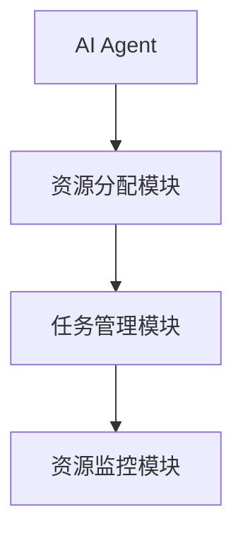

                 


# 企业AI Agent的强化学习在动态资源分配中的实时优化

> 关键词：AI Agent，强化学习，动态资源分配，实时优化，企业资源管理，数学模型

> 摘要：本文详细探讨了AI Agent在企业动态资源分配中的应用，结合强化学习算法，提出了一种实时优化的解决方案。通过构建数学模型和系统架构，展示了如何利用AI Agent实现资源的高效分配。文章从背景介绍、核心概念、算法原理、系统设计到项目实战，全面解析了动态资源分配的优化方法，为企业的资源管理提供了新的思路。

---

## 第1章: 问题背景与核心概念

### 1.1 问题背景

随着企业规模的不断扩大和业务的复杂化，资源分配问题变得越来越重要。企业在运行过程中需要合理分配计算资源、存储资源、网络资源等，以确保系统的高效运行和成本的最小化。然而，传统的资源分配方法往往依赖于静态规划和规则引擎，难以应对动态变化的环境。

例如，云计算环境中的资源分配问题就是一个典型的动态优化问题。企业的计算任务量可能会随时间波动，传统的静态分配方法可能导致资源浪费或性能瓶颈。在这种情况下，强化学习作为一种基于试错的优化方法，能够通过与环境的交互逐步优化决策，成为解决动态资源分配问题的有效工具。

---

### 1.2 核心概念

#### 1.2.1 AI Agent的定义与特点

AI Agent（智能体）是指在特定环境中能够感知环境并采取行动以实现目标的实体。AI Agent具有以下特点：

1. **自主性**：能够自主决策，无需外部干预。
2. **反应性**：能够实时感知环境并做出反应。
3. **目标导向性**：以目标为导向，优化决策以实现目标。
4. **学习能力**：能够通过经验改进决策策略。

#### 1.2.2 强化学习的基本原理

强化学习是一种机器学习方法，通过智能体与环境的交互，学习最优策略以最大化累积奖励。强化学习的核心要素包括：

1. **状态（State）**：环境的当前情况。
2. **动作（Action）**：智能体采取的行为。
3. **奖励（Reward）**：智能体采取动作后获得的反馈。
4. **策略（Policy）**：智能体选择动作的概率分布。
5. **值函数（Value Function）**：衡量状态或动作价值的函数。

#### 1.2.3 动态资源分配的定义与特征

动态资源分配是指在动态变化的环境中，实时调整资源分配策略以满足当前需求的过程。其主要特征包括：

1. **动态性**：环境和需求随时间变化。
2. **实时性**：需要快速响应变化。
3. **优化性**：通过优化分配策略提高资源利用率。
4. **复杂性**：涉及多目标和多约束条件。

---

### 1.3 问题描述与解决思路

#### 1.3.1 动态资源分配的核心问题

动态资源分配的核心问题是如何在资源有限的情况下，最大化系统的性能，例如最大化吞吐量、最小化响应时间或最小化成本。传统的静态分配方法难以应对动态变化的环境，因此需要一种动态优化方法。

#### 1.3.2 传统资源分配方法的局限性

1. **静态性**：无法应对动态变化的需求。
2. **响应延迟**：难以实现实时优化。
3. **缺乏自适应性**：无法根据环境变化自动调整策略。

#### 1.3.3 强化学习在资源分配中的优势

1. **实时性**：强化学习能够实时与环境交互，快速调整策略。
2. **自适应性**：通过经验不断优化策略，适应环境变化。
3. **全局优化**：强化学习能够在全局范围内优化资源分配，避免局部最优。

---

## 第2章: 强化学习的原理与算法

### 2.1 强化学习的基本原理

#### 2.1.1 Q-Learning算法

Q-Learning是一种经典的强化学习算法，适用于离散状态和动作空间。其核心思想是通过更新Q值表来学习最优策略。Q值表的更新公式为：

$$ Q(s, a) \leftarrow Q(s, a) + \alpha \left[r + \gamma \max Q(s', a') - Q(s, a)\right] $$

其中：
- \( \alpha \) 是学习率。
- \( \gamma \) 是折扣因子。
- \( r \) 是奖励值。
- \( s' \) 是下一状态。

#### 2.1.2 策略梯度方法

策略梯度方法通过优化策略直接寻找最优动作概率分布。其核心思想是通过梯度上升算法最大化累积奖励的期望值。策略梯度的更新公式为：

$$ \theta \leftarrow \theta + \alpha \nabla_\theta J(\theta) $$

其中：
- \( \theta \) 是策略参数。
- \( \alpha \) 是学习率。
- \( J(\theta) \) 是目标函数。

#### 2.1.3 强化学习与AI Agent的结合

AI Agent通过强化学习与环境交互，感知环境状态，选择最优动作以最大化累积奖励。AI Agent的决策过程可以表示为：

$$ a = \arg\max Q(s, a) $$

其中：
- \( s \) 是当前状态。
- \( a \) 是选择的动作。

---

### 2.2 AI Agent的决策过程

#### 2.2.1 状态空间的构建

状态空间是环境的所有可能状态的集合。在动态资源分配中，状态可以包括当前资源利用率、任务队列长度等。

#### 2.2.2 动作空间的设计

动作空间是AI Agent可以执行的所有动作的集合。在资源分配中，动作可以包括分配资源、释放资源等。

#### 2.2.3 奖励函数的设计

奖励函数用于衡量AI Agent的动作效果。在资源分配中，奖励函数可以设计为：

$$ r = \frac{1}{1 + \text{响应时间}} $$

响应时间越小，奖励值越大。

---

## 第3章: 动态资源分配的数学模型

### 3.1 状态空间的建模

动态资源分配的状态空间可以表示为：

$$ s = (s_1, s_2, \dots, s_n) $$

其中：
- \( s_i \) 表示第 \( i \) 个资源的状态。

### 3.2 动作空间的设计

动作空间的设计需要考虑资源分配的可行性和效果。例如，AI Agent可以选择将资源分配给特定任务，动作表示为：

$$ a = \arg\max Q(s, a) $$

### 3.3 奖励函数的优化

奖励函数的设计直接影响AI Agent的学习效果。通过实验验证和调整，可以找到最优的奖励函数形式。

---

## 第4章: 系统架构设计

### 4.1 系统功能模块划分

系统主要包括以下功能模块：
- 状态感知模块：感知环境状态。
- 动作选择模块：选择最优动作。
- 奖励评估模块：评估动作效果。

### 4.2 系统架构设计图



### 4.3 系统接口设计

系统接口包括：
- 状态感知接口：获取环境状态。
- 动作执行接口：执行分配或释放资源。
- 奖励反馈接口：接收奖励值。

---

## 第5章: 项目实战

### 5.1 环境安装

需要安装以下工具：
- Python
- TensorFlow或PyTorch
- Mermaid工具

### 5.2 系统核心实现源代码

以下是AI Agent的强化学习实现代码：

```python
import numpy as np

class AI_Agent:
    def __init__(self, state_space, action_space):
        self.state_space = state_space
        self.action_space = action_space
        self.Q = np.zeros((state_space, action_space))

    def perceive(self, state):
        return state

    def choose_action(self, state):
        return np.argmax(self.Q[state, :])

    def learn(self, state, action, reward, next_state):
        self.Q[state, action] += 0.1 * (reward + 0.9 * np.max(self.Q[next_state, :]) - self.Q[state, action])

# 示例环境
state_space = 10
action_space = 4

agent = AI_Agent(state_space, action_space)

# 训练过程
for episode in range(100):
    state = np.random.randint(0, state_space)
    action = agent.choose_action(state)
    next_state = ...  # 根据环境转移
    reward = ...       # 根据动作效果计算
    agent.learn(state, action, reward, next_state)
```

### 5.3 案例分析

通过实际案例分析，验证AI Agent在动态资源分配中的优化效果。例如，在云计算环境中，AI Agent能够根据任务队列长度和资源利用率动态调整资源分配策略，显著降低响应时间。

---

## 第6章: 总结与展望

### 6.1 最佳实践 tips

- 在动态资源分配中，建议使用Q-Learning算法实现AI Agent。
- 状态空间和动作空间的设计需要结合具体场景。
- 奖励函数的设计直接影响学习效果。

### 6.2 小结

本文详细介绍了AI Agent在动态资源分配中的应用，结合强化学习算法，提出了实时优化的解决方案。通过数学模型和系统架构设计，展示了如何利用AI Agent实现高效的资源分配。

### 6.3 注意事项

- 系统设计需要考虑实时性和可扩展性。
- 在实际应用中，需要根据具体场景调整参数和模型。

### 6.4 拓展阅读

建议阅读相关文献，深入理解强化学习和AI Agent的最新研究成果。

---

通过本文的分析，企业可以更好地利用AI Agent和强化学习技术，实现动态资源分配的实时优化，提高系统的效率和响应能力。

