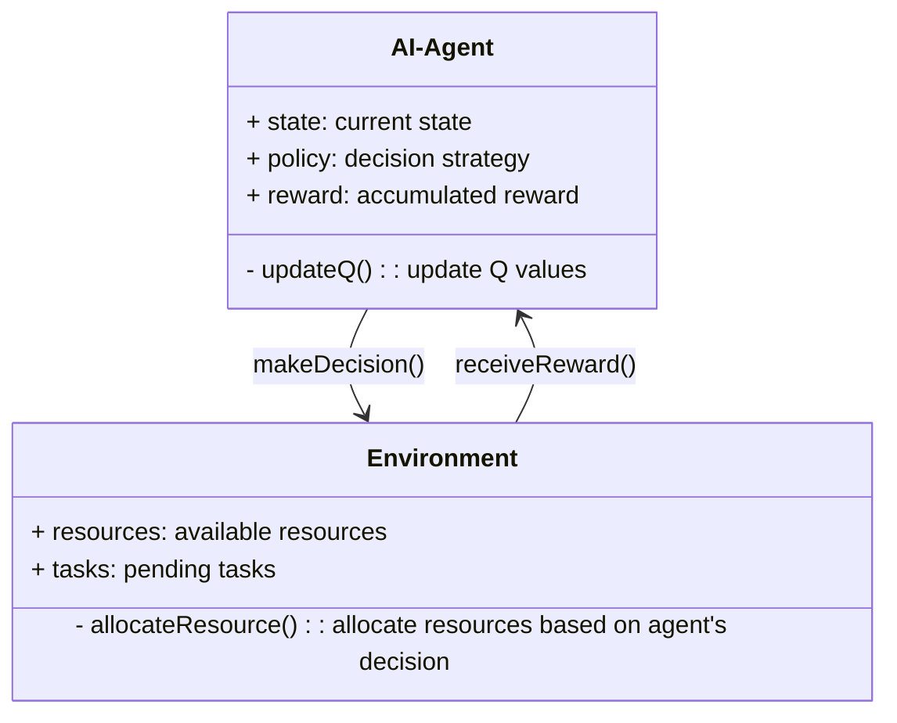

                 


# 企业AI Agent的强化学习在动态资源分配中的应用

## 关键词：AI Agent，强化学习，动态资源分配，企业应用，算法优化

## 摘要：  
本文深入探讨了企业AI Agent利用强化学习技术在动态资源分配中的应用。通过分析强化学习的核心概念、算法原理、系统架构以及实际案例，详细阐述了AI Agent如何通过强化学习实现动态资源分配的智能化决策。文章结合数学模型和实际代码示例，帮助读者全面理解强化学习在企业资源分配中的优势和实现方法。

---

## 第一章: 强化学习与AI Agent概述

### 1.1 强化学习的基本概念  
强化学习是一种机器学习范式，通过智能体与环境的交互，学习最优策略以最大化累计奖励。其核心在于通过试错过程优化决策，适用于动态、复杂的环境。  

**AI Agent的定义与分类**  
AI Agent是指能够感知环境、做出决策并执行动作的智能体。根据智能体的决策方式，可以分为基于规则的Agent和基于学习的Agent。  

**动态资源分配的背景与挑战**  
动态资源分配问题涉及在资源需求变化的环境中，高效分配计算资源、网络资源等，以满足企业业务需求。传统的静态分配方法难以应对动态变化的挑战，而强化学习的动态适应性为解决这一问题提供了新的思路。

---

## 第二章: 强化学习的核心概念与数学模型

### 2.1 强化学习的基本原理  
强化学习的核心要素包括状态（State）、动作（Action）、奖励（Reward）和策略（Policy）。通过不断试错，智能体学习最优策略以最大化累计奖励。  

**状态与动作的定义**  
在动态资源分配中，状态可以表示当前资源使用情况，动作可以表示资源分配决策（如分配多少计算资源给某个任务）。  

**奖励函数的设计**  
奖励函数用于衡量智能体的决策效果。例如，可以设计奖励函数为资源利用率越高，奖励越大。  

### 2.2 动态资源分配的强化学习建模  
**状态空间的构建**  
状态空间包括当前任务需求、资源使用情况等。  

**动作空间的设计**  
动作空间包括分配资源、释放资源等操作。  

**奖励函数的定义**  
奖励函数需要平衡资源利用率和任务完成时间，以避免资源过度分配或不足。

### 2.3 强化学习的数学模型  
**Q-learning算法的数学模型**  
$$ Q(s,a) = Q(s,a) + \alpha [r + \gamma \max Q(s',a') - Q(s,a)] $$  
其中，$Q(s,a)$表示状态$s$下动作$a$的Q值，$\alpha$为学习率，$\gamma$为折扣因子。  

**策略梯度方法的数学模型**  
$$ \nabla \theta J(\theta) = \mathbb{E}[ \nabla \log \pi(a|s) Q(s,a) ] $$  
其中，$\pi(a|s)$为策略函数，$Q(s,a)$为价值函数。

---

## 第三章: 动态资源分配的强化学习算法

### 3.1 基于Q-learning的资源分配算法  
**Q-learning算法的实现步骤**  
1. 初始化Q表为零。  
2. 在每个时间步，根据当前状态选择动作。  
3. 执行动作，观察新的状态和奖励。  
4. 更新Q表：$$ Q(s,a) = Q(s,a) + \alpha [r + \gamma \max Q(s',a') - Q(s,a)] $$  

**算法的收敛性分析**  
Q-learning算法在离散状态和动作空间下具有收敛性，但在动态环境中需要结合经验回放等技术以加速收敛。

### 3.2 基于深度强化学习的资源分配算法  
**Deep Q-Networks (DQN) 的原理**  
DQN通过神经网络近似Q值函数，适用于高维状态空间。  

**算法的改进与优化**  
引入经验回放和目标网络，减少样本偏差和加快收敛速度。  

**算法的代码实现**  
```python
import numpy as np
import gym

class DQN:
    def __init__(self, state_space, action_space, lr=0.01, gamma=0.99):
        self.state_space = state_space
        self.action_space = action_space
        self.lr = lr
        self.gamma = gamma
        # 初始化神经网络
        self.model = ...
```

---

## 第四章: 系统分析与架构设计方案

### 4.1 问题场景介绍  
企业资源分配问题通常涉及多个任务的竞争资源需求，动态变化的环境使得传统规则难以应对。  

### 4.2 系统功能设计  
**系统功能设计（领域模型）**  


### 4.3 系统架构设计  
**系统架构设计（架构图）**  
```mermaid
graph TD
    Agent --> Environment: interact
    Environment --> Agent: provide feedback
    Agent --> Database: store Q values
```

### 4.4 系统接口设计  
系统接口包括AI Agent与环境的交互接口，以及资源分配接口。

---

## 第五章: 项目实战

### 5.1 环境安装  
需要安装强化学习框架（如TensorFlow、Keras）和资源管理库（如OpenAI Gym）。  

### 5.2 系统核心实现源代码  
```python
def allocate_resources(agent, environment):
    while True:
        state = environment.get_state()
        action = agent.choose_action(state)
        next_state, reward = environment.step(action)
        agent.updateQ(state, action, reward, next_state)
```

### 5.3 代码应用解读与分析  
通过代码实现强化学习算法，训练AI Agent在动态资源分配中的决策能力。

### 5.4 实际案例分析  
以云计算资源分配为例，分析AI Agent如何通过强化学习优化资源利用率。

---

## 第六章: 总结与展望

### 6.1 本章总结  
本文详细介绍了强化学习在动态资源分配中的应用，通过数学模型和算法实现，展示了AI Agent在企业资源管理中的潜力。

### 6.2 未来展望  
未来研究可以结合多智能体协同、自适应算法优化等方向，进一步提升强化学习在资源分配中的效果。

### 6.3 最佳实践 tips  
- 在实际应用中，建议结合企业具体需求调整奖励函数设计。  
- 注意处理动态环境中的不确定性，采用经验回放等技术增强算法鲁棒性。  

---

通过以上内容，本文系统地介绍了企业AI Agent的强化学习在动态资源分配中的应用，为读者提供了理论与实践结合的深度分析。

