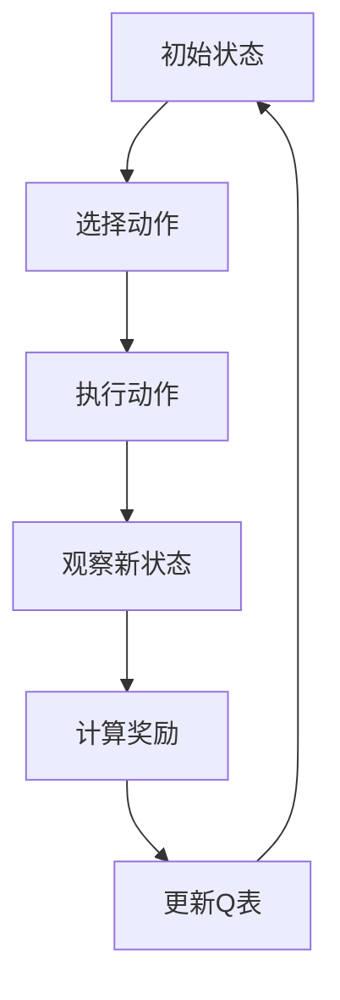
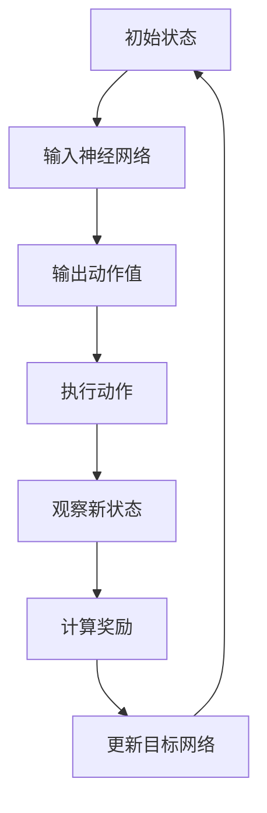
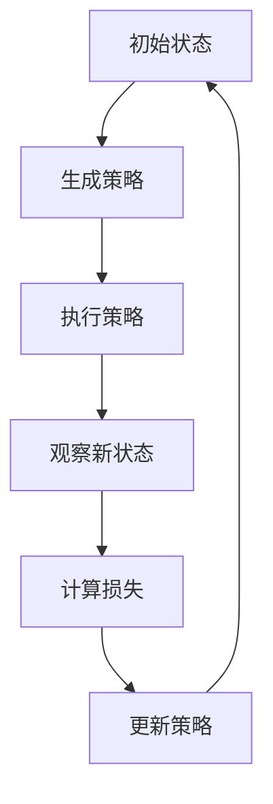
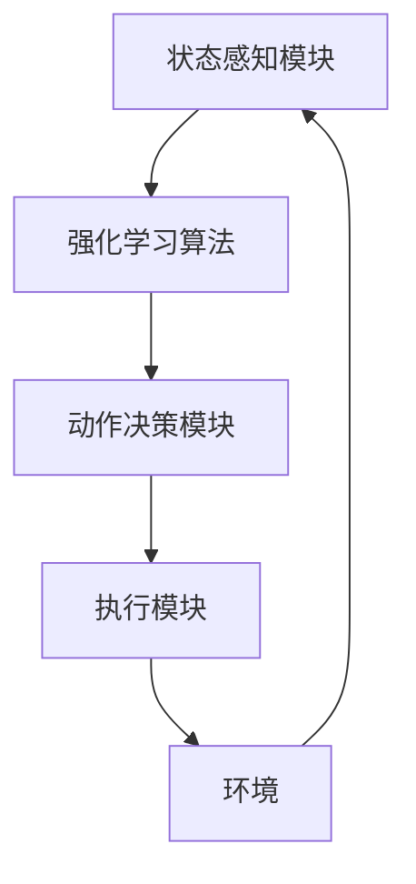
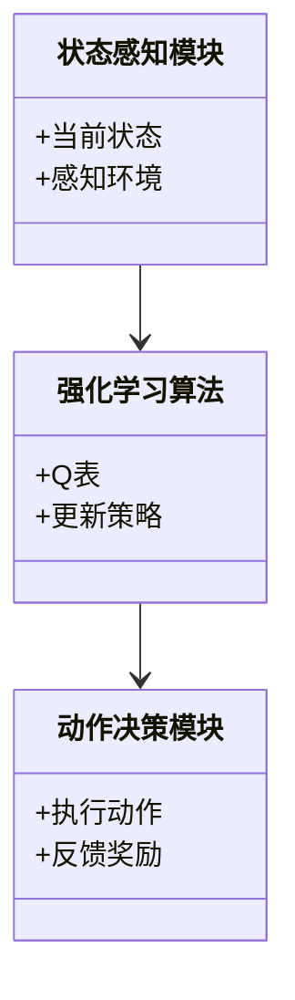

                 


# 企业AI Agent的强化学习在复杂决策场景中的实践

> 关键词：AI Agent, 强化学习, 复杂决策场景, 企业应用, 系统架构设计, 算法实现

> 摘要：本文深入探讨了企业AI Agent在复杂决策场景中的应用，结合强化学习的核心算法，分析了AI Agent的设计原理、系统架构、算法实现及实际案例。文章从理论到实践，详细阐述了如何通过强化学习优化企业决策过程，帮助读者理解并应用这一技术。

---

## 第1章: 企业AI Agent与强化学习概述

### 1.1 企业AI Agent的基本概念

#### 1.1.1 什么是AI Agent
AI Agent（人工智能代理）是指能够感知环境、自主决策并执行任务的智能体。企业AI Agent通常用于优化企业内部流程、提升决策效率，例如供应链管理、资源分配和风险控制。

#### 1.1.2 AI Agent的核心特点
- **自主性**：AI Agent能够独立决策，无需人工干预。
- **反应性**：能够实时感知环境变化并调整行为。
- **目标导向**：基于目标函数优化决策。
- **学习能力**：通过机器学习算法提升决策质量。

#### 1.1.3 企业AI Agent的应用场景
- **供应链优化**：通过预测需求和优化库存。
- **风险管理**：识别潜在风险并制定应对策略。
- **资源分配**：优化人力、资金等资源的分配。

### 1.2 强化学习的基本概念

#### 1.2.1 强化学习的定义
强化学习是一种机器学习范式，通过智能体与环境的交互，学习最优策略以最大化累积奖励。

#### 1.2.2 强化学习的核心要素
- **状态（State）**：环境的当前情况。
- **动作（Action）**：智能体的行为。
- **奖励（Reward）**：对智能体行为的反馈。
- **策略（Policy）**：决策规则，定义在给定状态下选择动作的概率分布。
- **值函数（Value Function）**：评估某状态下策略的期望收益。

#### 1.2.3 强化学习与监督学习的区别
| 对比维度 | 监督学习 | 强化学习 |
|----------|----------|----------|
| 数据来源 | 标签数据 | 环境反馈 |
| 反馈机制 | 单步反馈 | 延时反馈 |
| 决策空间 | 确定性 | 概率性 |

### 1.3 企业AI Agent与强化学习的结合

#### 1.3.1 AI Agent在企业中的作用
- **自动化决策**：通过强化学习优化决策过程。
- **动态适应**：实时调整策略应对环境变化。
- **提高效率**：通过优化资源配置提升企业效率。

#### 1.3.2 强化学习在决策中的应用
- **动态规划问题**：如供应链中的库存优化。
- **多阶段决策**：如金融投资组合管理。
- **博弈论场景**：如市场竞争策略。

#### 1.3.3 企业AI Agent强化学习的挑战与机遇
- **挑战**：复杂环境下的决策不确定性、大规模状态空间。
- **机遇**：通过强化学习实现更高效的资源分配和决策优化。

## 1.4 本章小结
本章介绍了企业AI Agent的基本概念、强化学习的核心要素，以及两者的结合方式。通过对比强化学习与监督学习，明确了强化学习在企业决策中的独特优势。

---

## 第2章: 强化学习的算法原理

### 2.1 强化学习的基本算法

#### 2.1.1 Q-learning算法

##### 算法流程


##### 核心公式
$$ Q(s, a) = Q(s, a) + \alpha (r + \gamma \max Q(s', a') - Q(s, a)) $$

#### 2.1.2 Deep Q-Network (DQN)算法

##### 算法流程


##### 核心公式
$$ Q(s, a) = \arg \max_a Q_{\theta}(s, a) $$

#### 2.1.3 Policy Gradient方法

##### 算法流程


##### 核心公式
$$ J(\theta) = \mathbb{E}_{s,a} [\log \pi(a|s,\theta) Q(s,a)] $$

### 2.2 强化学习的核心概念

#### 2.2.1 状态空间与动作空间
- **状态空间**：所有可能的状态集合。
- **动作空间**：所有可能的动作集合。

#### 2.2.2 奖励函数的设计
- **设计原则**：奖励函数应明确引导智能体向目标方向发展。
- **示例**：在供应链管理中，奖励可以是成本降低的金额。

#### 2.2.3 策略与价值函数
- **策略函数**：将状态映射到动作的概率分布。
- **价值函数**：评估某状态下策略的期望收益。

### 2.3 强化学习的数学模型

#### 2.3.1 Q-learning的数学公式
$$ Q(s, a) = (1-\alpha) Q(s, a) + \alpha (r + \gamma Q(s', a')) $$

#### 2.3.2 DQN算法的数学推导
$$ Q_{\text{target}}(s', a') = \gamma Q_{\text{target}}(s', a') + r $$

#### 2.3.3 策略梯度法的数学模型
$$ \nabla J(\theta) = \mathbb{E}_{s,a} [\nabla \log \pi(a|s,\theta) Q(s,a)] $$

### 2.4 本章小结
本章详细讲解了强化学习的核心算法，包括Q-learning、DQN和策略梯度法，并通过公式和流程图展示了其数学模型和算法流程。

---

## 第3章: 企业AI Agent的系统架构设计

### 3.1 企业AI Agent的架构概述

#### 3.1.1 分层架构设计
- **感知层**：处理环境反馈。
- **决策层**：执行强化学习算法。
- **执行层**：执行决策动作。

#### 3.1.2 模块化设计原则
- **模块独立性**：各模块功能明确，便于维护。
- **松耦合设计**：模块之间依赖性低，便于扩展。

#### 3.1.3 高可用性与容错设计
- **冗余设计**：关键模块冗余部署。
- **故障恢复**：自动检测并恢复故障。

### 3.2 系统功能设计

#### 3.2.1 状态感知模块
- **功能**：感知环境状态。
- **实现**：通过传感器或API获取数据。

#### 3.2.2 动作决策模块
- **功能**：基于强化学习算法生成决策。
- **实现**：调用训练好的模型进行推理。

#### 3.2.3 奖励机制模块
- **功能**：计算并反馈奖励。
- **实现**：根据预设规则生成奖励信号。

### 3.3 系统架构图

#### 3.3.1 系统架构的Mermaid图


#### 3.3.2 模块之间的交互关系
- **状态感知模块**：向强化学习算法传递当前状态。
- **强化学习算法**：根据状态生成决策。
- **动作决策模块**：执行决策并反馈结果。
- **执行模块**：与环境交互，更新状态。

### 3.4 本章小结
本章详细设计了企业AI Agent的系统架构，包括分层架构、模块化设计和系统功能模块，并通过Mermaid图展示了各模块的交互关系。

---

## 第4章: 企业AI Agent的强化学习实践

### 4.1 项目背景与目标

#### 4.1.1 项目背景介绍
- **行业**：金融行业。
- **场景**：优化投资组合管理。

#### 4.1.2 项目目标设定
- **目标**：通过强化学习优化投资组合，提高收益并降低风险。

#### 4.1.3 项目范围界定
- **范围**：股票和债券的投资组合优化。

### 4.2 系统功能设计

#### 4.2.1 领域模型的Mermaid类图


#### 4.2.2 功能模块的设计细节
- **状态感知模块**：获取市场数据。
- **强化学习算法**：基于市场数据更新Q表。
- **动作决策模块**：根据Q表生成投资决策。

#### 4.2.3 功能模块之间的交互关系
- **数据流**：市场数据 → 状态感知模块 → 强化学习算法 → 动作决策模块。
- **反馈机制**：投资结果 → 动作决策模块 → 状态感知模块。

### 4.3 系统架构设计

#### 4.3.1 系统架构的Mermaid架构图


#### 4.3.2 模块之间的依赖关系
- **状态感知模块**：依赖环境数据接口。
- **强化学习算法**：依赖训练数据和模型。
- **动作决策模块**：依赖执行接口。

### 4.4 本章小结
本章通过实际案例展示了企业AI Agent的强化学习实践，包括系统功能设计和架构设计，并通过Mermaid图展示了系统的交互关系。

---

## 第5章: 项目实战

### 5.1 环境安装

#### 5.1.1 安装Python环境
- **工具**：使用Anaconda或虚拟环境。
- **依赖**：安装TensorFlow、Keras、OpenAI Gym等库。

#### 5.1.2 安装强化学习库
- **库**：安装 Gym、TensorFlow、numpy等。

### 5.2 系统核心实现源代码

#### 5.2.1 Q-learning算法实现
```python
import numpy as np
import gym

class QLAgent:
    def __init__(self, env):
        self.env = env
        self.Q = np.zeros((env.observation_space.n, env.action_space.n))
    
    def act(self, state):
        return np.argmax(self.Q[state, :])
    
    def update(self, state, action, reward, next_state):
        alpha = 0.1
        gamma = 0.9
        self.Q[state, action] += alpha * (reward + gamma * np.max(self.Q[next_state, :]) - self.Q[state, action])

env = gym.make('FrozenLake-v1')
agent = QLAgent(env)
```

#### 5.2.2 DQN算法实现
```python
import tensorflow as tf
from tensorflow.keras import layers

class DQNetwork:
    def __init__(self, state_space, action_space):
        self.model = self.create_model(state_space, action_space)
    
    def create_model(self, state_space, action_space):
        model = tf.keras.Sequential([
            layers.Dense(32, activation='relu', input_shape=(state_space,)),
            layers.Dense(32, activation='relu'),
            layers.Dense(action_space, activation='linear')
        ])
        model.compile(optimizer=tf.keras.optimizers.Adam(learning_rate=0.001), loss='mse')
        return model
```

### 5.3 代码应用解读与分析

#### 5.3.1 Q-learning代码解读
- **初始化**：创建Q表，初始化为零。
- **act方法**：选择具有最大Q值的动作。
- **update方法**：更新Q表，基于当前状态、动作、奖励和下一步状态。

#### 5.3.2 DQN代码解读
- **DQNetwork类**：定义深度Q网络模型。
- **create_model方法**：构建神经网络模型。
- **编译模型**：使用Adam优化器和均方误差损失函数。

### 5.4 实际案例分析和详细讲解

#### 5.4.1 案例介绍
- **场景**：优化投资组合管理。
- **数据集**：使用历史股票数据。

#### 5.4.2 案例分析
- **训练过程**：通过强化学习算法优化投资组合。
- **结果展示**：比较强化学习与传统方法的收益和风险。

### 5.5 本章小结
本章通过实际案例展示了企业AI Agent的强化学习实践，包括环境安装、代码实现和案例分析，帮助读者理解如何将强化学习应用于实际场景。

---

## 第6章: 数学模型与公式解析

### 6.1 强化学习的数学模型

#### 6.1.1 Q-learning的数学公式
$$ Q(s, a) = Q(s, a) + \alpha (r + \gamma \max Q(s', a') - Q(s, a)) $$

#### 6.1.2 DQN的数学模型
$$ Q_{\text{target}}(s', a') = \gamma Q_{\text{target}}(s', a') + r $$

#### 6.1.3 策略梯度法的数学公式
$$ J(\theta) = \mathbb{E}_{s,a} [\log \pi(a|s,\theta) Q(s,a)] $$

### 6.2 数学公式详细解析

#### 6.2.1 Q-learning公式解析
- **α**：学习率，控制更新步长。
- **γ**：折扣因子，平衡当前奖励和未来奖励。

#### 6.2.2 DQN公式解析
- **Q_target**：目标网络，用于稳定训练。
- **r**：即时奖励。

#### 6.2.3 策略梯度公式解析
- **π(a|s,θ)**：策略函数，输出动作的概率。
- **Q(s,a)**：价值函数，评估状态-动作对的值。

### 6.3 数学公式与实际应用结合
- **Q-learning**：适用于离散动作空间。
- **DQN**：适用于连续动作空间。
- **策略梯度法**：适用于高维状态空间。

### 6.4 本章小结
本章详细解析了强化学习的核心数学公式，并结合实际应用进行了分析，帮助读者理解公式背后的含义。

---

## 第7章: 系统架构与接口设计

### 7.1 系统架构设计

#### 7.1.1 系统架构概述
- **分层架构**：感知层、决策层、执行层。
- **模块化设计**：各模块独立，便于维护。

#### 7.1.2 系统架构图


### 7.2 系统接口设计

#### 7.2.1 状态感知接口
- **输入**：当前状态。
- **输出**：环境数据。

#### 7.2.2 动作决策接口
- **输入**：状态和动作。
- **输出**：决策结果。

#### 7.2.3 奖励机制接口
- **输入**：动作和结果。
- **输出**：奖励值。

### 7.3 系统交互流程
- **流程**：感知环境 → 生成决策 → 执行动作 → 获取反馈 → 更新模型。

### 7.4 本章小结
本章详细设计了系统架构和接口，通过Mermaid图展示了系统的交互流程。

---

## 第8章: 项目实战与代码实现

### 8.1 项目实战

#### 8.1.1 环境安装
- **工具**：安装Python和必要的库。

#### 8.1.2 系统核心实现源代码
- **Q-learning实现**：感知环境、生成决策、执行动作、更新模型。
- **DQN实现**：构建神经网络、训练模型、执行策略。

### 8.2 代码应用解读与分析
- **Q-learning代码**：通过不断更新Q表实现强化学习。
- **DQN代码**：通过神经网络近似Q值函数。

### 8.3 实际案例分析和详细讲解
- **案例**：投资组合优化。
- **结果展示**：对比传统方法和强化学习方法的收益和风险。

### 8.4 本章小结
本章通过实际案例展示了强化学习在企业AI Agent中的应用，详细解读了代码实现和项目实战。

---

## 第9章: 总结与展望

### 9.1 总结
- **核心内容**：企业AI Agent的强化学习实践。
- **主要收获**：理解强化学习算法、系统架构设计、项目实战。

### 9.2 展望
- **未来研究方向**：多智能体强化学习、复杂环境下的决策优化。
- **技术发展趋势**：强化学习在企业中的广泛应用。

### 9.3 最佳实践 Tips
- **数据质量**：确保数据准确性和完整性。
- **模型优化**：通过超参数调优提升性能。
- **系统维护**：定期更新模型，适应环境变化。

### 9.4 本章小结
本章总结了全文内容，并展望了未来的研究方向和技术发展趋势，同时给出了最佳实践建议。

---

## 结束语

企业AI Agent的强化学习在复杂决策场景中的应用是一个充满潜力的领域，通过不断的研究和实践，我们可以进一步优化企业的决策过程，提高效率和竞争力。希望本文能够为读者提供有价值的参考和启发。

