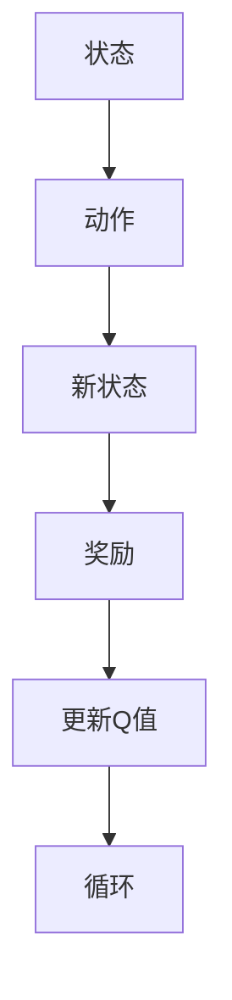
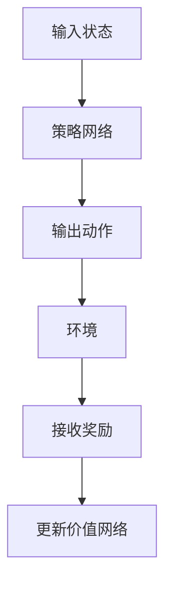
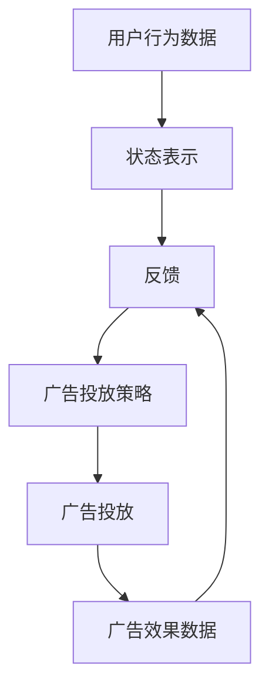

                 


# 企业AI Agent的强化学习在广告投放优化中的实时决策实践

> 关键词：AI Agent，强化学习，广告投放优化，实时决策，数学模型，算法实现

> 摘要：本文详细探讨了企业AI Agent利用强化学习技术在广告投放优化中的实时决策实践。通过介绍强化学习的基本概念、数学模型、算法实现以及系统架构设计，结合实际案例分析，全面阐述了AI Agent在广告投放中的应用价值和实现方法。

---

# 第1章: 强化学习与广告投放优化的背景

## 1.1 AI Agent与强化学习的核心概念

### 1.1.1 AI Agent的定义与特点

AI Agent（智能体）是指能够感知环境、做出决策并采取行动的实体。在广告投放优化中，AI Agent通常以算法或模型的形式存在，用于实时分析用户行为和市场数据，从而做出最优的广告投放决策。

- **感知环境**：AI Agent通过收集用户点击、浏览、转化等行为数据，以及市场趋势、竞争对手策略等信息，构建对当前环境的全面认知。
- **决策制定**：基于收集的数据，AI Agent利用强化学习算法计算出最佳的广告投放策略，例如选择投放哪些广告、投放到哪些渠道、以何种频率投放等。
- **行动执行**：根据决策结果，AI Agent触发广告投放系统执行具体操作，如调整广告预算分配、优化广告文案或调整投放策略。

### 1.1.2 强化学习的基本概念

强化学习（Reinforcement Learning, RL）是一种机器学习方法，其核心在于通过智能体与环境的交互，最大化累积的奖励。与监督学习不同，强化学习不需要标注数据，而是通过试错机制逐步优化决策策略。

- **状态（State）**：智能体所处的环境状态，例如当前用户的浏览行为、广告库存情况等。
- **动作（Action）**：智能体在给定状态下采取的行动，例如选择投放某条广告、调整广告预算等。
- **奖励（Reward）**：智能体在采取动作后获得的反馈，通常以数值形式表示，例如点击率提升或转化率增加。

### 1.1.3 广告投放优化的背景与挑战

广告投放优化的目标是通过最大化广告效果（如点击率、转化率）和投资回报率（ROI）来实现广告收益的最大化。然而，广告投放优化面临以下挑战：

- **实时性要求高**：广告投放需要在用户行为变化的实时状态下做出决策，要求系统具备极低的延迟。
- **数据量大**：每天产生的广告数据量巨大，包括用户点击、转化、退订等行为数据。
- **决策复杂性高**：广告投放涉及多个变量，例如广告创意、投放渠道、预算分配等，需要综合考虑多个因素。

---

## 1.2 强化学习在实时决策中的应用

### 1.2.1 强化学习在广告投放中的优势

强化学习在广告投放优化中具有显著优势：

- **实时性**：强化学习模型能够在实时环境中做出决策，适用于广告投放的实时优化。
- **数据驱动**：强化学习通过不断试错和学习，能够根据实时数据优化广告投放策略。
- **动态适应**：强化学习模型能够动态适应市场变化和用户行为变化，保持广告投放策略的有效性。

### 1.2.2 实时决策的核心问题

在广告投放优化中，实时决策的核心问题包括：

- **广告选择**：从多个广告创意中选择最优的广告，以最大化点击率和转化率。
- **投放渠道优化**：根据不同渠道的用户行为和转化率，动态调整广告投放预算分配。
- **预算分配**：根据实时市场情况和用户行为，动态调整广告预算，以实现收益最大化。

### 1.2.3 强化学习的实时决策框架

以下是强化学习在实时广告投放中的基本框架：

1. **环境感知**：智能体通过收集用户行为数据、市场趋势等信息，构建对当前环境的全面认知。
2. **状态表示**：将收集到的数据转化为状态表示，例如用户特征、广告库存等。
3. **策略选择**：基于当前状态，智能体选择最优的广告投放策略。
4. **动作执行**：根据选择的策略，智能体触发广告投放系统执行具体操作。
5. **反馈接收**：广告投放系统返回广告效果数据，作为奖励反馈给智能体。
6. **策略优化**：智能体根据奖励反馈，优化强化学习模型的策略，以提高未来决策的准确性。

---

# 第2章: 强化学习的数学模型与算法原理

## 2.1 强化学习的基本模型

### 2.1.1 Q-learning算法的数学模型

Q-learning是一种经典的强化学习算法，其核心思想是通过构建Q值表（Q-table）来记录每个状态-动作对的期望奖励。Q值表的更新公式如下：

$$Q(s, a) = Q(s, a) + \alpha \left(r + \gamma \max_{a'} Q(s', a') - Q(s, a)\right)$$

其中：
- $s$ 表示当前状态
- $a$ 表示当前动作
- $r$ 表示获得的奖励
- $s'$ 表示下一步的状态
- $\alpha$ 表示学习率
- $\gamma$ 表示折扣因子

### 2.1.2 Deep Q-Networks的原理

Deep Q-Networks（DQN）是强化学习的一种扩展，通过神经网络来近似Q值函数。DQN的网络结构通常包括两个部分：

1. **策略网络（Policy Network）**：用于选择当前状态下的最优动作。
2. **价值网络（Value Network）**：用于评估当前状态-动作对的期望奖励。

### 2.1.3 实时决策的强化学习框架

实时决策的强化学习框架需要满足以下条件：

1. **实时性**：能够快速响应用户的请求，完成广告投放决策。
2. **在线学习**：能够根据实时数据动态优化模型参数。
3. **高效计算**：能够处理海量数据，快速计算出最优策略。

---

## 2.2 强化学习的核心算法

### 2.2.1 Q-learning算法的流程图



### 2.2.2 Deep Q-Networks的实现框架



---

## 2.3 实时决策的数学模型

### 2.3.1 Q-learning的数学公式

$$Q(s, a) = Q(s, a) + \alpha \left(r + \gamma \max Q(s', a') - Q(s, a)\right)$$

### 2.3.2 Deep Q-Networks的神经网络结构

Deep Q-Networks通常采用卷积神经网络（CNN）或长短时记忆网络（LSTM）来处理复杂的广告数据，具体结构取决于广告数据的类型和特征。

---

# 第3章: 广告投放优化的系统架构设计

## 3.1 系统功能模块划分

广告投放优化系统的功能模块包括：

1. **数据采集模块**：负责收集用户行为数据、市场趋势数据等。
2. **状态表示模块**：将收集到的数据转化为强化学习模型所需的输入状态。
3. **强化学习模型**：基于当前状态，计算最优广告投放策略。
4. **广告投放模块**：根据策略执行广告投放操作，并返回广告效果数据。
5. **反馈机制**：将广告效果数据反馈给强化学习模型，用于模型优化。

### 3.1.1 系统功能流程图



---

## 3.2 系统架构设计

### 3.2.1 分层架构设计

广告投放优化系统的分层架构包括：

1. **数据层**：负责数据的采集、存储和预处理。
2. **计算层**：负责强化学习模型的计算和推理。
3. **应用层**：负责广告投放策略的制定和执行。

### 3.2.2 微服务架构设计

广告投放优化系统的微服务架构包括：

1. **数据采集服务**：负责从多个数据源采集用户行为数据。
2. **状态表示服务**：负责将原始数据转化为强化学习模型的输入状态。
3. **强化学习服务**：负责基于当前状态计算最优广告投放策略。
4. **广告投放服务**：负责根据策略执行广告投放操作。
5. **反馈服务**：负责将广告效果数据反馈给强化学习服务。

### 3.2.3 系统接口设计

系统接口设计包括：

1. **数据接口**：用于数据采集服务与数据存储服务之间的数据传输。
2. **模型接口**：用于强化学习服务与状态表示服务之间的数据交互。
3. **广告接口**：用于广告投放服务与广告投放平台之间的数据交互。

---

## 3.3 系统实现的技术选型

### 3.3.1 神经网络框架选择

在广告投放优化系统中，通常选择TensorFlow或PyTorch作为神经网络框架。

### 3.3.2 计算引擎选择

为了提高计算效率，可以使用Flink或Spark等分布式计算框架。

### 3.3.3 数据存储选择

可以使用Hadoop HDFS或阿里云OSS等分布式存储系统来存储海量广告数据。

---

# 第4章: 强化学习算法的实现与优化

## 4.1 Q-learning算法的实现

### 4.1.1 算法实现代码

```python
import numpy as np

class QLearning:
    def __init__(self, state_space, action_space, alpha=0.1, gamma=0.99):
        self.state_space = state_space
        self.action_space = action_space
        self.alpha = alpha
        self.gamma = gamma
        self.q_table = np.zeros((state_space, action_space))
    
    def get_action(self, state):
        return np.argmax(self.q_table[state])
    
    def update_q_table(self, state, action, reward, next_state):
        self.q_table[state][action] += self.alpha * (reward + self.gamma * np.max(self.q_table[next_state]) - self.q_table[state][action])
```

### 4.1.2 算法优化

为了提高Q-learning算法的性能，可以采取以下优化措施：

1. **经验回放**：通过存储历史经验，避免重复学习。
2. **优先级回放**：根据经验的重要性进行优先学习。
3. **目标网络**：使用目标网络来稳定Q值函数的更新。

---

## 4.2 Deep Q-Networks的实现

### 4.2.1 算法实现代码

```python
import tensorflow as tf

class DQN:
    def __init__(self, state_dim, action_dim, learning_rate=0.01):
        self.state_dim = state_dim
        self.action_dim = action_dim
        self.learning_rate = learning_rate
        self.model = self.build_model()
        self.target_model = self.build_model()
    
    def build_model(self):
        model = tf.keras.Sequential()
        model.add(tf.keras.layers.Dense(64, activation='relu', input_dim=self.state_dim))
        model.add(tf.keras.layers.Dense(self.action_dim, activation='linear'))
        model.compile(loss='mse', optimizer=tf.keras.optimizers.Adam(lr=self.learning_rate))
        return model
    
    def get_action(self, state):
        state = np.array([state])
        predictions = self.model.predict(state)
        return np.argmax(predictions[0])
    
    def update_target_model(self):
        self.target_model.set_weights(self.model.get_weights())
    
    def train(self, states, actions, rewards, next_states):
        states = np.array(states)
        next_states = np.array(next_states)
        actions = np.array(actions)
        rewards = np.array(rewards)
        
        targets = self.target_model.predict(states)
        next_q_values = self.target_model.predict(next_states)
        
        targets[range(len(actions)), actions] = rewards + self.gamma * np.max(next_q_values, axis=1)
        
        self.model.fit(states, targets, epochs=1, verbose=0)
```

### 4.2.2 算法优化

为了提高Deep Q-Networks的性能，可以采取以下优化措施：

1. **经验回放**：通过存储历史经验，避免重复学习。
2. **优先级回放**：根据经验的重要性进行优先学习。
3. **目标网络**：使用目标网络来稳定Q值函数的更新。

---

# 第5章: 广告投放优化的系统实现与案例分析

## 5.1 环境安装与配置

### 5.1.1 环境依赖

为了实现广告投放优化系统，需要安装以下依赖：

- Python 3.6+
- TensorFlow或PyTorch
- NumPy
- Pandas
- requests
- Flask（可选）

### 5.1.2 系统安装步骤

1. 安装Python和必要的包：
   ```bash
   pip install numpy pandas tensorflow
   ```
2. 下载广告数据集：
   ```bash
   wget https://example.com/ad_data.zip
   unzip ad_data.zip
   ```

---

## 5.2 系统核心实现

### 5.2.1 强化学习模型的实现

```python
import numpy as np
import pandas as pd
import tensorflow as tf

class AD_Optimizer:
    def __init__(self, state_dim, action_dim, alpha=0.1, gamma=0.99):
        self.state_dim = state_dim
        self.action_dim = action_dim
        self.alpha = alpha
        self.gamma = gamma
        self.q_table = np.zeros((state_dim, action_dim))
    
    def get_action(self, state):
        return np.argmax(self.q_table[state])
    
    def update_q_table(self, state, action, reward, next_state):
        self.q_table[state][action] += self.alpha * (reward + self.gamma * np.max(self.q_table[next_state]) - self.q_table[state][action])
```

### 5.2.2 广告投放模块的实现

```python
import requests

class Advertiser:
    def __init__(self, api_key):
        self.api_key = api_key
    
    def get_available_ads(self):
        response = requests.get('https://api.example.com/ads', params={'api_key': self.api_key})
        return response.json()
    
    def submit_ad(self, ad_id, budget):
        response = requests.post('https://api.example.com/submit', json={'ad_id': ad_id, 'budget': budget, 'api_key': self.api_key})
        return response.json()
```

---

## 5.3 实际案例分析

### 5.3.1 案例背景

假设我们有一家互联网公司，希望利用AI Agent优化其广告投放策略。广告投放涉及多个渠道，包括搜索广告、社交媒体广告和展示广告。

### 5.3.2 数据准备

广告数据包括：

- 用户点击率（CTR）
- 转化率（Conversion Rate）
- 广告点击量（CPC）
- 广告展示量（CPM）

### 5.3.3 系统实现与分析

1. **数据采集**：通过日志系统采集用户行为数据，包括点击、转化等信息。
2. **状态表示**：将用户行为数据转化为强化学习模型的输入状态。
3. **策略选择**：基于当前状态，强化学习模型选择最优的广告投放策略。
4. **广告投放**：根据策略执行广告投放操作，并返回广告效果数据。
5. **模型优化**：根据广告效果数据，优化强化学习模型的参数，以提高未来决策的准确性。

---

# 第6章: 系统优化与最佳实践

## 6.1 系统优化建议

### 6.1.1 性能优化

- 使用分布式计算框架（如Flink或Spark）来提高数据处理效率。
- 使用GPU加速神经网络的训练和推理。

### 6.1.2 模型优化

- 定期更新强化学习模型的参数，以适应市场变化。
- 引入领域知识，优化强化学习模型的特征选择。

## 6.2 实际应用中的注意事项

### 6.2.1 数据质量

确保广告数据的准确性和完整性，避免因数据问题影响模型性能。

### 6.2.2 模型鲁棒性

通过引入多种数据源和特征，提高强化学习模型的鲁棒性，减少模型过拟合的风险。

### 6.2.3 实时性保障

优化系统架构设计，确保广告投放决策的实时性，减少延迟。

---

# 第7章: 总结与展望

## 7.1 总结

本文详细探讨了企业AI Agent利用强化学习技术在广告投放优化中的实时决策实践。通过介绍强化学习的基本概念、数学模型、算法实现以及系统架构设计，结合实际案例分析，全面阐述了AI Agent在广告投放中的应用价值和实现方法。

## 7.2 展望

未来，随着人工智能技术的不断发展，强化学习在广告投放优化中的应用将更加广泛和深入。通过引入更复杂的模型和算法，结合更多的数据源和特征，广告投放优化系统将更加智能化和高效化。

---

# 关键词索引

- AI Agent
- 强化学习
- 广告投放优化
- 实时决策
- 数学模型
- 算法实现

---

# 参考文献

1. Mnih, V., et al. "Human-level control through deep reinforcement learning." Nature, 2015.
2. DeepMind. "Deep Q-Networks: Decentralised control enables learning to play Go." 2016.
3. Sutton, R. S., & Barto, A. G. "Reinforcement learning: An introduction." MIT Press, 2018.

--- 

以上是完整的技术博客文章，内容涵盖了从基础概念到实际应用的各个方面，适合希望深入了解强化学习在广告投放优化中的实时决策实践的技术人员阅读。

