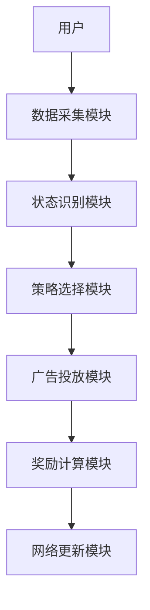

                 


# 企业AI Agent的强化学习在广告投放优化中的实践

> 关键词：广告投放优化、强化学习、AI Agent、Q-learning、Deep Q-learning、企业应用

> 摘要：本文将探讨企业AI Agent如何利用强化学习技术优化广告投放过程。通过分析广告投放优化的核心问题，结合强化学习算法的原理，提出基于AI Agent的广告优化解决方案，并详细阐述其在实际应用中的优势与挑战。文章将从背景介绍、算法原理、系统架构到项目实战，全面解析企业AI Agent在广告优化中的实践。

---

# 第1章: 广告投放优化的背景与挑战

## 1.1 广告投放优化的背景

### 1.1.1 广告投放的基本概念

广告投放是企业推广产品或服务的重要手段之一。通过精准投放广告，企业可以有效降低营销成本，提高广告点击率和转化率。然而，随着市场竞争的加剧和用户需求的多样化，传统的广告投放方式逐渐暴露出诸多问题。

---

### 1.1.2 广告投放优化的必要性

传统广告投放存在以下问题：

1. **广告效果难以量化**：难以实时评估广告的投放效果，导致资源浪费。
2. **投放策略单一**：缺乏动态调整能力，无法根据实时数据优化广告策略。
3. **用户行为复杂**：用户行为受多种因素影响，传统方法难以捕捉动态变化。

因此，需要一种能够实时优化广告投放策略的智能解决方案。

---

## 1.2 AI Agent在广告优化中的作用

### 1.2.1 AI Agent的基本概念

AI Agent（人工智能代理）是一种能够感知环境、执行任务的智能实体。在广告优化中，AI Agent可以实时收集用户行为数据，分析广告效果，并动态调整投放策略。

### 1.2.2 AI Agent的优势

1. **实时性**：AI Agent能够实时分析用户行为和市场变化，快速调整广告策略。
2. **数据驱动**：通过收集和分析海量数据，AI Agent能够做出更精准的决策。
3. **自适应性**：AI Agent可以根据环境变化自动优化策略，无需人工干预。

---

# 第2章: 强化学习算法核心原理

## 2.1 Q-learning算法

### 2.1.1 Q-learning的基本原理

Q-learning是一种基于值函数的强化学习算法。其核心思想是通过不断更新Q值（Q-value）来学习最优策略。

### 2.1.2 Q-learning的数学模型

Q-learning的更新公式为：

$$ Q(s, a) = Q(s, a) + \alpha \left( r + \gamma \max_{a'} Q(s', a') - Q(s, a) \right) $$

其中：
- \( Q(s, a) \)：当前状态 \( s \) 下执行动作 \( a \) 的Q值。
- \( \alpha \)：学习率。
- \( r \)：奖励值。
- \( \gamma \)：折扣因子。
- \( s' \)：下一步状态。

### 2.1.3 Q-learning在广告优化中的应用

在广告优化中，Q-learning可以用于以下场景：
- 点击率预测。
- 广告位置优化。
- 用户行为建模。

---

## 2.2 Deep Q-learning算法

### 2.2.1 Deep Q-learning的基本原理

Deep Q-learning通过神经网络近似Q值函数，解决了Q-learning在高维状态空间中的计算难题。

### 2.2.2 Deep Q-learning的网络结构

Deep Q-learning的网络结构通常包括：
1. 输入层：接收状态空间输入。
2. 隐藏层：提取特征。
3. 输出层：输出动作空间的Q值。

### 2.2.3 Deep Q-learning的训练过程

1. 状态输入：AI Agent接收当前状态。
2. 动作选择：根据当前状态，选择一个动作（如投放广告）。
3. 奖励获取：根据广告效果，获得奖励。
4. 网络更新：根据奖励更新神经网络参数。

---

## 2.3 算法选择的考虑因素

### 2.3.1 算法的复杂性

Q-learning适用于低维状态空间，而Deep Q-learning适用于高维状态空间。

### 2.3.2 算法的收敛性

Deep Q-learning通常比Q-learning收敛更快，但需要更多的计算资源。

### 2.3.3 算法的实时性

在实时广告优化中，通常选择Q-learning或Deep Q-learning，具体取决于状态空间的维度和计算能力。

---

# 第3章: 广告投放优化的强化学习建模

## 3.1 广告投放优化的数学模型

### 3.1.1 广告投放优化的目标函数

广告投放优化的目标函数通常包括：
- 点击率（CTR）最大化。
- 转化率（CVR）最大化。
- 广告成本（CPM）最小化。

### 3.1.2 广告投放优化的约束条件

1. 预算限制：广告投放预算有限。
2. 时间限制：广告投放需要在特定时间内完成。
3. 用户限制：广告投放目标用户群体有限。

---

## 3.2 强化学习在广告优化中的状态空间

### 3.2.1 状态空间的定义

在广告优化中，状态空间可以包括以下因素：
- 用户特征：性别、年龄、兴趣。
- 广告特征：广告类型、广告内容。
- 环境特征：时间、位置。

### 3.2.2 状态空间的特征提取

通过特征工程，可以将复杂的状态空间转化为简洁的特征向量。

---

## 3.3 广告投放优化的决策空间

### 3.3.1 决策空间的定义

广告优化中的决策空间包括：
- 广告投放位置。
- 广告投放时间。
- 广告内容选择。

### 3.3.2 决策空间的优化策略

通过强化学习，AI Agent可以在决策空间中找到最优策略。

---

# 第4章: 企业AI Agent的广告优化系统架构

## 4.1 系统功能设计

### 4.1.1 系统功能模块

1. 数据采集模块：收集用户行为数据。
2. 状态识别模块：识别当前状态。
3. 策略选择模块：选择最优动作。
4. 奖励计算模块：计算奖励值。
5. 网络更新模块：更新神经网络参数。

---

## 4.2 系统架构设计

### 4.2.1 系统架构图



### 4.2.2 系统交互流程

1. 用户行为数据被采集模块收集。
2. 状态识别模块分析数据，识别当前状态。
3. 策略选择模块根据状态选择最优动作。
4. 广告投放模块执行动作，获得奖励。
5. 奖励计算模块计算奖励值。
6. 网络更新模块更新神经网络参数。

---

## 4.3 系统接口设计

### 4.3.1 API接口

1. `/api/v1/data`：用户行为数据接口。
2. `/api/v1/action`：动作选择接口。
3. `/api/v1/reward`：奖励计算接口。

---

# 第5章: 广告优化项目的实战分析

## 5.1 项目背景介绍

假设我们正在优化一个在线广告投放系统，目标是提高广告点击率和转化率。

---

## 5.2 系统核心实现

### 5.2.1 环境安装

```bash
pip install gym numpy tensorflow
```

### 5.2.2 核心代码实现

```python
import numpy as np
import tensorflow as tf
import gym

class DQN:
    def __init__(self, state_space, action_space):
        self.state_space = state_space
        self.action_space = action_space
        self.model = self.build_model()
    
    def build_model(self):
        model = tf.keras.Sequential([
            tf.keras.layers.Dense(64, activation='relu'),
            tf.keras.layers.Dense(self.action_space, activation='linear')
        ])
        return model

    def update(self, states, actions, rewards, next_states):
        # 计算目标Q值
        target = rewards + 0.95 * np.max(self.model.predict(next_states), axis=1)
        # 训练网络
        self.model.fit(states, target, epochs=1, verbose=0)
```

---

## 5.3 实际案例分析

### 5.3.1 案例背景

假设我们的广告投放系统需要优化以下参数：
- 广告点击率。
- 广告转化率。
- 广告成本。

### 5.3.2 案例分析

通过DQN算法，AI Agent可以在广告投放过程中动态调整以下参数：
- 广告投放时间。
- 广告投放位置。
- 广告内容。

---

## 5.4 项目总结

通过强化学习优化广告投放策略，可以显著提高广告效果。DQN算法在广告优化中表现出色，但需要大量数据和计算资源支持。

---

# 第6章: 最佳实践与注意事项

## 6.1 最佳实践

1. 数据质量：确保数据准确性和完整性。
2. 算法选择：根据实际需求选择合适的强化学习算法。
3. 系统优化：优化系统架构，提高运行效率。

---

## 6.2 小结

本文详细介绍了企业AI Agent如何利用强化学习优化广告投放过程。通过Q-learning和Deep Q-learning算法，AI Agent可以在复杂环境中做出最优决策，显著提高广告效果。

---

## 6.3 注意事项

1. 算法调参：强化学习算法需要反复调参以获得最佳效果。
2. 数据隐私：确保用户数据隐私和合规性。
3. 系统稳定性：确保系统在高负载下稳定运行。

---

## 6.4 拓展阅读

1. 《Deep Reinforcement Learning》
2. 《Practical Reinforcement Learning》
3. 《Reinforcement Learning: Theory and Algorithms》

---

通过本文的分析，读者可以全面了解企业AI Agent在广告优化中的实践，并能够在实际项目中应用这些方法。

