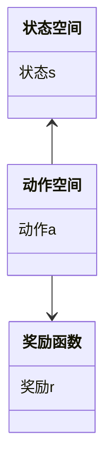
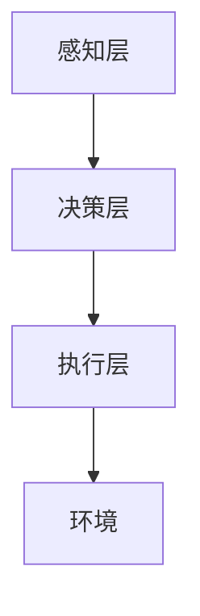

                 


# 企业AI Agent的强化学习在智能制造调度中的应用

## 关键词：AI Agent，强化学习，智能制造，调度优化，算法原理，系统架构，项目实战

## 摘要：本文探讨了AI Agent结合强化学习在智能制造调度中的应用，从背景、概念、算法到系统架构和项目实战，详细分析了强化学习在调度优化中的价值和实现方法。

---

## 第一部分：企业AI Agent的强化学习在智能制造调度中的应用概述

### 第1章：制造业智能化转型与AI Agent的引入

#### 1.1 智能制造的发展背景

随着工业4.0的推进，制造业正经历数字化转型。传统制造业面临效率低下、资源浪费等问题，而智能化转型通过引入AI技术，显著提升了生产效率和产品质量。AI Agent作为智能系统的核心组件，能够实时感知环境并做出决策，成为智能制造的重要工具。

#### 1.2 AI Agent的基本概念

AI Agent是具备感知、决策和执行能力的智能实体。它能够理解环境信息，通过推理制定策略，并执行动作以实现目标。AI Agent在智能制造中的应用涵盖了生产调度、质量控制等多个领域。

#### 1.3 强化学习在智能制造中的应用价值

强化学习是一种通过试错优化策略的机器学习方法。它在调度优化中表现出色，能够处理动态复杂的环境。AI Agent结合强化学习，使系统能够自主学习最优策略，显著提升生产效率。

---

### 第2章：强化学习与AI Agent的核心原理

#### 2.1 强化学习的数学模型与算法原理

强化学习通过状态、动作和奖励的循环更新策略。Q-learning算法通过更新Q值函数，找到最优策略。公式如下：

$$ Q(s,a) = (1-\alpha)Q(s,a) + \alpha[r + \max Q(s',a')] $$

其中，α是学习率，r是奖励。

#### 2.2 AI Agent的强化学习框架设计

AI Agent通过与环境交互，更新策略网络。奖励机制的设计直接影响学习效果，需根据具体问题调整。例如，在调度问题中，奖励可以是完成时间的缩短。

---

### 第3章：系统分析与架构设计

#### 3.1 系统功能设计

智能制造调度系统包括任务分配、资源分配和调度优化功能。领域模型通过Mermaid类图展示各实体关系：



#### 3.2 系统架构设计

系统架构分为感知层、决策层和执行层。感知层收集数据，决策层通过强化学习优化策略，执行层执行动作。整体架构如图：



---

### 第4章：项目实战

#### 4.1 环境安装

安装Python、TensorFlow和OpenAI Gym库：

```bash
pip install numpy tensorflow gym
```

#### 4.2 核心代码实现

实现强化学习算法，训练AI Agent：

```python
import gym
import numpy as np

env = gym.make('FiniteStateMachine-v0')
env.seed(42)
np.random.seed(42)

# 初始化参数
alpha = 0.1
gamma = 0.99
epsilon = 0.1

# 状态空间和动作空间
state_size = env.observation_space.n
action_size = env.action_space.n

# 初始化Q表
Q = np.zeros([state_size, action_size])

# 训练过程
for episode in range(1000):
    state = env.reset()
    done = False
    while not done:
        if np.random.random() < epsilon:
            action = np.random.randint(action_size)
        else:
            action = np.argmax(Q[state])
        
        next_state, reward, done, info = env.step(action)
        
        Q[state][action] = Q[state][action] + alpha * (reward + gamma * np.max(Q[next_state]) - Q[state][action])
        
        state = next_state
```

#### 4.3 实际案例分析

以机器调度为例，AI Agent学习最优调度策略，显著减少生产时间。

---

## 第五部分：最佳实践

### 5.1 小结

本文系统介绍了AI Agent和强化学习在智能制造调度中的应用，详细讲解了算法原理和系统架构。

### 5.2 注意事项

确保奖励机制合理，避免局部最优；实时监控系统性能，及时调整参数。

### 5.3 拓展阅读

推荐学习强化学习经典算法，深入研究多智能体协作在智能制造中的应用。

---

通过以上结构，本文全面探讨了AI Agent结合强化学习在智能制造调度中的应用，为实际应用提供了理论和实践指导。

