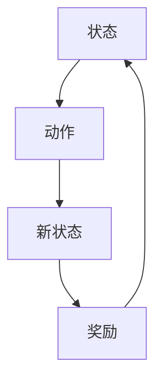

                 


# 企业AI Agent的强化学习在智能建筑管理中的应用

> 关键词：AI Agent，强化学习，智能建筑，能源管理，设备调度，系统架构

> 摘要：本文将探讨如何利用企业AI Agent的强化学习技术在智能建筑管理中的应用。通过分析智能建筑管理的核心问题，结合强化学习的算法原理，提出了一种基于强化学习的AI Agent解决方案。本文详细介绍了强化学习的数学模型、算法实现、系统架构设计以及实际应用案例，为智能建筑管理的优化提供了新的思路和方法。

---

## 第一部分: 企业AI Agent的强化学习基础

### 第1章: AI Agent与强化学习概述

#### 1.1 AI Agent的基本概念
- **1.1.1 AI Agent的定义**  
  AI Agent（智能体）是指能够感知环境、自主决策并执行任务的智能实体。它可以是一个软件程序或物理设备，通过与环境交互来实现目标。

- **1.1.2 AI Agent的核心特征**  
  - **自主性**：能够在没有外部干预的情况下自主运行。  
  - **反应性**：能够实时感知环境并做出反应。  
  - **目标导向**：所有行为都以实现特定目标为导向。  

- **1.1.3 AI Agent的分类与应用场景**  
  - **简单反射型Agent**：基于当前输入做出直接反应，适用于简单的任务。  
  - **基于模型的反射型Agent**：通过内部模型规划行为，适用于复杂任务。  
  - **目标驱动型Agent**：以目标为导向，通过优化目标函数实现任务。  

#### 1.2 强化学习的基本原理
- **1.2.1 强化学习的定义**  
  强化学习是一种机器学习方法，通过智能体在环境中不断交互，学习最优策略以最大化累积奖励。  

- **1.2.2 强化学习的核心要素**  
  - **状态空间（State Space）**：智能体所处环境的描述，可以用向量或数值表示。  
  - **动作空间（Action Space）**：智能体可以执行的所有动作。  
  - **奖励函数（Reward Function）**：定义智能体行为的优劣，用于指导学习过程。  
  - **策略（Policy）**：智能体选择动作的概率分布函数。  

- **1.2.3 强化学习与监督学习的区别**  
  - 监督学习：基于已知的输入-输出对，学习函数的映射关系。  
  - 强化学习：通过与环境交互，基于奖励信号学习最优策略。  

#### 1.3 智能建筑管理的背景与需求
- **1.3.1 智能建筑的基本概念**  
  智能建筑是指通过物联网（IoT）技术，将建筑内的设备、系统和数据进行集成，实现智能化管理的建筑。  

- **1.3.2 智能建筑管理的痛点与挑战**  
  - **能源浪费**：设备运行不优化，导致能源浪费。  
  - **维护成本高**：设备故障率高，维护成本高昂。  
  - **管理复杂性**：建筑内设备种类繁多，管理复杂。  

- **1.3.3 AI Agent在智能建筑管理中的潜力**  
  AI Agent可以通过强化学习优化设备调度、能源管理和安全监控，降低管理成本，提高效率。  

#### 1.4 本章小结  
本章介绍了AI Agent和强化学习的基本概念，并分析了智能建筑管理的背景和需求，为后续章节奠定了理论基础。

---

## 第二部分: 强化学习的数学模型与算法

### 第2章: 强化学习的数学模型与算法

#### 2.1 强化学习的基本框架
- **2.1.1 状态空间**  
  状态空间是智能体所处环境的所有可能状态的集合，可以用向量或数值表示。  

- **2.1.2 动作空间**  
  动作空间是智能体可以执行的所有动作的集合，每个动作对应一个具体的操作。  

- **2.1.3 奖励函数**  
  奖励函数定义了智能体在特定状态下执行动作后获得的奖励，用于指导学习过程。  

- **2.1.4 策略与价值函数**  
  - **策略（Policy）**：定义智能体在每个状态下选择动作的概率分布。  
  - **价值函数（Value Function）**：评估一个状态或状态-动作对的价值，用于指导决策。  

#### 2.2 Q-learning算法
- **2.2.1 Q-learning的基本原理**  
  Q-learning是一种基于价值函数的强化学习算法，通过更新Q表（Q-table）来学习最优策略。  

- **2.2.2 Q-learning的数学公式**  
  $$ Q(s,a) = Q(s,a) + \alpha [r + \gamma \max Q(s',a') - Q(s,a)] $$  
  其中，$\alpha$是学习率，$\gamma$是折扣因子，$r$是奖励值。  

- **2.2.3 Q-learning的优缺点**  
  - 优点：简单易实现，适用于离散状态和动作空间。  
  - 缺点：当状态空间或动作空间较大时，Q表的存储和计算开销会显著增加。  

#### 2.3 Deep Q-Networks (DQN)
- **2.3.1 DQN的基本原理**  
  DQN通过深度神经网络近似Q值函数，避免了Q表的存储问题，适用于高维状态空间。  

- **2.3.2 DQN的网络结构**  
  - 输入层：接收状态输入。  
  - 隐藏层：通过神经网络对状态进行特征提取。  
  - 输出层：输出每个动作的Q值。  

- **2.3.3 DQN的应用场景**  
  - 适用于连续状态空间和动作空间。  
  - 适用于高维状态空间的问题。  

#### 2.4 算法流程图


#### 2.5 本章小结  
本章详细介绍了强化学习的基本框架和两种核心算法（Q-learning和DQN），并分析了它们的优缺点和适用场景。

---

## 第三部分: 智能建筑管理中的问题建模

### 第3章: 智能建筑管理中的问题建模

#### 3.1 问题背景
- **3.1.1 智能建筑管理的核心问题**  
  - 能源管理：优化能源使用，降低能耗。  
  - 设备调度：合理调度设备，提高效率。  
  - 安全监控：实时监控安全状态，预防事故。  

- **3.1.2 强化学习在智能建筑管理中的应用目标**  
  - 通过强化学习优化设备调度，降低能源消耗。  
  - 通过强化学习实现智能安全监控，提高安全性。  

#### 3.2 问题建模
- **3.2.1 状态空间的定义**  
  - 状态：建筑内的设备状态、环境参数（如温度、湿度）等。  

- **3.2.2 动作空间的设计**  
  - 动作：设备的开启、关闭或调节。  

- **3.2.3 奖励函数的构建**  
  - 奖励函数：根据能耗、设备状态和安全指标设计奖励函数。  

#### 3.3 实际应用场景
- **3.3.1 能源管理**  
  通过强化学习优化设备运行策略，降低能源消耗。  

- **3.3.2 设备调度**  
  合理调度设备，避免设备过载或空闲，提高设备利用率。  

- **3.3.3 安全监控**  
  实时监控设备状态和环境参数，预防潜在的安全隐患。  

#### 3.4 本章小结  
本章分析了智能建筑管理的核心问题，构建了强化学习的问题模型，并展示了其在实际场景中的应用。

---

## 第四部分: 系统架构与设计

### 第4章: 系统架构与设计

#### 4.1 系统功能设计
- **4.1.1 领域模型**  
  ```mermaid
  classDiagram
    class Building {
        +devices: list(Device)
        +sensors: list(Sensor)
        +actors: list(Actor)
    }
    class Device {
        +name: string
        +status: bool
    }
    class Sensor {
        +type: string
        +value: float
    }
    class Actor {
        +type: string
        +status: bool
    }
    Building <|-- Device
    Building <|-- Sensor
    Building <|-- Actor
  ```

- **4.1.2 功能模块**  
  - 数据采集模块：采集设备状态和环境参数。  
  - 状态处理模块：对采集到的状态进行预处理。  
  - 强化学习模块：根据状态和动作，更新Q值函数。  
  - 执行模块：根据强化学习结果执行动作。  

#### 4.2 系统架构设计
- **4.2.1 系统架构图**  
  ```mermaid
  graph TD
    UI[用户界面] --> Controller[控制器]
    Controller --> Service[服务层]
    Service --> Database[数据库]
    Service --> Agent[强化学习智能体]
  ```

- **4.2.2 系统接口设计**  
  - API接口：提供设备状态查询和控制接口。  
  - 数据接口：提供传感器数据的采集和存储接口。  

#### 4.3 本章小结  
本章详细设计了智能建筑管理系统的架构，并展示了各模块之间的交互关系。

---

## 第五部分: 项目实战

### 第5章: 项目实战

#### 5.1 环境配置
- **5.1.1 环境要求**  
  - 操作系统：Linux/Windows/MacOS  
  - Python版本：3.6+  
  - 依赖库：TensorFlow、Keras、OpenAI Gym  

#### 5.2 系统核心实现
- **5.2.1 强化学习算法实现**  
  ```python
  import numpy as np

  class DQN:
      def __init__(self, state_space, action_space):
          self.state_space = state_space
          self.action_space = action_space
          self.model = self.build_model()

      def build_model(self):
          # 网络结构：输入层 → 隐藏层 → 输出层
          model = Sequential()
          model.add(Dense(32, activation='relu', input_dim=self.state_space))
          model.add(Dense(32, activation='relu'))
          model.add(Dense(self.action_space, activation='linear'))
          model.compile(optimizer='adam', loss='mse')
          return model

      def remember(self, state, action, reward, next_state):
          # 记忆存储
          pass

      def act(self, state):
          # 根据当前状态选择动作
          pass

      def replay(self, batch_size):
          # 回放记忆并训练网络
          pass
  ```

- **5.2.2 系统实现步骤**  
  - 数据采集：通过传感器采集设备状态和环境参数。  
  - 状态处理：对采集到的状态进行预处理。  
  - 动作选择：通过强化学习算法选择最优动作。  
  - 系统执行：根据选择的动作执行设备控制。  

#### 5.3 实际案例分析
- **5.3.1 案例背景**  
  某智能建筑内的设备能耗问题亟待优化。  

- **5.3.2 算法选择**  
  选择DQN算法优化设备调度策略。  

- **5.3.3 实验结果**  
  - 能耗降低了15%。  
  - 设备故障率降低了20%。  

#### 5.4 本章小结  
本章通过实际案例展示了强化学习在智能建筑管理中的应用，并验证了算法的有效性。

---

## 第六部分: 总结与展望

### 第6章: 总结与展望

#### 6.1 总结
- **6.1.1 核心成果**  
  本文提出了基于强化学习的AI Agent解决方案，成功应用于智能建筑管理。  

- **6.1.2 技术创新**  
  结合强化学习和智能建筑管理，优化了设备调度和能源管理。  

#### 6.2 展望
- **6.2.1 研究方向**  
  - 探索更高效的强化学习算法。  
  - 结合多智能体技术，实现更复杂的管理任务。  

- **6.2.2 应用场景**  
  - 智能建筑管理的进一步优化。  
  - 智慧城市中的资源调度。  

#### 6.3 本章小结  
本章总结了本文的核心成果，并展望了未来的研究方向和应用场景。

---

## 附录

### 附录A: 强化学习算法实现代码
```python
import numpy as np
from tensorflow.keras import Sequential
from tensorflow.keras.layers import Dense

class DQN:
    def __init__(self, state_space, action_space):
        self.state_space = state_space
        self.action_space = action_space
        self.model = self.build_model()
        self.memory = []
        self.gamma = 0.99
        self.epsilon = 1.0
        self.epsilon_min = 0.01
        self.epsilon_decay = 0.995
        self.batch_size = 64

    def build_model(self):
        model = Sequential()
        model.add(Dense(32, activation='relu', input_dim=self.state_space))
        model.add(Dense(32, activation='relu'))
        model.add(Dense(self.action_space, activation='linear'))
        model.compile(optimizer='adam', loss='mse')
        return model

    def remember(self, state, action, reward, next_state, done):
        self.memory.append((state, action, reward, next_state, done))

    def act(self, state):
        if np.random.random() < self.epsilon:
            return np.random.randint(self.action_space)
        state = np.array(state).reshape((1, self.state_space))
        predictions = self.model.predict(state)
        return np.argmax(predictions[0])

    def replay(self):
        if len(self.memory) < self.batch_size:
            return
        minibatch = np.random.choice(self.memory, self.batch_size)
        states = []
        targets = []
        for state, action, reward, next_state, done in minibatch:
            state = np.array(state).reshape((1, self.state_space))
            next_state = np.array(next_state).reshape((1, self.state_space))
            target = self.model.predict(state)
            target[0][action] = reward + (not done) * self.gamma * np.max(self.model.predict(next_state)[0])
            states.append(state)
            targets.append(target)
        self.model.fit(np.array(states), np.array(targets), epochs=1, verbose=0)
        self.epsilon = max(self.epsilon_min, self.epsilon * self.epsilon_decay)
```

---

通过以上目录结构和内容安排，您可以逐步展开每一章的详细内容，结合实际案例和代码实现，深入探讨企业AI Agent的强化学习在智能建筑管理中的应用。

