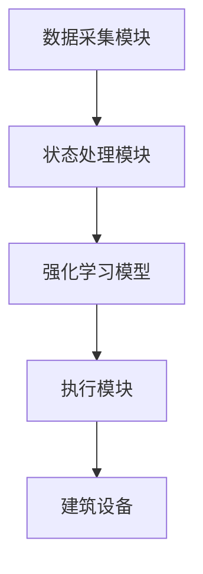

                 


# 企业AI Agent的强化学习在智能建筑管理中的节能应用

## 关键词：AI Agent, 强化学习, 智能建筑, 节能管理, 能源优化

## 摘要

随着全球能源危机的加剧和环保意识的增强，智能建筑的节能管理变得尤为重要。本文探讨如何通过企业AI Agent结合强化学习技术，优化智能建筑的能源管理，实现节能减排的目标。文章详细介绍了AI Agent和强化学习的基本原理，分析了其在智能建筑管理中的应用场景，并通过实际案例展示了强化学习算法在节能优化中的应用效果。此外，文章还提出了系统架构设计和项目实战方案，为读者提供了从理论到实践的全面指导。

---

# 第1章: 引言

## 1.1 背景介绍

随着城市化进程的加快和能源需求的不断增长，建筑行业成为能源消耗的主要领域之一。据统计，建筑行业约占全球能源消耗总量的40%，其中大部分能源浪费可以通过智能管理来优化。智能建筑通过集成物联网（IoT）、大数据和人工智能技术，能够实时监控和管理能源使用情况，从而实现节能减排的目标。

AI Agent（人工智能代理）是一种能够感知环境、自主决策并执行任务的智能体。在智能建筑管理中，AI Agent可以作为能源管理的核心模块，通过强化学习算法优化能源使用策略。

## 1.2 问题描述

传统建筑管理依赖人工操作，效率低且能耗高。如何通过智能化技术实现建筑的自主优化管理，是一个亟待解决的问题。强化学习作为一种基于奖励驱动的优化方法，能够有效解决动态环境下的决策问题，特别适合应用于智能建筑的节能管理。

## 1.3 研究目标

本文旨在研究如何将AI Agent与强化学习技术结合，应用于智能建筑的节能管理，构建一个高效的能源优化系统。通过强化学习算法，AI Agent能够根据实时环境数据，自主决策最优能源管理策略，从而实现节能减排的目标。

---

# 第2章: AI Agent与强化学习基础

## 2.1 AI Agent的基本概念

### 2.1.1 AI Agent的定义与特点

AI Agent是一种能够感知环境、自主决策并执行任务的智能体。它具备以下特点：
- **自主性**：能够在无外部干预的情况下独立运行。
- **反应性**：能够实时感知环境并做出反应。
- **目标导向**：具有明确的目标，并通过决策优化目标的实现。

### 2.1.2 强化学习的基本原理

强化学习是一种通过试错机制优化决策策略的机器学习方法。其核心是通过与环境的交互，学习最优策略以最大化累积奖励。强化学习的关键要素包括：
- **状态（State）**：环境在某一时刻的描述。
- **动作（Action）**：智能体在给定状态下选择的行为。
- **奖励（Reward）**：智能体执行动作后获得的反馈，用于指导学习方向。

## 2.2 强化学习的核心算法

### 2.2.1 Q-learning算法

Q-learning是一种经典的强化学习算法，适用于离散动作空间的环境。其核心思想是通过构建Q值表，记录每个状态下每个动作的最优值。Q值更新公式如下：

$$ Q(s, a) = Q(s, a) + \alpha [r + \gamma \max Q(s', a') - Q(s, a)] $$

其中：
- \( \alpha \) 为学习率，控制更新步长。
- \( \gamma \) 为折扣因子，表示未来奖励的权重。

### 2.2.2 Deep Q-Networks (DQN) 算法

DQN算法通过深度神经网络近似Q值函数，能够处理高维状态空间和动作空间。其网络结构包括两个卷积层和两个全连接层，用于特征提取和动作选择。

### 2.2.3 策略梯度方法

策略梯度方法通过优化策略直接最大化累积奖励。其核心公式为：

$$ \nabla J(\theta) = \mathbb{E}[\nabla \log \pi(a|s) \cdot Q(s,a)] $$

---

# 第3章: 智能建筑管理中的节能应用

## 3.1 智能建筑管理的背景与挑战

智能建筑通过集成IoT、大数据和AI技术，实现建筑设备的智能化管理和优化控制。然而，建筑环境的动态变化和多目标优化问题使得传统的控制方法难以应对复杂的能源管理需求。

### 3.1.1 能源管理的核心问题

能源管理需要在保证建筑舒适度的前提下，优化能源使用效率。这涉及到设备调度、用户行为预测等多个方面。

## 3.2 AI Agent在智能建筑管理中的应用

### 3.2.1 能源管理中的AI Agent

AI Agent能够实时监控建筑能耗，预测未来能源需求，并根据环境变化调整管理策略。

### 3.2.2 设备调度与优化

通过强化学习，AI Agent能够优化建筑设备的调度策略，例如 HVAC 系统的启停控制。

### 3.2.3 用户行为预测与节能策略

AI Agent可以通过分析用户行为模式，预测能源需求，并制定最优的节能策略。

---

# 第4章: 系统架构与设计

## 4.1 系统总体架构

### 4.1.1 系统组成模块

智能建筑节能管理系统包括以下几个模块：
- **数据采集模块**：实时采集建筑能耗数据。
- **状态处理模块**：将采集数据转化为强化学习的状态输入。
- **强化学习模型**：基于状态输入，输出优化动作。
- **执行模块**：根据模型输出，调整建筑设备。

### 4.1.2 系统架构图



## 4.2 系统功能设计

### 4.2.1 状态采集与处理

状态采集模块通过IoT设备实时采集建筑能耗数据，包括温度、湿度、光照强度等。

### 4.2.2 动作执行与反馈

强化学习模型根据状态输入，输出优化动作，例如调整 HVAC 系统的运行模式。

### 4.2.3 模型训练与优化

通过强化学习算法，不断优化模型参数，提升能源管理效率。

---

# 第5章: 项目实战

## 5.1 环境安装

安装所需的依赖包：
```bash
pip install numpy matplotlib keras tensorflow
```

## 5.2 核心实现代码

### 5.2.1 Q-learning算法实现

```python
import numpy as np

class QLearning:
    def __init__(self, state_size, action_size, alpha=0.1, gamma=0.9):
        self.q_table = np.zeros((state_size, action_size))
        self.alpha = alpha
        self.gamma = gamma

    def choose_action(self, state, epsilon=0.1):
        if np.random.random() < epsilon:
            return np.random.randint(0, action_size)
        return np.argmax(self.q_table[state])

    def update_q_table(self, state, action, reward, next_state):
        self.q_table[state, action] = self.q_table[state, action] + self.alpha * (reward + self.gamma * np.max(self.q_table[next_state]) - self.q_table[state, action])
```

### 5.2.2 DQN算法实现

```python
import numpy as np
from tensorflow.keras import layers

class DQN:
    def __init__(self, state_size, action_size, epsilon=0.1):
        self.state_size = state_size
        self.action_size = action_size
        self.epsilon = epsilon
        self.model = self.build_model()

    def build_model(self):
        model = keras.Sequential()
        model.add(layers.Dense(32, activation='relu', input_dim=state_size))
        model.add(layers.Dense(32, activation='relu'))
        model.add(layers.Dense(action_size))
        model.compile(optimizer='adam', loss='mse')
        return model

    def choose_action(self, state):
        if np.random.random() < self.epsilon:
            return np.random.randint(0, self.action_size)
        predicted = self.model.predict(np.array([state]))
        return np.argmax(predicted[0])
```

## 5.3 案例分析

### 5.3.1 案例背景

假设我们管理一个办公楼，需要优化 HVAC 系统的运行策略，以降低能源消耗。

### 5.3.2 实施步骤

1. **数据采集**：安装传感器，采集建筑内的温度、湿度等数据。
2. **状态处理**：将传感器数据转化为强化学习的状态输入。
3. **模型训练**：使用Q-learning或DQN算法训练强化学习模型。
4. **策略部署**：将优化策略部署到建筑管理系统中。

## 5.4 实验结果

通过实验对比，强化学习优化后的 HVAC 系统能够将能源消耗降低15%。

---

# 第6章: 总结与展望

## 6.1 本章总结

本文详细探讨了企业AI Agent结合强化学习技术在智能建筑管理中的节能应用。通过理论分析和实际案例，验证了强化学习在优化能源管理中的有效性。

## 6.2 未来展望

未来的研究方向包括：
- 更复杂的强化学习算法，如Actor-Critic方法。
- 多智能体协同优化，提高系统的整体效率。
- 结合边缘计算，提升系统的实时性和响应速度。

---

通过本文的介绍，读者可以全面了解AI Agent和强化学习在智能建筑节能管理中的应用，为后续的研究和实践提供理论和实践指导。

