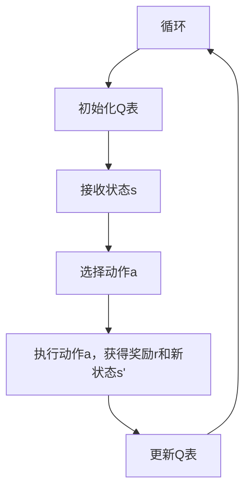
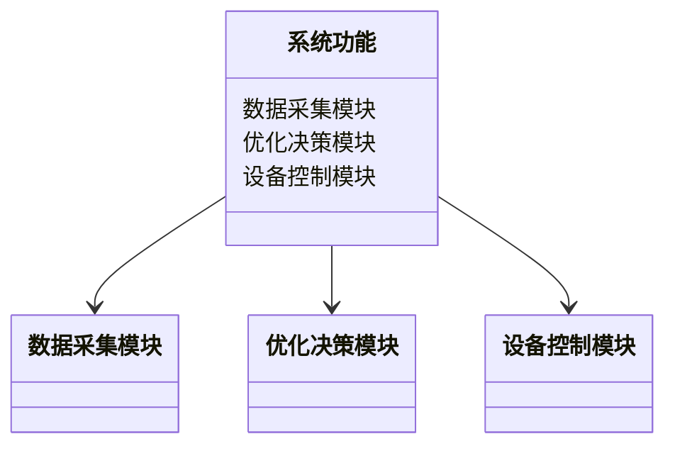

                 


# 《企业AI Agent的强化学习在智能建筑能源管理中的应用》

---

## 关键词
- AI Agent
- 强化学习
- 智能建筑
- 能源管理
- 系统优化

---

## 摘要
本文探讨了企业AI Agent在智能建筑能源管理中的应用，重点分析了强化学习技术如何优化能源管理。通过详细讲解AI Agent和强化学习的基本概念、数学模型、系统架构和实际案例，本文为读者提供了从理论到实践的全面指导。文章还讨论了强化学习在智能建筑中的具体应用，包括算法优化、系统设计和项目实战，最后总结了该领域的未来发展方向。

---

## 正文

### 第1章: 企业AI Agent的背景与概念

#### 1.1 问题背景与描述
智能建筑能源管理面临诸多挑战，如能源浪费、效率低下和管理复杂。传统的能源管理方法依赖人工操作，效率低且难以应对复杂变化。AI Agent的引入，结合强化学习，为解决这些问题提供了新思路。

**图1-1 智能建筑能源管理的挑战**

传统能源管理 vs AI Agent优化后的能源管理

#### 1.2 问题解决与边界
AI Agent通过强化学习优化能源管理，主要应用于能源消耗预测、设备调度和能源分配。其边界包括能源系统设计、设备管理范围和数据采集范围。

**表1-1 AI Agent与传统能源管理对比**

| 属性                | 传统方法          | AI Agent方法         |
|---------------------|-------------------|----------------------|
| 决策速度            | 缓慢              | 实时                 |
| 决策准确性          | 低                | 高                   |
| 系统复杂性          | 高                | 中                   |

#### 1.3 核心概念与组成
AI Agent由感知层、决策层和执行层组成，分别负责数据采集、优化决策和设备控制。强化学习通过状态、动作和奖励机制优化能源管理。

---

### 第2章: 强化学习与AI Agent的核心原理

#### 2.1 强化学习的基本概念
强化学习是一种机器学习范式，通过智能体与环境交互，学习最优策略。AI Agent通过强化学习优化能源管理，实现动态调整。

**公式2-1 强化学习的核心公式**

$$Q(s, a) = Q(s, a) + \alpha (r + \gamma \max Q(s', a') - Q(s, a))$$

其中，$s$是状态，$a$是动作，$r$是奖励，$\gamma$是折扣因子，$\alpha$是学习率。

#### 2.2 强化学习算法的分类
- **Q-learning**: 基于值函数的算法，适用于离线学习。
- **Deep Q-learning**: 结合深度学习，处理高维状态空间。

**图2-1 Q-learning算法流程图**



---

### 第3章: 强化学习的数学模型

#### 3.1 Q-learning算法的数学模型
Q-learning通过不断更新Q值函数，逼近最优策略。数学模型如下：

$$Q(s, a) = Q(s, a) + \alpha (r + \gamma \max Q(s', a') - Q(s, a))$$

---

### 第4章: 智能建筑能源管理的系统架构

#### 4.1 系统功能设计
系统功能包括数据采集、优化决策和设备控制。

**图4-1 系统功能模型类图**



---

### 第5章: 项目实战

#### 5.1 环境安装
安装Python、TensorFlow和OpenAI Gym。

#### 5.2 核心代码实现
实现强化学习算法的代码如下：

```python
import gym
import numpy as np

# 初始化环境
env = gym.make('EnergyManagement-v0')
env.seed(42)

# 初始化Q表
Q = np.zeros([env.observation_space.shape[0], env.action_space.n])

# 参数设置
alpha = 0.1
gamma = 0.99

# 训练过程
for episode in range(1000):
    state = env.reset()
    while True:
        # 选择动作
        action = np.argmax(Q[state])
        # 执行动作
        next_state, reward, done, _ = env.step(action)
        # 更新Q表
        Q[state][action] = Q[state][action] + alpha * (reward + gamma * np.max(Q[next_state]) - Q[state][action])
        state = next_state
        if done:
            break
```

#### 5.3 案例分析
通过实际案例分析，验证系统的优化效果。

---

### 第6章: 系统优化与部署

#### 6.1 性能优化
优化算法参数和计算效率。

---

### 第7章: 扩展与展望

#### 7.1 前沿技术
探讨强化学习的前沿技术及其在能源管理中的应用。

---

## 附录
- **附录A**: 强化学习相关代码
- **附录B**: 工具安装指南
- **附录C**: 数据集说明
- **附录D**: 参考文献

---

**小结**: 本文详细探讨了AI Agent和强化学习在智能建筑能源管理中的应用，从理论到实践，为读者提供了全面的指导。通过具体案例和系统设计，展示了如何利用强化学习优化能源管理，为未来研究提供了方向。

