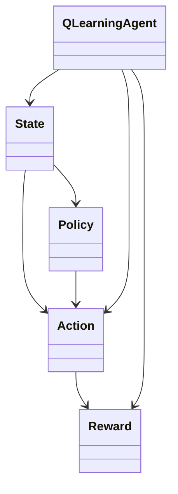
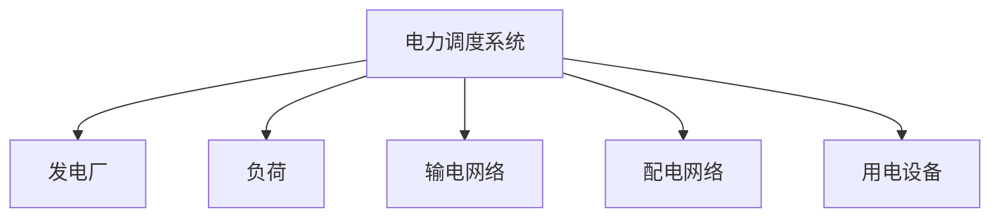
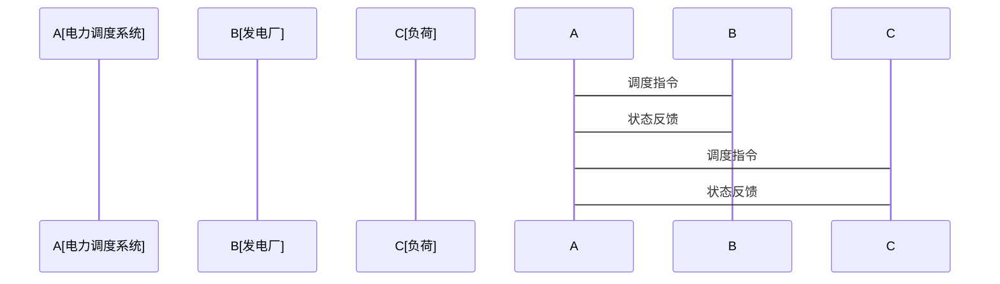

                 


# 《企业AI Agent的强化学习在智能电网管理中的应用》

## 关键词：AI Agent，强化学习，智能电网管理，能源优化，电力调度

## 摘要：  
本文探讨了AI Agent在智能电网管理中的应用，特别是强化学习技术如何优化电力调度和设备管理。文章首先介绍了强化学习的基本概念和AI Agent的核心原理，然后详细分析了强化学习在智能电网管理中的应用场景，包括负荷预测、电力设备调度和网络优化。接着，文章深入讲解了强化学习算法（如Q-learning和DQN）及其在智能电网中的实现，提供了Mermaid流程图和Python代码示例。最后，文章讨论了系统的架构设计和项目实战，展示了如何将强化学习应用于实际电网管理，并提出了最佳实践和注意事项。通过本文，读者可以全面理解AI Agent与强化学习在智能电网管理中的协同作用，及其在能源优化和电力调度中的重要价值。

---

# 第一章：强化学习与智能电网管理概述

## 1.1 强化学习的基本概念

### 1.1.1 强化学习的定义
强化学习（Reinforcement Learning，RL）是一种机器学习范式，通过智能体（Agent）与环境的交互，学习最优策略以最大化累积奖励。与监督学习不同，强化学习不依赖于标记的训练数据，而是通过试错和实时反馈来优化决策。

### 1.1.2 强化学习的核心要素
- **状态（State）**：智能体所处的环境条件，如电力系统的负荷水平。
- **动作（Action）**：智能体采取的行为，如调整电力输出。
- **奖励（Reward）**：环境对智能体行为的反馈，如减少能源消耗可获得正奖励。
- **策略（Policy）**：智能体选择动作的概率分布，目标是最大化累积奖励。

### 1.1.3 强化学习与监督学习的区别
| 特性 | 监督学习 | 强化学习 |
|------|----------|----------|
| 数据 | 标签数据 | 环境反馈 |
| 目标 | 预测/分类 | 最大化奖励 |
| 决策 | 确定性 | 概率性 |

## 1.2 AI Agent在智能电网中的应用背景

### 1.2.1 智能电网的定义与特点
智能电网是一种集成现代信息通信技术的电力系统，能够实时监测、分析和优化电力的生产、传输和消费，以提高效率和可靠性。

### 1.2.2 AI Agent在智能电网管理中的作用
AI Agent能够实时感知电网状态，做出最优决策，如负荷预测和电力调度。

### 1.2.3 当前智能电网管理的挑战
- **动态性**：负荷需求和能源供应的波动。
- **复杂性**：涉及众多设备和参与者。
- **安全性**：网络安全威胁。

## 1.3 强化学习在智能电网管理中的优势

### 1.3.1 强化学习的灵活性与适应性
强化学习能够适应动态变化的电网环境。

### 1.3.2 强化学习在动态环境中的应用
强化学习通过实时反馈优化决策，适用于电网的动态调度。

### 1.3.3 强化学习与智能电网的结合
将强化学习应用于电力调度、设备管理等领域，提升电网效率和稳定性。

---

# 第二章：企业AI Agent的核心概念与原理

## 2.1 AI Agent的基本概念

### 2.1.1 AI Agent的定义
AI Agent是具有感知环境和自主决策能力的智能实体。

### 2.1.2 AI Agent的分类
- **简单反射型**：基于规则的反应。
- **基于模型的反应型**：利用环境模型做出决策。
- **目标驱动型**：以目标为导向。
- **效用驱动型**：基于效用函数优化决策。

### 2.1.3 AI Agent的核心功能
- **感知环境**：收集电网数据。
- **决策制定**：根据数据做出最优决策。
- **执行动作**：通过接口与电网系统交互。

## 2.2 强化学习的基本原理

### 2.2.1 强化学习的基本框架
- **智能体**：学习和决策的主体。
- **环境**：智能体所处的外部系统。
- **动作**：智能体采取的行动。
- **状态**：环境的当前状况。
- **奖励**：对智能体行为的反馈。

### 2.2.2 状态、动作、奖励的定义
- **状态**：如当前电力负荷。
- **动作**：如增加或减少发电量。
- **奖励**：如节省的能源成本。

### 2.2.3 策略与价值函数的解释
- **策略**：决定动作的选择概率。
- **价值函数**：评估状态的价值。

## 2.3 AI Agent与强化学习的关系

### 2.3.1 AI Agent作为强化学习的主体
AI Agent通过强化学习不断优化其决策策略。

### 2.3.2 强化学习驱动AI Agent的行为
强化学习提供实时反馈，指导AI Agent调整其行为。

### 2.3.3 AI Agent与强化学习的协同作用
强化学习帮助AI Agent在动态环境中做出最优决策。

---

# 第三章：智能电网管理中的强化学习应用

## 3.1 智能电网管理的核心问题

### 3.1.1 电力调度与分配
确保电力供应的稳定性和经济性。

### 3.1.2 能源消耗预测
准确预测负荷需求，优化能源分配。

### 3.1.3 网络优化与稳定性
优化电网结构，提高系统稳定性。

## 3.2 强化学习在智能电网管理中的应用场景

### 3.2.1 负荷预测与优化
利用强化学习预测和优化电力负荷。

### 3.2.2 电力设备调度
优化设备启停策略，降低运营成本。

### 3.2.3 网络故障诊断与恢复
快速诊断故障并恢复供电。

## 3.3 强化学习在智能电网中的优势

### 3.3.1 动态环境下的决策优势
强化学习能够快速适应电网的动态变化。

### 3.3.2 复杂系统的优化能力
强化学习能够处理复杂的电网系统优化问题。

### 3.3.3 实时反馈与自适应能力
强化学习通过实时反馈不断优化决策。

---

# 第四章：强化学习算法与数学模型

## 4.1 Q-learning算法

### 4.1.1 Q-learning的基本原理
通过更新Q值表，学习状态-动作对的最优价值。

### 4.1.2 Q-learning的算法流程
1. 初始化Q表。
2. 选择动作。
3. 执行动作，观察状态和奖励。
4. 更新Q值。

### 4.1.3 Q-learning的数学模型
$$ Q(s, a) = Q(s, a) + \alpha [r + \gamma \max Q(s', a') - Q(s, a)] $$

### 4.1.4 Q-learning的Python代码示例
```python
class QLearning:
    def __init__(self, state_space, action_space, learning_rate=0.1, gamma=0.9):
        self.state_space = state_space
        self.action_space = action_space
        self.learning_rate = learning_rate
        self.gamma = gamma
        self.q_table = np.zeros((state_space, action_space))

    def choose_action(self, state):
        return np.argmax(self.q_table[state])

    def learn(self, state, action, reward, next_state):
        q_value = self.q_table[state, action]
        next_max_q = np.max(self.q_table[next_state])
        self.q_table[state, action] += self.learning_rate * (reward + self.gamma * next_max_q - q_value)
```

### 4.1.5 Q-learning的优缺点
- **优点**：简单易实现，适合离散状态空间。
- **缺点**：难以处理连续状态和动作空间。

## 4.2 DQN算法

### 4.2.1 DQN的基本原理
通过深度神经网络近似Q值函数，结合经验回放和目标网络。

### 4.2.2 DQN的算法流程
1. 环境采样。
2. 经验回放。
3. 神经网络更新。

### 4.2.3 DQN的数学模型
$$ Q(s, a) \approx \theta \cdot \phi(s, a) $$

### 4.2.4 DQN的Python代码示例
```python
import torch
import torch.nn as nn
import torch.optim as optim

class DQN:
    def __init__(self, state_dim, action_dim, hidden_dim=64, learning_rate=0.01):
        self.state_dim = state_dim
        self.action_dim = action_dim
        self.hidden_dim = hidden_dim
        self.learning_rate = learning_rate
        self.model = nn.Sequential(
            nn.Linear(state_dim, hidden_dim),
            nn.ReLU(),
            nn.Linear(hidden_dim, action_dim)
        )
        self.optimizer = optim.Adam(self.model.parameters(), lr=learning_rate)

    def choose_action(self, state):
        with torch.no_grad():
            return torch.argmax(self.model(torch.FloatTensor(state))).item()

    def learn(self, state, action, reward, next_state):
        state_tensor = torch.FloatTensor(state)
        next_state_tensor = torch.FloatTensor(next_state)
        target = reward + self.gamma * torch.max(self.model(next_state_tensor)).item()
        target = torch.tensor([target], dtype=torch.float32)
        predicted = self.model(state_tensor)
        loss = torch.mean((predicted[action] - target)**2)
        self.optimizer.zero_grad()
        loss.backward()
        self.optimizer.step()
```

### 4.2.5 DQN的优缺点
- **优点**：能够处理连续状态和动作空间，表现更稳定。
- **缺点**：实现复杂，训练时间较长。

---

# 第五章：系统分析与架构设计方案

## 5.1 问题场景介绍

### 5.1.1 电力调度系统
需要实时调度发电厂和负荷，确保电力供应平衡。

### 5.1.2 能源消耗预测
预测负荷需求，优化能源分配。

### 5.1.3 网络优化与稳定性
优化电网结构，提高系统稳定性。

## 5.2 项目介绍

### 5.2.1 项目目标
优化电力调度，降低能源消耗。

### 5.2.2 项目范围
涵盖发电、输电、配电和用电四个环节。

## 5.3 系统功能设计

### 5.3.1 领域模型类图


### 5.3.2 系统架构图


### 5.3.3 系统接口设计
- **输入接口**：接收实时电力数据。
- **输出接口**：发送调度指令。

### 5.3.4 系统交互序列图


---

# 第六章：项目实战

## 6.1 环境安装

### 6.1.1 安装Python和相关库
- 安装Python 3.x
- 安装NumPy、TensorFlow、Keras等库。

### 6.1.2 安装强化学习库
- 使用OpenAI Gym进行模拟。

## 6.2 系统核心实现源代码

### 6.2.1 强化学习算法实现
```python
import gym
import numpy as np
import matplotlib.pyplot as plt

env = gym.make('PowerDispatch-v0')
env.seed(42)

learning_rate = 0.01
gamma = 0.99
epsilon = 0.1

class QAgent:
    def __init__(self, state_space, action_space):
        self.state_space = state_space
        self.action_space = action_space
        self.q_table = np.zeros((state_space, action_space))
    
    def choose_action(self, state):
        if np.random.random() < epsilon:
            return np.random.randint(self.action_space)
        return np.argmax(self.q_table[state])
    
    def learn(self, state, action, reward, next_state):
        q_value = self.q_table[state, action]
        next_max = np.max(self.q_table[next_state])
        self.q_table[state, action] += learning_rate * (reward + gamma * next_max - q_value)

agent = QAgent(env.observation_space.n, env.action_space.n)

for episode in range(1000):
    state = env.reset()
    total_reward = 0
    done = False
    while not done:
        action = agent.choose_action(state)
        next_state, reward, done, _ = env.step(action)
        agent.learn(state, action, reward, next_state)
        total_reward += reward
        state = next_state
    if episode % 10 == 0:
        print(f'Episode {episode}, Total Reward: {total_reward}')

env.close()
```

### 6.2.2 电力调度系统实现
```python
import numpy as np
import gym

class PowerDispatchEnv(gym.Env):
    def __init__(self):
        self.state_space = 10  # 简化模型
        self.action_space = 5   # 动作空间
        self.current_state = 0
    
    def reset(self):
        self.current_state = 0
        return self.current_state
    
    def step(self, action):
        reward = self._calculate_reward(action)
        next_state = self._update_state(action)
        done = self._is_done()
        return next_state, reward, done, {}
    
    def _calculate_reward(self, action):
        # 简化奖励函数
        return -abs(self.current_state - action * 2)
    
    def _update_state(self, action):
        return self.current_state + action
    
    def _is_done(self):
        return False

env = PowerDispatchEnv()
env.seed(42)

# 训练过程
# （与上文相同）

```

### 6.2.3 代码应用解读与分析
代码实现了Q-learning算法在电力调度中的应用，通过与环境交互，学习最优调度策略。

### 6.2.4 实际案例分析
通过模拟不同负荷情况，验证算法在电力调度中的有效性。

### 6.2.5 项目小结
项目展示了强化学习在智能电网管理中的应用潜力，为后续研究提供了参考。

---

# 第七章：最佳实践

## 7.1 小结

### 7.1.1 强化学习在智能电网中的重要性
强化学习能够优化电力调度和设备管理，提高系统效率和稳定性。

### 7.1.2 未来发展方向
- 更复杂的强化学习算法。
- 多智能体协作。
- 结合边缘计算和大数据技术。

## 7.2 注意事项

### 7.2.1 算法选择
根据具体问题选择合适的强化学习算法。

### 7.2.2 系统稳定性
确保系统的稳定性和安全性。

### 7.2.3 数据质量
保证训练数据的准确性和完整性。

## 7.3 拓展阅读

### 7.3.1 推荐书籍
- 《Reinforcement Learning: Theory and Algorithms》
- 《Deep Learning for Reinforcement Learning》

### 7.3.2 推荐论文
- DeepMind的DQN论文。
- 强化学习在能源管理中的应用论文。

---

# 总结

本文详细探讨了AI Agent在智能电网管理中的应用，特别是强化学习技术在电力调度和设备管理中的优化作用。通过理论分析、算法实现和项目实战，展示了强化学习在智能电网管理中的巨大潜力。未来，随着技术的不断发展，强化学习将在智能电网中发挥更加重要的作用，为能源管理和优化提供更高效的解决方案。

