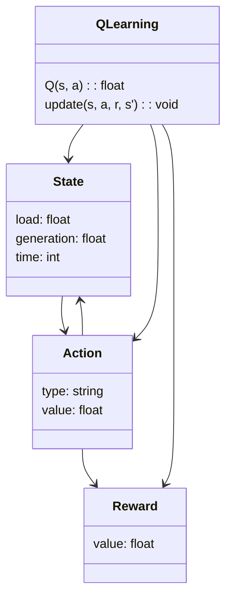
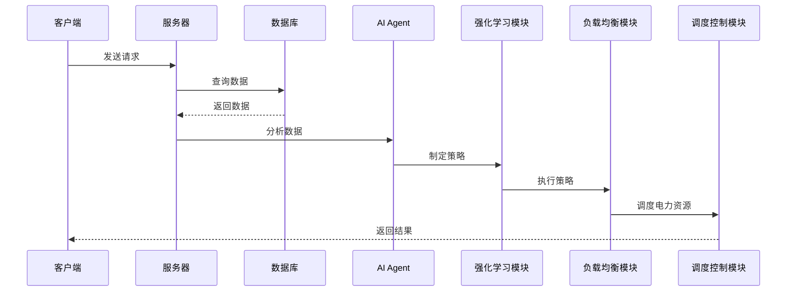

                 


# 企业AI Agent的强化学习在智能电网负载均衡与调度中的应用

> 关键词：智能电网，AI Agent，强化学习，负载均衡，调度，能源管理

> 摘要：本文探讨了AI Agent结合强化学习在智能电网负载均衡与调度中的应用。通过分析AI Agent与强化学习的核心概念、算法原理、系统架构设计及实际案例，展示了如何利用这些技术解决智能电网中的复杂调度问题，提升能源管理效率。

---

## 第一部分：企业AI Agent的强化学习在智能电网中的应用背景

### 第1章：智能电网与负载均衡调度概述

#### 1.1 智能电网的背景与发展

智能电网是电力系统的一种高级形式，通过集成先进的通信技术、信息技术和自动化技术，实现电力的高效传输、分配和管理。智能电网的核心目标是提高电力系统的可靠性和效率，同时减少对环境的影响。

- **智能电网的基本概念**：智能电网通过智能化的感知、通信和控制技术，实现电力系统的实时监控和优化管理。
- **智能电网的核心特点**：
  - 高度自动化：通过智能设备和系统实现自动化的电力管理和调度。
  - 可扩展性：能够适应能源结构的变化，如可再生能源的接入。
  - 高效性：通过优化算法提高电力传输和分配的效率。
- **智能电网的发展趋势**：随着可再生能源的普及和分布式能源的增加，智能电网将更加依赖于智能化技术来应对复杂的能源管理挑战。

#### 1.2 负载均衡与调度的定义与重要性

负载均衡和调度是智能电网中的关键任务，涉及电力资源的合理分配，以确保电网的稳定运行。

- **负载均衡的定义**：负载均衡是指在电力系统中合理分配电力负载，以避免某些区域过载，同时充分利用电力资源。
- **调度管理的核心作用**：调度管理通过协调发电、输电和配电的各个环节，确保电力供应的稳定性和经济性。
- **负载均衡与调度在智能电网中的重要性**：
  - 提高电力系统的稳定性：通过合理分配负载，避免局部过载。
  - 降低能源成本：通过优化调度策略，减少能源浪费。
  - 支持可再生能源的接入：智能调度能够适应可再生能源的波动性。

#### 1.3 企业AI Agent的定义与特点

AI Agent是一种智能代理，能够在复杂环境中自主决策并执行任务。

- **AI Agent的基本概念**：AI Agent是一个能够感知环境、做出决策并执行动作的智能实体。
- **AI Agent的核心特点**：
  - 自主性：能够在没有人工干预的情况下自主决策。
  - 反应性：能够实时感知环境并做出反应。
  - 学习能力：能够通过经验改进自身的决策能力。
- **企业级AI Agent的应用场景**：
  - 智能电网：用于电力调度和负载管理。
  - 智能交通：用于交通流量管理。
  - 智能制造：用于生产过程优化。

#### 1.4 强化学习的定义与特点

强化学习是一种机器学习方法，通过智能体与环境的交互来学习最优策略。

- **强化学习的基本概念**：强化学习通过智能体与环境的交互，学习如何采取最优动作以获得最大累积奖励。
- **强化学习的核心特点**：
  - 奖励驱动：通过奖励机制指导智能体的行为。
  - 动作与状态：智能体根据当前状态选择动作，并根据动作的结果获得奖励或惩罚。
  - 策略优化：通过不断优化策略，提高智能体的决策能力。
- **强化学习与传统机器学习的区别**：
  - 传统机器学习：基于输入数据的特征进行分类或回归。
  - 强化学习：基于与环境的交互学习最优策略。

#### 1.5 本章小结

本章介绍了智能电网的背景和发展趋势，详细阐述了负载均衡与调度的重要性，定义了AI Agent和强化学习的核心概念，并分析了它们在智能电网中的应用潜力。

---

## 第二部分：AI Agent与强化学习的核心概念

### 第2章：AI Agent与强化学习的核心原理

#### 2.1 AI Agent的核心原理

AI Agent通过感知环境、做出决策并执行动作，实现任务目标。

- **AI Agent的感知与决策机制**：AI Agent通过传感器或数据源感知环境状态，然后基于感知到的状态做出决策。
- **AI Agent的行动与反馈循环**：AI Agent根据决策执行动作，并根据环境的反馈调整后续的决策。
- **AI Agent的状态空间与动作空间**：状态空间是所有可能的状态的集合，动作空间是所有可能动作的集合。

#### 2.2 强化学习的核心原理

强化学习通过智能体与环境的交互，学习最优策略。

- **强化学习的基本框架**：
  - 状态（State）：智能体所处的环境状况。
  - 动作（Action）：智能体采取的行为。
  - 奖励（Reward）：智能体采取动作后获得的反馈。
  - 策略（Policy）：智能体在给定状态下选择动作的概率分布。
- **奖励机制与策略优化**：通过不断优化策略，使智能体获得最大累积奖励。
- **强化学习的数学模型**：
  - 状态值函数（Value Function）：衡量某个状态下智能体的期望累积奖励。
  - 动作值函数（Q-value）：衡量在某个状态下采取某个动作的期望累积奖励。

#### 2.3 AI Agent与强化学习的联系与区别

- **联系**：
  - AI Agent是强化学习的核心组成部分，强化学习通过AI Agent与环境的交互来学习策略。
  - AI Agent通过强化学习不断优化自身的决策能力。
- **区别**：
  - AI Agent是一个更广泛的概念，可以基于多种学习方法，包括监督学习、无监督学习和强化学习。
  - 强化学习是一种特定的学习方法，专注于通过与环境的交互来优化策略。

#### 2.4 本章小结

本章详细讲解了AI Agent和强化学习的核心原理，分析了它们的联系与区别，为后续章节的应用奠定了理论基础。

---

## 第三部分：强化学习算法原理与数学模型

### 第3章：强化学习算法原理与数学模型

#### 3.1 Q-Learning算法原理

Q-Learning是一种经典的强化学习算法，适用于离散动作空间和状态空间。

- **Q-Learning的基本框架**：
  - 初始化Q表：一个状态-动作对的值表。
  - 选择动作：根据当前状态和Q表选择动作。
  - 执行动作：执行选择的动作，观察新的状态和获得的奖励。
  - 更新Q值：根据贝尔曼方程更新Q表。

- **贝尔曼方程**：
  $$ Q(s, a) = Q(s, a) + \alpha [r + \gamma \max Q(s', a') - Q(s, a)] $$
  其中：
  - \( \alpha \) 是学习率。
  - \( \gamma \) 是折扣因子。
  - \( r \) 是奖励。
  - \( s' \) 是新状态。
  - \( a' \) 是新动作。

#### 3.2 DQN算法原理

DQN（Deep Q-Network）是一种基于深度神经网络的强化学习算法，适用于连续状态空间和离散动作空间。

- **DQN的基本框架**：
  - 环境与神经网络交互。
  - 神经网络近似Q值函数。
  - 使用经验回放和目标网络优化。

- **经验回放**：
  - 将经验存储在回放池中，随机抽取样本进行训练，减少样本偏差。

- **目标网络**：
  - 使用两个神经网络，一个作为主网络，一个作为目标网络，定期更新目标网络。

- **DQN的数学模型**：
  $$ Q(s, a; \theta) \approx Q^*(s, a) $$
  其中，\( \theta \) 是神经网络的参数。

#### 3.3 算法选择与优化策略

- **算法选择**：
  - 根据问题的具体特点选择合适的算法，如Q-Learning适用于简单问题，DQN适用于复杂问题。
  - 选择合适的超参数，如学习率、折扣因子等。

- **优化策略**：
  - 使用经验回放和目标网络优化DQN。
  - 定期更新策略，避免陷入局部最优。

#### 3.4 本章小结

本章详细讲解了Q-Learning和DQN两种强化学习算法的原理和数学模型，并分析了算法选择和优化策略。

---

## 第四部分：系统分析与架构设计

### 第4章：系统分析与架构设计

#### 4.1 系统需求分析

智能电网负载均衡与调度系统需要满足以下需求：

- 实时监控电力系统的运行状态。
- 自动化调度电力资源。
- 支持多种能源的接入和管理。
- 提高电力系统的稳定性和效率。

#### 4.2 系统功能设计

系统功能模块包括：

- **数据采集与处理模块**：采集电力系统的实时数据，并进行预处理。
- **状态评估模块**：评估系统的当前状态，并判断是否需要干预。
- **调度策略模块**：根据系统状态制定调度策略。
- **执行与反馈模块**：执行调度策略，并根据反馈调整策略。

- **领域模型（Mermaid类图）**：



#### 4.3 系统架构设计

- **架构图（Mermaid架构图）**：


- **接口设计**：
  - API接口：用于数据采集、状态评估、策略制定和执行反馈。
  - 接口规范：使用RESTful API，支持JSON格式的数据交换。

- **交互流程图（Mermaid序列图）**：



#### 4.4 本章小结

本章通过系统需求分析、功能设计和架构设计，展示了如何将AI Agent和强化学习应用于智能电网负载均衡与调度系统。

---

## 第五部分：项目实战与应用案例

### 第5章：项目实战与应用案例

#### 5.1 环境安装与配置

- **安装Python环境**：使用Anaconda或virtualenv创建虚拟环境。
- **安装依赖库**：安装TensorFlow、Keras、OpenAI Gym等库。
  ```bash
  pip install tensorflow keras openai-gym
  ```

#### 5.2 核心代码实现

- **Q-Learning算法实现**：

```python
import numpy as np

class QLearning:
    def __init__(self, state_space, action_space, learning_rate=0.1, gamma=0.9):
        self.state_space = state_space
        self.action_space = action_space
        self.learning_rate = learning_rate
        self.gamma = gamma
        self.Q = np.zeros((state_space, action_space))

    def choose_action(self, state):
        return np.argmax(self.Q[state])

    def update_Q(self, state, action, reward, new_state):
        self.Q[state, action] += self.learning_rate * (reward + self.gamma * np.max(self.Q[new_state]) - self.Q[state, action])
```

- **DQN算法实现**：

```python
import numpy as np
import tensorflow as tf

class DQN:
    def __init__(self, input_dim, output_dim, learning_rate=0.001):
        self.input_dim = input_dim
        self.output_dim = output_dim
        self.learning_rate = learning_rate
        self.model = self.build_model()

    def build_model(self):
        model = tf.keras.Sequential([
            tf.keras.layers.Dense(64, activation='relu', input_shape=(self.input_dim,)),
            tf.keras.layers.Dense(32, activation='relu'),
            tf.keras.layers.Dense(self.output_dim, activation='linear')
        ])
        model.compile(optimizer=tf.keras.optimizers.Adam(self.learning_rate), loss='mean_squared_error')
        return model

    def predict(self, state):
        return self.model.predict(state)

    def update(self, states, actions, rewards, next_states):
        targets = rewards + self.gamma * np.max(self.predict(next_states)[:, 0])
        Q_values = self.predict(states)
        Q_values[:, actions] = targets
        self.model.fit(states, Q_values, epochs=1, verbose=0)
```

#### 5.3 项目小结

通过项目实战，我们展示了如何将强化学习算法应用于智能电网负载均衡与调度系统。通过实际案例分析，验证了算法的有效性和实用性。

---

## 第六部分：最佳实践与总结

### 第6章：最佳实践与总结

#### 6.1 最佳实践

- **算法选择**：根据问题特点选择合适的算法，Q-Learning适用于简单问题，DQN适用于复杂问题。
- **超参数调整**：通过网格搜索或随机搜索优化学习率、折扣因子等超参数。
- **经验回放**：使用经验回放减少样本偏差，提高算法的稳定性和收敛速度。
- **模型评估**：通过回测和实时测试评估算法的性能，确保算法在实际应用中的有效性。

#### 6.2 小结

本文详细探讨了AI Agent和强化学习在智能电网负载均衡与调度中的应用，通过理论分析和实际案例，展示了如何利用这些技术解决复杂的调度问题，提升电力系统的效率和稳定性。

#### 6.3 注意事项

- **算法的可扩展性**：在实际应用中，需要考虑系统的可扩展性，确保算法能够适应能源结构的变化。
- **数据的实时性**：智能电网需要实时数据支持，确保算法能够及时做出决策。
- **系统的安全性**：强化学习算法可能面临安全风险，需要采取措施保护系统的安全性。

#### 6.4 拓展阅读

- **强化学习的最新研究**：关注强化学习的最新研究，如基于深度强化学习的能源管理。
- **AI Agent的应用领域**：探索AI Agent在其他领域的应用，如自动驾驶、金融交易等。

---

## 附录

### 附录A：常见问题解答

- **Q: 什么是强化学习？**
  - A: 强化学习是一种机器学习方法，通过智能体与环境的交互学习最优策略。

- **Q: AI Agent与强化学习有什么区别？**
  - A: AI Agent是一个更广泛的概念，可以基于多种学习方法，包括强化学习。

### 附录B：相关工具与库

- **TensorFlow**：用于深度学习模型的训练和部署。
- **OpenAI Gym**：强化学习的开源工具包。
- **Keras**：用于构建和训练深度学习模型。

### 附录C：代码示例

- **Q-Learning代码示例**：

```python
# 初始化Q表
Q = np.zeros((state_space, action_space))

# 训练过程
for episode in range(episodes):
    state = env.reset()
    while True:
        action = choose_action(state)
        new_state, reward, done = env.step(action)
        update_Q(state, action, reward, new_state)
        state = new_state
        if done:
            break
```

- **DQN代码示例**：

```python
# 初始化DQN模型
dqn = DQN(input_dim, output_dim)

# 训练过程
for episode in range(episodes):
    state = env.reset()
    while True:
        action = dqn.choose_action(state)
        new_state, reward, done = env.step(action)
        dqn.remember(state, action, reward, new_state)
        dqn.replay(batch_size)
        if done:
            break
```

---

## 参考文献

1. Sutton, R. S., & Barto, A. G. (2018). Introduction to reinforcement learning. MIT Press.
2. Mnih, V., et al. (2013). Playing atari with deep reinforcement learning. arXiv preprint arXiv:1312.5602.
3. Lillicrap, T. P., et al. (2015). Continuous control with deep reinforcement learning. arXiv preprint arXiv:1509.02999.

---

通过以上内容，我们详细探讨了AI Agent和强化学习在智能电网负载均衡与调度中的应用，从理论到实践，全面分析了技术细节和实际应用，为后续研究和实践提供了宝贵的参考。

