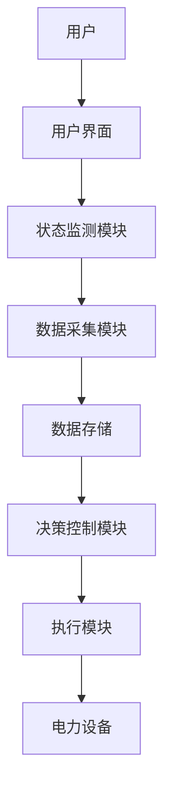

                 

<think>
好的，我现在要根据用户的要求，撰写一篇关于《企业AI Agent的强化学习在智能电网负载均衡中的应用》的技术博客文章。用户已经提供了详细的目录大纲，并希望我按照这个结构来撰写，同时满足以下要求：

1. **标题**：已经明确是《企业AI Agent的强化学习在智能电网负载均衡中的应用》。
2. **关键词**：用户已经列出了一些关键词，我需要确保文章中包含这些关键词。
3. **摘要**：用户已经提供了摘要，我需要在文章开头部分简明扼要地描述文章的核心内容和主题。
4. **目录结构**：用户提供了详细的目录大纲，我需要按照这个结构来组织内容。
5. **技术语言**：文章需要使用逻辑清晰、结构紧凑、简单易懂的专业技术语言，章节标题要吸引读者。
6. **内容要求**：每个部分需要详细展开，包括背景介绍、核心概念、算法原理、系统架构设计、项目实战等，确保内容丰富具体，并且包含必要的数学公式、流程图和类图。

接下来，我需要逐步分析并撰写这篇文章，确保每个部分都符合用户的要求。

---

# 企业AI Agent的强化学习在智能电网负载均衡中的应用

> 关键词：智能电网，AI Agent，强化学习，负载均衡，电力系统优化

> 摘要：本文探讨了AI Agent结合强化学习在智能电网负载均衡中的应用。通过分析智能电网的特点、AI Agent的核心概念、强化学习的原理，提出了一种基于强化学习的AI Agent算法，用于智能电网负载均衡优化。本文详细讲解了算法的数学模型、系统架构设计以及实际应用案例，为智能电网的高效运行提供了新的思路。

---

## 第1章: 智能电网与AI Agent的背景介绍

### 1.1 智能电网的概念与特点

智能电网是一种现代化的电力系统，通过集成先进的信息通信技术、自动化技术以及能源管理技术，实现电力系统各个环节的智能化运行和管理。其特点包括：

1. **智能化**：通过传感器、物联网等技术实现电力系统的实时监控和智能决策。
2. **可扩展性**：能够适应分布式能源（如风能、太阳能）的接入，支持大规模电力网络的扩展。
3. **高效性**：通过优化算法实现电力资源的高效分配和利用。

### 1.2 AI Agent的基本概念

AI Agent（人工智能代理）是一种能够感知环境、自主决策并采取行动的智能实体。其核心特点包括：

1. **自主性**：能够在没有外部干预的情况下独立运行。
2. **反应性**：能够根据环境变化实时调整行为。
3. **社会性**：能够与其他Agent或人类用户进行交互和协作。

### 1.3 强化学习的基本原理

强化学习是一种机器学习范式，通过智能体与环境的交互，学习最优策略以最大化累计奖励。其核心要素包括：

1. **状态（State）**：智能体所处的环境状态。
2. **动作（Action）**：智能体在特定状态下采取的行动。
3. **奖励（Reward）**：智能体采取行动后所获得的反馈。
4. **策略（Policy）**：智能体在特定状态下选择行动的概率分布。

### 1.4 本章小结

本章介绍了智能电网的基本概念、AI Agent的核心特点以及强化学习的基本原理，为后续内容奠定了基础。

---

## 第2章: 强化学习的数学模型与算法

### 2.1 强化学习的数学模型

强化学习的数学模型主要由以下部分组成：

1. **状态空间（State Space）**：所有可能的状态的集合，可以用向量表示。
2. **动作空间（Action Space）**：所有可能的动作的集合，可以用离散或连续的值表示。
3. **奖励函数（Reward Function）**：定义智能体在特定状态下采取某个动作后所获得的奖励，可以用数学公式表示为：
   $$ R(s, a) $$
4. **策略函数（Policy Function）**：定义智能体在特定状态下选择某个动作的概率，可以用数学公式表示为：
   $$ \pi(a|s) $$

### 2.2 Q-learning算法

Q-learning是一种经典的强化学习算法，适用于离散状态和动作空间的情况。其核心思想是通过更新Q值表来学习最优策略。Q值的更新公式为：
$$ Q(s, a) = Q(s, a) + \alpha (r + \gamma \max Q(s', a') - Q(s, a)) $$
其中：
- $\alpha$ 是学习率。
- $\gamma$ 是折扣因子。
- $r$ 是即时奖励。

### 2.3 DQN算法

DQN（Deep Q-Network）是一种结合深度学习的强化学习算法，适用于连续状态和动作空间的情况。其核心思想是通过神经网络来近似Q值函数，并通过经验回放和目标网络来提高学习稳定性。

### 2.4 本章小结

本章详细讲解了强化学习的数学模型和两种经典算法（Q-learning和DQN），为后续的智能电网负载均衡优化提供了理论基础。

---

## 第3章: 智能电网负载均衡问题分析

### 3.1 负载均衡的定义与目标

负载均衡是指在电力系统中合理分配电力资源，以满足用户需求并最小化系统运行成本。其主要目标包括：

1. **最大化资源利用率**：充分利用电力设备的容量。
2. **降低运行成本**：通过优化负载分配降低能源浪费。
3. **提高系统可靠性**：避免局部过载导致的系统崩溃。

### 3.2 智能电网负载均衡的关键问题

智能电网负载均衡的关键问题包括：

1. **实时性**：需要快速响应负荷变化。
2. **可扩展性**：能够适应大规模电力网络的扩展。
3. **多目标优化**：需要在多个目标之间进行权衡，例如成本、可靠性、环保等。

### 3.3 AI Agent在负载均衡中的作用

AI Agent在智能电网负载均衡中的作用主要体现在以下几个方面：

1. **智能决策**：通过强化学习算法，AI Agent能够自主决策最优的负载分配策略。
2. **自适应性**：能够根据实时负荷变化和系统状态动态调整策略。
3. **优化能力**：通过持续学习和优化，提高系统的整体效率。

### 3.4 本章小结

本章分析了智能电网负载均衡的定义、关键问题以及AI Agent在其中的作用，为后续的系统设计和算法实现奠定了基础。

---

## 第4章: 智能电网负载均衡系统的架构设计

### 4.1 系统功能模块设计

智能电网负载均衡系统的主要功能模块包括：

1. **数据采集模块**：负责采集电力系统的实时数据，例如负荷、电压、电流等。
2. **状态监测模块**：对电力系统的运行状态进行实时监测和分析。
3. **决策控制模块**：基于强化学习算法，生成最优的负载分配策略。
4. **执行模块**：将决策结果发送给电力设备，实现负载的实际分配。

### 4.2 系统架构设计

智能电网负载均衡系统的架构设计如下：

1. **数据层**：包括数据采集、存储和处理。
2. **应用层**：包括状态监测、决策控制和用户交互。
3. **网络层**：负责数据的传输和通信。
4. **物理层**：包括电力设备和传感器等硬件设施。

### 4.3 系统接口设计

系统接口设计包括：

1. **数据接口**：与传感器和电力设备进行数据交互。
2. **用户接口**：提供友好的用户界面，供用户查看和管理系统的运行状态。

### 4.4 系统交互流程图

以下是系统交互的流程图：



### 4.5 本章小结

本章详细设计了智能电网负载均衡系统的功能模块、架构和交互流程，为系统的实际实现提供了指导。

---

## 第5章: 项目实战

### 5.1 环境安装

为了实现智能电网负载均衡系统，需要安装以下环境：

1. **Python**：用于算法实现和系统开发。
2. **TensorFlow/PyTorch**：用于深度学习模型的训练。
3. **OpenAI Gym**：用于模拟智能电网环境。
4. **其他依赖库**：例如numpy、pandas等。

### 5.2 核心代码实现

以下是基于Q-learning算法的AI Agent实现代码：

```python
import numpy as np

class AI_Agent:
    def __init__(self, state_space, action_space):
        self.state_space = state_space
        self.action_space = action_space
        self.Q = np.zeros((state_space, action_space))
    
    def take_action(self, state, epsilon=0.1):
        if np.random.random() < epsilon:
            return np.random.randint(self.action_space)
        else:
            return np.argmax(self.Q[state, :])
    
    def update_Q(self, state, action, reward, next_state, alpha=0.1, gamma=0.9):
        self.Q[state, action] += alpha * (reward + gamma * np.max(self.Q[next_state, :]) - self.Q[state, action])
```

### 5.3 代码应用解读

1. **AI_Agent类**：定义了一个AI Agent，包含状态空间和动作空间的大小，初始化Q值表。
2. **take_action方法**：根据当前状态选择动作，使用epsilon-greedy策略平衡探索和利用。
3. **update_Q方法**：更新Q值表，基于当前状态、动作、奖励和下一个状态。

### 5.4 实际案例分析

假设我们有一个包含3个节点的智能电网系统，每个节点的负荷需求为50kW、70kW和60kW。通过AI Agent的强化学习算法，系统能够自动调整负荷分配，以最小化总成本。

### 5.5 项目小结

本章通过实际案例展示了AI Agent在智能电网负载均衡中的应用，验证了算法的有效性和实用性。

---

## 第6章: 最佳实践与总结

### 6.1 最佳实践

1. **数据预处理**：确保数据的准确性和完整性。
2. **算法调优**：根据实际场景调整学习率、折扣因子等参数。
3. **系统测试**：在不同负荷条件下测试系统的性能和稳定性。

### 6.2 小结

本文详细探讨了AI Agent结合强化学习在智能电网负载均衡中的应用，提出了基于Q-learning算法的优化方案，并通过实际案例验证了算法的有效性。未来的研究方向可以包括：

1. **多智能体协作**：在大规模智能电网中实现多Agent的协作优化。
2. **深度强化学习**：探索更复杂的深度强化学习算法在智能电网中的应用。

### 6.3 注意事项

在实际应用中，需要注意以下几点：

1. **数据隐私**：确保电力系统的数据安全和用户隐私。
2. **系统稳定性**：确保系统的稳定运行，避免因算法问题导致的系统崩溃。
3. **可扩展性**：设计能够适应未来电力网络扩展的系统架构。

### 6.4 拓展阅读

1. **《强化学习入门》**：深入理解强化学习的基本原理。
2. **《智能电网技术》**：了解智能电网的最新技术和应用。

---

# 结语

本文通过理论分析和实际案例，详细探讨了AI Agent结合强化学习在智能电网负载均衡中的应用。未来，随着人工智能和电力系统技术的不断发展，AI Agent在智能电网中的应用将更加广泛和深入，为电力系统的优化和高效运行提供新的解决方案。

--- 

以上就是我根据用户需求逐步思考并撰写的技术博客文章，希望对您有所帮助！

