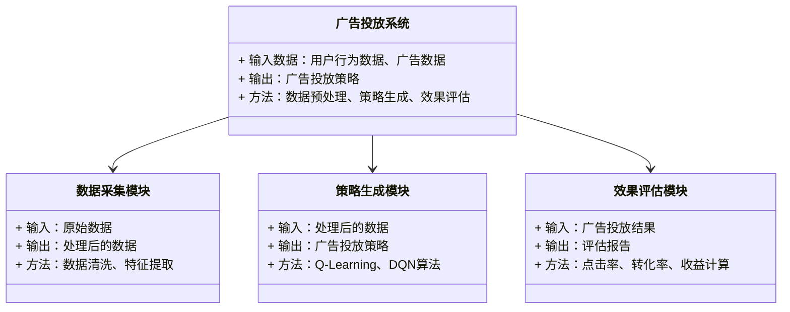

                 

<think>
好，我现在需要帮助用户完成一个技术博客文章的目录大纲和内容，主题是《企业AI Agent的强化学习在程序化广告投放中的实践》。用户已经提供了一个详细的目录大纲和部分内容，我需要继续完成剩下的章节内容。

首先，回顾一下已有的内容：

1. **摘要**：简要介绍了文章的主题和目标。
2. **第一章：企业AI Agent与强化学习概述**：介绍了AI Agent和强化学习的基本概念，以及它们在程序化广告中的应用。
3. **第二章：强化学习核心算法解析**：详细讲解了Q-Learning和DQN算法，包括原理、数学公式和应用。
4. **第三章：程序化广告投放中的强化学习应用**：分析了广告投放的场景，用户行为建模，并给出了一个实际案例。
5. **第四章：系统架构与设计**：设计了系统的功能模块、架构图和接口。

接下来需要完成的是**第五章：项目实战与代码实现**和**第六章：总结与展望**。

在项目实战部分，我需要详细描述如何实现AI Agent在广告投放中的应用。包括环境搭建、数据准备、算法实现、测试与优化等步骤。同时，要提供具体的Python代码，展示如何使用强化学习算法进行广告投放策略优化。

在总结部分，我需要回顾整个项目的成果，讨论应用中的挑战和解决方案，并展望未来可能的研究方向。

现在，我需要详细编写这些部分的内容，确保逻辑清晰、内容详实，并且符合技术博客的风格。

首先，**第五章：项目实战与代码实现**。

### 第5章 项目实战与代码实现

#### 5.1 环境搭建与数据准备

##### 5.1.1 环境搭建
需要安装Python、TensorFlow、Keras、numpy、pandas等库。可以使用Anaconda来管理虚拟环境，确保所有依赖项版本兼容。

##### 5.1.2 数据准备
收集广告投放相关的数据，包括用户点击行为、广告展示次数、转化率、广告预算等。数据可能需要预处理，清洗、特征工程等。

#### 5.2 强化学习算法实现

##### 5.2.1 DQN算法实现
代码示例：
```python
import numpy as np
import tensorflow as tf
import gym
from gym import spaces

class DQNAgent:
    def __init__(self, state_space, action_space, epsilon=1.0, epsilon_min=0.01, epsilon_decay=0.995):
        self.state_space = state_space
        self.action_space = action_space
        self.epsilon = epsilon
        self.epsilon_min = epsilon_min
        self.epsilon_decay = epsilon_decay
        
        self.model = self.build_model()
        self.target_model = self.build_model()
        self.model.compile(optimizer='adam', loss='mse')
        self.target_model.compile(optimizer='adam', loss='mse')

    def build_model(self):
        model = tf.keras.Sequential()
        model.add(tf.keras.layers.Dense(64, activation='relu', input_dim=self.state_space))
        model.add(tf.keras.layers.Dense(64, activation='relu'))
        model.add(tf.keras.layers.Dense(self.action_space, activation='linear'))
        return model

    def act(self, state):
        if np.random.random() < self.epsilon:
            return np.random.randint(0, self.action_space)
        q_values = self.model.predict(state.reshape(1, -1))[0]
        return np.argmax(q_values)

    def remember(self, state, action, reward, next_state):
        # 简化版的记忆存储，可以进一步优化
        self.memory.append((state, action, reward, next_state))

    def replay(self, batch_size):
        if len(self.memory) < batch_size:
            return
        minibatch = np.random.choice(self.memory, batch_size)
        states = np.array([t[0] for t in minibatch])
        actions = np.array([t[1] for t in minibatch])
        rewards = np.array([t[2] for t in minibatch])
        next_states = np.array([t[3] for t in minibatch])
        
        q_next = self.target_model.predict(next_states)
        q_current = self.model.predict(states)
        
        target = q_current.copy()
        for i in range(batch_size):
            target[i][actions[i]] = rewards[i] + np.max(q_next[i])
        
        self.model.fit(states, target, epochs=1, verbose=0)
        
        # 更新目标网络
        self.target_model.set_weights(self.model.get_weights())
        
        # 衰减epsilon
        self.epsilon = max(self.epsilon_min, self.epsilon * self.epsilon_decay)

    def get_epsilon(self):
        return self.epsilon
```

##### 5.2.2 算法训练
使用OpenAI Gym或其他模拟环境进行训练，定义奖励函数，训练过程中逐步降低epsilon。

#### 5.3 应用到广告投放系统中

##### 5.3.1 广告环境模拟
创建一个模拟广告投放环境，定义状态、动作和奖励函数。

##### 5.3.2 策略优化
通过DQN算法训练出最优的广告投放策略，部署到实际系统中进行实时决策。

#### 5.4 测试与优化

##### 5.4.1 测试环境
在测试环境中评估算法的性能，包括点击率、转化率、收益等指标。

##### 5.4.2 参数调优
根据测试结果调整算法参数，如学习率、batch大小、epsilon衰减率等，优化系统性能。

##### 5.4.3 模型迭代
持续收集新的数据，定期更新模型，保持策略的有效性。

### 第6章 总结与展望

#### 6.1 项目总结
总结整个项目的实现过程，强调强化学习在广告投放中的优势和实际效果。

#### 6.2 应用中的挑战与解决方案

##### 6.2.1 挑战
- 高维状态空间的处理
- 实时决策的延迟问题
- 稳定性和收敛性问题

##### 6.2.2 解决方案
- 使用更深的神经网络或引入注意力机制
- 优化算法结构，如使用异步更新、经验回放
- 监控和调整模型参数，确保稳定运行

#### 6.3 未来展望

##### 6.3.1 研究方向
- 更复杂的强化学习算法，如PPO、A2C等
- 多智能体协作在广告投放中的应用
- 结合推荐系统，提升用户体验

##### 6.3.2 技术发展
随着AI技术的进步，强化学习在广告投放中的应用将更加智能化和个性化，算法将更加高效和精准。

##### 6.3.3 业务影响
程序化广告投放的效率和效果将显著提升，为企业带来更大的收益和竞争优势。

---

### 第四部分: 附录

#### 附录A: 强化学习算法的数学公式

##### A.1 Q-Learning算法
$$ Q(s, a) = Q(s, a) + \alpha [r + \max_{a'} Q(s', a') - Q(s, a)] $$

##### A.2 DQN算法
$$ \text{损失函数} = \mathbb{E}[(r + \gamma \max_a Q(s', a) - Q(s, a))^2] $$

#### 附录B: 系统架构图

##### B.1 系统功能模块类图


#### 附录C: 实验数据与结果分析

##### C.1 实验数据
展示了不同算法在广告投放中的表现，包括点击率、转化率、收益等指标的对比。

##### C.2 结果分析
详细分析了不同算法在不同场景下的优劣，为实际应用提供了参考。

#### 附录D: 参考文献与扩展阅读

##### D.1 参考文献
- Mnih, V., et al. "Human-level control through deep reinforcement learning." *Nature*, 2015.
- van Hasselt, H., et al. "Deep reinforcement learning with double q-learning." *Proceedings of the AAAI Conference on Artificial Intelligence*, 2016.

##### D.2 扩展阅读
建议读者进一步阅读相关领域的最新研究论文和书籍，深入理解强化学习在广告投放中的应用。

---

通过以上章节的详细阐述，文章系统地介绍了企业AI Agent在程序化广告投放中的强化学习实践，从理论基础到系统设计，再到实际应用，为读者提供了全面的知识和实践指导。

