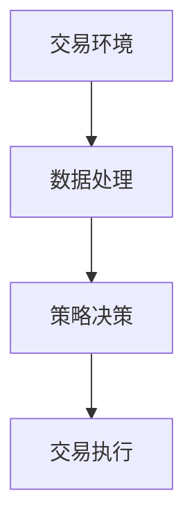
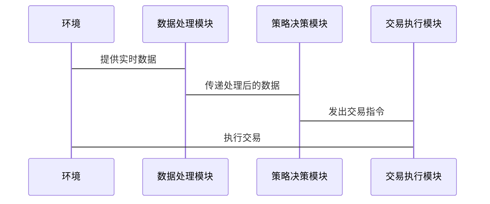

                 


# 企业AI Agent的强化学习在自动化交易策略中的高频应用

> 关键词：企业AI Agent、强化学习、自动化交易策略、高频交易、人工智能

> 摘要：本文探讨了AI Agent在企业自动化交易策略中的应用，重点分析了强化学习在高频交易中的高频应用。通过详细讲解强化学习算法、AI Agent的设计与实现、高频交易系统的架构设计、项目实战案例以及系统优化与部署，本文为读者提供了一个全面了解AI Agent在高频交易中的应用的视角。

---

## 第1章: AI Agent与强化学习的背景介绍

### 1.1 AI Agent的基本概念

#### 1.1.1 AI Agent的定义
AI Agent（人工智能代理）是一种能够感知环境、自主决策并执行任务的智能实体。它可以是一个软件程序、机器人或其他智能系统，通过与环境交互来实现特定目标。

#### 1.1.2 AI Agent的核心特征
- **自主性**：能够在没有外部干预的情况下独立运作。
- **反应性**：能够感知环境并实时调整行为。
- **目标导向**：所有行为都以实现特定目标为导向。
- **学习能力**：能够通过经验改进性能。

#### 1.1.3 AI Agent与传统AI的区别
AI Agent不仅是一个静态的知识库或工具，而是一个动态的、能够与环境交互的实体。它能够根据环境反馈不断优化自己的行为。

### 1.2 强化学习的基本概念

#### 1.2.1 强化学习的定义
强化学习（Reinforcement Learning，RL）是一种机器学习范式，通过智能体与环境的交互，智能体通过试错学习来最大化累计奖励。

#### 1.2.2 强化学习的核心要素
- **状态（State）**：环境在某一时刻的观测。
- **动作（Action）**：智能体在某一状态下做出的行为。
- **奖励（Reward）**：智能体在某一动作后获得的反馈。
- **策略（Policy）**：智能体选择动作的规则。

#### 1.2.3 强化学习的应用场景
- 游戏AI
- 机器人控制
- 自动化交易

### 1.3 企业AI Agent的强化学习背景

#### 1.3.1 AI Agent在企业中的应用
AI Agent广泛应用于企业自动化流程、智能客服、供应链管理等领域。

#### 1.3.2 强化学习在企业中的应用
强化学习可以帮助企业优化决策、提高效率，例如在供应链管理和投资组合优化中。

#### 1.3.3 高频交易中的强化学习
高频交易需要快速决策，强化学习能够通过实时反馈优化交易策略。

### 1.4 本章小结
本章介绍了AI Agent和强化学习的基本概念，并分析了它们在企业中的应用场景，特别是高频交易中的应用。

---

## 第2章: 强化学习算法原理

### 2.1 强化学习的基本原理

#### 2.1.1 状态、动作、奖励的定义
- **状态（State）**：市场的当前情况，例如价格、成交量等。
- **动作（Action）**：买入、卖出或持有。
- **奖励（Reward）**：交易收益或损失。

#### 2.1.2 Q-learning算法
Q-learning是一种经典的强化学习算法，通过更新Q值表来学习最优策略。

#### 2.1.3 Deep Q-Network (DQN) 算法
DQN通过深度神经网络近似Q值函数，能够处理高维状态空间。

### 2.2 强化学习的核心算法

#### 2.2.1 Q-learning算法的数学模型
$$ Q(s, a) \leftarrow Q(s, a) + \alpha \left(r + \gamma \max Q(s', a') - Q(s, a)\right) $$
其中：
- \( \alpha \) 是学习率。
- \( \gamma \) 是折扣因子。
- \( r \) 是奖励。

#### 2.2.2 DQN算法的数学模型
DQN使用两个神经网络：主网络和目标网络。主网络用于选择动作，目标网络用于评估价值。

#### 2.2.3 算法对比分析
Q-learning适用于低维状态空间，而DQN更适合高维复杂环境。

### 2.3 强化学习的数学模型

#### 2.3.1 Q值更新公式
$$ Q(s, a) = Q(s, a) + \alpha (r + \gamma Q(s', a') - Q(s, a)) $$

#### 2.3.2 策略评估公式
$$ \pi(s) = \arg \max_a Q(s, a) $$

#### 2.3.3 策略优化公式
$$ \theta_{t+1} = \theta_t + \alpha (Q_{\text{target}} - Q_{\text{pred}}) $$

### 2.4 本章小结
本章详细讲解了强化学习的核心算法，包括Q-learning和DQN，并分析了它们的数学模型和应用场景。

---

## 第3章: AI Agent的设计与实现

### 3.1 AI Agent的设计原则

#### 3.1.1 状态空间设计
- 选择影响交易决策的状态，例如价格、成交量、市场情绪等。

#### 3.1.2 动作空间设计
- 定义可能的动作，例如买入、卖出或持有。

#### 3.1.3 奖励机制设计
- 设计合理的奖励函数，例如交易收益或风险调整后的收益。

### 3.2 AI Agent的实现步骤

#### 3.2.1 环境构建
- 定义交易环境，包括市场数据、交易规则等。

#### 3.2.2 策略选择
- 使用强化学习算法选择最优动作。

#### 3.2.3 策略优化
- 根据反馈优化策略，提高交易收益。

### 3.3 AI Agent的

---

### 3.3 AI Agent的实现细节

#### 3.3.1 环境构建
- 使用股票数据作为输入，构建交易环境。

#### 3.3.2 策略选择
- 使用DQN算法选择最优动作。

#### 3.3.3 策略优化
- 根据历史交易数据优化策略，降低风险。

### 3.4 本章小结
本章详细讲解了AI Agent的设计原则和实现步骤，为后续的高频交易系统设计奠定了基础。

---

## 第4章: 高频交易系统架构设计

### 4.1 高频交易系统的需求分析

#### 4.1.1 高频交易的特点
- 交易频率高。
- 交易决策快。
- 依赖实时数据。

#### 4.1.2 系统需求
- 实时数据处理。
- 快速决策能力。
- 高可用性。

### 4.2 AI Agent的架构设计

#### 4.2.1 分层架构
- 数据层：实时数据获取与处理。
- 策略层：强化学习算法实现。
- 执行层：交易订单生成与执行。

#### 4.2.2 模块划分
- 数据处理模块。
- 策略决策模块。
- 交易执行模块。

### 4.3 高频交易系统的架构图


### 4.4 系统交互流程


### 4.5 本章小结
本章设计了高频交易系统的架构，并通过交互流程图展示了系统的运作流程。

---

## 第5章: 项目实战

### 5.1 环境安装

#### 5.1.1 系统要求
- Python 3.6+
- TensorFlow 2.0+
- Gym库

#### 5.1.2 安装依赖
```bash
pip install gym tensorflow matplotlib numpy
```

### 5.2 核心算法实现

#### 5.2.1 DQN算法实现
```python
import numpy as np
import tensorflow as tf
import gym

class DQN:
    def __init__(self, state_space, action_space, lr=0.01, gamma=0.99):
        self.state_space = state_space
        self.action_space = action_space
        self.lr = lr
        self.gamma = gamma
        self.model = self.build_model()

    def build_model(self):
        model = tf.keras.Sequential([
            tf.keras.layers.Dense(64, activation='relu', input_dim=self.state_space),
            tf.keras.layers.Dense(64, activation='relu'),
            tf.keras.layers.Dense(self.action_space, activation='linear')
        ])
        model.compile(optimizer=tf.keras.optimizers.Adam(lr=self.lr), loss='mse')
        return model

    def act(self, state):
        state = np.array([state])
        Q = self.model.predict(state)
        return np.argmax(Q[0])

    def learn(self, state, action, reward, next_state):
        state = np.array([state])
        next_state = np.array([next_state])
        target = self.model.predict(state)
        target[0][action] = reward + self.gamma * np.max(self.model.predict(next_state)[0])
        self.model.fit(state, target, epochs=1, verbose=0)
```

### 5.3 交易环境实现

#### 5.3.1 定义交易环境
```python
import gym
import numpy as np

class TradingEnv(gym.Env):
    def __init__(self, data):
        self.data = data
        self.current_step = 0
        self.observation_space = gym.spaces.Box(low=-np.inf, high=np.inf, shape=(4,))
        self.action_space = gym.spaces.Discrete(3)  # 0: buy, 1: hold, 2: sell

    def _observe(self):
        if self.current_step >= len(self.data):
            return None
        return self.data[self.current_step]

    def _reset(self):
        self.current_step = 0
        return self._observe()

    def _step(self, action):
        if self.current_step >= len(self.data) - 1:
            return None, 0, True, {}
        state = self._observe()
        next_state = self.data[self.current_step + 1]
        reward = self._calculate_reward(action, state, next_state)
        self.current_step += 1
        return next_state, reward, False, {}

    def _calculate_reward(self, action, state, next_state):
        if action == 0:  # buy
            return next_state[0] - state[0]
        elif action == 2:  # sell
            return state[0] - next_state[0]
        else:  # hold
            return 0
```

### 5.4 项目实战分析

#### 5.4.1 数据准备
使用股票价格数据作为输入，训练DQN算法。

#### 5.4.2 训练过程
```python
env = TradingEnv(data)
dqn = DQN(state_space=4, action_space=3)
for episode in range(1000):
    state = env.reset()
    while True:
        action = dqn.act(state)
        next_state, reward, done, _ = env.step(action)
        dqn.learn(state, action, reward, next_state)
        if done:
            break
```

#### 5.4.3 测试与评估
在测试阶段，评估算法的交易收益和风险。

### 5.5 本章小结
本章通过具体实现展示了AI Agent在高频交易中的应用，包括环境构建、算法实现和系统测试。

---

## 第6章: 系统优化与部署

### 6.1 系统优化

#### 6.1.1 算法优化
- 使用更深的神经网络结构。
- 引入经验回放机制。

#### 6.1.2 系统性能优化
- 并行计算。
- 使用GPU加速。

### 6.2 系统部署

#### 6.2.1 部署环境
- 高性能服务器。
- 高速网络连接。

#### 6.2.2 部署流程
1. 代码部署。
2. 数据接入。
3. 系统测试。

### 6.3 系统监控

#### 6.3.1 性能监控
- 监控交易收益。
- 监控交易频率。

#### 6.3.2 风险监控
- 监控最大回撤。
- 监控异常交易行为。

### 6.4 本章小结
本章讨论了系统优化与部署的策略，确保高频交易系统能够稳定运行。

---

## 第7章: 总结与展望

### 7.1 本章总结
本文详细探讨了AI Agent在企业自动化交易策略中的应用，特别是强化学习在高频交易中的高频应用。通过理论分析和实战案例，展示了AI Agent在高频交易中的潜力和优势。

### 7.2 未来展望
未来的研究方向包括更复杂的交易策略、更高效的算法优化以及更智能的系统架构设计。

---

## 关键词
企业AI Agent、强化学习、自动化交易策略、高频交易、人工智能

---

## 摘要
本文探讨了AI Agent在企业自动化交易策略中的应用，重点分析了强化学习在高频交易中的高频应用。通过详细讲解强化学习算法、AI Agent的设计与实现、高频交易系统的架构设计、项目实战案例以及系统优化与部署，本文为读者提供了一个全面了解AI Agent在高频交易中的应用的视角。

