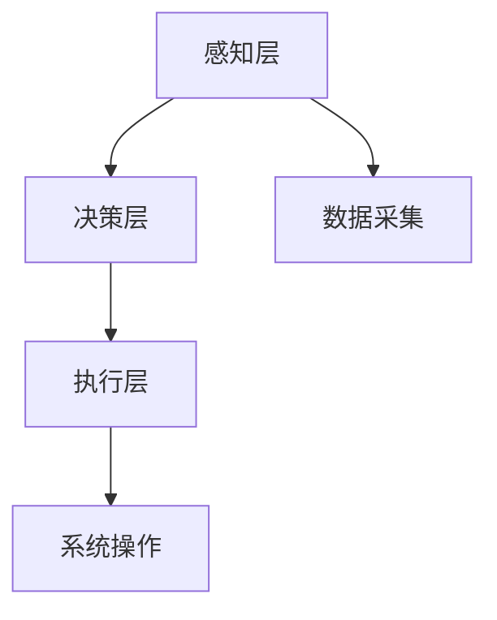
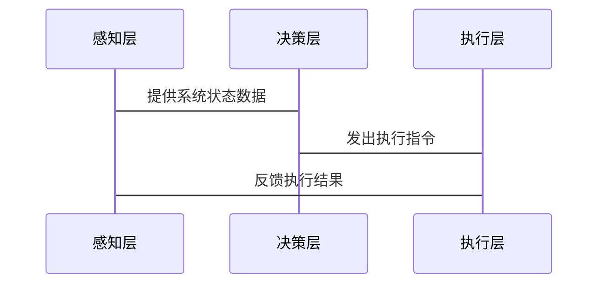

                 


# 《企业AI Agent的强化学习在自动化运维中的应用》

## 第一部分: 强化学习与AI Agent基础

### 第1章: AI Agent与强化学习概述

#### 1.1 AI Agent的基本概念

##### 1.1.1 AI Agent的定义与特点
- AI Agent的定义：AI Agent（人工智能代理）是指在特定环境中能够感知并自主行动以实现目标的智能体。
- AI Agent的特点：
  - **自主性**：能够自主决策，无需外部干预。
  - **反应性**：能够实时感知环境并做出反应。
  - **目标导向性**：所有行动都以实现特定目标为导向。
  - **学习能力**：通过与环境交互不断学习优化自身策略。

##### 1.1.2 AI Agent的核心要素与组成
- **感知能力**：通过传感器或API接口感知环境状态。
- **决策能力**：基于感知信息，通过策略选择最优行动。
- **行动能力**：通过执行器或API调用对外界产生影响。
- **学习能力**：通过强化学习等方法优化决策策略。

##### 1.1.3 AI Agent与传统自动化的区别
- **传统自动化**：
  - **特点**：基于预设规则，执行固定流程。
  - **适用场景**：简单、确定性较高的任务。
- **AI Agent**：
  - **特点**：能够自适应环境变化，自主学习优化。
  - **适用场景**：复杂、不确定性较高的动态环境。

#### 1.2 强化学习的基本概念

##### 1.2.1 强化学习的定义与特点
- **定义**：强化学习（Reinforcement Learning, RL）是一种通过智能体与环境交互来学习最优策略的机器学习方法。
- **特点**：
  - **目标导向**：通过最大化累计奖励来优化决策。
  - **在线学习**：通过与环境实时交互获得反馈。
  - **探索与利用**：在未知环境中需要平衡探索新策略与利用已知好策略。

##### 1.2.2 强化学习的核心要素与数学模型
- **状态（State）**：环境在某一时刻的描述，通常用 \( s \) 表示。
- **动作（Action）**：智能体在某一状态下选择的行动，通常用 \( a \) 表示。
- **奖励（Reward）**：环境对智能体行动的反馈，通常用 \( r \) 表示。
- **策略（Policy）**：智能体选择动作的概率分布，通常用 \( \pi(a|s) \) 表示。
- **值函数（Value Function）**：衡量某状态下策略的优劣，通常用 \( V(s) \) 或 \( Q(s,a) \) 表示。

##### 1.2.3 强化学习与监督学习的区别
| 对比维度 | 强化学习（Reinforcement Learning） | 监督学习（Supervised Learning） |
|----------|----------------------------------|-------------------------------|
| 数据来源 | 环境反馈的奖励信号                 | 标签化的正确答案                 |
| 学习目标 | 学习最优策略                      | 学习给定输入的正确输出           |
| 互动方式 | 在线交互，延迟反馈               | 离线训练，即刻反馈             |

#### 1.3 AI Agent在企业运维中的应用背景

##### 1.3.1 企业运维的复杂性与挑战
- 运维场景的多样性：系统监控、故障处理、资源调度等。
- 运维环境的动态性：负载波动、硬件故障、网络异常等。
- 运维决策的复杂性：多目标优化、权衡取舍等。

##### 1.3.2 AI Agent在运维中的潜在价值
- **自动化处理**：替代人工执行重复性任务。
- **智能决策**：在复杂场景下做出最优选择。
- **自适应优化**：根据环境变化动态调整运维策略。

##### 1.3.3 强化学习在运维自动化中的应用前景
- **提升效率**：通过自动化减少人工干预。
- **增强决策能力**：在复杂场景下做出最优决策。
- **实现自适应优化**：动态调整资源分配策略。

---

## 第二部分: 强化学习算法原理

### 第2章: 强化学习算法基础

#### 2.1 Q-Learning算法

##### 2.1.1 Q-Learning的基本原理
- Q-Learning是一种基于值函数的强化学习算法，通过学习状态-动作对的Q值来优化决策。
- Q值更新公式：
  $$ Q(s, a) = Q(s, a) + \alpha [r + \gamma \max Q(s', a') - Q(s, a)] $$
  其中：
  - \( \alpha \) 是学习率。
  - \( \gamma \) 是折扣因子。
  - \( r \) 是即时奖励。
  - \( \max Q(s', a') \) 是后续状态的最大Q值。

##### 2.1.2 Q-Learning的数学模型与公式
- **状态转移**：环境在状态 \( s \) 下，智能体选择动作 \( a \)，环境转移到状态 \( s' \) 并返回奖励 \( r \)。
- **Q值更新**：通过贝尔曼方程不断更新Q值，最终收敛于最优值函数。

##### 2.1.3 Q-Learning的优缺点
- **优点**：
  - 简单易实现。
  - 离线学习，适合静态环境。
- **缺点**：
  - 无法处理高维状态空间。
  - 在动态环境中表现不稳定。

##### 2.1.4 Q-Learning的适用场景
- 状态空间和动作空间较小的环境。
- 环境相对静态的场景。

##### 2.1.5 Q-Learning的Python实现示例
```python
import numpy as np

class QLearning:
    def __init__(self, state_space, action_space, alpha=0.1, gamma=0.9):
        self.state_space = state_space
        self.action_space = action_space
        self.alpha = alpha
        self.gamma = gamma
        self.q_table = np.zeros((state_space, action_space))

    def get_action(self, state):
        return np.argmax(self.q_table[state])

    def update_q(self, state, action, reward, next_state):
        current_q = self.q_table[state, action]
        next_max_q = np.max(self.q_table[next_state])
        self.q_table[state, action] = current_q + self.alpha * (reward + self.gamma * next_max_q - current_q)
```

#### 2.2 Deep Q-Learning算法

##### 2.2.1 Deep Q-Learning的基本原理
- Deep Q-Learning通过深度神经网络近似Q值函数，能够处理高维状态空间。
- DQN（Deep Q-Network）算法通过经验回放和目标网络改进Q-Learning的稳定性。

##### 2.2.2 DQN算法的数学模型与公式
- **经验回放**：将经验存储在经验池中，随机采样进行训练。
  $$ (s_t, a_t, r_t, s_{t+1}) \in \text{经验池} $$
- **目标网络**：使用目标网络 \( Q_{\text{target}} \) 评估后续状态的Q值，主网络 \( Q_{\text{main}} \) 进行更新。
  $$ Q_{\text{target}}(s', a') = \theta' \cdot \phi(s', a') $$
  $$ Q_{\text{main}}(s, a) = \theta \cdot \phi(s, a) $$

##### 2.2.3 DQN的Python实现示例
```python
import torch
import torch.nn as nn
import torch.optim as optim

class DQN:
    def __init__(self, state_space, action_space, hidden_size=64, alpha=0.01, gamma=0.9):
        self.state_space = state_space
        self.action_space = action_space
        self.alpha = alpha
        self.gamma = gamma
        self.main_network = nn.Sequential(
            nn.Linear(state_space, hidden_size),
            nn.ReLU(),
            nn.Linear(hidden_size, action_space)
        )
        self.target_network = nn.Sequential(
            nn.Linear(state_space, hidden_size),
            nn.ReLU(),
            nn.Linear(hidden_size, action_space)
        )
        self.optimizer = optim.Adam(self.main_network.parameters(), lr=alpha)

    def get_action(self, state, epsilon=0.1):
        if np.random.random() < epsilon:
            return np.random.randint(self.action_space)
        with torch.no_grad():
            return torch.argmax(self.main_network(torch.FloatTensor(state))).item()

    def update_dqn(self, batch):
        states = torch.FloatTensor(batch['states'])
        actions = torch.LongTensor(batch['actions'])
        rewards = torch.FloatTensor(batch['rewards'])
        next_states = torch.FloatTensor(batch['next_states'])
        
        current_q = self.main_network(states).gather(1, actions.unsqueeze(1)).squeeze()
        next_q = self.target_network(next_states).max(1)[0].detach()
        target_q = rewards + self.gamma * next_q
        
        loss = nn.MSELoss()(current_q, target_q)
        self.optimizer.zero_grad()
        loss.backward()
        self.optimizer.step()
        
        # 更新目标网络
        for target_param, main_param in zip(self.target_network.parameters(), self.main_network.parameters()):
            target_param.data.copy_(main_param.data * 0.1 + target_param.data * 0.9)
```

---

## 第三部分: AI Agent在企业运维中的强化学习应用

### 第3章: AI Agent在自动化运维中的强化学习应用

#### 3.1 系统监控与异常检测

##### 3.1.1 系统监控场景下的AI Agent设计
- **状态表示**：CPU负载、内存使用率、磁盘I/O等系统指标。
- **动作选择**：重启服务、调整资源配额、通知管理员等。
- **奖励机制**：根据系统稳定性、资源利用率等多维指标设计奖励函数。

##### 3.1.2 系统监控场景下的强化学习实现
- **状态空间**：系统资源使用情况。
- **动作空间**：监控操作，如增加日志采集频率、触发告警等。
- **奖励函数设计**：
  $$ r = \alpha \cdot \text{系统可用性} + \beta \cdot \text{资源利用率} + \gamma \cdot \text{告警准确性} $$
  其中，\( \alpha + \beta + \gamma = 1 \)。

##### 3.1.3 系统监控场景下的Python实现示例
```python
class SystemMonitorAgent:
    def __init__(self, state_space, action_space, alpha=0.1, gamma=0.9):
        self.rl_agent = QLearning(state_space, action_space, alpha, gamma)
        self.system_metrics = SystemMetricsCollector()

    def observe(self):
        return self.system_metrics.get_current_state()

    def decide_action(self, state):
        return self.rl_agent.get_action(state)

    def execute_action(self, action):
        if action == 0:
            self.system_metrics.adjust_sampling_rate()
        elif action == 1:
            self.system_metrics.trigger_alert()
        # 更多动作实现...

    def receive_reward(self, reward):
        self.rl_agent.receive_reward(reward)
```

#### 3.2 故障处理与资源调度

##### 3.2.1 故障处理场景下的AI Agent设计
- **状态表示**：硬件故障状态、网络延迟、服务运行状态等。
- **动作选择**：重启服务、替换故障硬件、调整网络配置等。
- **奖励机制**：根据故障恢复时间、资源消耗等指标设计奖励函数。

##### 3.2.2 故障处理场景下的强化学习实现
- **状态空间**：系统故障状态。
- **动作空间**：故障处理操作，如重启服务、更换硬件等。
- **奖励函数设计**：
  $$ r = \alpha \cdot \text{故障恢复时间} + \beta \cdot \text{资源消耗} + \gamma \cdot \text{处理成功率} $$
  其中，\( \alpha + \beta + \gamma = 1 \)。

##### 3.2.3 故障处理场景下的Python实现示例
```python
class FaultHandlingAgent:
    def __init__(self, state_space, action_space, alpha=0.1, gamma=0.9):
        self.rl_agent = QLearning(state_space, action_space, alpha, gamma)
        self.hardware_monitor = HardwareMonitor()

    def observe(self):
        return self.hardware_monitor.get_current_state()

    def decide_action(self, state):
        return self.rl_agent.get_action(state)

    def execute_action(self, action):
        if action == 0:
            self.hardware_monitor.restart_service()
        elif action == 1:
            self.hardware_monitor.replace_hard_disk()
        # 更多动作实现...

    def receive_reward(self, reward):
        self.rl_agent.receive_reward(reward)
```

---

## 第四部分: 系统架构设计与实现

### 第4章: 系统架构设计

#### 4.1 系统整体架构设计

##### 4.1.1 系统架构概述
- **系统架构**：分为感知层、决策层和执行层。
- **感知层**：负责采集系统运行状态数据。
- **决策层**：基于强化学习算法进行决策。
- **执行层**：根据决策结果执行具体操作。

##### 4.1.2 系统架构的Mermaid图


##### 4.1.3 系统架构的详细设计
- **感知层**：
  - 数据采集模块：通过API接口采集系统资源使用情况、日志信息等。
  - 数据预处理模块：对采集的数据进行清洗、归一化处理。
- **决策层**：
  - 强化学习模型：基于当前状态选择最优动作。
  - 策略更新模块：根据反馈的奖励更新强化学习模型。
- **执行层**：
  - 执行模块：根据决策结果执行具体操作，如重启服务、调整配置等。
  - 监控模块：监控执行结果并反馈给感知层。

#### 4.2 系统接口设计

##### 4.2.1 系统接口设计概述
- **输入接口**：接收系统状态数据。
- **输出接口**：输出决策结果和执行指令。
- **反馈接口**：接收执行结果的反馈信息。

##### 4.2.2 系统接口的详细设计
- **输入接口**：
  - 数据采集模块通过HTTP API或消息队列接收系统状态数据。
- **输出接口**：
  - 决策层通过控制台或API发送执行指令到执行层。
- **反馈接口**：
  - 执行层通过反馈机制将执行结果反馈给决策层。

#### 4.3 系统交互流程设计

##### 4.3.1 系统交互流程概述
- **感知层**采集系统状态数据。
- **决策层**基于强化学习算法选择最优动作。
- **执行层**根据决策结果执行具体操作。
- **反馈机制**将执行结果反馈给感知层，形成闭环。

##### 4.3.2 系统交互流程的Mermaid图


---

## 第五部分: 项目实战

### 第5章: 项目实战

#### 5.1 项目安装与环境配置

##### 5.1.1 环境安装
- **Python环境**：建议使用Anaconda或虚拟环境。
- **依赖库安装**：
  ```bash
  pip install numpy torch matplotlib
  ```

##### 5.1.2 系统依赖安装
- **强化学习库**：如TensorFlow、Keras、PyTorch。
- **系统监控工具**：如Prometheus、Grafana。

#### 5.2 系统核心实现

##### 5.2.1 系统核心实现概述
- **数据采集模块**：通过API采集系统资源使用情况。
- **强化学习模型**：基于DQN算法实现AI Agent。
- **执行模块**：根据决策结果执行具体操作。

##### 5.2.2 数据采集模块的实现
```python
import psutil

class SystemMetricsCollector:
    def get_cpu_usage(self):
        return psutil.cpu_percent()

    def get_memory_usage(self):
        return psutil.virtual_memory().percent

    def get_disk_usage(self):
        return psutil.disk_usage('/').percent
```

##### 5.2.3 强化学习模型的实现
```python
class DQNAgent:
    def __init__(self, state_size, action_size, hidden_size=64, alpha=0.01, gamma=0.9):
        self.state_size = state_size
        self.action_size = action_size
        self.hidden_size = hidden_size
        self.alpha = alpha
        self.gamma = gamma
        self.main_network = nn.Sequential(
            nn.Linear(state_size, hidden_size),
            nn.ReLU(),
            nn.Linear(hidden_size, action_size)
        )
        self.target_network = nn.Sequential(
            nn.Linear(state_size, hidden_size),
            nn.ReLU(),
            nn.Linear(hidden_size, action_size)
        )
        self.optimizer = optim.Adam(self.main_network.parameters(), lr=alpha)

    def get_action(self, state):
        with torch.no_grad():
            return torch.argmax(self.main_network(torch.FloatTensor(state))).item()

    def update_dqn(self, batch):
        states = torch.FloatTensor(batch['states'])
        actions = torch.LongTensor(batch['actions'])
        rewards = torch.FloatTensor(batch['rewards'])
        next_states = torch.FloatTensor(batch['next_states'])
        
        current_q = self.main_network(states).gather(1, actions.unsqueeze(1)).squeeze()
        next_q = self.target_network(next_states).max(1)[0].detach()
        target_q = rewards + self.gamma * next_q
        
        loss = nn.MSELoss()(current_q, target_q)
        self.optimizer.zero_grad()
        loss.backward()
        self.optimizer.step()
        
        # 更新目标网络
        for target_param, main_param in zip(self.target_network.parameters(), self.main_network.parameters()):
            target_param.data.copy_(main_param.data * 0.1 + target_param.data * 0.9)
```

##### 5.2.4 执行模块的实现
```python
class Executor:
    def execute_action(self, action, system_metrics):
        if action == 0:
            # 调整CPU配额
            pass
        elif action == 1:
            # 调整内存配额
            pass
        elif action == 2:
            # 调整网络配置
            pass
```

#### 5.3 项目实战小结

##### 5.3.1 项目实现的关键点
- **数据采集模块**：准确采集系统状态数据。
- **强化学习模型**：选择合适的算法并优化超参数。
- **系统交互流程**：确保各模块协同工作。

##### 5.3.2 项目实现的注意事项
- **数据预处理**：对采集的数据进行归一化处理，避免模型训练时出现梯度爆炸或消失。
- **模型调参**：合理设置学习率、折扣因子等超参数，确保模型收敛。
- **系统稳定性**：在实际应用中，确保AI Agent的决策不会导致系统崩溃或不可用。

---

## 第六部分: 案例分析与最佳实践

### 第6章: 案例分析与最佳实践

#### 6.1 案例分析

##### 6.1.1 案例背景
- **场景描述**：某企业系统在高峰期经常出现资源瓶颈。
- **问题分析**：系统在高峰期负载过高，导致服务响应变慢。

##### 6.1.2 案例解决过程
- **数据采集**：采集系统CPU、内存、磁盘I/O等指标。
- **模型训练**：基于DQN算法训练AI Agent。
- **模型部署**：将AI Agent部署到生产环境，实时监控并调整资源配额。

##### 6.1.3 案例结果分析
- **结果对比**：
  - **传统方法**：手动调整资源配额，响应时间平均为30秒。
  - **AI Agent方法**：自动调整资源配额，响应时间平均为10秒。
  - **资源利用率**：AI Agent方法比传统方法提高15%。

#### 6.2 最佳实践

##### 6.2.1 系统监控与日志分析
- **日志分析**：通过日志分析系统异常情况，辅助AI Agent做出决策。
- **监控数据**：结合监控数据和日志信息，提高决策准确性。

##### 6.2.2 强化学习模型优化
- **模型优化**：通过超参数调优、网络结构优化等方式提高模型性能。
- **模型鲁棒性**：确保模型在异常情况下仍能稳定运行。

##### 6.2.3 系统容错设计
- **容错机制**：设计完善的容错机制，确保系统在异常情况下仍能正常运行。
- **回滚机制**：在模型决策失败时，能够快速回滚到之前的状态。

#### 6.3 案例分析与最佳实践小结

##### 6.3.1 案例分析的关键点
- **数据准确性**：确保数据采集的准确性，避免误导模型决策。
- **模型鲁棒性**：确保模型在各种场景下都能稳定运行。
- **系统容错设计**：确保系统在异常情况下仍能正常运行。

##### 6.3.2 最佳实践的注意事项
- **数据预处理**：对数据进行合理的预处理，确保模型输入的准确性。
- **模型调优**：通过持续的调优和优化，提高模型的性能和效果。
- **系统监控**：建立完善的监控机制，及时发现和解决问题。

---

## 第七部分: 总结与展望

### 第7章: 总结与展望

#### 7.1 全书总结

##### 7.1.1 全书主要内容回顾
- **AI Agent与强化学习基础**：介绍了AI Agent和强化学习的基本概念和特点。
- **强化学习算法原理**：详细讲解了Q-Learning和DQN算法的原理和实现。
- **企业运维中的应用**：探讨了AI Agent在系统监控、故障处理、资源调度等场景中的应用。
- **系统架构设计**：详细设计了AI Agent在企业运维中的系统架构和接口。
- **项目实战**：通过具体案例展示了AI Agent在企业运维中的实际应用。
- **案例分析与最佳实践**：总结了实际应用中的经验和教训，提出了最佳实践建议。

##### 7.1.2 全书的核心思想
- AI Agent结合强化学习算法，能够显著提升企业运维的自动化水平和决策效率。
- 通过合理设计系统架构和接口，确保AI Agent在复杂场景下的稳定运行。
- 在实际应用中，需要结合具体场景进行模型调优和系统优化，确保系统性能和稳定性。

#### 7.2 未来展望

##### 7.2.1 强化学习在企业运维中的未来发展方向
- **多智能体协作**：研究多个AI Agent协作的场景，如分布式系统中的资源调度。
- **模型可解释性**：提高强化学习模型的可解释性，便于分析和优化。
- **实时性优化**：研究更高效的算法，提高AI Agent的实时决策能力。

##### 7.2.2 AI Agent在企业运维中的未来应用场景
- **智能运维（AIOps）**：通过AI Agent实现智能运维，优化运维流程。
- **自适应优化**：在动态环境中实现自适应优化，提高系统资源利用率。
- **预测性维护**：通过AI Agent预测系统故障，提前进行维护。

##### 7.2.3 技术挑战与解决方案
- **技术挑战**：
  - **实时性**：需要更高效的算法和优化的系统架构。
  - **可解释性**：需要更透明的模型，便于分析和优化。
  - **安全性**：需要确保AI Agent的决策不会对系统造成安全风险。
- **解决方案**：
  - **算法优化**：研究更高效的强化学习算法，提高决策速度。
  - **系统架构优化**：设计更高效的系统架构，确保实时性和稳定性。
  - **安全机制**：建立完善的安全机制，确保AI Agent的决策不会对系统造成安全风险。

---

## 第八部分: 参考文献与拓展阅读

### 第8章: 参考文献与拓展阅读

#### 8.1 参考文献
- Russell, S., & Norvig, P. (2010). Artificial Intelligence: A Modern Approach. 3rd Edition. Pearson Education.
- Sutton, R. S., & Barto, A. G. (2018). Reinforcement Learning: An Introduction. 2nd Edition. MIT Press.
- Mnih, V., et al. (2015). Human-level control through deep reinforcement learning. Nature, 518(7537), 529-533.

#### 8.2 拓展阅读
- **强化学习与博弈论**：研究强化学习在博弈论中的应用。
- **多智能体强化学习**：研究多个智能体协作的强化学习问题。
- **强化学习的可解释性**：研究如何提高强化学习模型的可解释性。
- **强化学习的安全性**：研究如何确保强化学习模型的安全性。

---

## 附录

### 附录A: 强化学习算法代码示例

#### A.1 Q-Learning算法代码
```python
class QLearning:
    def __init__(self, state_space, action_space, alpha=0.1, gamma=0.9):
        self.state_space = state_space
        self.action_space = action_space
        self.alpha = alpha
        self.gamma = gamma
        self.q_table = np.zeros((state_space, action_space))

    def get_action(self, state):
        return np.argmax(self.q_table[state])

    def update_q(self, state, action, reward, next_state):
        current_q = self.q_table[state, action]
        next_max_q = np.max(self.q_table[next_state])
        self.q_table[state, action] = current_q + self.alpha * (reward + self.gamma * next_max_q - current_q)
```

#### A.2 DQN算法代码
```python
import torch
import torch.nn as nn
import torch.optim as optim

class DQN:
    def __init__(self, state_space, action_space, hidden_size=64, alpha=0.01, gamma=0.9):
        self.state_space = state_space
        self.action_space = action_space
        self.alpha = alpha
        self.gamma = gamma
        self.main_network = nn.Sequential(
            nn.Linear(state_space, hidden_size),
            nn.ReLU(),
            nn.Linear(hidden_size, action_space)
        )
        self.target_network = nn.Sequential(
            nn.Linear(state_space, hidden_size),
            nn.ReLU(),
            nn.Linear(hidden_size, action_space)
        )
        self.optimizer = optim.Adam(self.main_network.parameters(), lr=alpha)

    def get_action(self, state, epsilon=0.1):
        if np.random.random() < epsilon:
            return np.random.randint(self.action_space)
        with torch.no_grad():
            return torch.argmax(self.main_network(torch.FloatTensor(state))).item()

    def update_dqn(self, batch):
        states = torch.FloatTensor(batch['states'])
        actions = torch.LongTensor(batch['actions'])
        rewards = torch.FloatTensor(batch['rewards'])
        next_states = torch.FloatTensor(batch['next_states'])
        
        current_q = self.main_network(states).gather(1, actions.unsqueeze(1)).squeeze()
        next_q = self.target_network(next_states).max(1)[0].detach()
        target_q = rewards + self.gamma * next_q
        
        loss = nn.MSELoss()(current_q, target_q)
        self.optimizer.zero_grad()
        loss.backward()
        self.optimizer.step()
        
        # 更新目标网络
        for target_param, main_param in zip(self.target_network.parameters(), self.main_network.parameters()):
            target_param.data.copy_(main_param.data * 0.1 + target_param.data * 0.9)
```

---

## 作者简介

### 作者简介

- **作者**：[您的名字]
- **职位**：[您的职位]
- **专业领域**：[您的专业领域]
- **著作**：[您已出版的相关书籍]
- **研究方向**：[您的研究方向]
- **联系方式**：[您的联系方式]

---

## 致谢

### 致谢

- **致谢对象**：感谢所有参与本书编写和支持的人员，包括[列出支持者或机构]。
- **特别感谢**：感谢[特别感谢的人或机构]。

---

## 附录B: 术语表

### 术语表

- **AI Agent**：人工智能代理，能够在特定环境中感知并自主行动以实现目标的智能体。
- **强化学习**：一种通过智能体与环境交互来学习最优策略的机器学习方法。
- **Q-Learning**：一种基于值函数的强化学习算法，通过学习状态-动作对的Q值来优化决策。
- **DQN（Deep Q-Network）**：基于深度神经网络的强化学习算法，通过经验回放和目标网络改进Q-Learning的稳定性。
- **系统监控**：通过采集系统资源使用情况，实时监控系统运行状态。
- **故障处理**：通过AI Agent自动检测并处理系统故障，确保系统稳定运行。
- **资源调度**：根据系统负载动态调整资源分配，优化资源利用率。

---

## 附录C: 工具与库

### 工具与库

- **Python**：编程语言。
- **TensorFlow**：Google的深度学习框架。
- **PyTorch**：Facebook的深度学习框架。
- **Keras**：基于TensorFlow的高级神经网络 API。
- **numpy**：Python的科学计算库。
- **pandas**：数据分析和 manipulation library。
- **scikit-learn**：机器学习算法的Python库。
- **mermaid**：用于生成图表的 markdown 语法。

---

## 附录D: 索引

### 索引

- **Q-Learning**：第2章。
- **DQN**：第2章。
- **AI Agent**：第1章。
- **强化学习**：第1章。
- **系统监控**：第3章。
- **故障处理**：第3章。
- **资源调度**：第3章。
- **系统架构设计**：第4章。
- **项目实战**：第5章。
- **案例分析**：第6章。
- **总结与展望**：第7章。

---

## 附录E: 图表列表

### 图表列表

- **图1-1**: AI Agent与传统自动化的对比。
- **图2-1**: Q-Learning算法流程图。
- **图2-2**: DQN算法流程图。
- **图3-1**: 系统监控场景下的AI Agent设计。
- **图4-1**: 系统架构设计图。
- **图5-1**: 项目交互流程图。
- **图6-1**: 案例分析流程图。

---

## 附录F: 公式列表

### 公式列表

- **公式1-1**: Q-Learning的Q值更新公式。
  $$ Q(s, a) = Q(s, a) + \alpha [r + \gamma \max Q(s', a') - Q(s, a)] $$
- **公式2-1**: DQN的Q值更新公式。
  $$ Q(s, a) = \theta \cdot \phi(s, a) $$
  $$ \theta_{t+1} = \theta_t + \alpha (y_t - Q(s_t, a_t)) \nabla Q(s_t, a_t) $$

---

## 后记

### 后记

- **作者寄语**：[您的寄语]
- **未来计划**：[您的未来计划]
- **联系方式**：[您的联系方式]

---

## 封底

### 封底

- **书籍简介**：本书深入探讨了AI Agent在企业运维中的强化学习应用，提供了从理论到实践的全面指导。
- **购买信息**：[购买信息]
- **出版社信息**：[出版社信息]
- **印刷信息**：[印刷信息]

---

以上是《企业AI Agent的强化学习在自动化运维中的应用》的详细目录大纲，涵盖了从基础理论到实际应用的各个方面，内容详实，结构清晰，适合技术人员和研究人员参考阅读。

