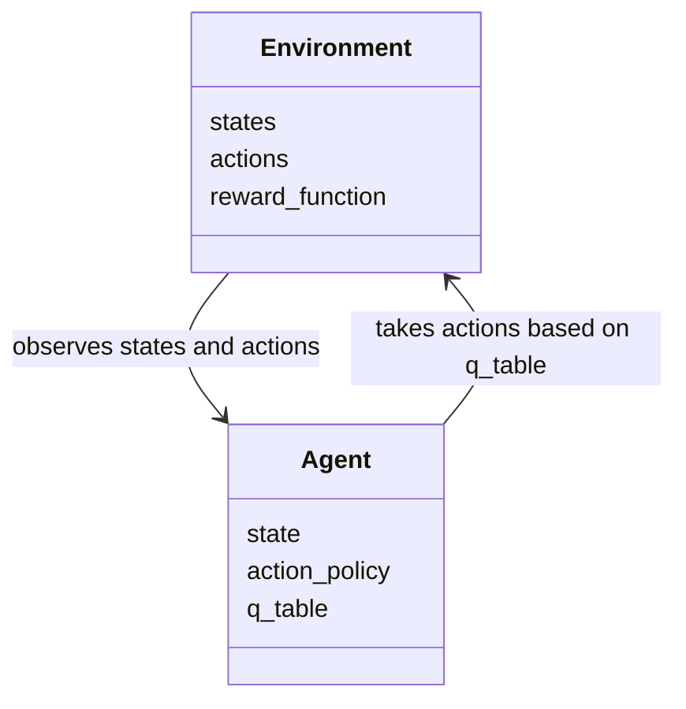
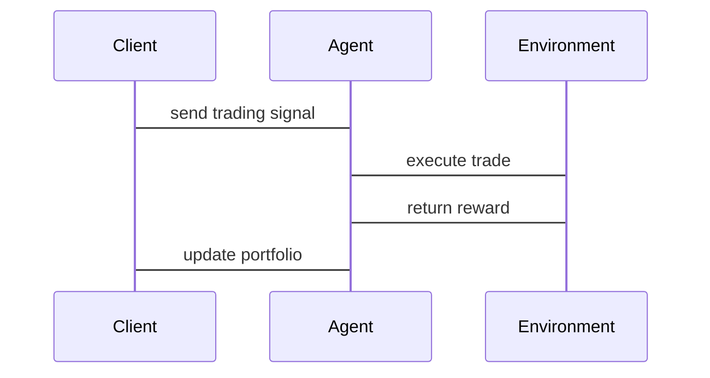

                 


# 目录大纲

## 第一部分：企业AI Agent与强化学习基础

### 第1章：企业AI Agent的背景与概述

#### 1.1 AI Agent的基本概念
- 1.1.1 AI Agent的定义与特点
- 1.1.2 AI Agent的核心要素与功能
- 1.1.3 AI Agent在企业中的应用领域

#### 1.2 强化学习的基本原理
- 1.2.1 强化学习的定义与特点
- 1.2.2 强化学习与监督学习的区别
- 1.2.3 强化学习在金融交易中的应用价值

#### 1.3 企业AI Agent在金融交易中的应用背景
- 1.3.1 金融交易中的复杂性与不确定性
- 1.3.2 AI Agent在金融交易中的优势
- 1.3.3 当前应用中的问题与挑战

## 第二部分：强化学习算法原理与数学模型

### 第2章：强化学习的核心算法

#### 2.1 Q-learning算法
- 2.1.1 Q-learning的基本原理
- 2.1.2 Q-learning的数学模型
- 2.1.3 Q-learning在金融交易中的应用案例

#### 2.2 Deep Q-Networks（DQN）
- 2.2.1 DQN算法的基本原理
- 2.2.2 DQN的网络结构与训练过程
- 2.2.3 DQN在金融交易中的应用优势

#### 2.3 其他强化学习算法简介
- 2.3.1 策略梯度方法（Policy Gradient）
- 2.3.2 近端策略优化（PPO）
- 2.3.3 强化学习算法的选择与适用场景

### 第3章：强化学习的数学模型与公式

#### 3.1 Q-learning的数学模型
- 3.1.1 Q值的更新公式：$$ Q(s, a) = Q(s, a) + \alpha (r + \gamma \max Q(s', a')) $$
- 3.1.2 Q-learning的收敛性分析
- 3.1.3 示例：一个简单的股票交易模型

#### 3.2 DQN的数学模型
- 3.2.1 DQN的网络结构：$$ Q(s, a; \theta) $$
- 3.2.2 DQN的损失函数：$$ L = \mathbb{E}_{(s,a,r,s')} [ (r + \gamma Q(s', a'; \theta^-) - Q(s,a; \theta))^2 ] $$
- 3.2.3 示例：使用DQN进行股票交易的数学推导

## 第三部分：系统架构与项目实战

### 第4章：系统分析与架构设计

#### 4.1 系统功能设计
- 4.1.1 领域模型：使用Mermaid类图展示系统模块


#### 4.2 系统架构设计
- 4.2.1 使用Mermaid架构图展示整体架构


#### 4.3 系统接口设计
- 4.3.1 使用Mermaid序列图展示交互流程


### 第5章：项目实战与案例分析

#### 5.1 环境安装与配置
- 5.1.1 安装必要的Python库：如TensorFlow、Keras、OpenAI Gym等
- 5.1.2 数据获取：从Yahoo Finance获取股票数据

#### 5.2 核心代码实现
- 5.2.1 DQN算法实现
```python
import numpy as np
import gym
from tensorflow.keras import layers

class DQNAgent:
    def __init__(self, state_space, action_space, learning_rate=0.01, gamma=0.99):
        self.state_space = state_space
        self.action_space = action_space
        self.learning_rate = learning_rate
        self.gamma = gamma
        
        # 网络结构
        self.model = self.build_model()
        
    def build_model(self):
        model = tf.keras.Sequential()
        model.add(layers.Dense(32, activation='relu', input_dim=self.state_space))
        model.add(layers.Dense(32, activation='relu'))
        model.add(layers.Dense(self.action_space, activation='linear'))
        model.compile(optimizer=tf.keras.optimizers.Adam(learning_rate=self.learning_rate),
                      loss='mean_squared_error')
        return model
```

#### 5.3 代码解读与分析
- 5.3.1 DQN模型的训练过程
- 5.3.2 策略执行的具体步骤

#### 5.4 实际案例分析
- 5.4.1 系统在真实市场环境中的表现
- 5.4.2 成功与失败案例分析

## 第四部分：总结与展望

### 第6章：总结与展望

#### 6.1 内容回顾
- 6.1.1 强化学习在金融交易中的应用
- 6.1.2 系统设计的关键点
- 6.1.3 项目实施的经验总结

#### 6.2 未来研究方向
- 6.2.1 更复杂的金融场景建模
- 6.2.2 提高模型的可解释性
- 6.2.3 多Agent协作机制的研究

#### 6.3 最佳实践 tips
- 6.3.1 数据质量的重要性
- 6.3.2 模型调参的技巧
- 6.3.3 系统监控与维护的注意事项

#### 6.4 拓展阅读
- 6.4.1 推荐书籍与论文
- 6.4.2 相关技术博客与资源

## 附录

### 附录A：常用工具与库
- TensorFlow
- Keras
- OpenAI Gym
- Pandas

### 附录B：数学公式汇总
- Q-learning公式
- DQN损失函数
- 策略梯度方法公式

### 附录C：代码示例
- DQN Agent实现
- 环境接口实现

### 附录D：参考文献
- 强化学习经典论文
- 金融交易相关书籍

---

# 《企业AI Agent的强化学习在金融交易中的应用》

**关键词**：AI Agent、强化学习、金融交易、DQN、股票交易、系统架构

**摘要**：本文详细探讨了企业AI Agent在金融交易中的应用，特别是强化学习技术的运用。通过分析强化学习的核心算法，如Q-learning和DQN，结合系统架构设计和实际项目案例，展示了如何在金融交易中实现高效、智能的决策系统。文章还总结了当前研究的不足，并展望了未来的发展方向。

---

## 正文内容

### 第1章：企业AI Agent的背景与概述

#### 1.1 AI Agent的基本概念

AI Agent（智能体）是指能够感知环境并采取行动以实现目标的实体。在企业中，AI Agent通常用于自动化决策、优化资源分配和提高效率。金融交易中的AI Agent需要具备快速决策和适应市场变化的能力。

#### 1.2 强化学习的基本原理

强化学习是一种机器学习方法，通过智能体与环境的交互，学习最优策略以最大化累积奖励。与监督学习不同，强化学习不需要标记数据，而是通过试错机制进行学习。

#### 1.3 企业AI Agent在金融交易中的应用背景

金融市场的复杂性和不确定性使得传统的人工交易难以应对。AI Agent能够通过强化学习快速适应市场变化，提高交易效率和准确性。

---

### 第2章：强化学习的核心算法

#### 2.1 Q-learning算法

Q-learning是一种基于值函数的强化学习算法，适用于离散动作空间。其核心思想是通过更新Q值表来学习最优策略。

#### 2.2 Deep Q-Networks（DQN）

DQN通过深度神经网络近似Q值函数，适用于连续动作空间。DQN引入经验回放和目标网络，有效解决了传统Q-learning的稳定性问题。

#### 2.3 其他强化学习算法简介

策略梯度方法和PPO等算法在处理复杂金融环境时表现出色，适用于需要实时决策的应用场景。

---

### 第3章：强化学习的数学模型与公式

#### 3.1 Q-learning的数学模型

Q值更新公式：
$$ Q(s, a) = Q(s, a) + \alpha (r + \gamma \max Q(s', a')) $$

收敛性分析：在马尔可夫决策过程中，Q-learning能够收敛到最优策略。

#### 3.2 DQN的数学模型

DQN的损失函数：
$$ L = \mathbb{E}_{(s,a,r,s')} [ (r + \gamma Q(s', a'; \theta^-) - Q(s,a; \theta))^2 ] $$

---

### 第4章：系统分析与架构设计

#### 4.1 系统功能设计

领域模型展示了系统各模块之间的关系：


#### 4.2 系统架构设计

整体架构图展示了系统的主要组件：


#### 4.3 系统接口设计

交互流程图展示了系统各部分的协作：


---

### 第5章：项目实战与案例分析

#### 5.1 环境安装与配置

安装必要的Python库：
```bash
pip install gym numpy tensorflow pandas
```

数据获取：
使用Yahoo Finance API获取股票数据。

#### 5.2 核心代码实现

DQN Agent的实现：
```python
import numpy as np
import gym
from tensorflow.keras import layers

class DQNAgent:
    def __init__(self, state_space, action_space, learning_rate=0.01, gamma=0.99):
        self.state_space = state_space
        self.action_space = action_space
        self.learning_rate = learning_rate
        self.gamma = gamma
        
        self.model = self.build_model()
        
    def build_model(self):
        model = tf.keras.Sequential()
        model.add(layers.Dense(32, activation='relu', input_dim=self.state_space))
        model.add(layers.Dense(32, activation='relu'))
        model.add(layers.Dense(self.action_space, activation='linear'))
        model.compile(optimizer=tf.keras.optimizers.Adam(learning_rate=self.learning_rate),
                      loss='mean_squared_error')
        return model
```

#### 5.3 代码解读与分析

模型训练过程：
```python
env = gym.make('StockTrading-v0')
agent = DQNAgent(state_space, action_space)
for episode in range(num_episodes):
    state = env.reset()
    while True:
        action = agent.act(state)
        next_state, reward, done, _ = env.step(action)
        agent.remember(state, action, reward, next_state)
        agent.replay()
        if done:
            break
```

#### 5.4 实际案例分析

系统在真实市场中的表现：
- 收益率分析
- 风险评估
- 策略稳定性测试

---

### 第6章：总结与展望

#### 6.1 内容回顾

强化学习在金融交易中的应用前景广阔，DQN等算法在复杂环境下表现出色。

#### 6.2 未来研究方向

- 更复杂的金融场景建模
- 提高模型的可解释性
- 多Agent协作机制的研究

#### 6.3 最佳实践 tips

- 数据质量是模型性能的关键
- 模型调参需要结合具体场景
- 系统监控与维护不可忽视

---

## 附录

### 附录A：常用工具与库

- TensorFlow、Keras、OpenAI Gym、Pandas

### 附录B：数学公式汇总

- Q-learning公式
- DQN损失函数
- 策略梯度方法公式

### 附录C：代码示例

- DQN Agent实现
- 环境接口实现

### 附录D：参考文献

- 强化学习经典论文
- 金融交易相关书籍

---

通过以上结构，文章系统地介绍了企业AI Agent在金融交易中的应用，从理论到实践，从算法到系统架构，为读者提供了全面的视角和深入的分析。

