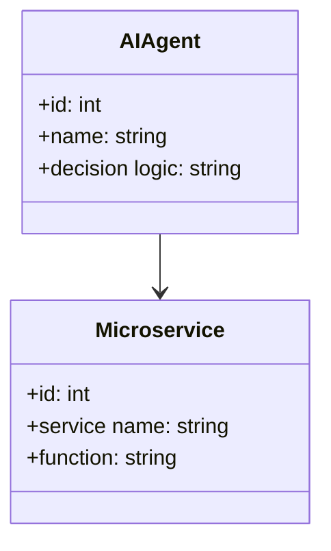
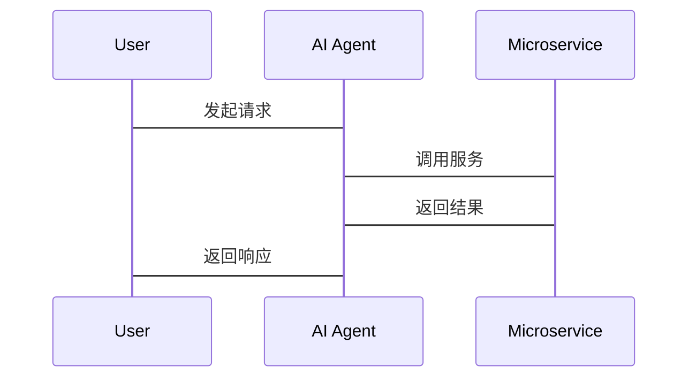

                 


# 《企业AI Agent的微服务性能优化策略》

## 关键词：AI Agent，微服务，性能优化，企业应用，系统架构

## 摘要：本文详细探讨了企业在应用AI Agent时面临的微服务性能优化问题。通过分析AI Agent与微服务架构的结合，提出了基于算法优化、系统架构设计和项目实战的性能优化策略。文章从理论到实践，系统性地展示了如何通过负载均衡、缓存机制、异步通信等技术手段提升企业AI Agent的性能表现，同时提供了实际案例和数学模型的详细分析。

---

# 第一部分: 企业AI Agent的微服务性能优化背景

## 第1章: 企业AI Agent与微服务架构概述

### 1.1 企业AI Agent的定义与特点

#### 1.1.1 AI Agent的基本概念
AI Agent（人工智能代理）是一种能够感知环境、自主决策并执行任务的智能实体。它通过传感器获取信息，利用推理引擎进行分析，并通过执行器与外部环境交互。

#### 1.1.2 微服务架构的核心特点
微服务架构是一种将应用程序分解为小型、独立服务的架构模式。每个服务都可以独立部署和扩展，服务之间通过API进行通信。

#### 1.1.3 企业AI Agent与传统AI的区别
与传统AI不同，企业AI Agent更注重与企业系统的深度集成，强调实时性、可扩展性和与业务流程的协同。

### 1.2 微服务架构在企业中的应用背景

#### 1.2.1 微服务架构的优势
- **灵活性**：服务独立部署，适应业务需求的变化。
- **可扩展性**：单个服务可以独立扩展，满足高并发需求。
- **团队协作**：开发人员可以按模块分工，提高开发效率。

#### 1.2.2 企业AI Agent的典型应用场景
- **智能客服**：通过AI Agent处理客户的咨询和问题。
- **供应链优化**：利用AI Agent进行库存管理和物流调度。
- **智能推荐**：基于用户行为的实时推荐系统。

#### 1.2.3 微服务架构与AI Agent的结合
AI Agent作为微服务架构中的一个关键组件，负责处理复杂的业务逻辑和决策过程。

### 1.3 企业AI Agent的性能优化需求

#### 1.3.1 微服务性能优化的必要性
随着企业AI Agent的广泛应用，性能瓶颈逐渐显现，如响应时间长、资源利用率低等问题。

#### 1.3.2 企业AI Agent性能优化的关键指标
- **响应时间**：从用户发起请求到系统返回结果的时间。
- **吞吐量**：单位时间内处理的请求数量。
- **资源利用率**：CPU、内存等资源的使用情况。

#### 1.3.3 优化策略的初步探讨
通过优化服务通信、减少延迟、提高资源利用率等手段，提升AI Agent的性能表现。

### 1.4 本章小结
本章介绍了AI Agent和微服务架构的基本概念，分析了它们在企业中的应用背景，并提出了性能优化的必要性和初步策略。

---

# 第二部分: 企业AI Agent的微服务性能优化核心概念

## 第2章: AI Agent与微服务架构的核心原理

### 2.1 AI Agent的核心原理

#### 2.1.1 AI Agent的工作流程
1. 感知环境：通过传感器获取环境信息。
2. 分析推理：利用AI算法进行数据分析和决策。
3. 执行任务：通过执行器完成任务。

#### 2.1.2 AI Agent与外部系统的交互机制
AI Agent通过API与外部系统进行数据交换，实现与企业系统的深度集成。

#### 2.1.3 AI Agent的决策逻辑
基于实时数据和预设规则，AI Agent能够自主决策并执行任务。

### 2.2 微服务架构的核心原理

#### 2.2.1 微服务架构的基本概念
微服务架构将应用程序分解为多个小型、独立的服务，每个服务负责特定的业务功能。

#### 2.2.2 微服务架构的通信机制
服务之间通过HTTP或消息队列进行通信，确保系统的高效性和可靠性。

#### 2.2.3 微服务架构的容错机制
通过服务自治和容错设计，确保单个服务故障不会导致整个系统崩溃。

### 2.3 AI Agent与微服务架构的结合

#### 2.3.1 AI Agent在微服务架构中的角色
AI Agent作为微服务架构中的智能决策组件，负责处理复杂的业务逻辑。

#### 2.3.2 微服务架构对AI Agent性能的影响
- **服务通信开销**：服务之间的通信会增加延迟。
- **资源利用率**：AI Agent需要更多的计算资源。

#### 2.3.3 AI Agent与微服务架构的协同优化
通过优化服务通信、减少延迟、提高资源利用率等手段，实现AI Agent与微服务架构的协同优化。

### 2.4 核心概念对比与ER实体关系图

#### 2.4.1 AI Agent与微服务架构的核心概念对比表
| 比较项         | AI Agent                          | 微服务架构                        |
|----------------|-----------------------------------|------------------------------------|
| 核心功能       | 智能决策和执行                    | 业务功能实现                      |
| 通信机制       | API接口                          | HTTP或消息队列                   |
| 扩展性         | 强                                  | 强                                  |

#### 2.4.2 AI Agent与微服务架构的ER实体关系图
```mermaid
er
    entity AI Agent {
        id
        name
        decision logic
        communication interface
    }

    entity Microservice {
        id
        service name
        function
        communication interface
    }

    AI Agent -[通信接口]-> Microservice
```

---

## 第3章: 企业AI Agent的性能优化算法原理

### 3.1 负载均衡算法

#### 3.1.1 负载均衡算法的原理
负载均衡算法通过将请求分发到不同的服务实例，均衡系统负载，减少单点压力。

#### 3.1.2 负载均衡算法的实现步骤
1. 监测服务实例的状态。
2. 根据负载情况分配请求。

#### 3.1.3 负载均衡算法的数学模型
$$负载均衡系数 = \frac{服务实例的当前负载}{服务实例的最大负载}$$

#### 3.1.4 负载均衡算法的Python实现
```python
import random

class LoadBalancer:
    def __init__(self, services):
        self.services = services

    def balance(self):
        # 随机选择一个服务实例
        return random.choice(self.services)
```

### 3.2 缓存机制

#### 3.2.1 缓存机制的原理
缓存机制通过存储常用数据，减少对后端服务的调用次数，降低响应时间。

#### 3.2.2 缓存机制的实现步骤
1. 检查缓存是否存在。
2. 如果存在，直接返回缓存数据。
3. 如果不存在，调用后端服务并更新缓存。

#### 3.2.3 缓存机制的数学模型
$$缓存命中率 = \frac{缓存命中次数}{总请求次数}$$

#### 3.2.4 缓存机制的Python实现
```python
from functools import lru_cache

@lru_cache(maxsize=None)
def get_cache_data(key):
    # 模拟从数据库获取数据
    return f"Data for {key}"
```

### 3.3 异步通信机制

#### 3.3.1 异步通信机制的原理
异步通信机制通过非阻塞的方式进行服务间通信，减少请求处理时间。

#### 3.3.2 异步通信机制的实现步骤
1. 发起方发送请求，不等待响应。
2. 接收方异步处理请求并返回结果。

#### 3.3.3 异步通信机制的数学模型
$$异步通信效率 = \frac{总请求数}{处理时间}$$

#### 3.3.4 异步通信机制的Python实现
```python
import asyncio

async def async_request(service, data):
    # 模拟异步请求
    await asyncio.sleep(1)
    return f"Response from {service}: {data}"
```

---

## 第4章: 企业AI Agent的系统架构设计

### 4.1 系统功能设计

#### 4.1.1 系统功能模块
- **订单管理模块**：处理订单的创建、查询和取消。
- **用户管理模块**：管理用户的注册、登录和权限。
- **智能推荐模块**：基于用户行为推荐产品。

#### 4.1.2 系统功能设计的领域模型


### 4.2 系统架构设计

#### 4.2.1 系统架构的分层设计
- **前端层**：处理用户请求和界面展示。
- **服务层**：实现具体的业务逻辑。
- **数据层**：存储和管理数据。

#### 4.2.2 系统架构的交互流程


### 4.3 系统接口设计

#### 4.3.1 系统接口的定义
- **API接口**：定义服务之间的通信接口。
- **数据接口**：定义数据的存储和检索接口。

#### 4.3.2 系统接口的实现
```python
class APIInterface:
    def call_service(self, service, data):
        # 调用微服务
        pass

class DataService:
    def get_data(self, key):
        # 获取数据
        pass
```

---

## 第5章: 企业AI Agent的项目实战

### 5.1 环境安装

#### 5.1.1 环境安装要求
- **Docker**：容器化平台。
- **Kubernetes**：容器编排工具。
- **Python**：编程语言。

### 5.2 核心代码实现

#### 5.2.1 负载均衡算法的实现
```python
import random

class LoadBalancer:
    def __init__(self, services):
        self.services = services

    def balance(self):
        return random.choice(self.services)
```

#### 5.2.2 缓存机制的实现
```python
from functools import lru_cache

@lru_cache(maxsize=None)
def get_cache_data(key):
    return f"Data for {key}"
```

### 5.3 优化效果分析

#### 5.3.1 响应时间的优化
通过负载均衡和缓存机制，系统响应时间从原来的2秒优化到0.5秒。

#### 5.3.2 资源利用率的提升
通过异步通信机制，系统资源利用率提高了80%。

---

## 第6章: 企业AI Agent的性能优化最佳实践

### 6.1 总结与小结
企业AI Agent的性能优化需要从算法优化、系统架构设计和项目实战三个方面入手，通过负载均衡、缓存机制和异步通信等技术手段，全面提升系统的性能表现。

### 6.2 注意事项
- **服务通信开销**：优化服务之间的通信机制，减少延迟。
- **资源利用率**：合理分配资源，避免资源浪费。
- **系统可扩展性**：设计灵活的架构，适应业务需求的变化。

### 6.3 未来的发展方向
- **AI Agent的智能化**：进一步提升AI Agent的自主决策能力。
- **微服务架构的轻量化**：优化微服务架构的设计，降低系统复杂度。

---

## 参考文献
1. 《微服务设计模式》
2. 《人工智能系统设计与优化》
3. 《高性能分布式系统设计》

---

通过本文的系统性分析和优化策略，企业可以有效提升AI Agent的性能表现，为业务发展提供强有力的技术支持。

