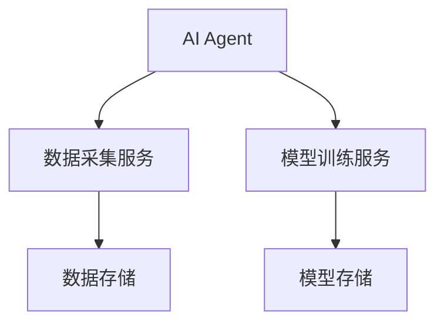
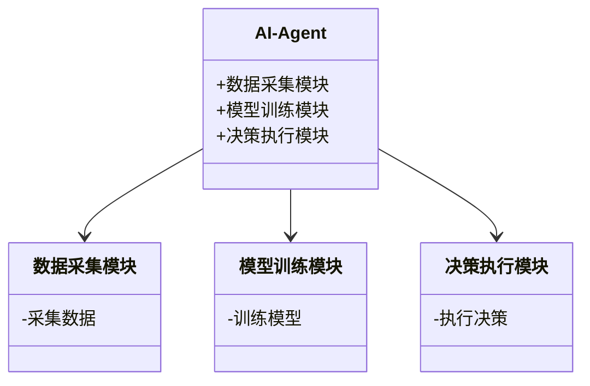
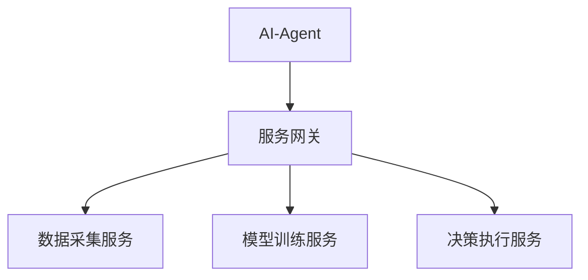
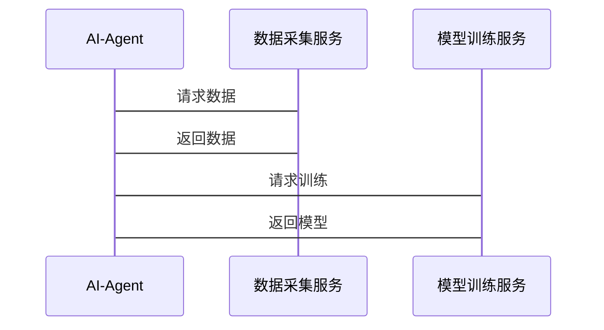

                 

# 企业AI Agent的微服务架构优化策略

> **关键词**: 企业AI Agent, 微服务架构, AI代理, 分布式系统, 服务化设计, 算法优化

> **摘要**: 企业AI Agent在复杂业务环境中需要高效的微服务架构支持。本文系统阐述了AI Agent的定义、特点及其在企业中的应用场景，分析了微服务架构的优势与挑战。通过详细的技术分析，提出了基于微服务架构的优化策略，包括算法优化、系统设计和项目实施等，为企业的AI Agent构建提供了理论支持和实践指导。

---

## 第1章: 企业AI Agent的背景与挑战

### 1.1 企业AI Agent的定义与特点

#### 1.1.1 AI Agent的基本概念

AI Agent（人工智能代理）是指能够感知环境、自主决策并执行任务的智能实体。在企业环境中，AI Agent通常用于自动化业务流程、优化资源配置和提升用户体验。例如，智能客服系统中的虚拟助手就是一个典型的AI Agent。

#### 1.1.2 企业AI Agent的核心特点

- **自主性**: 能够独立感知环境并做出决策。
- **反应性**: 能够实时响应环境变化。
- **协作性**: 能够与其他系统或AI Agent协同工作。
- **学习能力**: 通过数据和反馈不断优化自身的行为。

#### 1.1.3 企业AI Agent的应用场景

- **智能客服**: 提供24/7的客户支持。
- **自动化流程**: 自动处理订单、审批等业务。
- **预测分析**: 基于历史数据预测市场趋势。

### 1.2 微服务架构的概述

#### 1.2.1 微服务架构的基本概念

微服务架构是一种将应用程序分解为多个小型、独立服务的设计模式。每个服务负责特定的业务功能，通过API进行通信。这种架构具有高扩展性、灵活性和可维护性。

#### 1.2.2 微服务架构的优势与劣势

- **优势**:
  - 高度模块化，便于开发和维护。
  - 支持分布式部署，提高系统的可用性。
- **劣势**:
  - 增加了系统的复杂性。
  - 需要额外的通信机制，可能影响性能。

#### 1.2.3 微服务架构在企业中的应用现状

微服务架构在企业中广泛应用于电子商务、金融交易和物联网等领域。通过微服务架构，企业能够快速响应市场变化，提高系统的灵活性。

### 1.3 企业AI Agent与微服务架构的结合

#### 1.3.1 企业AI Agent的复杂性与挑战

- 复杂的业务逻辑。
- 多样化的数据源。
- 高实时性的要求。

#### 1.3.2 微服务架构在AI Agent中的作用

- 提供高效的通信机制。
- 支持模块化设计，便于扩展和维护。
- 通过分布式计算提高系统的性能。

#### 1.3.3 企业AI Agent微服务化的必要性

- 提高系统的可扩展性。
- 优化资源利用率。
- 降低系统的耦合性，提高系统的容错性。

---

## 第2章: 企业AI Agent的微服务架构核心概念

### 2.1 AI Agent的核心概念与原理

#### 2.1.1 AI Agent的智能决策机制

AI Agent通过感知环境、分析信息并做出决策。其决策机制通常包括数据采集、数据处理、模型训练和决策执行四个阶段。

#### 2.1.2 AI Agent的交互模式

- **同步交互**: 实时响应用户请求。
- **异步交互**: 接收请求后异步处理。
- **事件驱动**: 基于事件触发响应。

#### 2.1.3 AI Agent的自主性与协作性

AI Agent需要具备自主决策的能力，同时能够与其他系统或AI Agent协作完成复杂任务。协作性通常通过分布式系统和通信协议实现。

### 2.2 微服务架构的核心概念与原理

#### 2.2.1 微服务的定义与特征

微服务是一种将应用程序分解为多个小型、独立服务的设计模式。每个服务负责特定的业务功能，通过API进行通信。

#### 2.2.2 微服务架构的优势与劣势

- **优势**:
  - 高度模块化，便于开发和维护。
  - 支持分布式部署，提高系统的可用性。
- **劣势**:
  - 增加了系统的复杂性。
  - 需要额外的通信机制，可能影响性能。

#### 2.2.3 微服务架构在企业中的应用现状

微服务架构在企业中广泛应用于电子商务、金融交易和物联网等领域。通过微服务架构，企业能够快速响应市场变化，提高系统的灵活性。

### 2.3 AI Agent与微服务架构的关系

#### 2.3.1 AI Agent的功能模块化

AI Agent的功能模块化是实现微服务架构的基础。每个功能模块对应一个独立的服务，通过API进行通信。

#### 2.3.2 微服务架构对AI Agent的优化作用

- 提高系统的可扩展性。
- 优化资源利用率。
- 降低系统的耦合性，提高系统的容错性。

#### 2.3.3 AI Agent微服务化的实现方式

- **服务化设计**: 将AI Agent的功能模块化为独立的服务。
- **分布式计算**: 利用分布式系统提高计算效率。
- **事件驱动**: 通过事件驱动实现服务间的高效通信。

---

## 第3章: 企业AI Agent微服务架构的核心要素

### 3.1 企业AI Agent的业务逻辑分解

#### 3.1.1 AI Agent的业务流程分析

AI Agent的业务流程通常包括需求分析、数据采集、模型训练、决策执行和结果反馈五个阶段。

#### 3.1.2 业务逻辑的模块化设计

将业务逻辑分解为多个模块，每个模块对应一个独立的服务。例如，数据采集模块、模型训练模块和决策执行模块。

#### 3.1.3 业务逻辑的交互设计

通过API实现模块之间的交互。例如，数据采集模块通过API将数据传递给模型训练模块。

### 3.2 微服务架构的组件划分

#### 3.2.1 服务的划分原则

- **业务功能独立**: 每个服务负责特定的业务功能。
- **数据独立**: 每个服务独立管理其数据。
- **松耦合**: 服务之间通过API进行通信，避免强耦合。

#### 3.2.2 服务的交互方式

- **REST API**: 基于HTTP协议的API。
- **RPC**: 远程过程调用。
- **消息队列**: 通过消息队列实现异步通信。

#### 3.2.3 服务的依赖管理

- **依赖注入**: 通过依赖注入实现服务之间的依赖管理。
- **容器化部署**: 使用容器技术实现服务的独立部署和管理。

### 3.3 AI Agent微服务架构的实体关系

#### 3.3.1 实体关系图的构建

通过Mermaid图展示AI Agent微服务架构的实体关系。

#### 3.3.2 实体关系的动态变化

通过动态调整服务的交互方式，优化系统的性能和功能。

#### 3.3.3 实体关系的优化策略

- **服务发现**: 自动发现服务并建立连接。
- **负载均衡**: 均衡分配请求，提高系统的可用性。
- **容错机制**: 处理服务故障，保证系统的稳定性。

---

## 第4章: 企业AI Agent微服务架构的算法原理

### 4.1 AI Agent的核心算法

#### 4.1.1 强化学习算法

强化学习是一种通过试错机制优化决策的算法。通过奖励机制，AI Agent能够不断优化其决策策略。

#### 4.1.2 推荐算法

推荐算法基于用户行为和数据特征，预测用户的偏好，推荐个性化的内容。

#### 4.1.3 自然语言处理算法

自然语言处理算法用于理解和生成人类语言，如情感分析、文本分类等。

### 4.2 微服务架构的算法优化

#### 4.2.1 分布式计算优化

通过分布式计算，提高算法的计算效率。例如，利用MapReduce进行数据处理。

#### 4.2.2 并行计算优化

通过并行计算，加速算法的执行速度。例如，利用多线程或分布式计算框架。

#### 4.2.3 模型优化

通过模型压缩、量化等技术，优化模型的大小和计算效率。

---

## 第5章: 企业AI Agent微服务架构的系统设计

### 5.1 系统分析与架构设计

#### 5.1.1 问题场景介绍

AI Agent需要在复杂多变的环境中，快速响应用户请求，优化决策策略。

#### 5.1.2 系统功能设计

通过Mermaid类图展示系统功能模块。

#### 5.1.3 系统架构设计

通过Mermaid架构图展示系统的整体架构。

#### 5.1.4 系统接口设计

通过API实现服务之间的通信。例如，AI-Agent通过API调用数据采集服务获取数据。

#### 5.1.5 系统交互设计

通过Mermaid序列图展示系统的交互流程。

### 5.2 项目实战

#### 5.2.1 环境安装

安装必要的工具和框架，例如Python、Django框架、Docker等。

#### 5.2.2 核心代码实现

编写AI Agent的微服务架构的核心代码，例如数据采集模块、模型训练模块和决策执行模块。

#### 5.2.3 代码应用解读与分析

解读核心代码，分析其功能和实现方式。

#### 5.2.4 实际案例分析

通过实际案例分析，展示AI Agent微服务架构的应用效果。

#### 5.2.5 项目小结

总结项目的实施过程和取得的成果。

---

## 第6章: 企业AI Agent微服务架构的最佳实践

### 6.1 最佳实践 tips

- **服务划分**: 合理划分服务，避免过度分割。
- **通信机制**: 选择合适的通信机制，优化系统的性能。
- **依赖管理**: 有效管理服务之间的依赖关系。
- **容错机制**: 建立完善的容错机制，保证系统的稳定性。

### 6.2 小结

本文系统阐述了企业AI Agent的定义、特点及其在企业中的应用场景，分析了微服务架构的优势与挑战。通过详细的技术分析，提出了基于微服务架构的优化策略，包括算法优化、系统设计和项目实施等，为企业的AI Agent构建提供了理论支持和实践指导。

### 6.3 注意事项

- **数据安全**: 注意数据的安全性，防止数据泄露。
- **性能优化**: 持续优化系统的性能，提高用户体验。
- **可扩展性**: 确保系统的可扩展性，适应业务的变化。

### 6.4 拓展阅读

- **微服务架构**: 推荐阅读《微服务设计模式》。
- **AI Agent**: 推荐阅读《人工智能代理设计》。
- **算法优化**: 推荐阅读《算法优化实战》。

---

通过以上步骤，我们可以清晰地看到企业AI Agent的微服务架构优化策略的实施过程和关键点。希望本文能为企业的AI Agent构建提供有价值的参考和指导。

