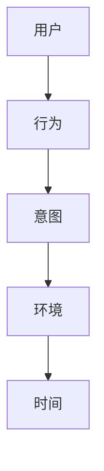
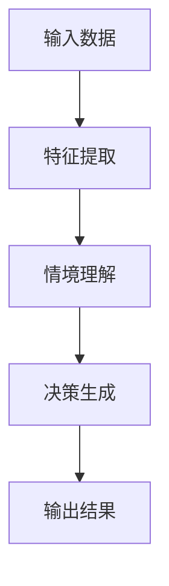
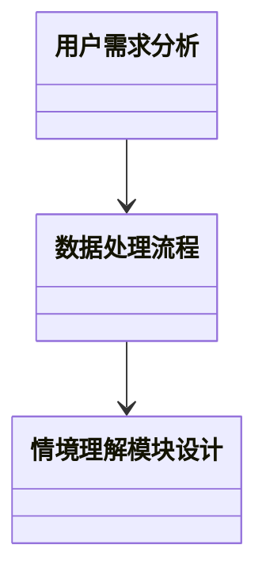

                 

# 《企业AI Agent的情境感知能力：提升用户体验》

## 关键词：企业AI Agent，情境感知，用户体验，人工智能，自然语言处理，机器学习

## 摘要：本文探讨企业AI Agent的情境感知能力如何提升用户体验。通过分析情境感知的核心概念、算法原理、系统架构及项目实战，结合最佳实践，为企业AI Agent的设计与优化提供指导。

---

## 目录大纲

### 第一部分: 情境感知能力的背景与定义

#### 第1章: 情境感知能力的背景与定义

##### 1.1 情境感知能力的定义
- 1.1.1 什么是情境感知能力
- 1.1.2 情境感知能力的核心要素
- 1.1.3 情境感知能力与用户体验的关系

##### 1.2 企业AI Agent的定义与特点
- 1.2.1 企业AI Agent的基本概念
- 1.2.2 企业AI Agent的核心功能
- 1.2.3 企业AI Agent与传统AI的区别

##### 1.3 情境感知能力在企业AI Agent中的重要性
- 1.3.1 提升用户体验的关键作用
- 1.3.2 情境感知能力对企业效率的提升
- 1.3.3 情境感知能力在企业数字化转型中的地位

#### 1.4 本章小结

---

### 第二部分: 情境感知能力的核心概念与联系

#### 第2章: 情境感知能力的核心概念与联系

##### 2.1 情境感知能力的原理
- 2.1.1 感知层：数据采集与分析
- 2.1.2 决策层：情境理解与推理
- 2.1.3 执行层：智能决策与反馈

##### 2.2 情境感知能力的核心要素
- 2.2.1 数据源：环境信息的获取
- 2.2.2 知识库：领域知识的存储与应用
- 2.2.3 智能算法：情境理解与决策的核心

##### 2.3 情境感知能力与相关概念的对比
- 2.3.1 情境感知能力与自然语言处理的对比
- 2.3.2 情境感知能力与计算机视觉的对比
- 2.3.3 情境感知能力与机器学习的对比

##### 2.4 情境感知能力的ER实体关系图

#### 2.5 本章小结

---

### 第三部分: 情境感知能力的算法原理

#### 第3章: 情境感知能力的算法原理

##### 3.1 注意力机制在情境感知中的应用
- 3.1.1 注意力机制的基本原理
- 3.1.2 注意力机制的数学模型
- 3.1.3 使用Python实现注意力机制的示例代码

##### 3.2 强化学习在情境决策中的应用
- 3.2.1 强化学习的基本原理
- 3.2.2 强化学习的数学模型
- 3.2.3 使用Python实现强化学习的示例代码

##### 3.3 情境感知算法的流程图

#### 3.4 本章小结

---

### 第四部分: 系统分析与架构设计

#### 第4章: 系统分析与架构设计

##### 4.1 问题场景介绍
- 4.1.1 用户需求分析
- 4.1.2 数据处理流程
- 4.1.3 情境理解模块设计

##### 4.2 系统功能设计
- 4.2.1 领域模型设计
- 4.2.2 系统架构设计
- 4.2.3 接口设计与交互流程

##### 4.3 系统架构图

#### 4.4 本章小结

---

### 第五部分: 项目实战

#### 第5章: 项目实战

##### 5.1 环境安装与配置
- 5.1.1 安装Python环境
- 5.1.2 安装必要的库和工具

##### 5.2 核心代码实现
- 5.2.1 情境感知算法的实现
- 5.2.2 系统接口的设计与实现

##### 5.3 代码解读与分析
- 5.3.1 关键代码段解读
- 5.3.2 代码功能分析

##### 5.4 实际案例分析
- 5.4.1 案例背景介绍
- 5.4.2 案例实现过程
- 5.4.3 案例结果分析

#### 5.5 项目小结

---

### 第六部分: 最佳实践

#### 第6章: 最佳实践

##### 6.1 小结
- 6.1.1 核心概念回顾
- 6.1.2 关键技术总结
- 6.1.3 实际应用中的注意事项

##### 6.2 注意事项
- 6.2.1 开发中的常见问题
- 6.2.2 优化建议
- 6.2.3 部署中的注意事项

##### 6.3 拓展阅读
- 6.3.1 相关领域的最新研究
- 6.3.2 未来发展趋势
- 6.3.3 进一步学习的资源推荐

#### 6.4 本章小结

---

### 附录

#### 附录A: 术语表
- 附录A.1 关键术语解释
- 附录A.2 术语表

#### 附录B: 参考文献
- 附录B.1 主要参考文献
- 附录B.2 进一步阅读的推荐资料

---

## 总结

以上目录大纲涵盖了《企业AI Agent的情境感知能力：提升用户体验》的各个方面，从背景介绍到项目实战，再到最佳实践，内容全面且逻辑清晰。每章内容都详细展开，确保读者能够深入了解情境感知能力的核心概念、算法原理和实际应用。

