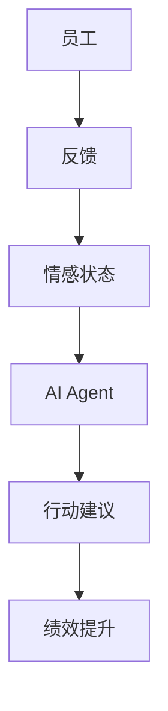
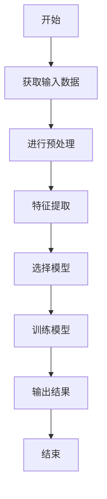
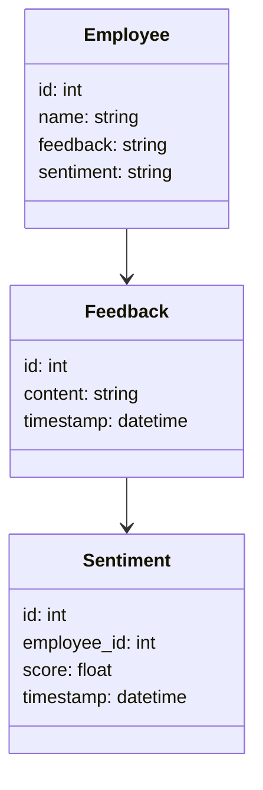
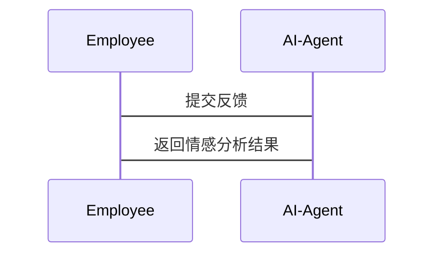

                 


# 企业AI Agent的情感智能：提升员工体验与忠诚度

## 关键词：企业AI Agent、情感智能、员工体验、员工忠诚度、AI技术、人机交互、情感分析

## 摘要：  
在现代企业环境中，员工体验和忠诚度是决定企业成功的关键因素。通过AI Agent的情感智能技术，企业能够实时分析员工情绪，提供个性化的支持，从而提升员工满意度和忠诚度。本文深入探讨企业AI Agent的情感智能，分析其核心概念、算法原理、系统架构，并结合实际案例，展示如何通过AI技术实现员工体验的优化与忠诚度的提升。

---

## 第一部分：企业AI Agent的情感智能概述

### 第1章：背景介绍

#### 1.1 企业AI Agent的基本概念
- **什么是企业AI Agent**  
  企业AI Agent是一种智能化的管理工具，能够通过自然语言处理、机器学习等技术，与员工进行交互，并根据员工的情绪和需求提供实时反馈和支持。
- **情感智能的定义与特征**  
  情感智能（Emotional Intelligence, EI）是AI Agent的核心能力之一，它能够识别、理解和分析人类的情感，并基于这些信息做出相应的决策或建议。
- **企业AI Agent与情感智能的关系**  
  AI Agent通过情感智能技术，能够更好地理解员工的需求和情绪，从而提供更加个性化的服务，增强员工的归属感和忠诚度。

#### 1.2 问题背景与描述
- **当前企业员工管理中的痛点**  
  - 沟通不畅：员工与管理层之间的信息传递存在障碍，导致员工需求无法及时被满足。  
  - 缺乏反馈机制：员工对公司的不满或建议往往无法得到有效反馈，导致员工满意度下降。  
  - 员工流失率高：由于缺乏情感支持和职业发展机会，员工容易流失，影响企业的稳定性。  
- **情感智能在员工体验中的作用**  
  - 提供实时情感反馈：通过情感分析技术，AI Agent能够快速识别员工的情绪状态，并提供相应的支持。  
  - 增强员工参与感：通过个性化的互动，员工感受到被关注和重视，从而增强对企业的忠诚度。  
- **提升员工忠诚度的必要性**  
  - 忠诚的员工能够为企业创造更大的价值，同时降低招聘和培训的成本。  
  - 忠诚的员工更愿意为企业付出额外努力，推动企业目标的实现。

#### 1.3 问题解决与边界
- **情感智能如何解决员工问题**  
  - 通过情感分析技术，AI Agent能够识别员工的情绪，并提供相应的解决方案。  
  - 通过情感记忆技术，AI Agent能够记录员工的历史情绪数据，分析情绪变化趋势，提供预防性支持。  
- **企业AI Agent的应用边界**  
  - AI Agent主要用于辅助员工管理，而不是完全替代人类管理者。  
  - 情感智能的应用需要遵守数据隐私保护的相关法律法规。  
- **情感智能的外延与限制**  
  - 情感智能可以应用于招聘、培训、绩效管理等多个领域。  
  - 由于情感数据的复杂性，AI Agent在处理某些情感问题时可能仍需人类的辅助决策。

### 第2章：核心概念与联系

#### 2.1 情感智能的核心原理
- **情感识别的算法基础**  
  情感识别主要依赖于自然语言处理（NLP）和机器学习技术。例如，支持向量机（SVM）和长短期记忆网络（LSTM）常用于情感分类任务。  
- **情感分析的数学模型**  
  情感分析模型通常基于概率论，例如朴素贝叶斯（Naive Bayes）模型。模型通过计算文本中关键词的概率分布，来预测文本的情感倾向。  
- **情感记忆的存储机制**  
  情感记忆可以通过数据库或知识图谱进行存储，记录员工在不同时间点的情感状态，以便后续分析和预测。

#### 2.2 核心概念对比表
| **概念**       | **传统AI**         | **情感智能**       | **员工忠诚度**      |
|----------------|-------------------|-------------------|--------------------|
| 核心能力       | 数据处理、逻辑推理 | 情感识别、情绪分析 | 员工满意度、归属感  |
| 应用场景       | 知识检索、流程自动化 | 员工反馈、情绪支持 | 人才保留、团队协作  |
| 优势           | 高效、精准       | 个性化、情感支持   | 提高员工忠诚度      |
| 限制           | 缺乏情感理解       | 数据隐私问题       | 技术依赖性高         |

#### 2.3 ER实体关系图


### 第3章：算法原理与实现

#### 3.1 情感智能算法概述
- **情感分析算法**  
  情感分析算法用于识别文本中的情感倾向，通常采用监督学习方法，通过训练数据进行分类。  
- **情感记忆算法**  
  情感记忆算法用于记录和分析员工的历史情感数据，帮助AI Agent更好地预测未来的情感变化。  
- **情感预测算法**  
  情感预测算法基于历史数据，预测员工未来的情感状态，从而提前采取干预措施。

#### 3.2 情感分析算法流程图


#### 3.3 算法实现代码
```python
def sentiment_analysis(text):
    # 预处理
    processed_text = preprocess(text)
    # 特征提取
    features = extract_features(processed_text)
    # 选择模型
    model = load_model('sentiment_model')
    # 预测
    prediction = model.predict(features)
    return prediction[0]
```

#### 3.4 数学模型与公式
- **情感分析的概率模型**  
  情感分析的分类问题可以表示为一个概率分类问题，使用贝叶斯定理进行求解。  
  $$ P(y|x) = \frac{P(x|y)P(y)}{P(x)} $$  
  其中，$y$ 表示情感类别（如正面、负面），$x$ 表示输入文本的特征向量。

---

## 第二部分：系统分析与架构设计

### 第4章：系统分析与架构设计

#### 4.1 问题场景介绍
- **员工反馈平台**  
  企业可以建立一个员工反馈平台，员工可以通过文本、语音或表情等方式提交反馈。  
- **实时情感监测**  
  AI Agent需要实时监测员工的情绪变化，及时发现潜在问题。

#### 4.2 系统功能设计


#### 4.3 系统架构设计


#### 4.4 系统接口设计
- **API接口**  
  AI Agent通过RESTful API与员工交互，接收反馈数据并返回情感分析结果。  
- **交互序列图**  


---

## 第三部分：项目实战

### 第5章：项目实战

#### 5.1 环境安装
- **安装Python和相关库**  
  需要安装Python 3.x，以及以下库：  
  - `numpy`  
  - `pandas`  
  - `scikit-learn`  
  - `transformers`

#### 5.2 核心代码实现
```python
from transformers import pipeline

# 初始化情感分析模型
sentiment_analyzer = pipeline("sentiment-analysis")

def analyze_sentiment(text):
    result = sentiment_analyzer(text)
    return result[0]['label']

# 示例
text = "我对公司的新政策感到不满。"
print(analyze_sentiment(text))  # 输出：'negative'
```

#### 5.3 代码解读与分析
- **模型加载**  
  使用预训练的情感分析模型，快速进行情感分类。  
- **数据处理**  
  对输入文本进行预处理，提取特征并进行分类。

#### 5.4 实际案例分析
- **案例背景**  
  某公司员工反映工作压力大，AI Agent通过情感分析识别到负面情绪，并建议公司提供心理咨询服务。  
- **实施效果**  
  员工情绪得到缓解，工作效率提升，员工满意度提高。

---

## 第四部分：最佳实践与未来展望

### 第6章：最佳实践

#### 6.1 实施建议
- **数据隐私保护**  
  在处理员工情感数据时，必须遵守数据隐私保护法规。  
- **模型优化**  
  定期更新情感分析模型，提高分类准确率。  
- **员工培训**  
  对员工进行培训，使其了解AI Agent的功能和使用方法。

#### 6.2 小结
- **核心优势**  
  情感智能能够帮助企业更好地管理员工，提升员工体验和忠诚度。  
- **系统特点**  
  企业AI Agent通过实时情感监测和个性化支持，优化员工管理流程。

#### 6.3 注意事项
- **数据质量**  
  情感分析结果的准确性依赖于高质量的数据。  
- **技术挑战**  
  情感数据的复杂性可能影响模型的性能。  
- **员工接受度**  
  需要确保员工接受AI Agent的存在，避免抵触情绪。

#### 6.4 拓展阅读
- **推荐书籍**  
  - 《人工智能：一种现代的方法》  
  - 《情感计算：人类与计算机的情感互动》  
- **推荐资源**  
  - [Transformers库官方文档](https://huggingface.co/transformers)  
  - [情感分析任务的基准数据集](https://huggingface.co/datasets/sentiment)

---

## 结语  
企业AI Agent的情感智能技术正在改变员工管理的方式，通过实时情感监测和个性化支持，企业能够更好地提升员工体验和忠诚度。未来，随着AI技术的不断发展，情感智能将在企业管理中发挥更大的作用。

