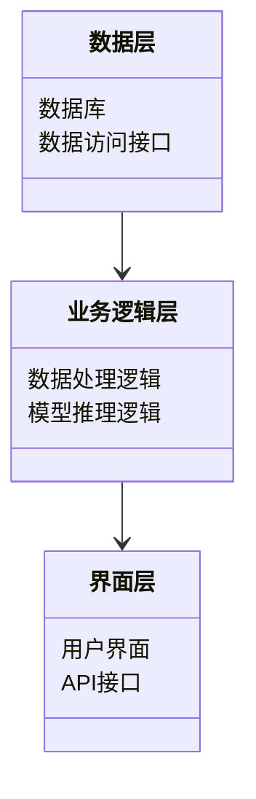

                 


# 企业AI Agent的持续集成与持续部署(CI/CD)实践

> 关键词：企业AI Agent, CI/CD, 持续集成, 持续部署, 人工智能, 软件架构

> 摘要：本文深入探讨了企业AI Agent在持续集成与持续部署（CI/CD）中的实践。通过分析AI Agent的系统架构、CI/CD的核心概念、算法原理、项目实战和最佳实践，本文为读者提供了从理论到实践的全面指导。结合实际案例和代码实现，本文详细阐述了如何在企业级AI Agent开发中实现高效的CI/CD流程。

---

## 第一章: 企业AI Agent的背景与价值

### 1.1 企业AI Agent的概念与定义

#### 1.1.1 什么是AI Agent
AI Agent（人工智能代理）是一种能够感知环境、自主决策并执行任务的智能实体。它能够通过传感器获取信息，利用算法进行分析和推理，并通过执行器与环境交互。

**AI Agent的核心特征**：
- **自主性**：无需外部干预，自主决策。
- **反应性**：能够实时感知环境并做出响应。
- **目标导向性**：具备明确的目标，驱动行为。
- **学习能力**：通过经验优化自身行为。

#### 1.1.2 企业级AI Agent的特殊性
企业AI Agent不同于个人助手（如Siri、Alexa），它需要处理复杂的业务逻辑，具备高可用性和可扩展性。例如，在企业级AI Agent中，需要处理大量数据，支持分布式部署，并满足严格的SLA（服务级别协议）。

### 1.2 持续集成与持续部署（CI/CD）的背景

#### 1.2.1 CI/CD的定义与作用
CI（持续集成）是指频繁地将代码合并到主分支，并通过自动化构建和测试确保代码质量。CD（持续部署）是指将代码从开发环境逐步推向生产环境，通过自动化流程确保每个版本的稳定性和可回滚性。

#### 1.2.2 AI开发中的CI/CD挑战
AI开发与传统软件开发不同，模型训练、数据准备和部署环境的复杂性使得CI/CD的实现更具挑战性。例如，AI模型的训练数据变更可能需要重新训练整个模型，这会增加CI/CD的复杂性。

#### 1.2.3 企业AI Agent的CI/CD价值
通过CI/CD，企业AI Agent可以实现快速迭代、高质量交付和高可用性。CI/CD能够显著缩短开发周期，降低风险，并提高开发效率。

---

## 第二章: 企业AI Agent的系统架构与设计

### 2.1 AI Agent的系统模块划分

#### 2.1.1 数据采集模块
数据采集模块负责从企业系统中获取数据，例如从数据库、日志系统或外部API获取数据。

#### 2.1.2 模型训练模块
模型训练模块负责对数据进行预处理、特征提取和模型训练，生成可用于推理的模型。

#### 2.1.3 模型部署模块
模型部署模块将训练好的模型部署到生产环境，使其能够实时处理请求。

#### 2.1.4 交互控制模块
交互控制模块负责处理用户的输入，调用模型进行推理，并将结果返回给用户。

### 2.2 系统架构的分层设计

#### 2.2.1 数据层
数据层负责数据的存储和管理，包括数据源、数据存储和数据访问接口。

#### 2.2.2 业务逻辑层
业务逻辑层负责处理用户的请求，调用模型进行推理，并返回结果。

#### 2.2.3 界面层
界面层负责与用户的交互，接收输入并展示输出结果。

#### 2.2.4 接口层
接口层负责与其他系统或服务进行通信，例如与企业内部系统集成。

### 2.3 系统架构的Mermaid图



---

## 第三章: 企业AI Agent的持续集成与持续部署（CI/CD）实现

### 3.1 CI/CD的核心概念

#### 3.1.1 CI与CD的区别
- CI（持续集成）：强调代码的频繁合并和自动化测试。
- CD（持续部署）：强调代码的自动化交付和版本控制。

#### 3.1.2 AI Agent中的CI/CD挑战
- 数据变更对模型的影响
- 模型训练的资源消耗
- 模型部署的环境一致性

### 3.2 CI/CD的具体实现

#### 3.2.1 Jenkins Pipeline的实现

```python
pipeline {
    agent any
    stages {
        stage('Checkout') {
            steps {
                git branch: 'main', url: 'https://github.com/enterprise-aagent/repo.git'
            }
        }
        stage('Install Dependencies') {
            steps {
                sh 'pip install -r requirements.txt'
            }
        }
        stage('Run Tests') {
            steps {
                sh 'pytest tests/test_aagent.py -v'
            }
        }
        stage('Build Docker Image') {
            steps {
                sh 'docker build -t aagent:latest .'
            }
        }
        stage('Deploy to Dev Environment') {
            steps {
                sh 'docker tag aagent:latest aagent-dev:latest && docker push aagent-dev:latest'
            }
        }
    }
}
```

#### 3.2.2 模型训练的自动化

```python
from datetime import datetime
import logging

def train_model():
    # 数据预处理
    data = load_data()
    processed_data = preprocess(data)
    
    # 模型训练
    model = build_model()
    history = model.fit(processed_data)
    
    # 保存模型
    save_model(model, f"model_{datetime.now().isoformat()}.h5")
    
    return history

train_model()
```

---

## 第四章: 企业AI Agent的项目实战

### 4.1 环境安装

#### 4.1.1 安装Jenkins
```bash
sudo apt-get update && sudo apt-get install jenkins
```

#### 4.1.2 安装Docker
```bash
sudo apt-get update && sudo apt-get install docker.io
```

### 4.2 系统核心实现

#### 4.2.1 数据处理代码

```python
import pandas as pd

def load_data():
    data = pd.read_csv('data.csv')
    return data

def preprocess(data):
    # 数据清洗和特征工程
    processed_data = data.dropna()
    return processed_data
```

#### 4.2.2 模型训练代码

```python
import tensorflow as tf

def build_model():
    model = tf.keras.Sequential([
        tf.keras.layers.Dense(64, activation='relu'),
        tf.keras.layers.Dense(1, activation='sigmoid')
    ])
    model.compile(optimizer='adam', loss='binary_crossentropy', metrics=['accuracy'])
    return model
```

### 4.3 案例分析与实际应用

#### 4.3.1 数据预处理
在数据预处理阶段，我们需要确保数据的完整性和一致性。例如，使用`pandas`进行数据清洗和特征工程。

#### 4.3.2 模型训练
在模型训练阶段，我们需要选择合适的模型架构和训练策略。例如，使用`TensorFlow`进行模型训练，并通过`Keras`进行模型定义和编译。

---

## 第五章: 企业AI Agent的持续集成与持续部署（CI/CD）的最佳实践

### 5.1 工具选择与配置

#### 5.1.1 CI工具选择
推荐使用Jenkins、GitLab CI/CD或GitHub Actions进行CI/CD配置。

#### 5.1.2 模型训练框架选择
推荐使用TensorFlow、PyTorch或Scikit-learn进行模型训练。

### 5.2 优化策略与注意事项

#### 5.2.1 环境一致性
通过使用Docker容器化技术，确保开发、测试和生产环境的一致性。

#### 5.2.2 性能优化
通过并行计算和分布式训练优化模型训练效率。

### 5.3 安全性与可扩展性

#### 5.3.1 数据安全
确保数据处理和存储的安全性，防止数据泄露。

#### 5.3.2 系统扩展
通过容器化和微服务架构，确保系统的可扩展性。

---

## 第六章: 企业AI Agent的未来趋势与挑战

### 6.1 未来发展趋势

#### 6.1.1 自动化运维
通过AIOps（AI for Operations）实现自动化运维和智能监控。

#### 6.1.2 智能化部署
通过AI技术优化CI/CD流程，实现智能化部署和自适应运维。

### 6.2 当前技术难点

#### 6.2.1 模型迭代的自动化
如何实现模型的自动迭代和优化。

#### 6.2.2 多模型协作
如何实现多个AI Agent的协作与通信。

---

## 总结

企业AI Agent的持续集成与持续部署（CI/CD）是一项复杂但重要的任务。通过合理的系统架构设计、自动化工具的选择和最佳实践的遵循，我们可以显著提高AI Agent的开发效率和交付质量。未来，随着AI技术的不断发展，企业AI Agent的CI/CD流程也将更加智能化和自动化。

--- 

**作者简介**：作为一名在人工智能和软件架构领域有着深厚积累的专家，我致力于为企业级AI Agent的开发与应用提供实践指导和技术支持。

