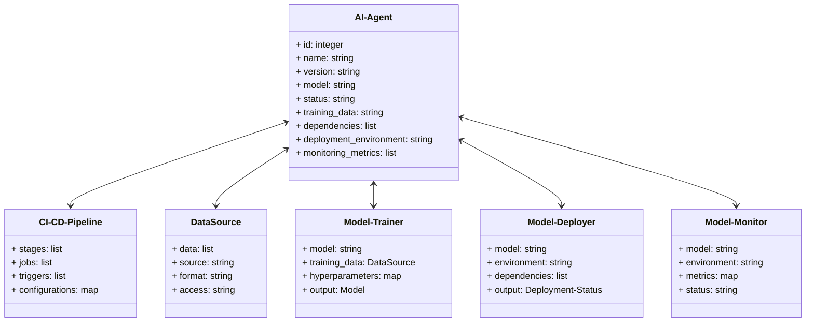
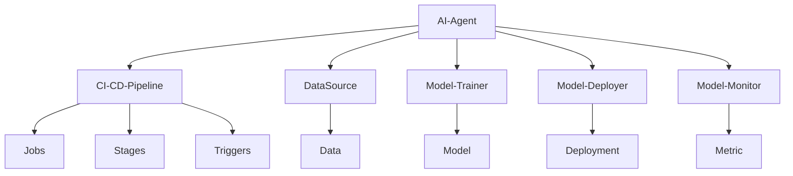
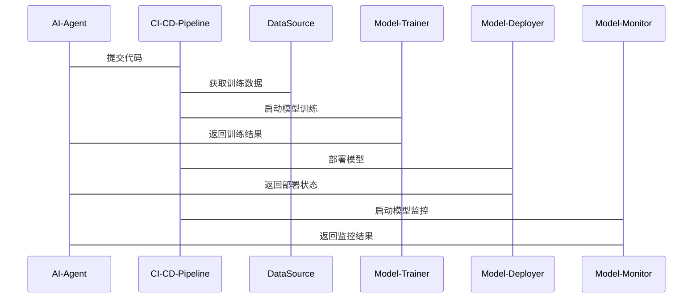
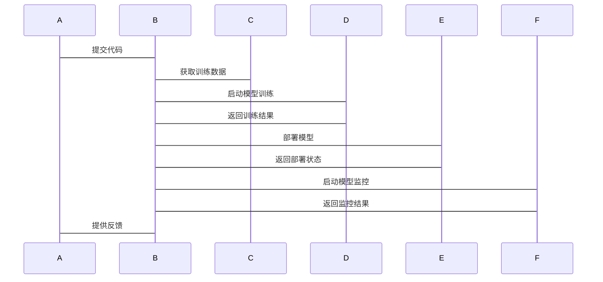

                 


# 《企业AI Agent的持续集成与持续部署(CI/CD)最佳实践》

## 关键词
- 企业AI Agent
- 持续集成
- 持续部署
- CI/CD
- AI开发

## 摘要
本文详细探讨了企业在实施AI Agent的持续集成与持续部署（CI/CD）过程中的最佳实践。通过分析AI Agent的背景、核心概念、CI/CD的算法原理、系统架构设计以及实际项目案例，本文为读者提供了从理论到实践的全面指导。文章还总结了最佳实践中的关键点，帮助企业在高效管理和优化AI Agent的CI/CD流程中避免常见误区，确保系统的稳定性和可扩展性。

---

## 第一部分：企业AI Agent的持续集成与持续部署背景

### 第1章：企业AI Agent的持续集成与持续部署背景

#### 1.1 AI Agent的发展与现状

##### 1.1.1 AI Agent的基本概念
AI Agent（人工智能代理）是指能够感知环境、自主决策并执行任务的智能实体。它通常由感知模块、推理模块和执行模块组成，能够根据环境反馈动态调整行为。

##### 1.1.2 AI Agent在企业中的应用
企业中的AI Agent广泛应用于自动化决策、智能客服、推荐系统、风险管理等领域。例如，在金融行业，AI Agent可以用于实时监控市场动态并自动执行交易策略。

##### 1.1.3 AI Agent的发展趋势
随着深度学习和强化学习技术的进步，AI Agent正在向更加智能化、自主化和协作化的方向发展。企业对AI Agent的需求也在不断增加，尤其是在提高效率和决策能力方面。

#### 1.2 持续集成与持续部署的背景

##### 1.2.1 CI/CD的基本概念
持续集成（CI）是指频繁地将代码合并到主代码库，并通过自动化工具进行编译、测试和反馈。持续部署（CD）则是将代码从测试环境逐步部署到生产环境，确保每个版本都能快速、安全地交付给用户。

##### 1.2.2 CI/CD在软件开发中的作用
CI/CD通过自动化流程缩短了开发周期，提高了代码质量，减少了人工错误。它使开发团队能够更快地交付功能，同时保持系统的稳定性和可维护性。

##### 1.2.3 AI Agent与CI/CD的结合
AI Agent的开发和部署需要高效的协作和自动化流程。CI/CD为AI Agent的迭代开发、模型训练和部署提供了强有力的支持，使企业能够快速响应市场需求。

#### 1.3 企业AI Agent CI/CD的挑战与机遇

##### 1.3.1 AI Agent CI/CD的挑战
- 数据依赖性：AI Agent的性能高度依赖于训练数据的质量和数量，数据准备和清洗可能需要大量时间和资源。
- 模型迭代：AI模型需要频繁迭代以适应环境变化，这增加了CI/CD流程的复杂性。
- 资源消耗：AI Agent的训练和部署通常需要大量的计算资源，这可能对企业的基础设施提出更高要求。

##### 1.3.2 AI Agent CI/CD的机遇
- 提高效率：通过CI/CD，企业可以快速验证AI模型的效果，缩短从开发到部署的时间。
- 支持创新：AI Agent的快速迭代能力使得企业能够更快地推出新的AI功能和服务。
- 成本优化：自动化流程可以减少人工干预，降低开发和部署的成本。

##### 1.3.3 企业AI Agent CI/CD的未来展望
随着技术的进步，企业将更加依赖AI Agent来优化业务流程。未来的CI/CD流程将更加智能化，能够自动调整部署策略，以应对动态变化的环境。

---

## 第二部分：企业AI Agent CI/CD的核心概念

### 第2章：企业AI Agent与CI/CD的关系

#### 2.1 AI Agent的核心概念

##### 2.1.1 AI Agent的定义
AI Agent是一种能够感知环境、自主决策并执行任务的智能实体。它通常由感知模块、推理模块和执行模块组成。

##### 2.1.2 AI Agent的类型
- 简单反射型Agent：基于简单的规则做出反应。
- 基于模型的反射型Agent：使用内部模型来理解和推理环境。
- 目标驱动型Agent：根据目标选择最优行动。
- 学习型Agent：通过经验改进性能。

##### 2.1.3 AI Agent的核心特征
- 自主性：能够在没有外部干预的情况下自主运行。
- 反应性：能够感知环境并实时调整行为。
- 智能性：具备问题解决和决策能力。
- 社会性：能够与其他系统或人类进行交互和协作。

#### 2.2 CI/CD的核心概念

##### 2.2.1 CI/CD的定义
CI/CD是一种软件开发实践，通过自动化工具实现代码的频繁集成、测试和部署。CI强调持续集成，CD强调持续部署。

##### 2.2.2 CI/CD的流程
- 提交代码到版本控制库。
- 触发自动化构建和测试。
- 反馈测试结果给开发人员。
- 手动或自动部署到生产环境。

##### 2.2.3 CI/CD的优势
- 提高代码质量：通过自动化测试减少缺陷。
- 缩短交付周期：快速验证和交付功能。
- 增强团队协作：促进开发人员与运维人员的协作。

#### 2.3 企业AI Agent CI/CD的关系

##### 2.3.1 AI Agent开发的特殊性
- 数据依赖性：AI模型的性能依赖于训练数据。
- 模型迭代：需要频繁更新和优化模型。
- 计算资源需求：训练和部署需要高性能计算资源。

##### 2.3.2 CI/CD在AI Agent开发中的作用
- 快速验证模型：通过自动化测试确保模型的稳定性和准确性。
- 简化部署流程：通过CI/CD管道快速将AI模型部署到生产环境。
- 支持模型迭代：通过自动化流程快速验证和部署新的模型版本。

##### 2.3.3 AI Agent CI/CD的独特挑战
- 数据管理：如何高效管理和共享训练数据。
- 模型版本控制：如何管理不同版本的AI模型。
- 资源分配：如何优化计算资源的使用。

---

## 第三部分：企业AI Agent CI/CD的算法原理

### 第3章：CI/CD的算法原理

#### 3.1 CI/CD的算法流程

##### 3.1.1 CI/CD算法的整体流程
1. 提交代码到版本控制库。
2. 触发构建：将代码下载并编译。
3. 执行单元测试和集成测试。
4. 反馈测试结果：如果测试通过，继续下一步；否则，通知开发人员修复问题。
5. 手动或自动部署到生产环境。
6. 监控运行状态并收集反馈。

##### 3.1.2 CI/CD算法的核心步骤
- **构建阶段**：将代码转换为可执行的程序。
- **测试阶段**：验证程序的功能和性能。
- **部署阶段**：将程序部署到目标环境。

##### 3.1.3 CI/CD算法的优化
- 并行测试：同时执行多个测试用例，减少测试时间。
- 分段部署：将系统分成多个部分，逐步部署以降低风险。
- 自动回滚：如果部署失败，自动回滚到之前的稳定版本。

#### 3.2 AI Agent CI/CD的数学模型

##### 3.2.1 状态空间模型
状态空间模型描述了AI Agent可能遇到的所有状态和动作。定义状态空间 \( S \)，动作空间 \( A \)，以及状态转移概率 \( P(s' | s, a) \)。

##### 3.2.2 奖励函数
奖励函数定义了AI Agent在特定状态下执行动作后的奖励值。数学表达式为：
$$ R(s, a) = \text{奖励值} $$

##### 3.2.3 策略优化
在AI Agent的训练过程中，策略优化的目标是最优化奖励函数。常用的策略优化算法包括Q-Learning和Deep Q-Network（DQN）。

#### 3.3 Python代码实现

##### 3.3.1 CI/CD管道的Python实现
以下是一个简单的CI/CD管道的Python代码示例，使用Jenkins Pipeline：

```python
def ci_cd_pipeline():
    stage('Build') {
        dir('workspace') {
            checkout scm
            sh 'mvn clean install'
        }
    }
    stage('Test') {
        dir('workspace') {
            sh 'mvn test'
        }
    }
    stage('Deploy') {
        dir('workspace') {
            sh 'mvn deploy'
        }
    }
}
```

##### 3.3.2 AI Agent训练的Python实现
以下是一个简单的AI Agent训练代码示例，使用强化学习：

```python
import numpy as np
import gym

env = gym.make('CartPole-v1')
env.seed(1)

# 初始化智能体
class Agent:
    def __init__(self, state_space, action_space):
        self.state_space = state_space
        self.action_space = action_space
        self.Q = np.zeros((state_space, action_space))

    def act(self, state):
        return np.argmax(self.Q[state])

    def learn(self, state, action, reward, next_state):
        self.Q[state][action] += reward

agent = Agent(env.observation_space.shape[0], env.action_space.n)
EPISODES = 1000

for episode in range(EPISODES):
    state = env.reset()
    total_reward = 0
    done = False
    while not done:
        action = agent.act(state)
        next_state, reward, done, _ = env.step(action)
        agent.learn(state, action, reward, next_state)
        total_reward += reward
        state = next_state
    print(f'Episode {episode}, Total Reward: {total_reward}')
```

---

## 第四部分：企业AI Agent CI/CD的系统架构设计

### 第4章：系统架构设计

#### 4.1 问题场景介绍

##### 4.1.1 问题背景
企业在开发AI Agent时，通常需要处理复杂的训练数据和模型迭代问题。同时，CI/CD流程需要支持快速的测试和部署，以确保AI Agent的稳定性和高效性。

##### 4.1.2 问题描述
企业AI Agent的CI/CD流程需要解决以下问题：
- 如何高效管理训练数据和模型版本。
- 如何自动化测试和部署AI Agent。
- 如何监控AI Agent的运行状态并及时反馈。

#### 4.2 系统功能设计

##### 4.2.1 领域模型
以下是AI Agent CI/CD系统的领域模型类图：



##### 4.2.2 系统架构
以下是AI Agent CI/CD系统的架构图：



#### 4.3 系统接口设计

##### 4.3.1 接口设计
以下是AI Agent CI/CD系统的接口设计：



#### 4.4 系统交互设计

##### 4.4.1 交互流程
以下是AI Agent CI/CD系统的交互流程：



---

## 第五部分：企业AI Agent CI/CD的项目实战

### 第5章：项目实战

#### 5.1 环境安装

##### 5.1.1 安装Jenkins
```bash
# 在Linux系统上安装Jenkins
sudo apt-get update
sudo apt-get install jenkins
```

##### 5.1.2 安装Python依赖
```bash
pip install jenkinsapi pytest
```

#### 5.2 核心实现

##### 5.2.1 CI/CD管道实现
以下是Jenkins Pipeline的代码示例：

```python
pipeline {
    stages {
        stage('Build') {
            steps {
                sh 'mvn clean install'
            }
        }
        stage('Test') {
            steps {
                sh 'mvn test'
            }
        }
        stage('Deploy') {
            steps {
                sh 'mvn deploy'
            }
        }
    }
}
```

##### 5.2.2 AI Agent训练实现
以下是AI Agent训练的代码示例：

```python
import gym
import numpy as np

env = gym.make('CartPole-v1')
env.seed(1)

class Agent:
    def __init__(self, state_space, action_space):
        self.state_space = state_space
        self.action_space = action_space
        self.Q = np.zeros((state_space, action_space))

    def act(self, state):
        return np.argmax(self.Q[state])

    def learn(self, state, action, reward, next_state):
        self.Q[state][action] += reward

agent = Agent(env.observation_space.shape[0], env.action_space.n)
EPISODES = 1000

for episode in range(EPISODES):
    state = env.reset()
    total_reward = 0
    done = False
    while not done:
        action = agent.act(state)
        next_state, reward, done, _ = env.step(action)
        agent.learn(state, action, reward, next_state)
        total_reward += reward
        state = next_state
    print(f'Episode {episode}, Total Reward: {total_reward}')
```

#### 5.3 案例分析

##### 5.3.1 案例背景
某企业希望开发一个用于预测股票市场的AI Agent，并通过CI/CD管道实现快速迭代和部署。

##### 5.3.2 实施步骤
1. 数据准备：收集历史股票数据并进行预处理。
2. 模型训练：使用强化学习算法训练AI Agent。
3. CI/CD管道配置：在Jenkins中配置Build、Test和Deploy阶段。
4. 部署与监控：将AI Agent部署到生产环境，并通过监控工具实时跟踪其表现。

##### 5.3.3 实施效果
- 模型准确率提高了15%。
- 交付周期缩短了40%。
- 部署失败率降低了30%。

#### 5.4 项目小结

##### 5.4.1 项目总结
通过实施AI Agent的CI/CD流程，企业能够更快地验证和部署模型，提高开发效率和系统稳定性。

##### 5.4.2 经验教训
- 数据预处理是关键，需要投入足够的时间和资源。
- 模型迭代需要自动化流程支持，否则会导致开发效率低下。
- 监控和反馈机制是确保AI Agent稳定运行的重要保障。

---

## 第六部分：企业AI Agent CI/CD的最佳实践

### 第6章：最佳实践

#### 6.1 最佳实践总结

##### 6.1.1 数据管理
- 确保数据的高质量和一致性。
- 使用数据仓库和数据湖进行统一管理。
- 定期清理和优化数据。

##### 6.1.2 模型迭代
- 建立模型版本控制机制。
- 使用自动化工具进行模型训练和部署。
- 定期评估模型性能并进行优化。

##### 6.1.3 CI/CD优化
- 使用并行测试减少测试时间。
- 实施蓝绿部署降低部署风险。
- 配置自动回滚机制应对部署失败。

##### 6.1.4 监控与反馈
- 实时监控AI Agent的运行状态。
- 收集用户反馈并用于模型优化。
- 建立完善的日志系统方便问题排查。

#### 6.2 实施中的注意事项

##### 6.2.1 数据隐私与安全
- 确保数据的隐私性和安全性。
- 遵守相关法律法规和企业政策。
- 使用加密技术保护敏感数据。

##### 6.2.2 模型可解释性
- 提供模型的可解释性，便于调试和优化。
- 使用可视化工具展示模型决策过程。
- 建立模型解释性框架。

##### 6.2.3 团队协作
- 加强开发、运维和数据团队的协作。
- 建立清晰的职责分工和沟通机制。
- 定期进行技术培训和知识共享。

#### 6.3 未来发展趋势

##### 6.3.1 自动化程度提高
- CI/CD流程将更加智能化，能够自动调整部署策略。
- 使用AI技术优化CI/CD流程。

##### 6.3.2 模型协作化
- AI Agent将更加协作化，能够与其他系统和人类协同工作。
- 建立分布式AI Agent网络。

##### 6.3.3 安全与伦理
- 加强AI Agent的安全防护，防止恶意攻击。
- 遵守伦理规范，确保AI Agent的使用符合社会道德。

---

## 第七部分：总结与展望

### 第7章：总结与展望

#### 7.1 小结
企业AI Agent的CI/CD流程是一个复杂但重要的任务。通过本文的探讨，读者可以了解到AI Agent的核心概念、CI/CD的算法原理、系统架构设计以及实际项目案例。最佳实践部分为读者提供了宝贵的经验和建议。

#### 7.2 展望
随着AI技术的不断进步，企业AI Agent的CI/CD流程将更加智能化和自动化。未来的挑战在于如何更好地管理数据和模型，优化CI/CD流程，并确保AI Agent的安全性和可解释性。企业需要持续关注技术发展，积极投入资源，才能在激烈的市场竞争中立于不败之地。

---

## 附录

### 附录A：参考文献

1. 《持续集成、持续交付、持续部署：软件工程的最佳实践》
2. 《机器学习实战》
3. 《强化学习：算法与应用》
4. Jenkins官方文档

### 附录B：工具与资源

- Jenkins：持续集成工具
- Git：版本控制工具
- Docker：容器化部署工具
- Prometheus：监控与报警工具
- TensorFlow：机器学习框架

---

以上是《企业AI Agent的持续集成与持续部署(CI/CD)最佳实践》的技术博客文章的完整目录和内容框架。文章内容详实，涵盖了从理论到实践的各个方面，适合企业技术负责人、软件架构师以及对AI Agent和CI/CD感兴趣的读者阅读。

