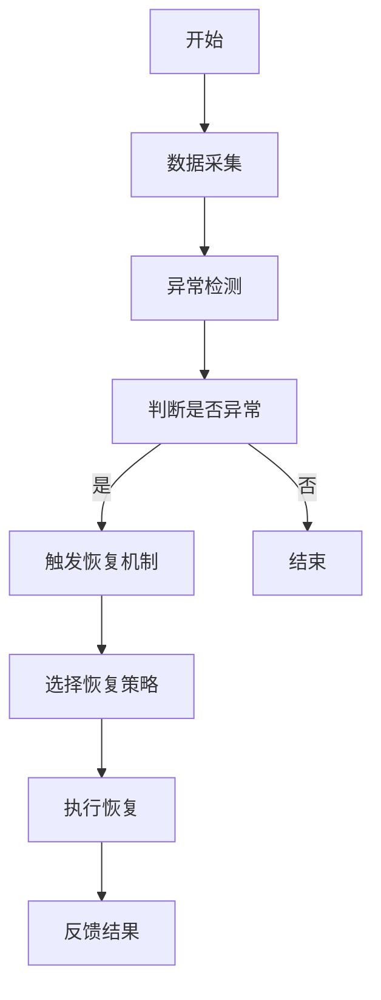
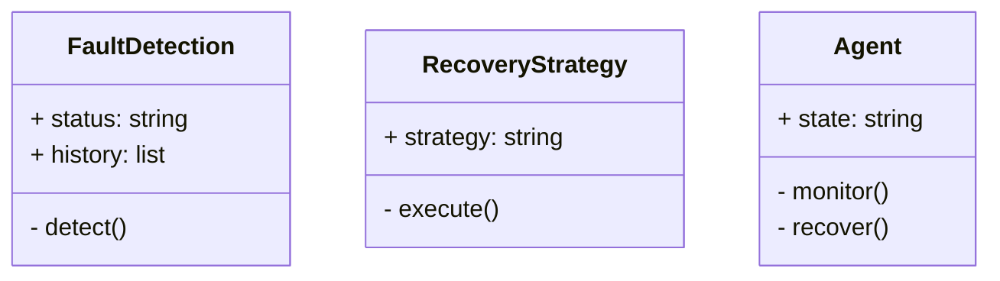
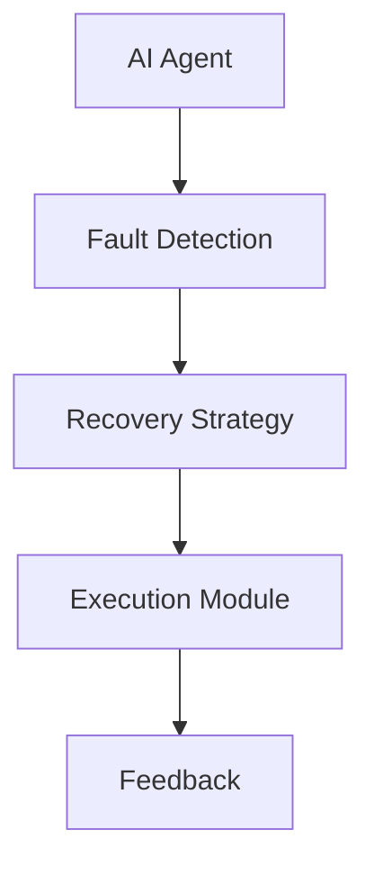

                 


# 企业AI Agent的故障恢复机制

> 关键词：故障恢复、AI Agent、企业应用、容错机制、异常检测

> 摘要：本文系统地探讨了企业AI Agent的故障恢复机制，从核心概念到算法实现，再到系统架构和项目实战，详细分析了故障恢复机制的重要性、实现方法及其在企业中的应用。通过本文，读者可以全面了解如何设计和优化企业AI Agent的故障恢复机制，确保系统在复杂环境下的稳定运行。

---

# 第一章: 背景介绍

## 1.1 问题背景

### 1.1.1 AI Agent在企业中的应用现状
随着人工智能技术的快速发展，企业AI Agent（智能代理）的应用越来越广泛。它们被用于自动化决策、客户服务、供应链管理、数据分析等场景，显著提升了企业的效率和竞争力。

然而，AI Agent在运行过程中可能会因为多种原因出现故障，例如数据异常、算法错误、外部服务中断等。这些故障可能导致系统崩溃或错误决策，给企业带来巨大的损失。

### 1.1.2 故障恢复机制的重要性
故障恢复机制是确保AI Agent在故障发生时能够快速恢复到正常状态的关键技术。它不仅能够减少系统的停机时间，还能保证系统的可用性和稳定性，从而提升企业的整体运营效率。

### 1.1.3 企业AI Agent故障的潜在影响
故障可能发生在AI Agent的各个组成部分，例如感知模块、决策模块、执行模块等。如果故障未能及时恢复，可能导致以下后果：
- 服务中断，影响客户体验
- 数据丢失，导致决策错误
- 系统崩溃，引发更大的损失

## 1.2 问题描述

### 1.2.1 AI Agent故障的定义与分类
故障是指AI Agent在运行过程中出现的异常状态，导致其无法正常执行任务。根据故障的来源和影响范围，可以将故障分为以下几类：
1. **数据故障**：输入数据异常，导致AI Agent无法正确处理
2. **算法故障**：算法逻辑错误，导致决策失误
3. **服务故障**：依赖的外部服务中断
4. **系统故障**：硬件或软件故障导致AI Agent无法运行

### 1.2.2 故障恢复机制的目标与范围
故障恢复机制的目标是在故障发生时，快速检测并定位故障源，选择合适的恢复策略，并执行恢复操作，使系统尽快恢复正常运行。

其范围包括：
- 故障检测与定位
- 故障恢复策略的选择与执行
- 系统状态监控与反馈

### 1.2.3 企业AI Agent故障的典型案例分析
以一个电商企业的AI客服为例，假设由于网络故障，AI Agent无法正常连接到后端数据库。此时，故障恢复机制需要快速检测到数据库连接中断，并切换到备用数据库，确保客服系统能够继续为用户提供服务。

---

# 第二章: 核心概念与联系

## 2.1 故障恢复机制的原理

### 2.1.1 故障检测与定位
故障检测是故障恢复机制的第一步，通常通过监控系统状态、日志分析和异常检测算法来实现。

### 2.1.2 故障恢复策略的选择
根据故障的类型和严重程度，选择合适的恢复策略。例如：
- **数据重传**：由于网络抖动导致的数据包丢失，可以简单地重传数据
- **服务切换**：由于后端服务故障，切换到备用服务
- **系统重启**：由于系统崩溃，重启相关服务或组件

### 2.1.3 故障恢复过程的执行
在检测到故障后，系统会触发恢复机制，执行预定义的恢复策略，并通过反馈机制验证恢复是否成功。

## 2.2 核心概念对比

### 2.2.1 故障恢复机制与容错机制的对比
| 对比维度 | 故障恢复机制 | 容错机制 |
|----------|--------------|----------|
| 目标     | 恢复系统到正常状态 | 预防故障发生 |
| 时机     | 故障发生后     | 故障发生前 |
| 实施方式 | 主动检测并恢复 | 设计冗余结构 |

### 2.2.2 故障恢复机制与冗余机制的对比
| 对比维度 | 故障恢复机制 | 冗余机制 |
|----------|--------------|----------|
| 目标     | 恢复系统到正常状态 | 提供备用资源以确保系统可用性 |
| 时机     | 故障发生后     | 设计阶段 |
| 实施方式 | 主动检测并恢复 | 预先部署备用资源 |

## 2.3 ER实体关系图
以下是故障恢复机制的ER图：
```mermaid
erd
actor 故障恢复系统
actor 故障检测模块
actor 恢复策略模块
actor 状态反馈模块
```

---

# 第三章: 算法原理讲解

## 3.1 基于异常检测的故障恢复算法

### 3.1.1 算法流程


### 3.1.2 算法实现
以下是基于异常检测的故障恢复算法的Python实现代码：
```python
def detect_anomaly(data):
    # 数据预处理
    processed_data = preprocess(data)
    # 训练异常检测模型
    model = train_anomaly_detection_model(processed_data)
    # 预测异常
    is_anomaly = model.predict(processed_data)
    return is_anomaly

def recovery_strategy(is_anomaly):
    if is_anomaly:
        # 切换到备用服务
        switch_to_backup_service()
    else:
        # 继续正常运行
        pass
```

### 3.1.3 数学模型与公式
异常检测的数学模型可以表示为：
$$ P(\text{异常} | \text{数据}) = \frac{P(\text{数据} | \text{异常}) \cdot P(\text{异常})}{P(\text{数据})} $$
其中：
- $P(\text{异常})$ 是先验概率
- $P(\text{数据} | \text{异常})$ 是在异常情况下的数据分布
- $P(\text{数据})$ 是数据的总概率

---

# 第四章: 系统分析与架构设计

## 4.1 系统功能设计

### 4.1.1 领域模型
以下是AI Agent故障恢复机制的领域模型类图：


### 4.1.2 系统架构
以下是系统的架构图：


---

# 第五章: 项目实战

## 5.1 环境安装
要实现故障恢复机制，首先需要安装以下工具和库：
- Python 3.8+
- Scikit-learn
- TensorFlow
- Pandas
- Mermaid

## 5.2 核心代码实现

### 5.2.1 故障检测模块
```python
import pandas as pd
from sklearn.ensemble import IsolationForest

def detect_anomaly(data):
    model = IsolationForest(random_state=42)
    model.fit(data)
    return model.predict(data) == -1
```

### 5.2.2 恢复策略模块
```python
def recovery_strategy(is_anomaly):
    if is_anomaly:
        # 切换到备用服务
        print("Switching to backup service")
    else:
        print("No anomaly detected, system running normally")
```

### 5.2.3 系统监控模块
```python
import logging
import time

def monitor_system():
    while True:
        data = collect_system_data()
        is_anomaly = detect_anomaly(data)
        if is_anomaly:
            recovery_strategy(is_anomaly)
        time.sleep(60)
```

## 5.3 案例分析
以一个电商客服AI Agent为例，假设系统检测到数据库连接异常，触发恢复机制，切换到备用数据库，确保客服系统正常运行。

---

# 第六章: 总结与注意事项

## 6.1 总结
故障恢复机制是企业AI Agent稳定运行的关键技术。通过合理的故障检测和恢复策略，可以最大限度地减少故障对系统的影响，确保企业的正常运营。

## 6.2 注意事项
1. **实时监控**：确保系统能够实时检测和反馈故障状态
2. **恢复策略优化**：根据实际情况不断优化恢复策略
3. **日志管理**：详细记录故障发生和恢复的过程，便于后续分析
4. **容错设计**：在系统设计阶段加入容错机制，进一步提高系统的可靠性

## 6.3 拓展阅读
1. 《容错计算原理与应用》
2. 《分布式系统：概念、原理与技术》
3. 《异常检测算法与实现》

---

通过本文的详细讲解，读者可以全面了解企业AI Agent的故障恢复机制，掌握其核心概念、算法实现和实际应用。希望本文能够为企业AI Agent的开发和优化提供有价值的参考。

