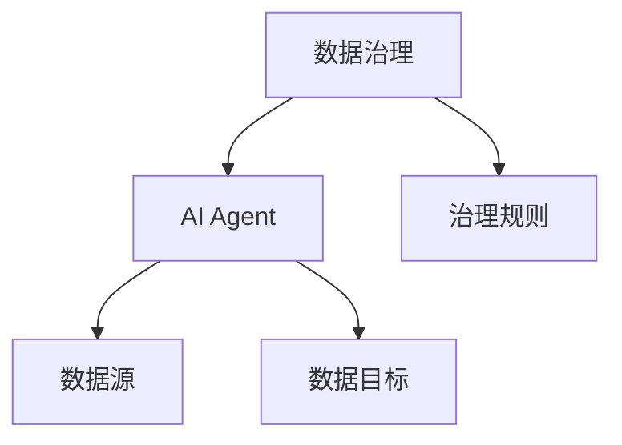
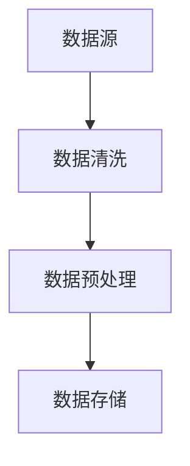
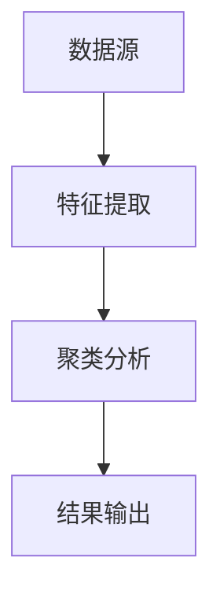
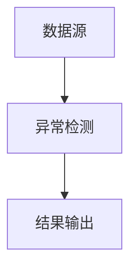
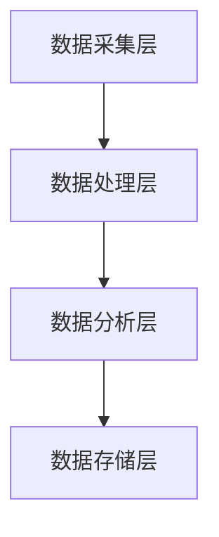
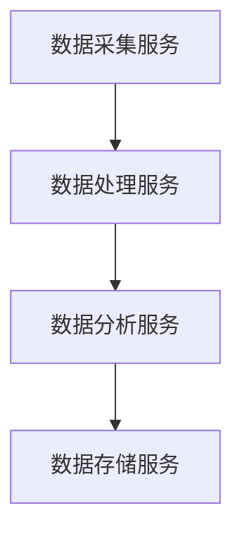
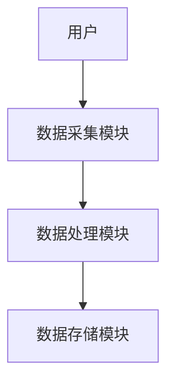
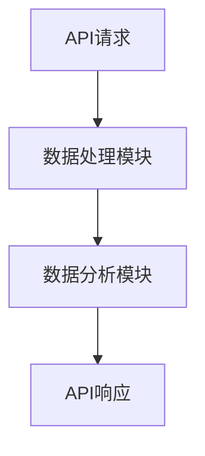

                 


# 《企业AI Agent的数据治理框架》目录大纲

----------------------------------------------------------------

# 第一部分: 企业AI Agent的数据治理框架概述

# 第1章: 企业AI Agent与数据治理概述

## 1.1 企业AI Agent的基本概念
### 1.1.1 AI Agent的定义与特点
### 1.1.2 企业AI Agent的核心功能
### 1.1.3 数据治理的基本概念与目标

## 1.2 企业AI Agent与数据治理的关系
### 1.2.1 数据治理在企业中的重要性
### 1.2.2 AI Agent在数据治理中的作用
### 1.2.3 两者的结合与应用场景

## 1.3 企业AI Agent数据治理的背景与挑战
### 1.3.1 数据治理的现状与问题
### 1.3.2 AI Agent在数据治理中的优势
### 1.3.3 当前的主要挑战与解决方案

## 1.4 本章小结
...

----------------------------------------------------------------

# 第二部分: 企业AI Agent数据治理的核心概念与联系

# 第2章: 数据治理的核心概念与原理

## 2.1 数据治理的原理与框架
### 2.1.1 数据治理的原理
### 2.1.2 数据治理的框架模型
### 2.1.3 数据治理的关键要素

## 2.2 AI Agent在数据治理中的核心作用
### 2.2.1 AI Agent的智能决策能力
### 2.2.2 AI Agent的数据分析能力
### 2.2.3 AI Agent的自动化执行能力

## 2.3 数据治理与AI Agent的实体关系图


## 2.4 本章小结
...

----------------------------------------------------------------

# 第三部分: 企业AI Agent数据治理的算法与原理

# 第3章: 数据治理的算法原理

## 3.1 数据清洗算法
### 3.1.1 数据清洗的定义与步骤
### 3.1.2 基于AI Agent的数据清洗流程


### 3.1.3 数据清洗的Python实现
```python
def data_cleaning(data):
    # 去除重复数据
    data = data.drop_duplicates()
    # 处理缺失值
    data = data.dropna()
    return data
```

## 3.2 数据分类与聚类算法
### 3.2.1 分类算法的原理与选择
### 3.2.2 基于K-means的聚类算法


### 3.2.3 分类与聚类算法的Python实现
```python
from sklearn.cluster import KMeans

def kmeans_clustering(data):
    model = KMeans(n_clusters=3)
    model.fit(data)
    return model.labels_
```

## 3.3 数据异常检测算法
### 3.3.1 异常检测的定义与方法
### 3.3.2 基于Isolation Forest的异常检测


### 3.3.3 Isolation Forest算法的Python实现
```python
from sklearn.ensemble import IsolationForest

def isolation_forest_anomaly_detection(data):
    model = IsolationForest(n_estimators=100)
    model.fit(data)
    return model.predict(data)
```

## 3.4 本章小结
...

----------------------------------------------------------------

# 第四部分: 企业AI Agent数据治理的系统架构与设计

# 第4章: 系统架构与设计

## 4.1 问题场景介绍
### 4.1.1 数据治理的主要问题
### 4.1.2 AI Agent在数据治理中的应用场景
### 4.1.3 系统目标与范围

## 4.2 系统功能设计
### 4.2.1 数据采集模块
### 4.2.2 数据处理模块
### 4.2.3 数据分析模块
### 4.2.4 数据存储与管理模块

## 4.3 系统架构设计
### 4.3.1 分层架构设计


### 4.3.2 微服务架构设计


## 4.4 系统接口设计
### 4.4.1 数据接口定义
### 4.4.2 API设计与交互
### 4.4.3 接口安全性设计

## 4.5 系统交互设计
### 4.5.1 用户与系统的交互流程


### 4.5.2 API交互流程


## 4.6 本章小结
...

----------------------------------------------------------------

# 第五部分: 企业AI Agent数据治理的项目实战

# 第5章: 项目实战与案例分析

## 5.1 环境安装与配置
### 5.1.1 开发环境搭建
### 5.1.2 依赖库安装
### 5.1.3 数据集准备

## 5.2 核心代码实现
### 5.2.1 数据采集与清洗代码
```python
import pandas as pd

def load_data():
    data = pd.read_csv('data.csv')
    return data_cleaning(data)

def data_cleaning(data):
    data = data.drop_duplicates()
    data = data.dropna()
    return data
```

### 5.2.2 数据分析与分类代码
```python
from sklearn.tree import DecisionTreeClassifier

def data_classification(data):
    X = data.drop('target', axis=1)
    y = data['target']
    model = DecisionTreeClassifier()
    model.fit(X, y)
    return model
```

## 5.3 项目实现解读与分析
### 5.3.1 代码实现分析
### 5.3.2 系统功能实现分析
### 5.3.3 数据治理效果分析

## 5.4 案例分析与详细讲解
### 5.4.1 案例背景介绍
### 5.4.2 数据治理过程
### 5.4.3 实施效果与经验总结

## 5.5 本章小结
...

----------------------------------------------------------------

# 第六部分: 最佳实践与总结

# 第6章: 最佳实践与总结

## 6.1 最佳实践
### 6.1.1 数据治理策略建议
### 6.1.2 AI Agent的选型与配置
### 6.1.3 系统维护与优化

## 6.2 小结与展望
### 6.2.1 本章内容总结
### 6.2.2 未来研究方向
### 6.2.3 对企业AI Agent数据治理的展望

## 6.3 注意事项
### 6.3.1 数据安全与隐私保护
### 6.3.2 系统稳定与可靠性
### 6.3.3 团队协作与沟通

## 6.4 拓展阅读
### 6.4.1 推荐书籍与文章
### 6.4.2 其他相关资源
### 6.4.3 进一步学习的方向

## 6.5 本章结束
...

----------------------------------------------------------------

# 参考文献
（此处列出相关参考文献）

