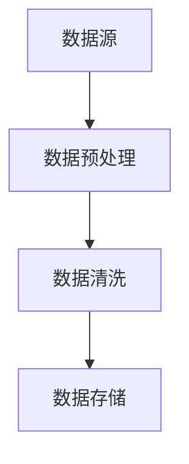
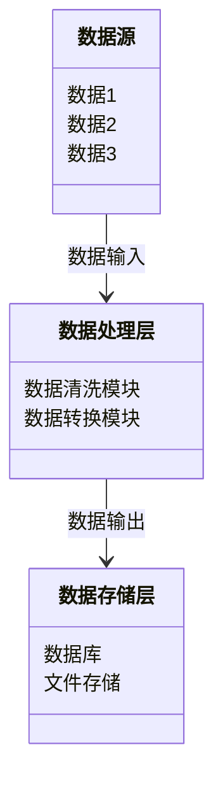

                 


# 《企业AI Agent的数据治理策略》

## 关键词：企业AI Agent，数据治理，数据安全，数据质量，机器学习，数据架构

## 摘要：本文系统性地探讨了企业AI Agent在数据治理中的应用策略。从数据治理的核心概念、算法原理到系统架构设计，再到项目实战，深入分析了如何构建高效、安全、可靠的企业AI Agent数据治理体系。通过具体案例分析和代码实现，为读者提供了从理论到实践的全面指导。

---

# 第1章：企业AI Agent的背景与概念

## 1.1 什么是企业AI Agent

### 1.1.1 AI Agent的基本概念
AI Agent（人工智能代理）是一种能够感知环境、自主决策并执行任务的智能实体。与传统自动化工具不同，AI Agent具备学习能力，能够根据反馈不断优化自身行为。

### 1.1.2 企业AI Agent的特征
- **自主性**：无需人工干预，自主完成任务。
- **反应性**：能够感知环境变化并实时调整策略。
- **学习能力**：通过数据和经验不断优化决策模型。
- **可解释性**：决策过程透明，便于分析和优化。

### 1.1.3 企业AI Agent的应用场景
- **智能客服**：通过自然语言处理技术，提供24/7的客户服务。
- **智能决策支持**：基于大数据分析，辅助高层制定战略决策。
- **流程自动化**：优化企业内部流程，提高效率。

---

## 1.2 数据治理的基本概念

### 1.2.1 数据治理的定义与目标
数据治理是通过制定和实施相关政策、流程、工具和技术，确保数据的准确性、完整性、一致性和安全性。

### 1.2.2 数据治理的范围
- 数据质量管理
- 数据安全与隐私保护
- 数据访问控制
- 数据生命周期管理

### 1.2.3 数据治理与企业AI Agent的关系
- 数据治理为AI Agent提供高质量的数据输入。
- 数据安全确保AI Agent的决策过程不受数据泄露的影响。
- 数据访问控制规范AI Agent的数据使用权限。

---

## 1.3 企业AI Agent的应用场景

### 1.3.1 智能客服与客户关系管理
AI Agent通过分析客户行为数据，提供个性化的服务，提升客户满意度。

### 1.3.2 智能决策支持与数据分析
AI Agent利用大数据分析技术，为企业提供实时的市场洞察和决策建议。

### 1.3.3 智能流程自动化与业务优化
AI Agent通过自动化处理企业流程，减少人工干预，提高业务效率。

---

## 1.4 本章小结
企业AI Agent作为智能化转型的核心工具，离不开数据治理的支持。数据治理确保了AI Agent的数据质量，保障了其决策的准确性和安全性。

---

# 第2章：数据治理的核心概念与原理

## 2.1 数据治理的核心要素

### 2.1.1 数据质量
- **准确性**：数据反映真实情况。
- **完整性**：数据无缺失。
- **一致性**：数据格式统一。

### 2.1.2 数据安全
- **机密性**：防止数据泄露。
- **完整性**：防止数据篡改。
- **可用性**：确保数据可访问。

### 2.1.3 数据访问控制
- **权限管理**：基于角色的访问控制。
- **审计追踪**：记录数据访问日志。

---

## 2.2 数据治理的原理

### 2.2.1 数据生命周期管理
- 数据生成
- 数据存储
- 数据处理
- 数据归档
- 数据销毁

### 2.2.2 数据质量管理
- 数据清洗：去除噪声数据。
- 数据标准化：统一数据格式。
- 数据增强：补充缺失数据。

---

## 2.3 数据治理框架的设计

### 2.3.1 数据治理框架的组成
- 数据治理策略
- 数据管理流程
- 数据安全策略
- 数据监控与优化

### 2.3.2 数据治理框架的实施步骤
1. **需求分析**：明确数据治理目标。
2. **政策制定**：制定数据治理制度。
3. **工具选型**：选择合适的数据治理工具。
4. **实施与监控**：监控数据治理效果。

---

## 2.4 核心概念对比表格

| 概念       | 描述                                                                 | 与AI Agent的关系                                                                 |
|------------|----------------------------------------------------------------------|---------------------------------------------------------------------------------|
| 数据质量    | 数据的准确性、完整性、一致性                                         | 决定AI Agent的决策准确性                                                       |
| 数据安全    | 数据的机密性、完整性、可用性                                         | 保障AI Agent的运行安全                                                         |
| 数据访问控制 | 数据的权限管理                                                     | 确保AI Agent的数据使用合规性                                                   |

---

## 2.5 数据治理的ER实体关系图

```mermaid
erDiagram
    actor 用户
    actor 管理员
    actor 开发者
    database 数据库
    actor 数据提供者
    actor 数据消费者
    用户 --> 数据提供者: 提供数据
    用户 --> 数据消费者: 使用数据
    管理员 --> 数据库: 管理数据
    开发者 --> 数据库: 开发AI Agent
```

---

## 2.6 本章小结
数据治理是企业AI Agent正常运行的基础，通过规范数据管理流程，确保数据质量，保障数据安全，企业能够更好地发挥AI技术的潜力。

---

# 第3章：数据治理算法的原理与实现

## 3.1 数据清洗算法

### 3.1.1 数据清洗的目标
- 去除噪声数据
- 补充缺失数据
- 统一数据格式

### 3.1.2 数据清洗的实现步骤

1. **数据预处理**：读取数据，识别异常值。
2. **异常值检测**：使用统计方法或机器学习算法识别异常值。
3. **数据修复**：填充缺失值或删除异常值。

### 3.1.3 数据清洗的流程图



---

## 3.2 数据清洗的Python实现

```python
import pandas as pd
import numpy as np

# 读取数据
data = pd.read_csv('data.csv')

# 检查缺失值
print(data.isnull().sum())

# 填充缺失值（使用均值填充）
data['age'].fillna(data['age'].mean(), inplace=True)

# 删除异常值（基于标准差）
z = np.abs((data['salary'] - data['salary'].mean())) / data['salary'].std()
data = data[z < 3]
```

---

## 3.3 数据安全的实现

### 3.3.1 数据加密技术
- **对称加密**：AES加密算法。
- **非对称加密**：RSA加密算法。

### 3.3.2 数据加密的Python实现

```python
from cryptography.hazmat.primitives.asymmetric import padding
from cryptography.hazmat.primitives.asymmetric.rsa import RSAPublicKey, RSAPrivateKey
from cryptography.hazmat.primitives import hashes

# 生成RSA密钥对
private_key = RSAPrivateKey.generate(65537)
public_key = RSAPublicKey.from_private_key(private_key)

# 加密数据
message = "Sensitive data"
encrypted_data = public_key.encrypt(message.encode(), padding.PKCS1v1_5())

# 解密数据
decrypted_data = private_key.decrypt(encrypted_data)
print(decrypted_data.decode())
```

---

## 3.4 数据治理算法的数学模型

### 3.4.1 数据质量评估模型
$$ Q = \frac{\sum_{i=1}^{n} w_i x_i}{\sum_{i=1}^{n} w_i} $$
其中，$Q$ 表示数据质量，$w_i$ 表示第 $i$ 个评估指标的权重，$x_i$ 表示第 $i$ 个指标的得分。

---

## 3.5 本章小结
通过数据清洗和加密等算法，企业可以有效提升数据质量，保障数据安全，为AI Agent的运行提供可靠的数据基础。

---

# 第4章：系统分析与架构设计

## 4.1 系统功能设计

### 4.1.1 领域模型设计



---

## 4.2 系统架构设计

```mermaid
archiDiagram
    component 数据源
    component 数据处理层 {
        数据清洗模块
        数据转换模块
    }
    component 数据存储层 {
        数据库
        文件存储
    }
    数据源 --> 数据处理层
    数据处理层 --> 数据存储层
```

---

## 4.3 系统接口设计

### 4.3.1 数据输入接口
- REST API：`POST /api/data/input`

### 4.3.2 数据输出接口
- REST API：`GET /api/data/output`

---

## 4.4 本章小结
通过合理的系统架构设计，企业可以构建高效、可靠的数据治理体系，为AI Agent的运行提供强有力的支持。

---

# 第5章：项目实战

## 5.1 环境配置

### 5.1.1 安装必要的库
```bash
pip install pandas scikit-learn cryptography
```

---

## 5.2 核心代码实现

### 5.2.1 数据清洗代码

```python
import pandas as pd
from sklearn.impute import SimpleImputer

# 读取数据
data = pd.read_csv('data.csv')

# 填充缺失值
imputer = SimpleImputer(strategy='mean')
data_imputed = pd.DataFrame(imputer.fit_transform(data))
```

---

## 5.2.2 数据加密代码

```python
from cryptography.hazmat.primitives.asymmetric import padding
from cryptography.hazmat.primitives.asymmetric.rsa import RSAPublicKey, RSAPrivateKey
from cryptography.hazmat.primitives import hashes

# 生成RSA密钥对
private_key = RSAPrivateKey.generate(65537)
public_key = RSAPublicKey.from_private_key(private_key)

# 加密数据
message = "Sensitive data"
encrypted_data = public_key.encrypt(message.encode(), padding.PKCS1v1_5())

# 解密数据
decrypted_data = private_key.decrypt(encrypted_data)
print(decrypted_data.decode())
```

---

## 5.3 案例分析

### 5.3.1 案例背景
某企业希望通过AI Agent优化其客户服务流程。

### 5.3.2 数据治理方案
1. **数据清洗**：处理客户反馈数据中的缺失值和异常值。
2. **数据加密**：保护客户隐私数据。
3. **数据安全**：制定数据访问控制策略。

---

## 5.4 本章小结
通过实际案例分析，读者可以更好地理解企业AI Agent数据治理的具体实施过程。

---

# 第6章：总结与最佳实践

## 6.1 总结
企业AI Agent的数据治理是智能化转型的关键，通过规范数据管理流程，企业可以有效提升数据质量，保障数据安全，为AI Agent的运行提供可靠的数据基础。

## 6.2 最佳实践

### 6.2.1 数据治理的注意事项
- 定期审查数据治理策略。
- 及时更新数据安全措施。
- 培训相关人员的数据治理意识。

### 6.2.2 数据治理的扩展阅读
- 《企业数据管理》
- 《数据治理与数据安全》
- 《AI Agent与数据科学》

---

## 6.3 小结
企业AI Agent的数据治理需要系统性的规划和实施，通过理论与实践相结合，企业可以更好地发挥AI技术的潜力，实现智能化转型。

--- 

# 结语
希望本文能够为企业在AI Agent的数据治理方面提供有价值的参考。通过系统的理论分析和实际案例的讲解，读者可以更好地理解企业AI Agent的数据治理策略，并将其应用于实际工作中。

