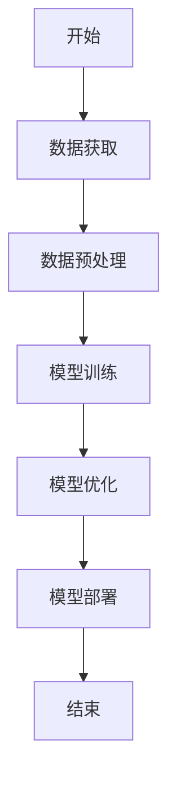
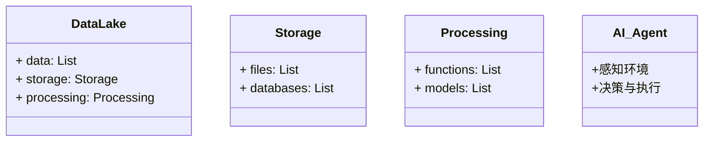
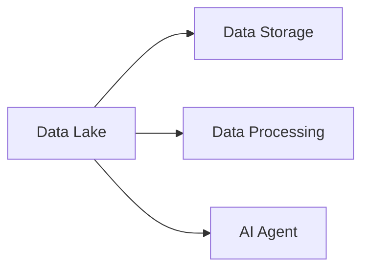
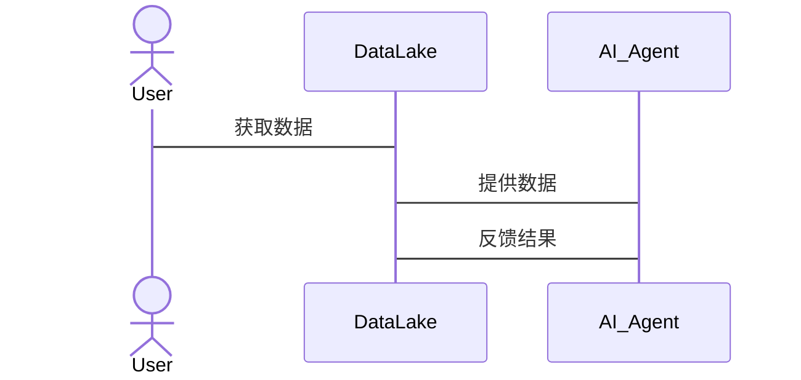

                 


# 企业AI Agent的数据湖架构设计

> 关键词：数据湖，AI Agent，企业应用，系统架构，算法设计

> 摘要：本文探讨了企业AI Agent与数据湖架构的结合，详细分析了数据湖作为AI Agent数据源的核心作用，以及AI Agent在数据湖中的应用价值。通过系统架构设计、算法原理、项目实战等多方面，深入剖析了企业AI Agent的数据湖架构设计方法，为企业智能化转型提供了实践指导。

---

## 第一部分: 企业AI Agent与数据湖架构背景

### 第1章: 数据湖与AI Agent概述

#### 1.1 数据湖的概念与特点
##### 1.1.1 数据湖的定义
数据湖是一种存储企业中所有类型数据的 centralized repository，支持结构化、半结构化和非结构化数据的存储和处理。它能够弹性扩展，支持多种数据格式和存储介质。

##### 1.1.2 数据湖的核心特点
- **灵活性**：支持多种数据格式和存储方式，用户可以根据需求自由选择。
- **可扩展性**：能够处理海量数据，支持水平扩展。
- **统一性**：提供统一的数据存储和访问接口，简化数据管理。
- **高效性**：通过优化存储和处理流程，提高数据处理效率。

##### 1.1.3 数据湖与传统数据仓库的区别
| 特性             | 数据湖                     | 数据仓库                     |
|------------------|---------------------------|-----------------------------|
| 数据结构         | 支持多种数据格式           | 主要支持结构化数据           |
| 存储方式         | 支持多种存储介质           | 主要依赖关系型数据库         |
| 数据处理         | 强调灵活性和扩展性         | 强调一致性与数据完整性       |
| 使用场景         | 数据探索、机器学习等       | 报表生成、数据分析等         |

#### 1.2 AI Agent的定义与特点
##### 1.2.1 AI Agent的定义
AI Agent（人工智能代理）是指能够感知环境、自主决策并执行任务的智能系统。它可以理解用户需求、优化资源分配、提高效率。

##### 1.2.2 AI Agent的核心特点
- **自主性**：能够在没有人工干预的情况下完成任务。
- **反应性**：能够实时感知环境变化并做出反应。
- **学习能力**：通过机器学习算法不断优化自身的决策能力。
- **可扩展性**：能够适应不同的业务场景和数据规模。

#### 1.3 数据湖与AI Agent的关系
##### 1.3.1 数据湖作为AI Agent的数据源
数据湖为AI Agent提供了丰富的数据资源，支持其进行数据挖掘、分析和预测。

##### 1.3.2 AI Agent在数据湖中的作用
AI Agent可以优化数据湖中的数据存储、处理和检索流程，提高数据湖的使用效率。

##### 1.3.3 数据湖与AI Agent的结合对企业的影响
- **提升数据利用率**：通过AI Agent的智能分析，企业可以更好地利用数据湖中的数据。
- **优化业务流程**：AI Agent能够自动化处理数据湖中的数据，优化企业业务流程。
- **提高决策效率**：通过数据湖与AI Agent的结合，企业可以更快地做出决策。

#### 1.4 数据湖在企业中的应用价值
##### 1.4.1 数据湖在企业中的潜在应用领域
- **数据存储与管理**：统一存储企业数据，简化数据管理。
- **数据分析与挖掘**：支持机器学习、数据挖掘等高级分析。
- **实时数据处理**：支持实时数据流的处理与分析。
- **数据共享与集成**：促进不同部门之间的数据共享与集成。

##### 1.4.2 数据湖对企业AI Agent发展的推动作用
- **数据源**：数据湖为AI Agent提供了丰富的数据源。
- **数据处理能力**：数据湖的高效处理能力支持AI Agent的实时决策。
- **扩展性**：数据湖的弹性扩展能力满足AI Agent的多样化需求。

##### 1.4.3 数据湖应用的挑战与机遇
- **挑战**：数据湖的存储和处理成本较高，数据质量控制难度大。
- **机遇**：数据湖为AI Agent提供了强大的数据支持，推动企业智能化转型。

#### 1.5 本章小结
本章介绍了数据湖和AI Agent的基本概念、特点以及它们之间的关系，强调了数据湖在企业AI Agent中的重要作用。接下来的章节将深入探讨数据湖与AI Agent的核心概念、算法原理以及系统架构设计。

---

## 第二部分: 数据湖与AI Agent的核心概念与联系

### 第2章: 数据湖与AI Agent的核心概念

#### 2.1 数据湖的架构原理
##### 2.1.1 数据湖的分层架构
数据湖的架构通常分为数据存储层、数据处理层和数据访问层。

- **数据存储层**：负责数据的存储和管理。
- **数据处理层**：负责数据的清洗、转换和分析。
- **数据访问层**：负责数据的查询和应用。

##### 2.1.2 数据湖的数据存储机制
数据湖支持多种数据存储方式，包括文件存储、数据库存储和分布式存储。

##### 2.1.3 数据湖的数据处理流程
数据湖的数据处理流程包括数据清洗、数据转换、数据分析和数据建模。

#### 2.2 AI Agent的算法原理
##### 2.2.1 AI Agent的感知与决策机制
AI Agent通过感知环境数据，利用算法进行决策和行动。

##### 2.2.2 AI Agent的学习与优化算法
AI Agent可以通过机器学习算法不断优化自身的决策能力。

##### 2.2.3 AI Agent的推理与执行流程
AI Agent通过推理得出最优解决方案，并执行相应的操作。

#### 2.3 数据湖与AI Agent的实体关系
##### 2.3.1 实体关系图
```mermaid
er
actor: 用户
system: 数据湖
database: 数据存储
function: 数据处理
```

---

## 第三部分: 数据湖与AI Agent的算法原理

### 第3章: 数据湖与AI Agent的算法设计

#### 3.1 AI Agent的算法流程
##### 3.1.1 算法流程图


##### 3.1.2 算法实现代码
```python
def data_preprocessing(data):
    # 数据清洗和转换代码
    pass

def model_training(data):
    # 模型训练代码
    pass

def model_optimization(data):
    # 模型优化代码
    pass

def model_deployment(data):
    # 模型部署代码
    pass
```

#### 3.2 数据湖的算法实现
##### 3.2.1 数据湖的数学模型
$$ P(D|θ) = \prod_{i=1}^{n} P(d_i|θ) $$

##### 3.2.2 数据湖的优化算法
$$ L(θ) = \sum_{i=1}^{n} \log P(d_i|θ) $$

##### 3.2.3 数据湖的实现代码
```python
import numpy as np

def data_distribution(data):
    # 数据分布计算代码
    pass

def data_optimization(data):
    # 数据优化代码
    pass
```

#### 3.3 算法原理的详细讲解
##### 3.3.1 算法流程的通俗解释
AI Agent通过数据湖获取数据，进行预处理、训练和优化，最后部署模型。

##### 3.3.2 数学模型的详细解读
$$ P(D|θ) = \prod_{i=1}^{n} P(d_i|θ) $$
该公式表示在参数θ下，数据D的概率分布。

---

## 第四部分: 数据湖与AI Agent的系统架构设计

### 第4章: 数据湖与AI Agent的系统架构

#### 4.1 问题场景介绍
企业需要通过AI Agent实现数据湖中的数据智能分析和决策支持。

#### 4.2 系统功能设计
##### 4.2.1 系统功能模块
- 数据存储模块
- 数据处理模块
- AI Agent决策模块
- 数据访问模块

##### 4.2.2 领域模型类图


#### 4.3 系统架构设计
##### 4.3.1 系统架构图


#### 4.4 系统接口设计
##### 4.4.1 系统接口
- 数据湖接口
- AI Agent接口
- 数据处理接口

##### 4.4.2 接口交互设计


---

## 第五部分: 企业AI Agent的数据湖架构设计项目实战

### 第5章: 数据湖与AI Agent的项目实战

#### 5.1 环境安装与配置
##### 5.1.1 环境安装
- 数据湖：使用Hadoop或云存储
- AI Agent：使用Python和机器学习库

#### 5.2 核心代码实现
##### 5.2.1 数据获取与处理
```python
import pandas as pd

def get_data():
    data = pd.read_csv('data.csv')
    return data

def preprocess(data):
    # 数据清洗和转换
    pass
```

##### 5.2.2 模型训练与部署
```python
def train_model(data):
    # 模型训练代码
    pass

def deploy_model(data):
    # 模型部署代码
    pass
```

#### 5.3 实际案例分析
##### 5.3.1 案例背景
企业希望通过AI Agent优化数据湖中的销售数据分析。

##### 5.3.2 数据分析与结果
通过AI Agent分析销售数据，发现最佳销售时段和产品组合。

##### 5.3.3 结果解读
AI Agent帮助企业在销售旺季提高销售额，优化库存管理。

#### 5.4 项目小结
本项目通过数据湖与AI Agent的结合，实现了企业的智能数据分析与决策支持。

---

## 第六部分: 数据湖与AI Agent的最佳实践与总结

### 第6章: 数据湖与AI Agent的最佳实践

#### 6.1 小结
本文详细介绍了数据湖与AI Agent的结合，通过系统架构设计和项目实战，为企业AI Agent的数据湖架构设计提供了实践指导。

#### 6.2 注意事项
- 数据湖的存储和处理成本较高，需合理规划资源。
- AI Agent的算法选择需根据具体业务需求进行调整。
- 数据质量和数据安全是数据湖应用中的重要问题。

#### 6.3 拓展阅读
建议读者进一步阅读相关技术书籍和论文，深入了解数据湖与AI Agent的结合应用。

---

## 附录: 术语解释

- 数据湖：集中存储企业数据的存储系统。
- AI Agent：能够感知环境、自主决策的智能系统。
- 数据处理：对数据进行清洗、转换和分析的过程。
- 系统架构：系统的整体设计和组织方式。

---

通过以上章节的详细讲解，企业可以更好地理解数据湖与AI Agent的结合方式，并在此基础上进行实际应用和优化。

