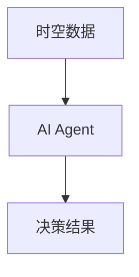
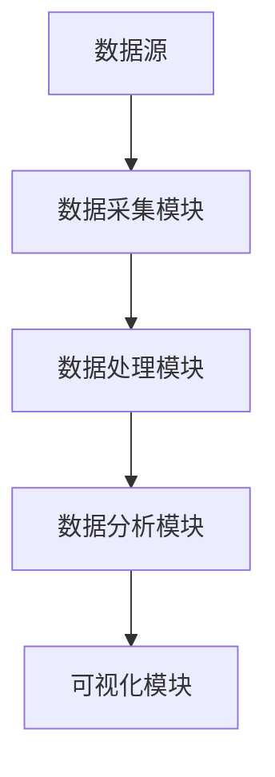

                 


# 企业AI Agent的时空大数据分析平台

## 关键词：企业AI Agent, 时空大数据, 数据分析, 算法原理, 系统架构

## 摘要：  
本文详细探讨了企业AI Agent在时空大数据分析平台中的应用，从核心概念、算法原理到系统架构，全面解析了该平台的构建与实现。通过实际案例分析和代码示例，深入浅出地展示了如何利用AI技术处理复杂的时空数据，为企业决策提供支持。

---

# 第1章: 企业AI Agent与时空大数据分析平台概述

## 1.1 问题背景与目标  
企业面临海量时空数据，如地理位置信息、时间戳数据等，传统的数据分析方法难以高效处理这些数据。AI Agent的引入，能够通过自动化决策和智能分析，帮助企业从时空数据中提取有价值的信息。

## 1.2 核心概念与边界  
- **时空大数据**：指包含地理位置和时间维度的海量数据，具有多维性、动态性等特点。  
- **AI Agent**：具备自主决策能力的智能体，能够根据数据变化做出实时响应。  
- **平台边界**：专注于时空数据的采集、处理和分析，不涉及数据源的采集环节。

## 1.3 平台功能与价值  
- 提供实时数据分析能力，支持企业快速决策。  
- 通过AI Agent优化数据处理流程，提升效率。  
- 支持多维度数据可视化，便于用户理解。

---

# 第2章: 时空大数据分析的核心原理

## 2.1 时空数据处理原理  
### 2.1.1 数据空间与时间维度的处理  
- 空间数据：通过地理信息系统（GIS）进行处理，支持经纬度、区域划分等操作。  
- 时间数据：通过时间序列分析，识别趋势、周期性等特征。

### 2.1.2 时空数据的索引与检索  
- 使用空间索引（如R-tree）和时间索引（如B+树）加速数据检索。  
- 检索效率直接影响平台的响应速度。

## 2.2 AI Agent的算法原理  
### 2.2.1 基于时空数据的特征提取  
- 利用机器学习算法（如K-means）对时空数据进行聚类分析，提取特征。  
- 示例代码：  
```python
from sklearn.cluster import KMeans
model = KMeans(n_clusters=3)
model.fit(X)
```

### 2.2.2 AI Agent的决策逻辑  
- 通过规则引擎和机器学习模型（如决策树）进行决策推理。  
- 示例代码：  
```python
from sklearn.tree import DecisionTreeClassifier
model = DecisionTreeClassifier()
model.fit(X, y)
```

## 2.3 核心概念关系图  
- **实体关系图**：展示时空数据与AI Agent的关系。  


---

# 第3章: 算法原理与数学模型

## 3.1 时空数据处理算法  
### 3.1.1 空间索引算法  
- R-tree用于高效查询空间数据。  
- 示例代码：  
```python
import spatialindex
index = spatialindex.Rtree()
```

### 3.1.2 时间序列预测模型  
- 使用ARIMA模型进行时间序列预测。  
- 示例代码：  
```python
from statsmodels.tsa.arima.model import ARIMA
model = ARIMA(data, order=(5,1,0))
model_fit = model.fit()
```

## 3.2 数学模型与公式  
- **空间索引公式**：  
$$ \text{空间索引} = f(\text{数据点}) $$  
- **时间序列预测公式**：  
$$ y_t = \phi y_{t-1} + \theta \epsilon_{t-1} + \epsilon_t $$  

---

# 第4章: 系统分析与架构设计

## 4.1 项目背景与目标  
- 平台旨在为企业提供高效的时空数据处理能力。  
- 主要目标包括数据采集、处理、分析和可视化。

## 4.2 系统功能设计  
- 数据采集模块：接收时空数据。  
- 数据处理模块：清洗和转换数据。  
- 数据分析模块：应用AI算法进行分析。  
- 可视化模块：展示分析结果。

## 4.3 系统架构图  


## 4.4 接口设计与交互流程  
- 接口定义：RESTful API。  
- 交互流程：数据采集→处理→分析→展示。

---

# 第5章: 项目实战

## 5.1 环境安装与配置  
- 安装Python、TensorFlow、Pandas等库。  
```bash
pip install numpy pandas tensorflow
```

## 5.2 核心代码实现  
### 5.2.1 数据处理代码  
```python
import pandas as pd
data = pd.read_csv('data.csv')
```

### 5.2.2 AI Agent实现  
```python
from tensorflow.keras import layers
model = Sequential()
model.add(layers.Dense(64, activation='relu'))
model.add(layers.Dense(1, activation='sigmoid'))
model.compile(optimizer='adam', loss='binary_crossentropy')
```

## 5.3 案例分析  
- 某企业销售数据的时空分析，识别销售高峰期和地理位置分布。

---

# 第6章: 最佳实践与小结

## 6.1 小结  
- 企业AI Agent的时空大数据分析平台具有广阔的应用前景。  
- 平台的构建需要结合先进的算法和高效的系统架构。

## 6.2 注意事项  
- 数据隐私和安全问题需高度重视。  
- 系统性能优化需从算法和架构两方面入手。

## 6.3 拓展阅读  
- 推荐阅读《大数据分析与机器学习》和《时空数据分析方法》。

---

# 结语  
企业AI Agent的时空大数据分析平台是未来数据分析的重要方向。通过本文的详细讲解，读者可以深入了解平台的构建与应用，为企业智能化转型提供参考。

---

感谢您的阅读！如果对内容有任何疑问或建议，请随时联系！

