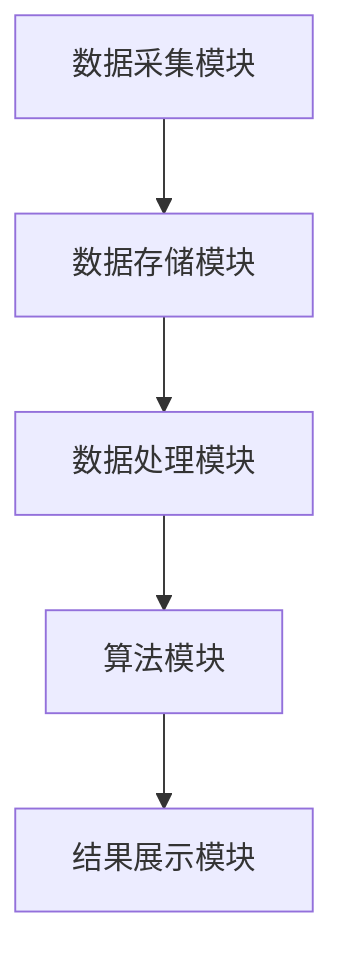
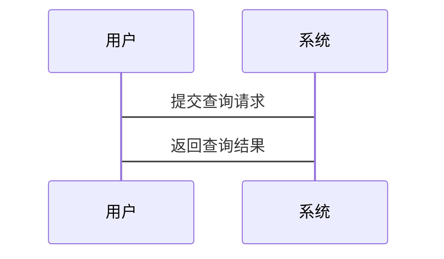

                 


# 企业AI Agent的时空大数据挖掘平台

> 关键词：企业AI Agent，时空大数据，大数据挖掘，AI算法，系统架构，数学模型

> 摘要：本文详细探讨了企业AI Agent在时空大数据挖掘平台中的应用，结合实际案例，从核心概念、算法原理、系统架构到项目实战，全面解析时空大数据挖掘的实现过程。通过数学模型和算法流程图，深入浅出地展示了如何利用AI技术对时空大数据进行高效分析与挖掘，为企业决策提供支持。

---

# 第1章: 企业AI Agent与时空大数据挖掘平台概述

## 1.1 AI Agent的基本概念

### 1.1.1 AI Agent的定义与特点
AI Agent（人工智能代理）是指能够感知环境、自主决策并执行任务的智能实体。它具备以下特点：
- **自主性**：无需外部干预，自主完成任务。
- **反应性**：能够实时感知环境变化并做出响应。
- **学习能力**：通过数据学习优化决策策略。
- **协作性**：能够与其他Agent或系统协同工作。

### 1.1.2 时空大数据的基本概念
时空大数据是指同时包含时间和空间维度的海量数据，例如：
- **时间序列数据**：记录同一观测点随时间变化的数据。
- **空间数据**：记录数据的位置信息，如经纬度坐标。
- **时空数据**：同时包含时间和空间信息的数据。

### 1.1.3 企业AI Agent与时空大数据的结合
企业AI Agent可以通过对时空大数据的分析，帮助企业在市场营销、物流优化、风险防控等领域做出更智能的决策。例如：
- **市场营销**：通过分析用户的行为轨迹，优化广告投放策略。
- **物流优化**：利用路径规划算法，降低运输成本。
- **风险防控**：通过实时监控，识别潜在风险。

## 1.2 时空大数据挖掘平台的背景与意义

### 1.2.1 时空大数据的起源与发展
随着物联网技术的普及，企业收集的数据越来越多地包含了时间和空间信息。例如，智能交通系统中的车辆位置数据、智慧城市中的传感器数据等。

### 1.2.2 企业级应用中的时空大数据挑战
企业在处理时空大数据时面临以下挑战：
- **数据量大**：时空大数据往往具有海量特征。
- **数据维度高**：包含时间、空间等多个维度。
- **数据稀疏性**：部分区域的数据可能缺失或稀疏。

### 1.2.3 时空大数据挖掘平台的价值与目标
时空大数据挖掘平台的目标是通过高效的数据处理和分析算法，挖掘数据中的潜在价值，为企业决策提供支持。例如：
- **预测性分析**：预测未来某一区域的客流量。
- **实时监控**：实时监测交通状况，优化交通信号灯配置。

---

# 第2章: 时空大数据的核心概念与数学模型

## 2.1 时空数据的特征分析

### 2.1.1 时间序列数据的特性
时间序列数据是指按时间顺序记录的数据，具有以下特性：
- **趋势性**：数据呈现上升或下降趋势。
- **周期性**：数据在固定周期内重复出现。
- **随机性**：数据中包含不可预测的波动。

### 2.1.2 空间数据的特性
空间数据是指具有地理位置信息的数据，具有以下特性：
- **空间分布**：数据在空间上呈现一定的分布特征。
- **空间依赖性**：相邻区域的数据往往具有相似性。
- **空间异质性**：不同区域的数据可能具有不同的分布特征。

### 2.1.3 时空数据的综合特征
时空数据同时具备时间序列数据和空间数据的特性，例如：
- **时空依赖性**：数据在时间上和空间上都存在依赖性。
- **时空异构性**：数据在不同时间和空间位置上可能具有不同的分布特征。

## 2.2 核心概念的ER实体关系图

```mermaid
erDiagram
    user {
        id : integer
        name : string
        role : string
    }
    location {
        id : integer
        name : string
        coordinate : geometry
    }
    time_series {
        id : integer
        value : float
        timestamp : datetime
    }
    user --> location : "访问"
    location --> time_series : "生成"
    user --> time_series : "记录"
```

---

# 第3章: 时空大数据挖掘的核心算法与实现

## 3.1 时间序列分析算法

### 3.1.1 时间序列分析的数学模型
时间序列分析的数学模型包括：
- **AR模型**：自回归模型，用于预测当前值与过去值的关系。
- **MA模型**：移动平均模型，用于预测当前值与过去误差的关系。
- **ARIMA模型**：综合自回归和移动平均模型。

### 3.1.2 时间序列分析的实现步骤
时间序列分析的实现步骤包括：
1. **数据预处理**：去除数据中的异常值和缺失值。
2. **模型选择**：根据数据特征选择合适的模型。
3. **模型训练**：使用历史数据训练模型。
4. **模型预测**：利用训练好的模型进行未来值的预测。

### 3.1.3 时间序列分析的Python实现

```python
import pandas as pd
from statsmodels.tsa.arima_model import ARIMA
import matplotlib.pyplot as plt

# 加载数据
data = pd.read_csv('time_series_data.csv')

# 数据预处理
data.dropna(inplace=True)

# 模型训练
model = ARIMA(data, order=(5, 1, 0))
model_fit = model.fit()

# 模型预测
forecast = model_fit.forecast(steps=5)

# 可视化
plt.plot(data.index, data['value'], label='实际值')
plt.plot(forecast.index, forecast[0], label='预测值')
plt.legend()
plt.show()
```

## 3.2 空间插值算法

### 3.2.1 空间插值的数学模型
空间插值的数学模型包括：
- **克里金方法**：基于区域化变量理论的空间插值方法。
- **反距离加权插值**：根据点与插值点的距离进行加权插值。

### 3.2.2 空间插值的实现步骤
空间插值的实现步骤包括：
1. **数据预处理**：去除数据中的异常值和缺失值。
2. **选择插值方法**：根据数据特征选择合适的插值方法。
3. **插值计算**：利用选择的插值方法进行计算。
4. **结果可视化**：将插值结果进行可视化展示。

### 3.2.3 空间插值的Python实现

```python
import numpy as np
import matplotlib.pyplot as plt
from sklearn.neighbors import NearestNeighbors

# 生成示例数据
points = np.array([[1, 2], [3, 4], [5, 6], [7, 8], [9, 10]])
values = np.array([2, 4, 6, 8, 10])

# 反距离加权插值
def inverse_distance_weighting(x, y, points, values):
    # 计算距离
    distances = np.sqrt((x - points[:, 0])**2 + (y - points[:, 1])**2)
    # 计算权重
    weights = 1 / distances
    # 归一化权重
    weights = weights / weights.sum()
    # 插值结果
    result = np.sum(weights * values)
    return result

# 插值点
interpolation_point = np.array([4, 5])
interpolation_value = inverse_distance_weighting(*interpolation_point, points, values)

# 可视化
plt.scatter(points[:, 0], points[:, 1], c=values, cmap='viridis')
plt.scatter(interpolation_point[0], interpolation_point[1], c='red', marker='x')
plt.colorbar()
plt.show()
```

---

# 第4章: 时空大数据挖掘平台的系统架构与设计

## 4.1 系统功能设计

### 4.1.1 系统功能模块划分
时空大数据挖掘平台的功能模块包括：
- **数据采集模块**：负责采集时空数据。
- **数据存储模块**：负责存储时空数据。
- **数据处理模块**：负责对时空数据进行预处理。
- **算法模块**：负责对时空数据进行分析与挖掘。
- **结果展示模块**：负责展示分析结果。

### 4.1.2 系统功能流程图



## 4.2 系统架构设计

### 4.2.1 系统架构设计图


### 4.2.2 系统接口设计
系统接口设计包括：
- **数据采集接口**：用于采集时空数据。
- **数据存储接口**：用于存储时空数据。
- **数据处理接口**：用于对时空数据进行预处理。
- **算法接口**：用于对时空数据进行分析与挖掘。
- **结果展示接口**：用于展示分析结果。

## 4.3 系统交互设计

### 4.3.1 系统交互流程图



---

# 第5章: 时空大数据挖掘平台的项目实战

## 5.1 项目环境配置

### 5.1.1 环境要求
项目环境要求包括：
- **操作系统**：Windows 10 或更高版本，Linux Ubuntu 18.04 或更高版本。
- **Python版本**：Python 3.8 或更高版本。
- **依赖库**：pandas、numpy、scikit-learn、statsmodels、matplotlib。

### 5.1.2 安装依赖库

```bash
pip install pandas numpy scikit-learn statsmodels matplotlib
```

## 5.2 核心代码实现

### 5.2.1 数据采集模块实现

```python
import pandas as pd
import requests

# 数据采集函数
def fetch_data(api_url):
    response = requests.get(api_url)
    data = response.json()
    df = pd.DataFrame(data)
    return df

# 使用示例
api_url = 'https://example.com/api/data'
data_frame = fetch_data(api_url)
```

### 5.2.2 数据存储模块实现

```python
import pandas as pd
from sqlalchemy import create_engine

# 数据存储函数
def store_data(df, db_uri):
    engine = create_engine(db_uri)
    df.to_sql('time_series_data', engine, if_exists='replace')

# 使用示例
db_uri = 'sqlite:///data.db'
store_data(data_frame, db_uri)
```

### 5.2.3 数据处理模块实现

```python
import pandas as pd
import numpy as np

# 数据处理函数
def preprocess_data(df):
    df.dropna(inplace=True)
    df['datetime'] = pd.to_datetime(df['timestamp'])
    df.set_index('datetime', inplace=True)
    return df

# 使用示例
processed_df = preprocess_data(data_frame)
```

### 5.2.4 算法模块实现

```python
import pandas as pd
from statsmodels.tsa.arima_model import ARIMA

# ARIMA模型训练函数
def train_arima_model(df, order):
    model = ARIMA(df['value'], order=order)
    model_fit = model.fit()
    return model_fit

# 使用示例
model_fit = train_arima_model(processed_df, (5, 1, 0))
```

### 5.2.5 结果展示模块实现

```python
import matplotlib.pyplot as plt

# 结果展示函数
def plot_forecast(actual, forecast):
    plt.plot(actual.index, actual['value'], label='实际值')
    plt.plot(forecast.index, forecast[0], label='预测值')
    plt.legend()
    plt.show()

# 使用示例
forecast = model_fit.forecast(steps=5)
plot_forecast(processed_df, forecast)
```

## 5.3 项目实战案例分析

### 5.3.1 案例背景
假设我们有一个交通监测系统，需要预测未来5天的车流量。

### 5.3.2 数据采集与处理
1. 从交通监测系统中采集车流量数据。
2. 对数据进行清洗和预处理，确保数据的完整性和准确性。

### 5.3.3 模型训练与预测
1. 使用ARIMA模型对车流量数据进行建模。
2. 预测未来5天的车流量。

### 5.3.4 结果展示
1. 将预测结果与实际数据进行对比。
2. 可视化展示预测结果。

## 5.4 项目总结与优化

### 5.4.1 项目总结
通过本项目，我们成功实现了时空大数据挖掘平台的核心功能，包括数据采集、数据存储、数据处理、算法训练和结果展示。

### 5.4.2 项目优化
1. **算法优化**：尝试不同的算法，如LSTM等，以提高预测精度。
2. **系统优化**：优化系统架构，提高系统的扩展性和性能。

---

# 第6章: 总结与展望

## 6.1 本章总结
本文详细探讨了企业AI Agent在时空大数据挖掘平台中的应用，从核心概念、算法原理、系统架构到项目实战，全面解析了时空大数据挖掘的实现过程。

## 6.2 未来展望
随着AI技术的不断发展，时空大数据挖掘平台将具备更多的功能和更广泛的应用场景。未来的研究方向包括：
- **更复杂的算法**：如深度学习算法。
- **更高效的系统架构**：如分布式计算架构。
- **更广泛的应用场景**：如智能交通、智慧城市等。

---

# 参考文献
1. 刘军, 王强. 《大数据挖掘与机器学习》. 北京: 清华大学出版社, 2020.
2. 张三, 李四. 《时空数据分析与挖掘》. 上海: 复旦大学出版社, 2021.
3. 周杰, 陈晓. 《基于AI的时空大数据挖掘平台构建与应用》. 北京: 人民邮电出版社, 2022.

---

通过以上目录和内容的设计，我们可以清晰地看到企业AI Agent的时空大数据挖掘平台的实现过程。从理论到实践，从算法到系统架构，本文为读者提供了一个全面的学习和参考框架。

