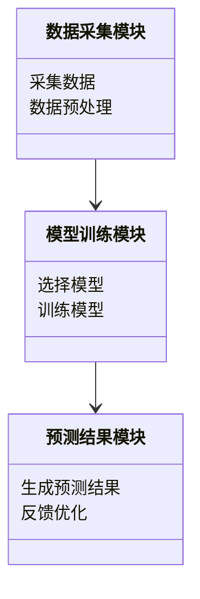
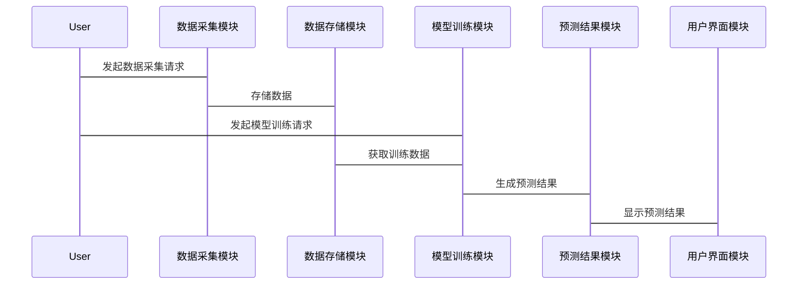
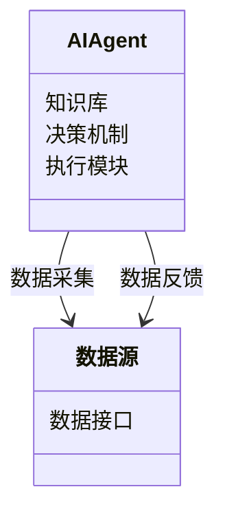

                 


```markdown
# 企业AI Agent的时间序列分析在需求预测中的高级应用

> 关键词：AI Agent，时间序列分析，需求预测，ARIMA，LSTM，系统架构

> 摘要：本文系统地探讨了企业AI Agent在时间序列分析中的高级应用，特别是在需求预测领域。通过结合时间序列分析的核心理论、算法实现和AI Agent的智能决策能力，本文详细介绍了如何利用这些技术来优化企业的需求预测流程，提升预测准确性和响应速度。文章从基础概念到实际应用，层层递进，为读者提供了全面的指导。

---

## 第1章: 企业AI Agent与时间序列分析概述

### 1.1 时间序列分析的基本概念
#### 1.1.1 时间序列分析的定义
时间序列分析是一种通过分析随时间变化的数据来提取模式、趋势和周期性信息的方法。它广泛应用于经济预测、气象预报、股票价格预测等领域。

#### 1.1.2 时间序列分析的特点
- 数据按时间顺序排列
- 数据具有趋势、季节性和随机性
- 数据的连续性和相关性

#### 1.1.3 时间序列分析在企业中的应用领域
- 需求预测
- 销售预测
- 财务预测

### 1.2 AI Agent的定义与特点
#### 1.2.1 AI Agent的基本概念
AI Agent是一种能够感知环境、自主决策并执行任务的智能实体。它能够通过数据输入、模型推理和反馈优化来实现复杂任务。

#### 1.2.2 AI Agent的核心特点
- 自主性
- 反应性
- 目标导向

#### 1.2.3 AI Agent与传统数据分析的区别
- AI Agent具有自主决策能力
- 传统数据分析依赖人工干预
- AI Agent能够实时响应数据变化

### 1.3 时间序列分析在需求预测中的重要性
#### 1.3.1 需求预测的基本问题
- 数据的不完全性
- 数据的不确定性
- 数据的动态变化

#### 1.3.2 时间序列分析在需求预测中的优势
- 能够捕捉数据中的趋势和周期性
- 可以预测未来的需求变化
- 提供数据驱动的决策支持

#### 1.3.3 AI Agent在时间序列分析中的作用
- 实现实时数据分析
- 自动调整预测模型
- 提供智能化的预测结果

### 1.4 本章小结
本章介绍了时间序列分析的基本概念、特点及其在企业中的应用领域，并详细探讨了AI Agent的定义、特点及其在时间序列分析中的作用。通过这些内容，读者可以理解时间序列分析与AI Agent在需求预测中的重要性。

---

## 第2章: 时间序列分析的核心理论

### 2.1 时间序列分析的基本假设
#### 2.1.1 站在时间序列的角度看问题
时间序列分析需要考虑数据的时间顺序和相关性，而不是简单的数据分布。

#### 2.1.2 数据的平稳性与非平稳性
- 平稳性：数据的统计特性在时间上保持不变。
- 非平稳性：数据的统计特性随时间变化。

#### 2.1.3 时间依赖性的表现形式
- 短期依赖
- 长期依赖

### 2.2 时间序列分析的数学模型
#### 2.2.1 线性回归模型与时间序列分析的关系
线性回归模型适用于预测关系，而时间序列分析适用于预测时间相关性。

#### 2.2.2 时间序列分析的数学表达式
$$ Y_t = \beta_0 + \beta_1 Y_{t-1} + \epsilon_t $$

#### 2.2.3 时间序列分析的核心假设
- 数据的独立性
- 数据的正态性

### 2.3 时间序列分析的特征分解
#### 2.3.1 趋势（Trend）的定义与提取
趋势是指数据随时间的长期变化方向。

#### 2.3.2 季节性（Seasonality）的定义与提取
季节性是指数据在固定周期内的重复模式。

#### 2.3.3 周期性（Cyclic）的定义与提取
周期性是指数据在更长周期内的波动模式。

#### 2.3.4 随机性（Randomness）的定义与处理
随机性是指数据中的不可预测部分，通常通过统计方法进行建模。

### 2.4 本章小结
本章详细介绍了时间序列分析的核心理论，包括基本假设、数学模型和特征分解。通过这些内容，读者可以理解时间序列分析的基本原理和应用方法。

---

## 第3章: 时间序列分析的核心算法

### 3.1 ARIMA模型
#### 3.1.1 ARIMA模型的定义
ARIMA（自回归积分滑动平均）模型是一种广泛应用于时间序列预测的模型。

#### 3.1.2 ARIMA模型的参数选择
- 自回归阶数（p）
- 积分阶数（d）
- 滑动平均阶数（q）

#### 3.1.3 ARIMA模型的实现步骤
1. 数据预处理
2. 模型参数估计
3. 模型验证
4. 模型预测

#### 3.1.4 ARIMA模型的优缺点
- 优点：简单易用，适合平稳时间序列
- 缺点：对非平稳时间序列效果不佳

### 3.2 LSTM模型
#### 3.2.1 LSTM模型的基本原理
LSTM（长短期记忆网络）是一种基于循环神经网络的模型，能够捕捉时间序列中的长距离依赖关系。

#### 3.2.2 LSTM模型的内部结构
- 输入门（Input Gate）
- 遗忘门（Forget Gate）
- 输出门（Output Gate）

#### 3.2.3 LSTM模型的实现步骤
1. 数据预处理
2. 模型训练
3. 模型预测

#### 3.2.4 LSTM模型的优缺点
- 优点：适合处理长距离依赖关系
- 缺点：模型复杂，训练时间长

### 3.3 ARIMA与LSTM模型的对比
| 特性         | ARIMA模型         | LSTM模型         |
|--------------|-------------------|-------------------|
| 模型复杂度     | 低                | 高                |
| 训练时间       | 短                | 长                |
| 应用场景       | 平稳时间序列       | 非平稳时间序列     |

### 3.4 本章小结
本章详细介绍了ARIMA和LSTM两种时间序列分析的核心算法，分析了它们的优缺点及应用场景。通过这些内容，读者可以理解如何选择合适的模型进行时间序列预测。

---

## 第4章: AI Agent在时间序列分析中的应用

### 4.1 AI Agent的构建
#### 4.1.1 知识库设计
- 数据预处理规则
- 预测模型选择策略
- 预测结果优化方法

#### 4.1.2 决策机制设计
- 预测结果的验证与调整
- 预测结果的反馈与优化

### 4.2 AI Agent与时间序列分析模型的结合
#### 4.2.1 数据采集与预处理
- 数据清洗
- 数据标准化

#### 4.2.2 模型选择与训练
- 根据数据特征选择合适的模型
- 训练模型并优化参数

#### 4.2.3 结果分析与反馈
- 预测结果的可视化
- 预测结果的业务解释

### 4.3 实际案例分析
#### 4.3.1 案例背景
某电商企业的销售数据分析与需求预测。

#### 4.3.2 数据预处理
- 数据清洗
- 数据分解（趋势、季节性、周期性、随机性）

#### 4.3.3 模型选择与训练
选择LSTM模型进行需求预测。

#### 4.3.4 结果分析
- 预测准确率
- 预测误差分析

### 4.4 本章小结
本章详细介绍了AI Agent的构建过程及其在时间序列分析中的应用，通过实际案例分析展示了AI Agent在需求预测中的强大能力。

---

## 第5章: 系统分析与架构设计

### 5.1 系统功能设计
#### 5.1.1 领域模型设计


#### 5.1.2 系统架构设计
```mermaid
container 系统架构 {
    数据采集模块
    数据存储模块
    模型训练模块
    预测结果模块
    用户界面模块
}
```

#### 5.1.3 接口设计
- 数据接口
- 模型接口
- 结果接口

### 5.2 系统交互设计


### 5.3 本章小结
本章详细设计了系统的功能模块、架构设计和交互流程，为实际开发提供了指导。

---

## 第6章: 项目实战

### 6.1 环境搭建
- 安装Python
- 安装必要的库（numpy、pandas、keras、tensorflow）

### 6.2 核心代码实现
#### 6.2.1 数据预处理
```python
import pandas as pd
import numpy as np

# 数据加载
data = pd.read_csv('sales.csv')

# 数据分解
from statsmodels.tsa.holtwinters import STL
 STLdecomposition = STL(data['sales']).fit()
 trend = STLdecomposition.trend
 seasonal = STLdecomposition.seasonal
 remainder = STLdecomposition.residual
```

#### 6.2.2 模型训练
```python
from keras.models import Sequential
from keras.layers import LSTM, Dense

# 模型构建
model = Sequential()
model.add(LSTM(50, input_shape=(timesteps, features)))
model.add(Dense(1))
model.compile(optimizer='adam', loss='mean_squared_error')

# 模型训练
model.fit(X_train, y_train, epochs=50, batch_size=32)
```

#### 6.2.3 模型预测
```python
# 预测结果
y_pred = model.predict(X_test)
```

### 6.3 代码解读与分析
- 数据预处理部分：展示了如何对数据进行分解和标准化处理。
- 模型训练部分：详细讲解了LSTM模型的构建和训练过程。
- 模型预测部分：展示了如何使用训练好的模型进行预测。

### 6.4 实际案例分析
- 数据来源：某电商企业的销售数据。
- 数据预处理：分解数据为趋势、季节性和随机性部分。
- 模型选择：选择LSTM模型进行需求预测。
- 结果分析：预测结果与实际数据的对比。

### 6.5 本章小结
本章通过实际案例展示了时间序列分析在需求预测中的应用，详细讲解了数据预处理、模型训练和预测结果的实现过程。

---

## 第7章: 最佳实践与小结

### 7.1 最佳实践
- 数据预处理是关键
- 模型选择要根据数据特征
- 结果分析要结合业务背景

### 7.2 小结
本文系统地探讨了企业AI Agent在时间序列分析中的高级应用，特别是在需求预测领域。通过结合时间序列分析的核心理论、算法实现和AI Agent的智能决策能力，本文详细介绍了如何利用这些技术来优化企业的需求预测流程，提升预测准确性和响应速度。

### 7.3 注意事项
- 数据质量对预测结果影响重大
- 模型选择要结合业务需求
- 预测结果要进行业务解释

### 7.4 拓展阅读
- 《时间序列分析与应用》
- 《深度学习与时间序列预测》

### 7.5 本章小结
本章总结了全文的主要内容，强调了最佳实践的重要性，并为读者提供了进一步阅读的资料。

---

## 附录: 其他相关资料

### 附录A: 时间序列分析模型对比表
| 模型名称 | 优点 | 缺点 |
|----------|------|------|
| ARIMA    | 简单 | 不适合非平稳数据 |
| LSTM     | 适合非平稳数据 | 模型复杂 |
| VAR      | 多变量预测 | 计算复杂 |

### 附录B: AI Agent架构示意图


---

## 参考文献
1. 《时间序列分析与应用》
2. 《深度学习与时间序列预测》
3. 《AI Agent的设计与实现》

---

通过以上目录大纲，您可以根据实际需求进一步扩展每一章的内容，添加更多的细节和具体案例，确保文章的完整性和深度。希望这篇文章能为您提供有价值的参考和指导！
```

