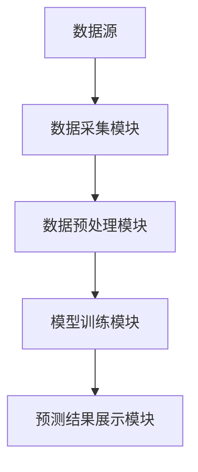

                 


# 企业AI Agent的时间序列预测在财务规划中的应用

## 关键词：企业AI Agent，时间序列预测，财务规划，现金流预测，LSTM，ARIMA

## 摘要：本文探讨了企业AI Agent如何利用时间序列预测技术优化财务规划。通过分析ARIMA和LSTM模型，结合系统架构设计和项目实战，展示了AI Agent在现金流预测、支出预测和财务风险管理中的应用，为企业财务决策提供高效支持。

---

## 第一部分: 企业AI Agent与时间序列预测概述

### 第1章: AI Agent的基本概念

#### 1.1 AI Agent的定义与特点
##### 1.1.1 AI Agent的定义
AI Agent（人工智能代理）是能够感知环境、自主决策并执行任务的智能实体。它通过传感器接收信息，利用算法处理数据，执行动作以实现目标。

##### 1.1.2 AI Agent的核心特点
- **自主性**：无需外部干预，自主决策。
- **反应性**：实时感知环境并调整行为。
- **目标导向**：所有行动基于明确的目标。
- **学习能力**：通过数据优化决策模型。

##### 1.1.3 AI Agent在企业中的应用优势
AI Agent能够提高企业效率、增强决策能力，适用于自动化流程、风险管理等领域。

#### 1.2 企业AI Agent的分类
- **基于规则的Agent**：根据预设规则执行任务。
- **基于模型的Agent**：利用模型动态调整行为。
- **基于学习的Agent**：通过机器学习优化决策。

### 第2章: 时间序列预测的基本原理

#### 2.1 时间序列预测的定义
时间序列预测是对未来数值的估算，基于历史数据的模式识别。

#### 2.2 时间序列预测的应用场景
- **销售预测**：预测产品销量。
- **库存管理**：优化库存水平。
- **金融分析**：股票价格预测。

#### 2.3 时间序列预测在财务规划中的重要性
准确预测现金流、支出和财务风险，帮助优化资源配置，提升企业财务健康度。

---

## 第二部分: 时间序列预测的算法原理

### 第3章: 时间序列预测的经典算法

#### 3.1 ARIMA模型
##### 3.1.1 ARIMA模型的定义
ARIMA（自回归积分滑动平均）是一种广泛应用于时间序列预测的统计模型。

##### 3.1.2 ARIMA模型的数学公式
$$ ARIMA(p, d, q) $$
- p：自回归阶数
- d：差分阶数
- q：移动平均阶数

##### 3.1.3 ARIMA模型的应用步骤
1. 数据预处理：去除趋势和季节性。
2. 模型选择：确定p、d、q参数。
3. 模型训练：基于历史数据训练模型。
4. 模型预测：生成未来预测值。

#### 3.2 LSTM网络
##### 3.2.1 LSTM网络的基本原理
LSTM（长短期记忆网络）通过门控机制处理长期依赖关系，适用于复杂时间序列预测。

##### 3.2.2 LSTM网络的结构
- **输入门**：控制信息输入。
- **遗忘门**：决定遗忘信息。
- **输出门**：生成输出。

##### 3.2.3 LSTM网络的数学模型
$$ f_t = \sigma(W_f \cdot [h_{t-1}, x_t] + b_f) $$
- $f_t$：输入门
- $h_{t-1}$：前一时刻隐藏状态
- $x_t$：当前输入
- $W_f$：权重矩阵
- $b_f$：偏置项

### 第4章: 时间序列预测的算法实现

#### 4.1 ARIMA模型的实现步骤
##### 4.1.1 数据预处理
```python
from statsmodels.tsa.statespace.tools import detrender
import pandas as pd

data = pd.read_csv('financial_data.csv')
data['date'] = pd.to_datetime(data['date'])
data.set_index('date', inplace=True)
```

##### 4.1.2 模型训练
```python
from statsmodels.tsa.arima.model import ARIMA

model = ARIMA(data['value'], order=(5, 1, 0))
model_fit = model.fit()
```

##### 4.1.3 模型预测
```python
forecast = model_fit.forecast(steps=10)
print(forecast)
```

#### 4.2 LSTM网络的实现步骤
##### 4.2.1 数据预处理
```python
import numpy as np
from sklearn.preprocessing import MinMaxScaler

data = data.values
data = data.reshape(-1, 1)
scaler = MinMaxScaler(feature_range=(0, 1))
scaled_data = scaler.fit_transform(data)
```

##### 4.2.2 模型训练
```python
from tensorflow.keras.models import Sequential
from tensorflow.keras.layers import LSTM, Dense

model = Sequential()
model.add(LSTM(128, input_shape=(1, 1)))
model.add(Dense(1))
model.compile(loss='mean_squared_error', optimizer='adam')
model.fit(X_train, y_train, epochs=50, batch_size=32)
```

##### 4.2.3 模型预测
```python
y_pred = model.predict(X_test)
y_pred = scaler.inverse_transform(y_pred)
```

---

## 第三部分: AI Agent在财务规划中的应用

### 第5章: AI Agent在财务规划中的应用

#### 5.1 现金流预测
##### 5.1.1 现金流预测的定义
预测企业未来现金流入和流出，帮助优化资金管理。

##### 5.1.2 基于AI Agent的现金流预测模型
结合ARIMA和LSTM模型，预测现金流趋势。

#### 5.2 支出预测
##### 5.2.1 支出预测的定义
预测企业未来各项支出，优化预算分配。

##### 5.2.2 基于AI Agent的支出预测模型
利用历史支出数据，训练时间序列预测模型。

#### 5.3 财务风险预测
##### 5.3.1 财务风险预测的定义
评估企业财务风险，预测潜在问题。

##### 5.3.2 基于AI Agent的财务风险预测模型
通过时间序列预测识别财务风险因素。

---

## 第四部分: 系统架构与设计

### 第6章: 系统架构与设计

#### 6.1 系统功能设计
##### 6.1.1 系统功能模块
- 数据采集模块：收集财务数据。
- 数据预处理模块：清洗和转换数据。
- 模型训练模块：训练时间序列预测模型。
- 预测结果展示模块：可视化预测结果。

##### 6.1.2 功能模块的交互流程
1. 数据采集模块接收原始数据。
2. 数据预处理模块清洗数据。
3. 模型训练模块训练预测模型。
4. 预测结果展示模块显示预测结果。

#### 6.2 系统架构设计
##### 6.2.1 系统架构图


##### 6.2.2 数据流
- 数据从源流向数据采集模块。
- 数据经过预处理模块清洗。
- 模型训练模块生成预测结果。
- 结果展示模块呈现给用户。

---

## 第五部分: 项目实战

### 第7章: 项目实战

#### 7.1 项目介绍
##### 7.1.1 项目背景
企业希望通过AI Agent优化财务预测，提升财务规划效率。

##### 7.1.2 项目目标
实现现金流预测、支出预测和财务风险预测。

#### 7.2 核心代码实现
##### 7.2.1 现金流预测代码
```python
import pandas as pd
from statsmodels.tsa.arima.model import ARIMA

data = pd.read_csv('cash_flow.csv')
model = ARIMA(data['cash_flow'], order=(5, 1, 0))
model_fit = model.fit()
forecast = model_fit.forecast(steps=12)
print(forecast)
```

##### 7.2.2 支出预测代码
```python
import numpy as np
from tensorflow.keras.models import Sequential
from tensorflow.keras.layers import LSTM, Dense

model = Sequential()
model.add(LSTM(128, input_shape=(1, 1)))
model.add(Dense(1))
model.compile(loss='mean_squared_error', optimizer='adam')
model.fit(X_train, y_train, epochs=50, batch_size=32)
```

#### 7.3 案例分析
##### 7.3.1 案例背景
某制造企业希望通过AI Agent预测现金流，优化资金管理。

##### 7.3.2 案例分析步骤
1. 数据收集：获取过去三年的现金流数据。
2. 数据预处理：清洗和归一化数据。
3. 模型训练：训练ARIMA和LSTM模型。
4. 模型预测：生成未来12个月的现金流预测。
5. 结果分析：评估模型准确性，优化预测结果。

#### 7.4 项目总结
通过项目实战，展示了AI Agent在财务规划中的强大能力，帮助企业在复杂市场环境中做出明智决策。

---

## 第六部分: 最佳实践与未来展望

### 第8章: 最佳实践与未来展望

#### 8.1 最佳实践
##### 8.1.1 数据质量的重要性
确保数据准确性和完整性，提升预测模型的性能。

##### 8.1.2 模型选择的策略
根据具体场景选择合适的时间序列预测算法，结合企业需求优化模型。

#### 8.2 小结
AI Agent通过时间序列预测技术，显著提升了企业财务规划的效率和准确性，为企业创造价值。

#### 8.3 未来展望
随着AI技术的进步，AI Agent在财务规划中的应用将更加广泛，预测模型将更加智能化和个性化，为企业决策提供更强大的支持。

---

通过本文的详细讲解和项目实战，读者可以深入理解AI Agent在时间序列预测中的应用，并掌握实际操作技能，为企业的财务规划带来新的可能性。

