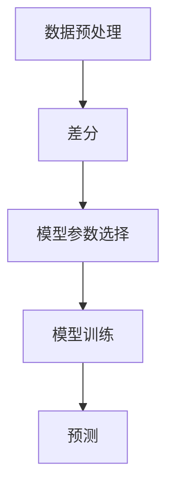
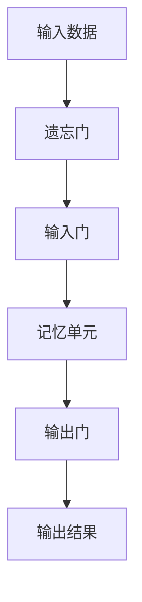

                 


# 企业AI Agent的时间序列预测在需求规划中的精准应用

## 关键词：时间序列预测、AI Agent、需求规划、企业应用、算法实现

## 摘要：  
本文深入探讨了时间序列预测在企业需求规划中的应用，结合AI Agent技术，分析了如何利用时间序列预测算法（如ARIMA、LSTM和Prophet）优化企业的销售预测、库存管理和生产计划。通过详细讲解算法原理、系统架构设计和项目实战，展示了AI Agent在时间序列预测中的精准应用，为企业需求规划提供了有效的解决方案。

---

# 第一部分: 企业AI Agent与时间序列预测概述

## 第1章: 时间序列预测的背景与应用

### 1.1 时间序列预测的核心概念

#### 1.1.1 时间序列预测的定义  
时间序列预测是一种通过历史数据预测未来趋势的分析方法，广泛应用于金融、经济、气象等领域。其核心在于识别数据中的模式（如趋势、周期性）并基于这些模式进行预测。

#### 1.1.2 时间序列预测的特征  
- **有序性**：数据按时间顺序排列。
- **连续性**：数据点之间存在连续的时间关系。
- **可预测性**：通过模型识别数据中的规律。

#### 1.1.3 时间序列预测的分类  
时间序列预测主要分为以下几类：
- **单变量时间序列预测**：基于单一变量的历史数据进行预测。
- **多变量时间序列预测**：结合多个变量的历史数据进行预测。
- **监督学习时间序列预测**：将时间序列数据作为输入，预测目标变量。

---

### 1.2 企业需求规划中的时间序列预测

#### 1.2.1 需求规划的定义与挑战  
需求规划是企业在制定生产和采购计划时，基于历史需求数据和市场预测来确定未来需求量的过程。其主要挑战包括：
- 数据的不确定性：市场需求受多种因素影响（如季节性、经济周期）。
- 数据的复杂性：需求数据可能包含噪声和异常值。

#### 1.2.2 时间序列预测在需求规划中的作用  
时间序列预测能够帮助企业：
- 准确预测未来需求，优化库存管理。
- 降低生产成本，减少资源浪费。
- 提高供应链效率，增强企业竞争力。

#### 1.2.3 企业AI Agent的定义与特点  
企业AI Agent是一种能够感知环境、自主决策并执行任务的智能系统。其特点包括：
- **自主性**：无需人工干预即可完成任务。
- **反应性**：能够根据环境变化调整行为。
- **学习能力**：通过数据和经验优化预测模型。

---

## 第2章: 时间序列预测的核心概念与联系

### 2.1 时间序列预测的数学模型

#### 2.1.1 线性回归模型  
线性回归模型是一种简单的时间序列预测方法，适用于数据呈现线性趋势的情况。其数学表达式为：
$$ y_t = a + bt + \epsilon $$
其中，$y_t$ 是预测值，$a$ 和 $b$ 是模型参数，$\epsilon$ 是误差项。

#### 2.1.2 自回归模型  
自回归模型（AR模型）基于当前值和过去值之间的关系进行预测。其数学表达式为：
$$ y_t = c + \sum_{i=1}^p \phi_i y_{t-i} + \epsilon $$

#### 2.1.3 移动平均模型  
移动平均模型（MA模型）基于过去误差项的平均值进行预测。其数学表达式为：
$$ y_t = c + \sum_{i=1}^q \theta_i \epsilon_{t-i} + \epsilon $$

---

### 2.2 时间序列预测的算法原理

#### 2.2.1 ARIMA算法原理  
ARIMA（自回归积分移动平均模型）结合了AR和MA模型的优势。其工作流程如下（使用mermaid表示）：



ARIMA算法的数学模型为：
$$ (1 - B)^d X_t = \mu + \theta(B) Z_t $$

#### 2.2.2 LSTM算法原理  
LSTM（长短期记忆网络）通过引入记忆单元和遗忘门，解决了传统RNN模型的梯度消失问题。其工作流程如下：



LSTM的数学模型为：
$$ f_t = \sigma(W_f x_t + U_f h_{t-1} + b_f) $$
$$ i_t = \sigma(W_i x_t + U_i h_{t-1} + b_i) $$
$$ o_t = \sigma(W_o x_t + U_o h_{t-1} + b_o) $$
$$ h_t = f_t \cdot c_{t-1} + i_t \cdot tanh(W_c x_t + U_c h_{t-1} + b_c) $$
$$ c_t = h_t $$
$$ o_t = o_t \cdot h_t $$

#### 2.2.3 Prophet算法原理  
Prophet模型通过分解时间序列数据为趋势、周期性和余项三部分进行预测。其数学模型为：
$$ y_t = g(t) + s(t) + \epsilon_t $$

---

## 第3章: 时间序列预测的算法实现

### 3.1 ARIMA算法实现

#### 3.1.1 ARIMA算法的数学模型  
ARIMA模型的数学表达式为：
$$ (1 - B)^d X_t = \mu + \theta(B) Z_t $$

#### 3.1.2 ARIMA算法的实现步骤  
1. 数据预处理：检查数据的平稳性。
2. 差分：通过差分使数据平稳。
3. 参数选择：确定AR和MA的阶数。
4. 模型训练：基于训练数据拟合模型。
5. 预测：利用模型预测未来值。

#### 3.1.3 ARIMA算法的优缺点  
- **优点**：适合处理线性趋势和季节性数据。
- **缺点**：对非线性数据的拟合效果较差。

---

### 3.2 LSTM算法实现

#### 3.2.1 LSTM算法的数学模型  
LSTM的数学模型包括遗忘门、输入门和输出门的计算，具体公式如下：
$$ f_t = \sigma(W_f x_t + U_f h_{t-1} + b_f) $$
$$ i_t = \sigma(W_i x_t + U_i h_{t-1} + b_i) $$
$$ o_t = \sigma(W_o x_t + U_o h_{t-1} + b_o) $$
$$ h_t = f_t \cdot c_{t-1} + i_t \cdot tanh(W_c x_t + U_c h_{t-1} + b_c) $$
$$ c_t = h_t $$
$$ o_t = o_t \cdot h_t $$

#### 3.2.2 LSTM算法的实现步骤  
1. 数据预处理：归一化数据并划分训练集和测试集。
2. 模型构建：定义LSTM模型结构。
3. 模型训练：使用训练数据拟合模型。
4. 预测：利用训练好的模型进行预测。

#### 3.2.3 LSTM算法的优缺点  
- **优点**：适合处理非线性数据，预测精度高。
- **缺点**：计算复杂度较高，训练时间较长。

---

### 3.3 Prophet算法实现

#### 3.3.1 Prophet算法的数学模型  
Prophet模型的数学模型为：
$$ y_t = g(t) + s(t) + \epsilon_t $$

#### 3.3.2 Prophet算法的实现步骤  
1. 数据预处理：检查数据的完整性并填充缺失值。
2. 模型构建：定义Prophet模型。
3. 模型训练：基于训练数据拟合模型。
4. 预测：利用模型预测未来值。

#### 3.3.3 Prophet算法的优缺点  
- **优点**：适合处理有明确时间依赖性的数据。
- **缺点**：对噪声数据的鲁棒性较差。

---

# 第二部分: 企业AI Agent的时间序列预测应用

## 第4章: 企业需求规划中的时间序列预测

### 4.1 企业需求规划的场景分析

#### 4.1.1 需求预测的常见场景  
- **销售预测**：预测未来销售额。
- **库存管理**：预测未来库存需求。
- **生产计划**：预测未来生产需求。

#### 4.1.2 需求预测的关键因素  
- **历史销售数据**：企业的历史销售数据。
- **市场趋势**：市场整体趋势和季节性变化。
- **竞争对手行为**：竞争对手的市场行为。

#### 4.1.3 需求预测的挑战与解决方案  
- **挑战**：数据噪声大、需求波动剧烈。
- **解决方案**：使用时间序列预测算法优化模型。

---

### 4.2 时间序列预测在需求规划中的应用

#### 4.2.1 时间序列预测在销售预测中的应用  
通过时间序列预测算法，企业可以基于历史销售数据预测未来销售额，优化库存管理和销售策略。

#### 4.2.2 时间序列预测在库存管理中的应用  
通过预测未来需求，企业可以优化库存水平，减少库存积压和缺货风险。

#### 4.2.3 时间序列预测在生产计划中的应用  
通过预测未来生产需求，企业可以合理安排生产计划，提高生产效率。

---

## 第5章: 企业AI Agent的时间序列预测系统架构

### 5.1 系统架构设计

#### 5.1.1 系统功能模块划分  
- **数据采集模块**：采集历史销售数据。
- **模型训练模块**：训练时间序列预测模型。
- **预测模块**：基于模型进行预测。
- **结果分析模块**：分析预测结果并优化模型。

#### 5.1.2 系统架构的分层设计  
系统架构分为数据层、算法层和应用层三部分：
- **数据层**：存储历史销售数据。
- **算法层**：实现时间序列预测算法。
- **应用层**：展示预测结果并提供决策支持。

#### 5.1.3 系统架构的优缺点  
- **优点**：模块化设计便于维护和扩展。
- **缺点**：系统架构复杂，开发成本较高。

---

### 5.2 系统接口设计

#### 5.2.1 数据接口设计  
- **输入接口**：接收历史销售数据。
- **输出接口**：输出预测结果。

---

# 第三部分: 项目实战与总结

## 第6章: 项目实战

### 6.1 环境安装与数据准备

#### 6.1.1 环境安装  
- **Python**：安装Python 3.8及以上版本。
- **库安装**：安装pandas、numpy、scikit-learn、Keras和prophet库。

#### 6.1.2 数据准备  
使用某企业过去三年的销售数据作为训练数据。

---

### 6.2 系统核心实现

#### 6.2.1 ARIMA模型实现

```python
from statsmodels.tsa.arima.model import ARIMA

# 数据预处理
data = ...  # 历史销售数据

# 差分
diff_data = data.diff().dropna()

# 模型训练
model = ARIMA(data, order=(5, 1, 0))
model_fit = model.fit()

# 预测
forecast = model_fit.forecast(steps=10)
print(forecast)
```

---

#### 6.2.2 LSTM模型实现

```python
from keras.models import Sequential
from keras.layers import LSTM, Dense

# 数据预处理
train_data = ...  # 训练数据
test_data = ...    # 测试数据

# 模型构建
model = Sequential()
model.add(LSTM(50, input_shape=(timesteps, features)))
model.add(Dense(1))
model.compile(loss='mean_squared_error', optimizer='adam')

# 模型训练
model.fit(train_data, epochs=50, batch_size=32)

# 预测
forecast = model.predict(test_data)
print(forecast)
```

---

#### 6.2.3 Prophet模型实现

```python
from fbprophet import Prophet

# 数据准备
data = {'ds': dates, 'y': values}
prophet_data = pd.DataFrame(data)

# 模型训练
model = Prophet()
model.fit(prophet_data)

# 预测
future = model.make_future_dataframe(periods=30)
forecast = model.predict(future)
print(forecast)
```

---

### 6.3 实际案例分析与结果解读

#### 6.3.1 案例分析  
以某企业的销售数据为例，使用ARIMA、LSTM和Prophet三种算法进行预测，并比较预测结果的准确性。

#### 6.3.2 结果解读  
- **ARIMA模型**：适合数据呈现线性趋势的情况。
- **LSTM模型**：适合数据呈现非线性趋势的情况。
- **Prophet模型**：适合数据呈现明确时间依赖性的场景。

---

## 第7章: 总结与展望

### 7.1 总结  
本文详细探讨了时间序列预测在企业需求规划中的应用，结合AI Agent技术，分析了如何利用ARIMA、LSTM和Prophet算法优化企业的销售预测、库存管理和生产计划。

### 7.2 未来展望  
未来，时间序列预测在企业需求规划中的应用将更加广泛。随着AI技术的不断发展，时间序列预测算法也将更加智能化和精准化。

### 7.3 最佳实践 Tips  
- **数据预处理**：确保数据的完整性和准确性。
- **模型选择**：根据数据特点选择合适的预测算法。
- **模型优化**：通过调参和数据增强优化预测模型。

---

通过本文的分析和实践，读者可以深入了解时间序列预测在企业需求规划中的应用，掌握AI Agent技术的核心原理和实现方法，为企业需求规划提供有效的解决方案。

